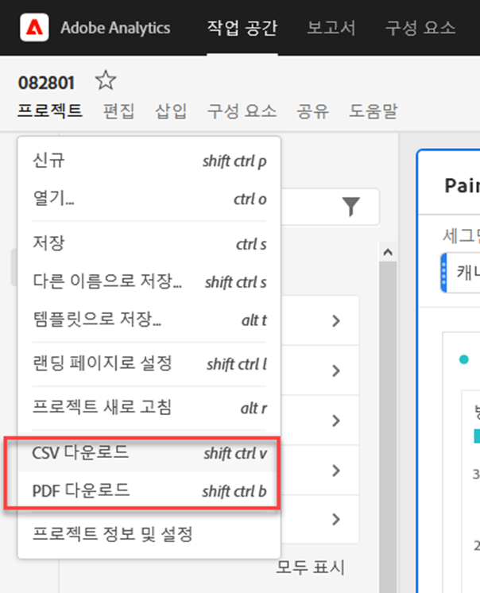
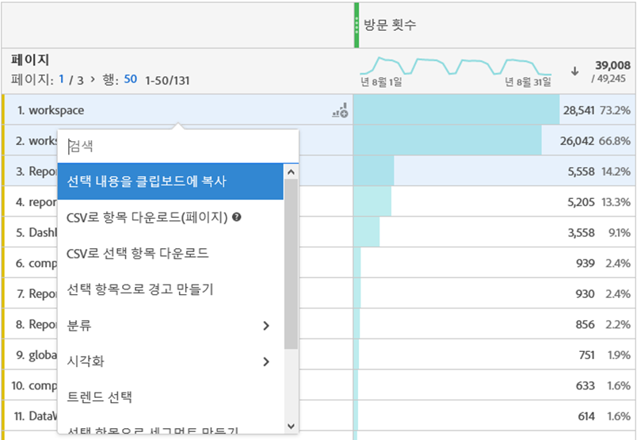
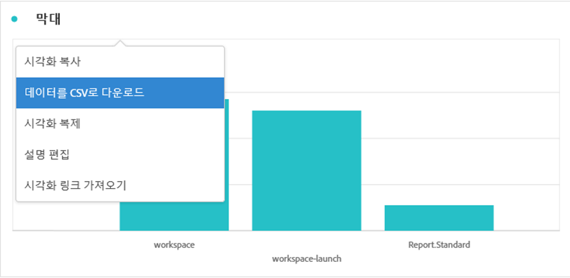
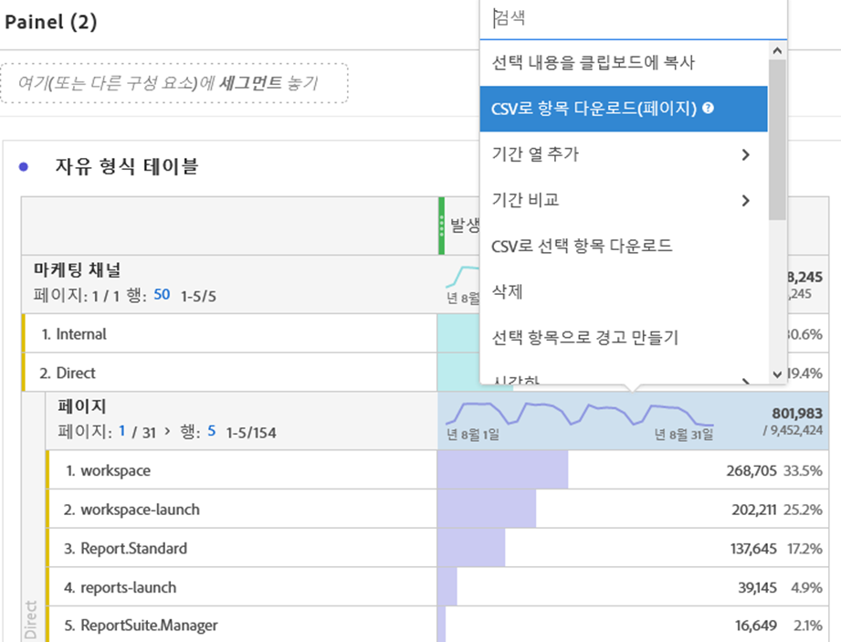
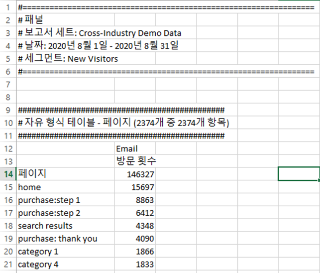

# PDF 또는 CSV 파일 다운로드 작업 공간에서

도구 외부에서 분석하려는 데이터 세트와 정보를 받아야 하는 사람에 따라 Analysis Workspace에서 데이터를 내보낼 수 있는 방법에는 여러 가지가 있습니다. 내보낸 데이터는 복사된 데이터, CSV 또는 PDF 파일 형태로 될 수 있습니다. PDF는 일반적으로 시각화를 파일에 포함하려는 경우 선호되지만 CSV(또는 복사된 데이터)는 단순히 일반 텍스트 데이터를 원하는 경우에 선호됩니다.

## 프로젝트를 CSV 또는 PDF로 다운로드 {#download-project}

프로젝트 > PDF로 **[!UICONTROL 다운로드(또는 CSV로)로 이동하여 전체 프로젝트를 다운로드할 수 있습니다]**. 다운로드한 파일에는 프로젝트에 표시된(표시) 테이블과 시각화가 모두 포함되어 있습니다. PDF는 일반적으로 시각화를 파일에 포함하려는 경우 선호되지만 CSV는 단순히 일반 텍스트 데이터를 원할 경우 선호됩니다.

프로젝트 다운로드 시 주의하십시오.

* 프로젝트 다운로드를 요청할 때 프로젝트를 저장하거나 저장할 수 있습니다. 그러나 저장된 프로젝트만 [예약할 수 있습니다](https://docs.adobe.com/content/help/en/analytics/analyze/analysis-workspace/curate-share/t-schedule-report.html).
* PDF 형식으로 렌더링하기 전에 프로젝트가 Adobe 서버에서 다시 실행되므로 브라우저에서 다운로드한 PDF를 내보내는 데 몇 분이 걸릴 수 있습니다. 브라우저에서 PDF를 다운로드할 때까지 프로젝트를 종료하지 않는 것이 좋습니다. 하지만 기다리는 동안 프로젝트를 계속 변경할 수 있습니다. PDF를 렌더링하는 데 5분 이상 걸리는 경우 대신 이메일로 전송하라는 메시지가 표시됩니다.
* PDF 다운로드는 페이지 매김이 적용되지 않은 단일 페이지로 렌더링됩니다.
* 프로젝트가 PDF로 렌더링되면 페이지의 내용이 렌더링됩니다. 프로젝트에 사용자 지정 크기의 시각화 및 패널이 있는 경우, 잘린 컨텐츠가 생기지 않게 시각화 및 패널의 크기가 자동으로 지정(오른쪽 상단 모서리의 단추)되도록 변경해야 합니다.

## 클립보드에 데이터 복사(핫키:Ctrl+C) {#copy-data}

마우스 오른쪽 단추 클릭 옵션인 클립보드에 **[!UICONTROL 복사]** 옵션을 사용하면 작업 공간에서 데이터를 신속하게 복사하여 다른 곳에 붙여넣을 수 있습니다.

* 표시된 테이블을 복사하려면 테이블 헤더를 마우스 오른쪽 단추로 클릭하고 클립보드에 데이터 **복사를 선택합니다**.
* 데이터의 하위 집합을 복사하려면 표에서 선택한 다음 마우스 오른쪽 단추 클릭 > 선택 항목 **복사를 클립보드로 클릭합니다**.

또한 핫키는 선택 사항을 클립보드에 `Ctrl+C` 복사합니다. 복사한 후 다른 도구로 이동하여 정보를 붙여 넣을 수 있습니다(또는 히트 `Ctrl+V`).

## 데이터를 CSV로 다운로드 {#download-data}

마우스 오른쪽 단추 클릭 옵션 **[!UICONTROL 데이터를 CSV로]** 다운로드 옵션을 사용하면 데이터 테이블이나 시각화의 데이터 소스를 CSV로 다운로드할 수 있습니다.

* 테이블 또는 시각화의 헤더에서 데이터를 CSV로 **[!UICONTROL 다운로드를 마우스 오른쪽 단추로 클릭합니다]**. 이렇게 하면 시각화에 대한 테이블 또는 기본 데이터 소스에 표시된 데이터를 CSV로 다운로드합니다. 참고:맵 시각화는 이 옵션을 지원하지 않습니다.
* 표에서 선택한 경우 이 옵션에는 [CSV로 **[!UICONTROL 다운로드]가 표시됩니다]**. 표시된 전체 테이블이 아닌 이 옵션과 함께 선택한 항목만 다운로드됩니다.

## CSV로 항목 다운로드 {#download-items}

테이블에 표시되는 400개 이상의 데이터 행을 분석하려면 테이블 머리글이나 모든 행을 마우스 오른쪽 단추로 클릭하고 **항목을 CSV로 다운로드(Dimension 이름)를 선택합니다**. 이 옵션은 필터 및 세그먼트가 적용된 선택한 차원에 대해 최대 50,000개의 차원 항목(테이블 정렬 기준)을 내보냅니다. 표 맨 위에서 이 옵션을 선택하면 표의 첫 번째 치수가 내보내집니다. 자유 형식 테이블에 적용되는 제한은 없지만 최적의 성능을 위해 20개 미만의 열이 있는 테이블에 항목 다운로드 옵션을 사용하는 것이 좋습니다.

>[!TIP]
>
> 차원이 50,000개 항목을 초과하는 경우 다른 정렬 지표가 적용된 파일을 다운로드하거나 필터를 적용합니다. 예를 들어 한 번의 다운로드에서 방문 횟수로 내림차순으로 정렬한 다음 두 번째 다운로드에서 방문 횟수로 오름차순으로 정렬합니다. 이 팁은 긴 꼬리 항목을 찾는 데 도움이 될 수 있습니다.

프로젝트 내에서 여러 작업을 수행하고 다운로드가 진행되는 동안 동일한 탭에서 새 작업 공간 프로젝트로 이동할 수도 있습니다. 새 브라우저 탭을 열면 다운로드가 일시 정지됩니다. 작업 공간을 완전히 종료하거나 브라우저 탭을 닫으면 다운로드가 취소됩니다.

### 다운로드한 항목 파일

표의 기능은 다음과 같이 다운로드한 파일에 적용됩니다.

* 모든 패널 세그먼트는 필터로 적용됩니다.
* 테이블에서 선택한 차원 **위에** 있는 분류는 각 열 위에 있는 필터로 적용됩니다.
* 테이블의 선택한 차원 **아래** 분류가 제거됩니다.

위의 예에서, 페이지 항목은 필터로 적용된 패널 세그먼트(새 방문자 고객) 및 위의 구성 요소(마케팅 채널 = 이메일)와 다운로드한 CSV에서 제거된 아래 구성 요소(모바일 장치 유형)와 함께 다운로드됩니다.

### 알림 다운로드

파일이 다운로드되면 진행 중인 정보 알림이 표시됩니다. 언제든지 다운로드 취소를 클릭하여 다운로드를 **[!UICONTROL 취소할 수 있습니다]**. 토스트 **를 닫아도 다운로드가 취소되지** 않습니다.

파일이 완료되면 완료 알림이 표시되고 파일이 브라우저에 다운로드됩니다.

한 번에 두 개 이상의 다운로드를 요청하는 경우 이전 다운로드가 완료될 때까지 각 추가 다운로드가 큐에 올라가 있다는 알림을 받게 됩니다.

## FAQ {#faq}

| 질문 | 답변 |
| --- | --- |
| 다운로드한 PDF가 한 페이지인 이유는 무엇입니까? | 현재 작업 공간은 다운로드한 PDF에 페이지를 매기지 않습니다. |
| &quot;항목을 CSV로 다운로드&quot; 옵션을 사용하여 50,000개 이상의 항목을 내보낼 수 있습니까? | 각 다운로드에는 최대 50,000개의 차원 항목이 포함될 수 있지만 더 긴 꼬리 항목을 검색하기 위해 표 정렬을 변경하거나 필터를 적용하여 보다 구체적인 항목을 다운로드할 수 있습니다. |
| 복사 시각화 **[!UICONTROL 는]** 어떤 기능을 합니까? | **[!UICONTROL 시각화]** 복사는 내보내기 옵션이 아닙니다. 시각화 또는 패널을 작업 공간의 한 위치에서 다른 위치로 복사할 수 있습니다. 예를 들어 동일한 프로젝트의 패널 간 또는 하나의 프로젝트에서 다른 프로젝트로 이어지는 경우입니다. [비디오 보기](https://www.youtube.com/watch?v=lvmAdKNfWQw) |

