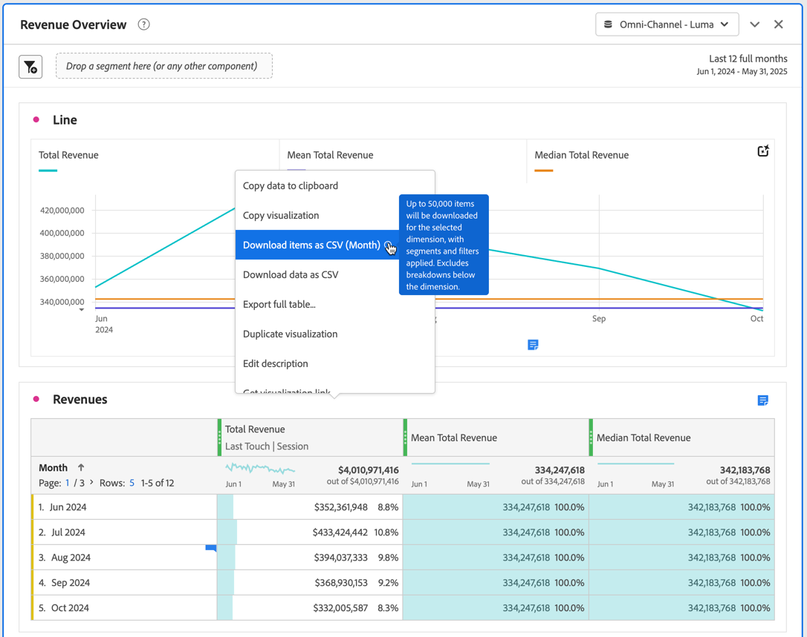

# 프로젝트 및 데이터 다운로드

Analysis Workspace 프로젝트 및 데이터를 로컬 장치에 다운로드할 수 있습니다. 이 다운로드는 데이터, CSV(쉼표로 구분된 값 데이터) 파일 또는 PDF(휴대용 문서 형식) 문서를 복사할 수 있습니다.

* 다운로드한 파일에 시각화를 포함하려면 PDF 옵션을 선택합니다.
* 일반 텍스트 데이터만 필요한 경우 CSV 및 복사된 데이터 옵션을 선택합니다.

Adobe Analytics 데이터를 내보내는 추가 방법은 [내보내기 가이드](/help/export/home.md)에 설명되어 있습니다.

## CSV 또는 PDF로 다운로드 {#download-project}

프로젝트를 PDF으로 다운로드할 때는 다음 사항을 고려하십시오.

* 프로젝트가 Adobe 서버에서 다시 실행되어 PDF 형식으로 렌더링되므로 다운로드에 몇 분 정도 걸릴 수 있습니다. 브라우저에서 프로젝트가 다운로드될 때까지 프로젝트를 종료하지 마십시오.  다운로드가 렌더링되는 동안 프로젝트를 계속 변경할 수 있습니다. PDF이 렌더링하는 데 5분 이상 걸리는 경우 대신 [PDF에 전자 메일을 보내십시오](../curate-share/send-schedule-files.md).
* 다운로드는 페이지 매김이 적용되지 않은 단일 페이지로 렌더링됩니다.
* PDF에는 Analysis Workspace의 브라우저 페이지에 표시되는 항목이 포함되어 있습니다. 사용자 지정 크기의 시각화 및 패널의 크기를 자동으로 조정해야 잘린 콘텐츠를 방지할 수 있습니다. 사용자 지정 크기의 시각화 또는 패널의 크기를 자동으로 조정하려면 을 선택하십시오.
* 자유 형식 테이블 내의 [하이퍼링크](/help/analyze/analysis-workspace/visualizations/freeform-table/freeform-table-hyperlinks.md)를 다운로드한 PDF의 하이퍼링크로 설정합니다.

프로젝트를 PDF 파일로 다운로드하려면 다음 작업을 수행하십시오.

1. **[!UICONTROL 프로젝트]** > **[!UICONTROL PDF 다운로드]**&#x200B;를 선택합니다.
녹색 막대에  **[!UICONTROL 다운로드가 요청되었습니다. 기다려 주십시오.]**&#x200B;이(가) 표시됩니다.

1. 다운로드가 준비되면  **[!UICONTROL *프로젝트 이름&#x200B;*PDF이 포함된 녹색 막대가 준비됩니다.]**&#x200B;이(가) 나타납니다.
PDF을 다운로드하려면&#x200B;**[!UICONTROL 다운로드]**&#x200B;를 선택하십시오. PDF이 정확히 표시되거나 다운로드되는 방법은 PDF 문서를 처리하기 위한 브라우저 구성에 따라 다릅니다.

프로젝트를 CSV 파일로 다운로드하려면 다음 작업을 수행하십시오.

* **[!UICONTROL 프로젝트]** > **[!UICONTROL CSV 다운로드]**&#x200B;를 선택합니다. 프로젝트는 브라우저 구성의 일부로 구성된 다운로드 폴더로 직접 다운로드됩니다. 파일 이름은 *프로젝트 이름* - *보고서 세트 이름* - *날짜*(예: `Example Project - Omni-Channel - Luma - Jun 30, 2025.csv`)로 구성됩니다.

## 클립보드에 복사 {#copy-data}

컨텍스트 메뉴의 **[!UICONTROL 클립보드에 복사]** 옵션을 사용하면 Analysis Workspace에서 데이터를 빠르게 복사하여 서드파티 도구에 붙여넣을 수 있습니다.

* 표시된 테이블 데이터를 복사하려면 테이블 헤더를 선택하고 컨텍스트 메뉴에서 **클립보드에 데이터 복사**&#x200B;를 선택합니다.
* 데이터의 일부를 복사하려면 테이블에서 선택한 다음 상황에 맞는 메뉴에서 **클립보드에 데이터 복사**&#x200B;를 선택합니다.

>[!TIP]
>
>핫키 **_cmd + c_**(macOS) 또는 **_ctrl + c_**(Windows)을 사용하여 선택 항목을 클립보드에 복사할 수 있습니다. 그런 다음 **_cmd + v_**(macOS) 또는 **_ctrl + v_**(Windows)을 사용하여 데이터를 붙여넣으십시오.

{zoomable="yes"}

## CSV로 다운로드 {#download-data}

컨텍스트 메뉴에서 CSV로 다운로드 옵션을 사용하면 데이터 테이블 또는 시각화의 데이터 소스를 CSV로 다운로드할 수 있습니다.

이렇게 하려면 다음 작업을 수행하십시오.

* 테이블 또는 시각화의 헤더에서 컨텍스트 메뉴에서 **[!UICONTROL CSV로 데이터 다운로드]**&#x200B;를 선택합니다. 이렇게 하면 테이블에 표시된 데이터 또는 시각화를 위한 기본 데이터 소스가 CSV로 다운로드됩니다.

<!-- Only relevant as soon as CJA supports Map visualization 
  >[!NOTE]
  >
  >  Note: the Map visualization does not support this option.
-->

* 테이블의 상황에 맞는 메뉴에서 **[!UICONTROL 선택 항목을 CSV로 다운로드]**&#x200B;를 선택합니다. 전체 표시된 테이블과는 대조적으로 이 옵션을 사용하면 선택 항목만 다운로드됩니다.

## CSV로 항목 다운로드 {#download-items}

테이블에 있는 400개 이상의 데이터 행을 분석하려면 테이블 머리글 또는 행의 컨텍스트 메뉴에서 **CSV로 항목 다운로드(_Dimension 이름_)**&#x200B;를 선택합니다. 이 옵션은 정렬 옵션과 필터가 적용된 상태에서 선택한 차원에 대해 최대 50,000개의 차원 항목(테이블 정렬 기준)을 내보냅니다. 테이블 상단에서 이 옵션을 선택하면 테이블의 첫 번째 차원이 내보내집니다.

자유 형식 테이블에는 제한이 적용되지 않습니다. 최적의 성능을 보장하려면 열이 20개 미만인 테이블에서 이 옵션을 사용하는 것이 좋습니다.

>[!TIP]
>
> 차원이 50,000개 항목을 초과하는 경우 다른 정렬 지표가 적용된 파일을 다운로드하거나 세그먼트를 적용합니다. 예를 들어 한 번의 다운로드에서 방문 횟수를 기준으로 내림차순으로 정렬한 다음 두 번째 다운로드에서 방문 횟수를 기준으로 오름차순으로 정렬합니다. 이 팁은 롱테일 항목을 검색하는 데 도움이 될 수 있습니다.

프로젝트 내에서 멀티태스킹을 할 수 있으며 다운로드가 진행되는 동안 동일한 탭에서 새 Workspace 프로젝트로 이동할 수도 있습니다. 새 브라우저 탭을 열면 다운로드가 일시 중지됩니다. Workspace를 완전히 종료하거나 브라우저 탭을 닫으면 다운로드가 취소됩니다.

### 다운로드한 항목 파일 {#items-file}

다운로드한 파일에는 자유 형식 테이블의 다음 기능이 적용됩니다.

* 모든 패널 세그먼트가 필터로 적용됩니다.
* 테이블에서 선택한 차원 **위** 분류는 각 열 위에 필터로 적용됩니다.
* 테이블에서 선택한 차원 **아래** 분류는 제거됩니다.

### 다운로드 알림 {#notifications}

파일이 다운로드되면 다음 알림이 표시됩니다.

* 파란색 **[!UICONTROL _테이블 이름&#x200B;_-_Dimension _.csv가 요청되었습니다. 진행 상황을 나타내는_x _% 완료]**. 언제든지 다운로드를 취소하려면&#x200B;**[!UICONTROL 다운로드 취소]**&#x200B;를 선택하십시오. 메시지를 닫고 다운로드를 취소하지 않으려면 을(를) 선택하십시오.
* 파일 다운로드가 완료되면 녹색 **[!UICONTROL _테이블 이름&#x200B;_-_Dimension _.csv가 다운로드되었습니다]**&#x200B;완료 알림이 표시됩니다. 파일이 브라우저에 대해 구성된 다운로드 폴더로 다운로드됩니다.

한 번에 두 개 이상의 다운로드를 요청하면 이전 다운로드가 완료될 때까지 각 추가 다운로드가 대기열에 있음을 알리는 알림을 받게 됩니다.

## FAQ {#faq}

| 질문 | 답변 |
| --- | --- |
| 다운로드한 PDF이 한 페이지로만 구성되는 이유는 무엇입니까? | [PDF 다운로드](#download-as-csv-or-pdf) 기능은 다운로드한 PDF에 페이지를 매기지 않습니다. |
| **[!UICONTROL CSV로 항목 다운로드]** 옵션을 사용하여 50,000개 이상의 항목을 내보낼 수 있습니까? | 각 다운로드에는 최대 50,000개의 차원 항목이 포함될 수 있지만 테이블의 정렬을 변경하여 롱테일 항목을 검색하거나 필터를 적용하여 더 많은 특정 항목을 다운로드할 수 있습니다. |
| **[!UICONTROL 시각화 복사]**&#x200B;의 기능은 무엇입니까? | [!UICONTROL **클립보드에 데이터 복사**] 또는 [!UICONTROL **클립보드에 선택 항목 복사**]&#x200B;와 달리 **[!UICONTROL 시각화 복사]** 상황에 맞는 메뉴 옵션은 내보내기 옵션이 아닙니다. 이 옵션을 사용하면 Workspace의 한 위치에서 다른 위치로 [시각화를 복사](/help/analyze/analysis-workspace/visualizations/freeform-analysis-visualizations.md#context-menu) 또는 [패널을 복사](/help/analyze/analysis-workspace/c-panels/panels.md#context-menu)할 수 있습니다. 예를 들어 동일한 프로젝트의 한 패널에서 다른 패널로 또는 한 프로젝트에서 다른 프로젝트로 복사할 수 있습니다. |

<!--

# Download 

There are several ways to export data from Analysis Workspace. The method you choose depends on what set of data you want to analyze and who needs to access it.

Exported data can be in the form of copied data, CSV, or PDF. A PDF is typically preferred if you want visualizations included in the file. CSV and copied data is preferred if you simply want plain-text data.

## Download a project as CSV or PDF {#download-project}

Consider the following when downloading projects:

* When downloading projects as a CSV or PDF, the project can be saved or unsaved when you request a project download. However, only saved projects can be [scheduled](/help/analyze/analysis-workspace/curate-share/t-schedule-report.md). 

* When downloading projects as a PDF:
  * Downloads can take several minutes to export because the project is re-run on Adobe servers before rendering in PDF format. We recommend not leaving the project until the PDF downloads in your browser. However, you can continue to make changes to the project while you wait. If a PDF takes longer than 5 minutes to render, you will be prompted to email it instead.
  * Downloads are rendered as a single page with no pagination applied.
  * PDF renderings contain what is on the page in Workspace. If a project has custom-sized visualizations and panels, you need to change them to be auto-sized (button in top-right corner) so that there will be no truncated content.
  * Any [hyperlinks](/help/analyze/analysis-workspace/visualizations/freeform-table/freeform-table-hyperlinks.md) that exist within freeform tables are not functional in the downloaded PDF. 

To download a project as a CSV or PDF file:

1. Do either of the following, depending on what format you want to download the project in:

   * **PDF:** Select **[!UICONTROL Project]** > **[!UICONTROL Download PDF]**.

     Choose this option if you want the downloaded file to contain all the displayed (visible) tables and visualizations in the project.

   * **CSV:** Select **[!UICONTROL Project]** > **[!UICONTROL Download CSV]**. 

     Choose this option if you want plain-text data.

   

1. (Conditional) If you chose to download a PDF, a message is shown after the project is ready to be downloaded. Click [!UICONTROL **Download**].
1. Click the **[!UICONTROL Download this file]** icon and save the file to a folder of your choice.

## Copy data to clipboard (hotkey: cmd + c) {#copy-data}

The right-click option **[!UICONTROL Copy to clipboard]** lets you quickly copy data from Workspace and paste it in a third-party tool. 

* If you want the displayed table copied, right-click the table header and choose **Copy data to clipboard**. 
* If you want a subset of data copied, make a selection in the table and then right-click > **Copy selection to clipboard**.

>[!TIP]
>
>You can use the hotkey `Ctrl+C` to copy your selection to the clipboard, then use `Ctrl+V` to paste it into a third-party tool.

## Download data as CSV {#download-data}

The right-click option **[!UICONTROL Download data as CSV]** allows you to download a table of data or the data source of any visualization as a CSV.

* From the header of any table or visualization, right-click and choose **[!UICONTROL Download data as CSV]**. This downloads the displayed data in the table or the underlying data source for a visualization as a CSV. 

  >[!NOTE]
  >
  >  Note: the Map visualization does not support this option.

* Within a table, right-click and choose **[!UICONTROL Download selection as CSV]**. Only the selection is downloaded with this option, as opposed to the full, displayed table.

## Download items as CSV {#download-items}

If you want to analyze more than the visible 400 rows of data in a table, right-click the table header or any row and select **Download items as CSV (_Dimension name_)**. This option exports up to 50,000 dimension items (based on the table sort) for the selected dimension, with filters and segments applied. If you chose this option from the top of the table, the first dimension in the table will be exported. While no limits are enforced in the freeform table, it is recommended that the Download items option be used in tables with less than 20 columns to ensure optimal performance.

>[!TIP]
>
> If your dimension exceeds 50,000 items, download the file with different sort metrics applied or apply a filter. For example, sort descending by Visits in one download and then ascending by Visits in a second download. This tip can help you retrieve longer-tail items.

You can multi-task within the project and even navigate to a new Workspace project in the same tab while the download is in progress. The download pauses if you open a new browser tab. The download is canceled if you leave Workspace completely or close the browser tab.

### Downloaded items file 

Features of the table will be applied to the downloaded file as follows:

* All panel segments are applied as filters.
* Breakdowns **above** the selected dimension in the table are applied as filters above each column. 
* Breakdowns **below** the selected dimension in the table are removed.

In the example above, Page items are downloaded with the panel segment (New Visitors Customers) and components above (Marketing Channel = Email) applied as filters, and the components below (Mobile Device Type) removed from the downloaded CSV.

### Download notifications

As the file downloads, you will see an informational notification with the progress. At any time, you can cancel the download by clicking **[!UICONTROL Cancel download]**. Closing the toast **will not** cancel the download. 

Once the file completes, you will see a completion notification and the file will download to your browser.

If you request more than one download at a time, you will receive a notification that each additional download will be queued until the prior download completes.

## FAQ {#faq}

| Question | Answer |
| --- | --- |
| Why is my downloaded PDF one page? | Workspace does not paginate downloaded PDFs at this time. |
| Can I export more than 50,000 items with the "Download items as CSV" option? | While each download can contain up to 50,000 dimension items, you can change the sort of your table to retrieve longer tail items, or apply a filter to download more specific items. |
| What does **[!UICONTROL Copy visualization]** do? | Unlike [!UICONTROL **Copy data to clipboard**] or [!UICONTROL **Copy selection to clipboard**], the **[!UICONTROL Copy visualization]** right-click option is not an export option. It allows you to copy a visualization or panel from one place in Workspace to another. For example, from one panel to another in the same project, or from one project to another project. [Intra-linking video](https://experienceleague.adobe.com/docs/analytics-learn/tutorials/analysis-workspace/visualizations/intra-linking-in-analysis-workspace.html?lang=ko) |

-->