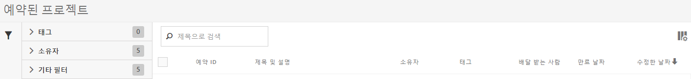

# 예약된 프로젝트 관리자

예약된 Analysis Workspace 프로젝트를 관리합니다.

**[!UICONTROL Analytics]** &gt; **[!UICONTROL 구성 요소]** &gt; **[!UICONTROL 예약된 프로젝트]**.

예약된 프로젝트 관리자에서 반복되는 프로젝트 배달을 편집하고 삭제할 수 있습니다. 이메일을 통해 지정된 주소로 보고서를 전송하는 배달 예약을 작성할 수 있습니다. 특정 시간 동안 또는 무한정으로 지정된 간격에 따라 보고서를 자동 전송하도록 하거나 되풀이되는 프로젝트 배달을 중지하도록 예약을 구성할 수 있습니다.

예약된 프로젝트 관리자는 특정 사용자가 만든 항목을 보여줍니다. 애플리케이션에서 사용자 계정이 비활성화된 경우 모든 예약된 배달이 중지됩니다.

* 예약된 프로젝트를 편집합니다.
* 프로젝트의 예약 ID(주로 디버그 목적으로 사용됨)를 봅니다.
* 예약된 프로젝트를 검색합니다.
* 예약된 프로젝트에 태그를 지정합니다.
* 예약된 프로젝트의 소유자를 지정/변경합니다.
* [승인됨], [실패], [즐겨찾기], [내 소유], [모두 표시], [만료된 프로젝트]와 같은 기타 필터를 추가합니다.

* 예약된 프로젝트의 만료 날짜를 정의합니다.

