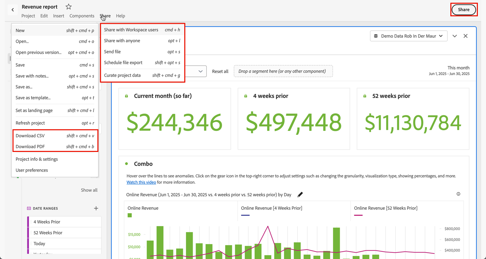

# 공유 개요

Analysis Workspace의 **[!UICONTROL 공유]** 메뉴에서 사용 가능한 옵션을 사용하거나 인터페이스 오른쪽 상단에서 **[!UICONTROL 공유]**&#x200B;를 선택하면 조직의 수신자에게 PDF 또는 CSV 파일로 프로젝트를 조정, 공유 및 예약할 수 있습니다.

| 옵션 | 설명 |
|---|---|
| **[!UICONTROL Workspace 사용자와 공유]** | 프로젝트를 조직의 다른 Analysis Workspace 사용자가 사용할 수 있게 합니다. 특정 사용자와 공유하거나, 프로젝트에 신속하게 액세스할 수 있는 공유 가능한 링크를 만듭니다. 사용자는 로그인해야 합니다. [자세히 알아보기](/help/analyze/analysis-workspace/curate-share/share-projects.md) |
| **[!UICONTROL 모두와 공유]** | Adobe Analytics에 액세스할 수 없는 사용자에게 Analysis Workspace 프로젝트에 대한 읽기 전용 액세스 권한을 부여합니다. [자세히 알아보기](/help/analyze/analysis-workspace/curate-share/share-projects.md) |
| **[!UICONTROL 파일 보내기]** | 프로젝트를 지정된 수신자에게 즉시 CSV 또는 PDF로 전송합니다. [자세히 알아보기](/help/analyze/analysis-workspace/curate-share/t-schedule-report.md) |
| **[!UICONTROL 파일 내보내기 예약]** | 프로젝트를 지정된 수신자에게 일정에 따라 CSV 또는 PDF로 전송합니다. [자세히 알아보기](/help/analyze/analysis-workspace/curate-share/t-schedule-report.md) |
| **[!UICONTROL 프로젝트 데이터 조정]** | 프로젝트에서 사용할 수 있는 구성 요소(차원, 지표, 세그먼트, 날짜 범위)를 제한합니다. [추가 정보](/help/analyze/analysis-workspace/curate-share/curate.md) |
