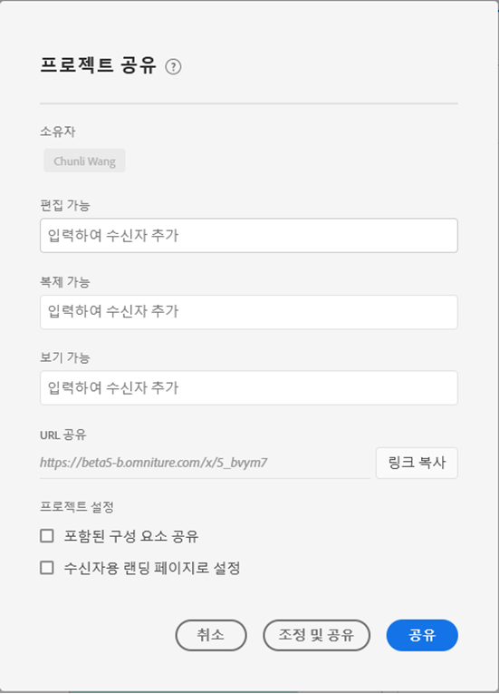
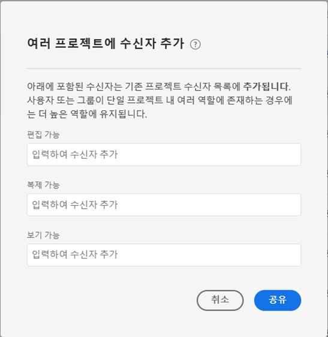

# 작업 공간 프로젝트 공유

공유하면 조직의 다른 Analysis Workspace 사용자가 프로젝트를 사용할 수 있습니다. 적용한 모든 [조정](curate.md) 기능은 받는 사람이 프로젝트를 열 때 반영됩니다.

## 프로젝트 역할 {#Roles}

3개의 프로젝트 역할 중 하나에 받는 사람을 추가할 수 있습니다. 프로젝트 역할은 사용자 및 특정 프로젝트 ID에 연결되어 있습니다. 프로젝트 역할은 [Adobe Experience Cloud 관리 콘솔에서 관리되는 사용자 권한과 독립적입니다](https://docs.adobe.com/content/help/ko-KR/core-services/interface/manage-users-and-products/admin-getting-started.html).

| 역할 | 프로젝트 제어 |
|---|---|
| 편집 가능 | 수신자는 프로젝트 및 기능에 대한 변경 내용을 공동 소유자로서 저장할 수 있습니다. 이 역할은 프로젝트를 다른 동료와 공동 편집하려는 경우 유용합니다. 참고: Analysis Workspace은 현재 라이브 공동 작업을 지원하지 않으므로 주어진 시간에 한 명의 사용자만 프로젝트를 편집하는 것이 좋습니다. 프로젝트를 동시에 저장하는 경우 마지막 버전이 유지됩니다. |
| 복제 가능 | 수신자는 다른 이름으로 저장하고 왼쪽 레일에 액세스할 수 있습니다. 이 역할에서는 프로젝트 상호 작용이 제한되지 않습니다. 이 역할은 조직의 데이터 및 Analysis Workspace 사용 방법을 이해하지만 프로젝트를 변경하지 않으려는 사용자에게 프로젝트를 공유하려는 경우에 유용합니다. |
| 보기 가능 | 받는 사람은 다른 이름으로 저장할 수 없으며 왼쪽 레일에 액세스할 수 없습니다. 프로젝트 상호 작용도 제한됩니다. 이 역할은 일반적으로 조직의 데이터 구조, Analysis Workspace 또는 Adobe Analytics에 익숙하지 않은 사용자에게 프로젝트를 공유하려는 경우에 유용합니다. 그러나 안전한 환경에서 데이터와 통찰력을 소비해야 합니다. 프로젝트 경험 [을 볼 수 있음에 대해 자세히 알아보십시오](/help/analyze/analysis-workspace/curate-share/view-only-projects.md). |

>[!IMPORTANT]
> 2020년 6월 18일 이전에 추가된 프로젝트 수신자는 프로젝트 역할로 마이그레이션되었습니다. 관리자 사용자가 역할 편집 **[!UICONTROL 가능]** 및 관리자가 아닌 사용자가 복제 **[!UICONTROL 가능한]** 역할로 마이그레이션했습니다. 이러한 역할은 이전에 경험했던 것과 동일한 프로젝트 경험을 제공합니다. 또한 모든 그룹(&quot;모두&quot; 포함)이 복제 **[!UICONTROL 가능한]** 역할로 마이그레이션됩니다.

### 할당된 역할 없음(프로젝트 링크 받는 사람)

받는 사람에게 역할이 할당되지 않고 프로젝트에 대한 링크를 받는 경우(**[!UICONTROL 공유][!UICONTROL > 프로젝트]**&#x200B;가져오기 링크 **** ) 기본적으로복제가능 역할에배치됩니다.

### 여러 역할 할당

수신자가 여러 역할에 배치되면 항상 가장 높은 경험을 받게 됩니다. 이는 받는 사람이 개인과 그룹의 일부로 모두 추가되는 경우에 발생할 수 있습니다. 예를 들어, 수신자에게 개인으로서 **[!UICONTROL 역할 편집]** 가능 **** 및 그룹의 구성원으로 역할을 볼 **[!UICONTROL 수 있음]** 이 주어지면, 해당 사용자는프로젝트 편집가능 환경을받게 됩니다.

### 관리자 및 역할

복제 **[!UICONTROL 가능]** 또는 **[!UICONTROL 역할을 볼]** 수 있음에 배치된 관리자는 프로젝트를 열 때 제한된 경험을 받게 됩니다. 원하는 경우 관리자는 구성 요소 **[!UICONTROL > 프로젝트를 통해 언제든지 편집할]** 수 **[!UICONTROL 있도록 역할을]늘릴[!UICONTROL 수]**&#x200B;있습니다.

## 공유 프로젝트에 받는 사람 추가 {#Add}

공유 프로젝트에 받는 사람을 추가하려면:

1. 공유 **[!UICONTROL > 프로젝트]** **[!UICONTROL 공유를 클릭합니다]**.
저장하지 않은 변경 사항이 있으면 먼저 프로젝트를 저장하라는 메시지가 표시됩니다.
1. 받는 사람 또는 받는 사람 그룹을 추가합니다.
각 역할에 대한 설명은 맨 위의 도움말 아이콘을 참조하십시오.
1. (선택 사항) 포함된 프로젝트 구성 요소(세그먼트, 계산된 지표 및 날짜 범위)를 모든 받는 사람과 공유합니다.
공유 후 이러한 구성 요소는 수신자의 작업 영역의 구성 요소 드롭다운에 나타납니다. 이 설정은 지속되지 않으며 공유 시 하나의 동작입니다.
1. (선택 사항) 이 페이지를 수신자의 랜딩 페이지로 설정합니다.
이 설정은 유지되지 않습니다. 공유 시의 단일 작업입니다.
1. 공유를 클릭합니다.
또한 조정 및 공유 **[!UICONTROL 를 클릭하여 프로젝트 조정을]** 자동으로 적용할 수도 있습니다. 프로젝트가 이미 공유된 경우 이 단추에는 **[!UICONTROL 업데이트]** 및 **[!UICONTROL 조정 및 업데이트가 표시됩니다]**. 프로젝트 조정에 대한 자세한 [내용을 살펴보십시오](https://docs.adobe.com/content/help/ko-KR/analytics/analyze/analysis-workspace/curate-share/curate.html).

## 받는 사람 그룹에 공유 {#Groups}

모든 사용자는 수신자의 집합인 그룹에 프로젝트를 공유할 수 있습니다. Adobe Analytics에서 그룹은 [Adobe Experience Cloud 관리 콘솔에서 제품 프로필로 정의됩니다](https://docs.adobe.com/content/help/ko-KR/core-services/interface/manage-users-and-products/admin-getting-started.html).

* 관리자는 &quot;모두&quot;를 비롯한 모든 그룹과 공유할 수 있습니다.
* 관리자가 아닌 사용자는 &quot;모두&quot;를 제외하고 자신이 구성원으로 있는 그룹과 공유할 수 있습니다.

## Share a project link {#Links}

[공유] > [프로젝트 **[!UICONTROL 가져오기]에서 프로젝트]링크를[!UICONTROL 가져올 수 있습니다]**. 클릭하면 수신자는 프로젝트에 참여하기 전에 로그인해야 합니다. 수신자가 프로젝트 역할에 배치되지 않은 경우 기본적으로 복제 **[!UICONTROL 가능]** 프로젝트 환경을 받게 됩니다.

[구성 요소] > [ **[!UICONTROL 프로젝트]에서 프로젝트를 공유할 수도]있습니다**. 위의 동일한 단계에 따라 단일 프로젝트를 공유할 수 있습니다

## 프로젝트 관리자에서 프로젝트 공유 {#Manager}

[구성 요소] > [ **[!UICONTROL 프로젝트]에서 프로젝트를 공유할 수도]있습니다**. 위의 동일한 단계에 따라 단일 프로젝트를 공유할 수 있습니다.  여러 프로젝트를 공유하도록 선택하면 받는 사람이 각 프로젝트에 대한 기존 수신자 목록에 추가됩니다.

예:

* 프로젝트 A는 받는 사람에게 공유됨 1, 2, 3
* 프로젝트 B는 수신자에게 공유됨 4, 5, 6

프로젝트 A와 B를 선택하면 받는 사람 4 및 7이 공유 목록에 추가됩니다. 이제 각 프로젝트에 대한 새 공유 목록이 표시됩니다.

* 프로젝트 A: 1, 2, 3, 4, 7
* 프로젝트 B: 4, 5, 6, 7

## FAQ {#FAQs}

| 질문 | 답변 |
|---|---|
| 두 명의 편집자가 동시에 프로젝트를 저장하면 어떻게 됩니까? | 변경 사항은 병합되지 않고 마지막으로 저장한 프로젝트 버전이 유지됩니다. Analysis Workspace은 현재 실시간 공동 작업을 지원하지 않습니다. |
| 관리자는 어떤 프로젝트 경험을 보게 됩니까? | 복제 **[!UICONTROL 가능]** 또는 **[!UICONTROL 역할을 볼]** 수 있음에 배치된 관리자는 프로젝트를 열 때 제한된 경험을 받게 됩니다. 원하는 경우 관리자는 구성 요소 **[!UICONTROL > 프로젝트를 통해 언제든지 편집할]** 수 **[!UICONTROL 있도록 역할을]늘릴[!UICONTROL 수]**&#x200B;있습니다. |
| 받는 사람이 하나의 역할에서 개인 또는 그룹의 구성원으로서의 다른 역할에 배치되면 어떻게 됩니까? | 수신자가 여러 역할에 배치되면 항상 더 높은 경험을 받게 됩니다. 예를 들어, 수신자에게 개인으로서 **[!UICONTROL 역할 편집]** 가능 **** 및 그룹의 구성원으로 역할을 볼 **[!UICONTROL 수 있음]** 이 주어지면, 해당 사용자는프로젝트 편집가능 환경을받게 됩니다. |
| 프로젝트 링크를 열면 수신자는 어떤 경험을 얻을 수 있습니까? | 받는 사람에게 역할이 할당되지 않고 프로젝트에 대한 링크를 받는 경우(**[!UICONTROL 공유][!UICONTROL > 프로젝트]**&#x200B;가져오기 링크 **** ) 기본적으로복제가능 역할에배치됩니다. |
