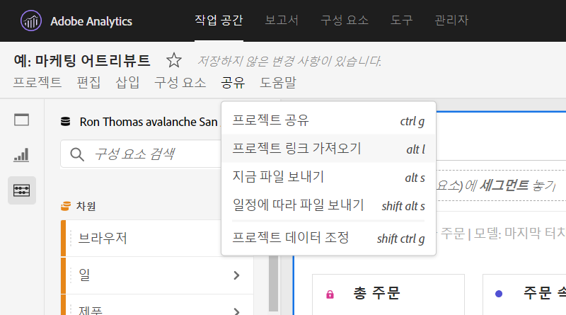
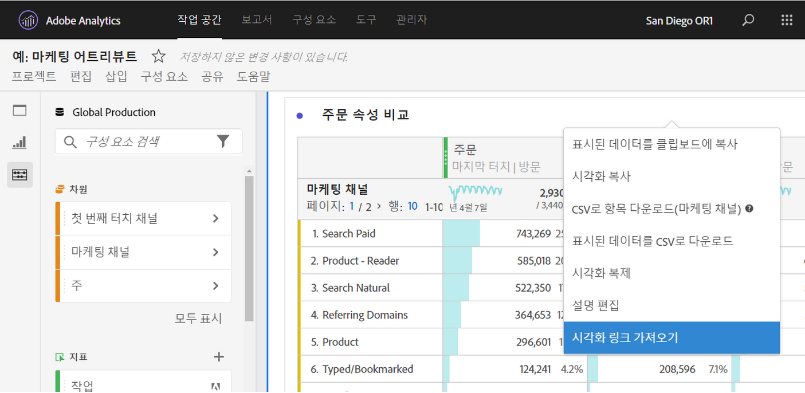
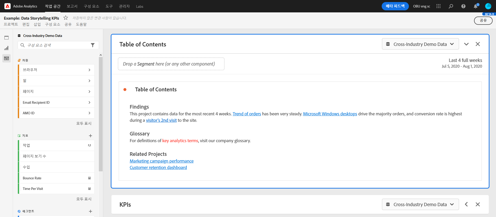

# 공유 가능한 링크 만들기

Analysis Workspace는 프로젝트 또는 프로젝트의 특정 부분에 대한 링크를 가져오는 기능을 포함하여 사용자에게 프로젝트를 공유할 수 있는 다양한 방법을 제공합니다. 링크를 받은 사용자는 프로젝트에 액세스하기 전에 Adobe Analytics에 로그인해야 합니다.

## 프로젝트 링크 가져오기 {#project-link}

전체 프로젝트에 대한 링크를 공유하려면 **[!UICONTROL 공유 > 프로젝트 링크 가져오기]**&#x200B;로 이동합니다. 링크의 수신자에게 [프로젝트 역할](https://docs.adobe.com/content/help/ko-KR/analytics/analyze/analysis-workspace/curate-share/share-projects.html)이 할당되지 않은 경우 관리자는 **[!UICONTROL 편집 가능]** 기능을 받으며 관리자가 아닌 사용자는 **[!UICONTROL 복제 가능]** 경험을 받습니다.

## 패널 또는 시각화 링크 가져오기 {#panel-link}

패널 또는 개별 시각화 등 프로젝트의 특정 부분에 대한 링크를 공유할 수도 있습니다. 이를 내부 연결이라고도 합니다. 이 기능은 프로젝트 내의 주요 인사이트에 사용자의 주의를 기울이는 데 유용할 수 있습니다.

* 패널 헤더에서 **[!UICONTROL 패널 링크 가져오기]**&#x200B;를 마우스 오른쪽 단추로 클릭합니다.
* 테이블 또는 시각화 헤더에서 **[!UICONTROL 시각화 링크 가져오기]**&#x200B;를 마우스 오른쪽 단추로 클릭합니다.

[비디오 보기](https://docs.adobe.com/content/help/ko-KR/analytics-learn/tutorials/analysis-workspace/visualizations/intra-linking-in-analysis-workspace.html)에서 링크를 만들고 이를 사용하여 수신자를 프로젝트의 특정 부분으로 유도하는 방법에 대해 알아봅니다.

## 목차에 링크 사용 {#TOC}

다양한 링크 옵션을 활용하는 한 가지 팁은 작업 공간 프로젝트 상단에 항상 목차를 포함하는 것입니다. 목차에서는 다른 관련 프로젝트, 특정 패널 및 특정 시각화에 연결할 수 있습니다. 이렇게 하면 프로젝트의 수신자가 보다 쉽게 탐색할 수 있습니다.

[비디오 보기](https://docs.adobe.com/content/help/ko-KR/analytics-learn/tutorials/analysis-workspace/navigating-workspace-projects/create-a-toc-in-analysis-workspace.html)에서 링크 및 작업 공간의 리치 텍스트 편집기를 사용하여 목차를 구성하는 방법에 대해 알아봅니다.

