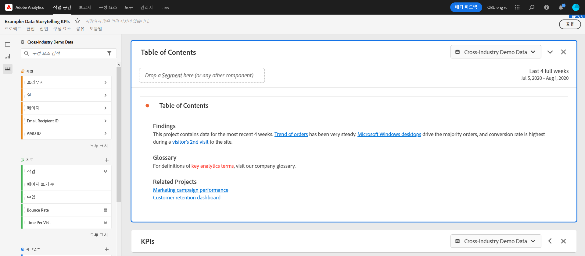
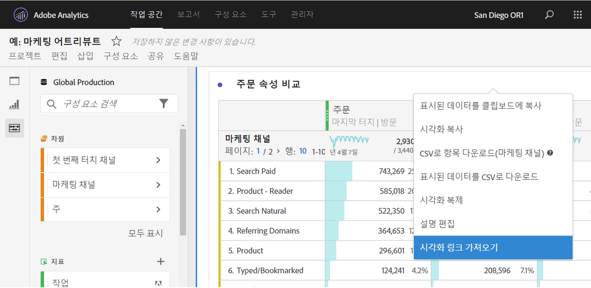

# 공유 가능한 링크 만들기

Analysis Workspace는 프로젝트 또는 프로젝트의 특정 부분에 대한 링크를 가져오는 기능을 포함하여 사용자에게 프로젝트를 공유할 수 있는 다양한 방법을 제공합니다. 일부 링크 유형에서는 수신자가 Adobe Analytics에 로그인해야 프로젝트에 액세스할 수 있지만 다른 링크 유형에서는 그렇지 않습니다.

## 다른 Workspace 사용자와 공유할 프로젝트 링크 받기 {#project-link}

프로젝트에 대한 링크를 공유하려면 공유할 프로젝트로 이동한 다음 **[!UICONTROL 공유]** > **[!UICONTROL 프로젝트 링크 가져오기]**(또는 **[!UICONTROL 공유]** > **[!UICONTROL Workspace 사용자와 공유]** > **[!UICONTROL 링크로 공유]**)로 이동을 선택합니다. 링크를 공유받는 사용자는 로그인해야 합니다.

링크의 수신자에게 [프로젝트 역할](/help/analyze/analysis-workspace/curate-share/share-projects.md)이 할당되지 않은 경우 관리자는 **[!UICONTROL 원본 편집]**&#x200B;을 받고 관리자가 아닌 사용자는 **[!UICONTROL 복사본 편집]**&#x200B;을 받습니다.

## 모두와 공유할 수 있는 읽기 전용 링크 받기

Adobe Analytics에 대한 액세스 권한이 없는 사용자와 Analysis Workspace 프로젝트에 대한 읽기 전용 링크를 공유할 수 있습니다.

자세한 내용은 [모든 사람과 공유](/help/analyze/analysis-workspace/curate-share/share-projects.md#share-a-project-with-anyone-no-login-required)를 참조하십시오.

## 패널 또는 시각화 링크 가져오기 {#panel-link}

패널 또는 개별 시각화 등 프로젝트의 특정 부분에 대한 링크를 공유할 수도 있습니다. 이를 내부 연결이라고도 합니다. 이 기능은 프로젝트 내의 주요 인사이트에 사용자의 주의를 기울이는 데 유용할 수 있습니다.

* 패널 헤더의 컨텍스트 메뉴에서 **[!UICONTROL 패널 링크 가져오기]**&#x200B;를 선택합니다.
* 시각화 헤더의 컨텍스트 메뉴에서 **[!UICONTROL 시각화 링크 가져오기]**&#x200B;를 선택합니다.

[비디오 보기](https://experienceleague.adobe.com/docs/analytics-learn/tutorials/analysis-workspace/visualizations/intra-linking-in-analysis-workspace.html?lang=ko-KR)에서 링크를 만들고 이를 사용하여 수신자를 프로젝트의 특정 부분으로 유도하는 방법에 대해 알아봅니다.

## 목차에 링크 사용 {#TOC}

다양한 링크 옵션을 활용하는 한 가지 팁은 작업 영역 프로젝트 상단에 항상 목차를 포함하는 것입니다. 목차에서는 다른 관련 프로젝트, 특정 패널 및 특정 시각화에 연결할 수 있습니다. 이렇게 하면 프로젝트의 수신자가 보다 쉽게 탐색할 수 있습니다.

[비디오 시청](https://experienceleague.adobe.com/docs/analytics-learn/tutorials/analysis-workspace/navigating-workspace-projects/create-a-toc-in-analysis-workspace.html?lang=ko-KR)에서 링크 및 Workspace의 리치 텍스트 편집기를 사용하여 목차를 구성하는 방법에 대해 알아보십시오.

<!--
# Create shareable links

Analysis Workspace offers many ways to share a project to your users, including the ability to get a link to a project or a specific part of a project. Some link types require the recipient to log in to Adobe Analytics before accessing the project, while others do not. 

## Get a project link to share with other Workspace users {#project-link} 

To share a link to a project, go to the project you want to share, then select go to [!UICONTROL **Share**] > [!UICONTROL **Share with Workspace users**] > [!UICONTROL **Share by link**]. Users you share the link with are required to log in. 

If the recipient of the link has not been assigned a [project role](/help/analyze/analysis-workspace/curate-share/share-projects.md), admins receive **[!UICONTROL Edit original]** and non-admins receive **[!UICONTROL Edit copy]** experiences.

## Get a read-only link to share with anyone

You can share a read-only link to Analysis Workspace projects with people who don't have access to Adobe Analytics. Users you share the link with are not required to log in. 

For more information, see "Share a project with anyone (no login required)" in the article [Share projects](/help/analyze/analysis-workspace/curate-share/share-projects.md).

## Get panel or visualization link {#panel-link} 

You can also share a link to a specific part of a project, such as a panel or individual visualization. This is sometimes referred to as intra-linking. This can be useful to draw your users' attention to key insights within the project.  

* From any panel header, right-click **[!UICONTROL Get panel link]** 
* From any table or visualization header, right-click **[!UICONTROL Get visualization link]** 

[Watch the video](https://experienceleague.adobe.com/docs/analytics-learn/tutorials/analysis-workspace/visualizations/intra-linking-in-analysis-workspace.html?lang=ko) on how to create links and use them to drive recipients to specific parts of your project. 

-->