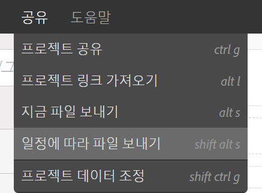
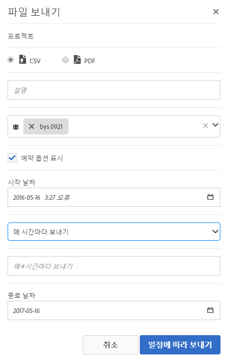

# 파일 보내기 - 배달할 프로젝트 예약

이메일을 통해 Analysis Workspace 프로젝트를 보내거나 전달할 일정을 예약합니다.

1. [Analysis Workspace 프로젝트를 생성하고](https://marketing.adobe.com/resources/help/en_US/analytics/analysis-workspace/t_freeform_project.html) 저장합니다.
1. **[!UICONTROL [공유]** ] &gt; [일정에 따라 파일 **[!UICONTROL 보내기]**] 를 클릭합니다.

   

1. [!UICONTROL 파일 보내기] 페이지에서 파일 형식(CSV 또는 PDF)을 지정합니다. 

   

1. Add recipients email addresses or names, the click **[!UICONTROL Send Now]**.
1. (Optional) Click **[!UICONTROL Show Scheduling Options]** to specify a delivery schedule, then click **[!UICONTROL Send on Schedule]**.
1. **[!UICONTROL 구성 요소]** &gt; [예약된 프로젝트에서 예약된 프로젝트를 관리합니다](../../../analyze/analysis-workspace/curate-share/schedule-projects.md#concept_A7B9856EF2504BD791FE5A9E8AA7C29C).