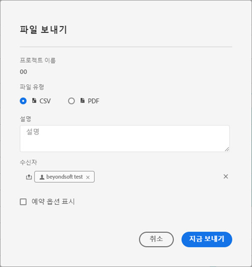
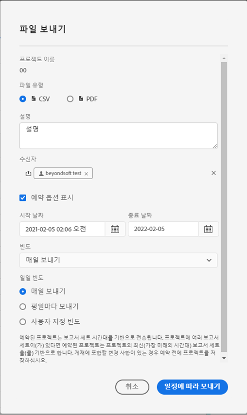
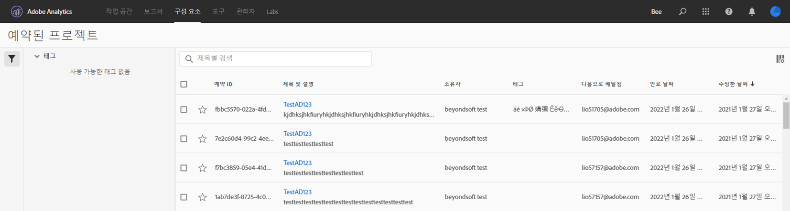

# 프로젝트 예약

Workspace **공유 메뉴**&#x200B;에서 이메일을 통해 선택한 수신자에게 Analysis Workspace 프로젝트를 보낼 수 있습니다. 파일은 CSV 또는 PDF 형식으로 보낼 수 있습니다.

## 지금 파일 보내기

이메일을 통해 파일을 수신자에게 즉시 보내려면

1. **공유 > 지금 파일 보내기**&#x200B;를 클릭합니다.
1. 파일 유형(CSV 또는 PDF)을 지정합니다.
1. (선택 사항) 수신되는 파일을 설명하기 위해 이메일에 포함할 설명을 추가합니다.
1. 수신자 또는 그룹을 추가합니다. 이메일 주소를 입력할 수도 있습니다.
1. **지금 보내기**&#x200B;를 클릭합니다.
1. (선택 사항) 배달 일정을 지정하려면 **예약 옵션 표시**&#x200B;를 클릭합니다.

## 일정에 따라 파일 보내기

이메일을 통해 되풀이되는 일정으로 수신자에게 파일을 보내려면

1. **공유 > 일정에 따라 파일 보내기**&#x200B;를 클릭합니다.
1. 파일 유형(CSV 또는 PDF)을 지정합니다.
1. (선택 사항) 수신되는 파일을 설명하기 위해 이메일에 포함할 설명을 추가합니다.
1. 수신자 또는 그룹을 추가합니다. 이메일 주소를 입력할 수도 있습니다.
1. 입력 시 시작 및 종료를 수정하여 일정이 전달될 범위를 지정합니다. 종료 날짜는 일정을 만들거나 수정한 날로부터 1년 이내여야 합니다.
1. 배달 빈도를 지정합니다. 각 빈도에서는 다양한 사용자 지정을 사용할 수 있습니다.
1. **일정에 따라 보내기**&#x200B;를 클릭합니다.

## 예약된 프로젝트 관리자

예약된 Analysis Workspace 프로젝트는 **Analytics > 구성 요소 > 예약된 프로젝트**&#x200B;에서 관리할 수 있습니다.

예약된 프로젝트 관리자에서 반복되는 프로젝트 일정을 편집하고 삭제할 수 있습니다. 검색 창에서 또는 왼쪽 레일의 필터 옵션을 사용하여 예약을 검색하십시오. 태그, 승인된 일정, 소유자 등으로 필터링할 수 있습니다.

다음은 예약된 프로젝트 관리자의 일반적인 작업입니다.

| 작업 | 설명 |
|---|---|
| **예약 편집** | 예약 제목을 클릭하여 배달 설정을 업데이트합니다. |
| **예약 삭제** | 목록에서 예약된 프로젝트를 선택한 다음, 메뉴에서 삭제를 클릭합니다. 선택한 프로젝트 예약이 삭제됩니다. 프로젝트 자체는 삭제되지 않습니다. |
| **태그 추가** | 일정을 구성하고 검색하기 더 쉽게 하려면 목록에서 예약된 프로젝트를 선택한 다음, &quot;태그&quot; 또는 &quot;승인&quot;을 선택합니다. |
| **실패한 일정 보기** | 실패한 예약을 보려면 왼쪽 레일 > 기타 필터 > 실패로 이동합니다. |
| **만료된 일정 보기** | 만료된 예약을 보려면 왼쪽 레일 > 기타 필터 > 만료됨으로 이동합니다. 예약의 제목을 클릭하여 새 배달 예약을 설정합니다. |
| **예약 ID 보기** | 오른쪽 상단의 열 옵션으로 이동하고 예약 ID 열을 테이블에 추가합니다. 예약된 ID는 종종 디버깅에 유용합니다. |

예약된 프로젝트 관리자는 특정 사용자가 만든 항목을 보여줍니다. 응용 프로그램에서 사용자 계정이 비활성화된 경우 모든 예약된 배달이 중지됩니다. 예약된 프로젝트 소유권은 **관리 > Analytics 사용자 및 자산 > 자산 전송**&#x200B;에서 새 사용자에게 **양도**&#x200B;할 수 있습니다.
