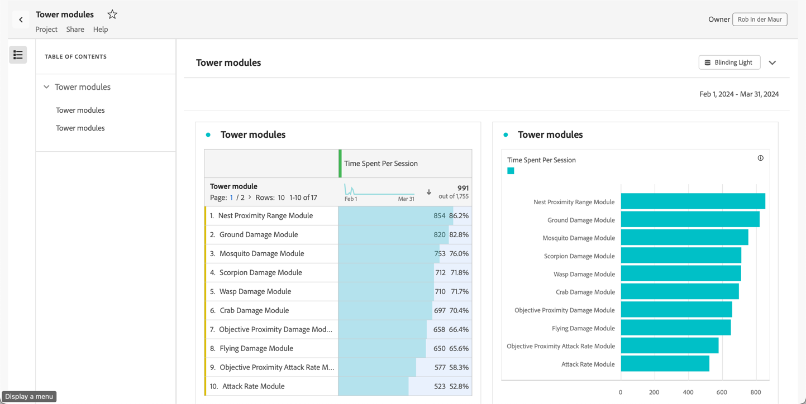

# 읽기 전용 프로젝트

[공유 기능](share-projects.md)을 통해 받는 사람에게 프로젝트를 읽기 전용으로 공유할 수 있습니다. **[!UICONTROL 읽기 전용]** 역할에 배치된 수신자는 보다 제한된 프로젝트 경험을 받게 됩니다.

일반적으로 조직의 데이터 구조, Analysis Workspace 또는 Adobe Analytics에 익숙하지 않지만 안전한 환경에서 데이터와 통찰력을 소비하려는 사용자에게 프로젝트를 공유하는 경우 이러한 작업이 필요할 수 있습니다.

읽기 전용 수신자에 대한 상호 작용은 제한됩니다.

## 비활성화된 상호 작용

보기 전용 프로젝트에서 비활성화된 상호 작용은 다음과 같습니다.

* 숨겨진 왼쪽 패널
* 패널 달력 날짜 범위입니다. 참고: 받는 사람에게 달력 컨트롤을 부여하려면 [날짜 범위가 있는 드롭다운 세그먼트](https://experienceleague.adobe.com/docs/analytics-learn/tutorials/analysis-workspace/using-panels/using-drop-down-filters.html?lang=ko)에 추가하십시오.
* 자유 형식 세그먼트화
* 보이는 행의 자유 형식 수
* 자유 형식 행, 열 또는 시각화 설정
* 패널 세그먼트
* 편집, 삽입 및 구성 요소 메뉴
* 작업 영역 팁

## 활성화된 상호 작용

보기 전용 프로젝트에서 보다 주목할 수 있는 활성화 상호 작용 중 일부는 다음과 같습니다.

| 영역 | 활성화된 상호 작용 |
| --- | --- |
| **자유 형식 테이블** | <li>페이지 매김 및 정렬</li><li>마우스로 가리키기</li><li>연결된 시각화를 업데이트하는 셀 선택</li><li>컨텍스트 메뉴 > 시각화 링크 가져오기</li><li>컨텍스트 메뉴 > 클립보드에 복사</li> |
| **시각화** | <li>범례를 켜거나 해제하려면 클릭</li><li>마우스로 가리키기</li><li>컨텍스트 메뉴 > 시각화 링크 가져오기</li><li>축소/확장</li><li>플로우 - 플로우 노드 확장</li><li>지도 - 확대/축소</li></ul> |
| **패널** | <li>대화형 드롭다운 세그먼트</li><li>컨텍스트 메뉴 > 패널 링크 가져오기</li><li>축소/확장</li> |
| **프로젝트** | <li>모든 정보 아이콘 검사</li><li>프로젝트 메뉴 - 신규, 열기, 랜딩 페이지로 설정, 새로 고침, CSV/PDF 다운로드, 제한된 프로젝트 정보 및 설정</li><li>공유 메뉴 - 프로젝트 링크 받기, 지금 파일 보내기</li><li>도움말 메뉴 - 팁 및 디버거 옵션을 제외한 모든 작업</li> |

## 모든 경험과 공유

[모든 사람과 공유](share-projects.md#share-a-project-with-anyone-no-login-required)를 사용하여 프로젝트를 선택한 경우 링크 수신자는 프로젝트만 볼 수 있으며 프로젝트와 상호 작용할 수 없습니다.

