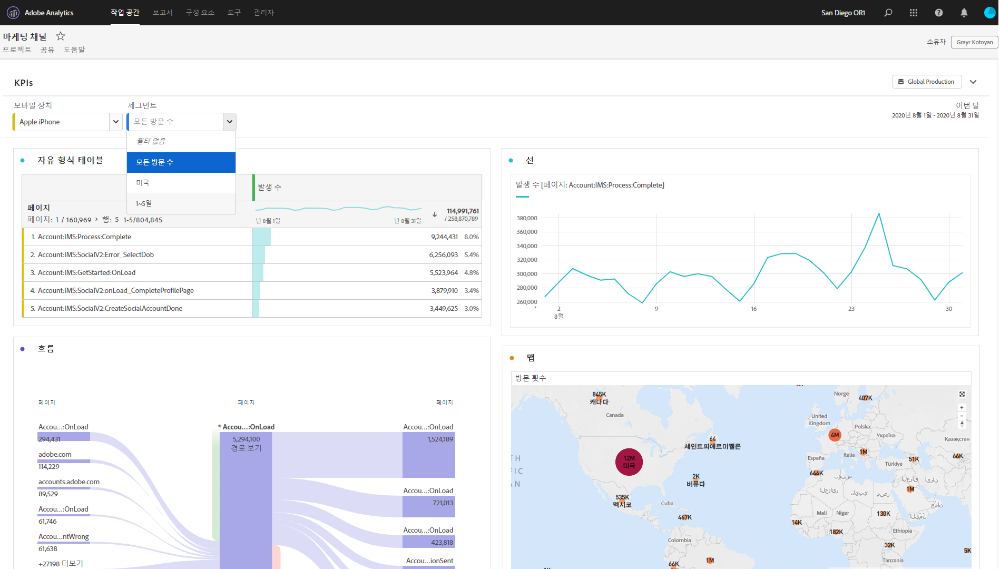

# 보기 전용 작업 공간 프로젝트

프로젝트 공유 워크플로우를 통해 받는 사람에게 프로젝트를 &quot;보기 전용&quot;으로 공유할 수 [있습니다](/help/analyze/analysis-workspace/curate-share/share-projects.md). 볼 수 있음 역할에 배치된 수신자는 더 제한된 프로젝트 경험을 받게 됩니다. 일반적으로 조직의 데이터 구조, 분석 작업 공간 또는 Adobe Analytics에 익숙하지 않은 사용자에게 프로젝트를 공유하는 경우에도 안전한 환경에서 데이터와 통찰력을 사용하기를 원하는 경우 이러한 작업을 원할 수 있습니다.

## 비활성화된 상호 작용

보기 전용 프로젝트에서 비활성화된 상호 작용은 다음과 같습니다.

* 숨겨진 왼쪽 레일
* 보고서 세트
* 패널 달력 날짜 범위참고: 받는 사람에게 달력 컨트롤을 부여하려면 날짜 범위의 [드롭다운 필터에 추가합니다](https://docs.adobe.com/content/help/en/analytics-learn/tutorials/analysis-workspace/using-panels/using-drop-down-filters.html).
* 자유 형식 필터링
* 보이는 행의 자유 형식 수
* 자유 형식 행, 열 또는 시각화 설정
* 패널 세그먼트
* 편집, 삽입 및 구성 요소 메뉴

## 활성화된 상호 작용

보기 전용 프로젝트에서 보다 주목할 수 있는 활성화 상호 작용 중 일부는 다음과 같습니다.

| 영역 | 활성화된 상호 작용 |
|---|---|
| 자유 형식 테이블 | <ul><li>페이지 매김 및 정렬</li><li>마우스로</li><li>연결된 시각화를 업데이트하는 셀 선택</li><li>마우스 오른쪽 단추 클릭 > 시각화 링크 가져오기</li><li>마우스 오른쪽 단추 클릭 > 클립보드에 복사</li></ul> |
| 시각화 | <ul><li>범례를 켜거나 해제하려면 클릭</li><li>마우스로</li><li>마우스 오른쪽 단추 클릭 > 시각화 링크 가져오기</li><li>축소/확장</li><li>흐름 - 흐름 노드 확장</li><li>지도 - 확대/축소</li></ul> |
| 패널 | <ul><li>인터랙티브한 드롭다운 필터</li><li>마우스 오른쪽 단추 클릭 > 패널 링크 가져오기</li><li>축소/확장</li></ul> |
| 프로젝트 | <ul><li>모든 정보 아이콘 검사</li><li>프로젝트 메뉴 - 신규, 열기, 랜딩 페이지로 설정, 새로 고침, CSV/PDF 다운로드, 제한된 프로젝트 정보 및 설정</li><li>공유 메뉴 - 프로젝트 링크 받기, 지금 파일 보내기</li><li>도움말 메뉴 - 팁 및 디버거 옵션을 제외한 모든 작업</li></ul> |