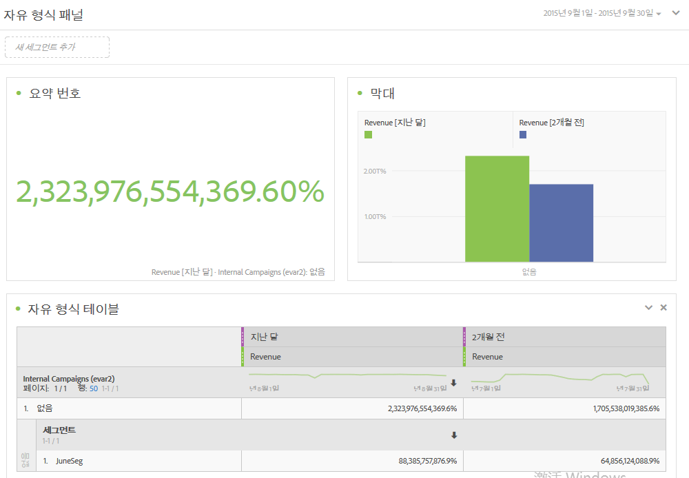
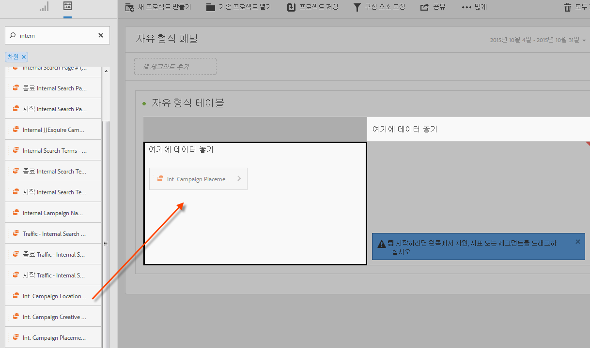
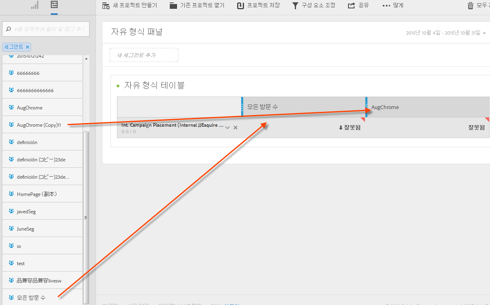
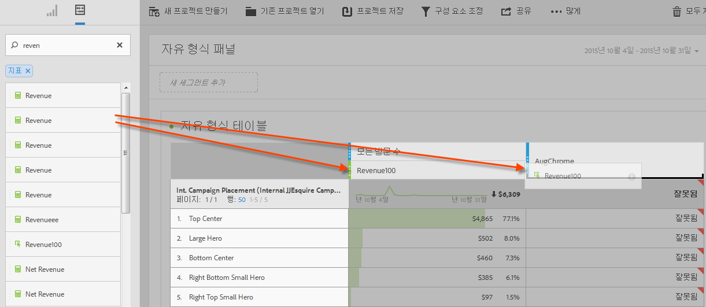
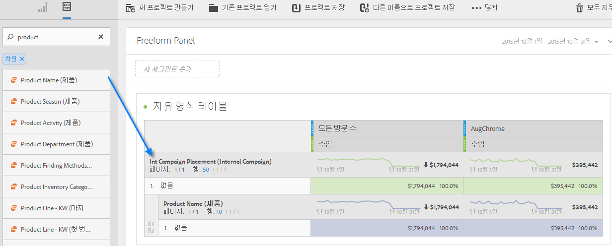
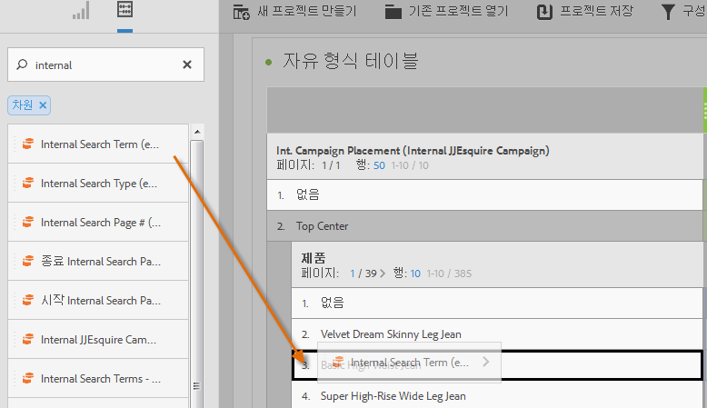
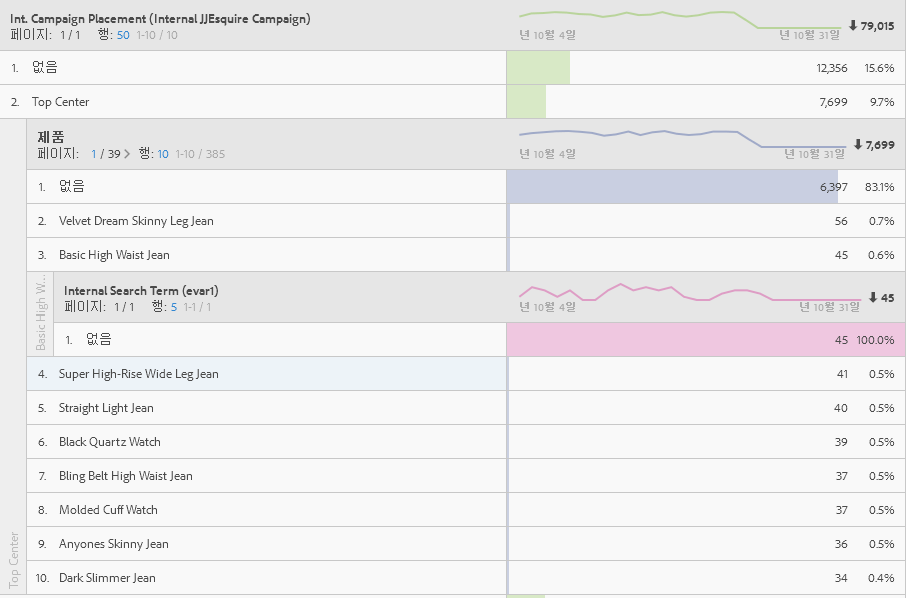

# 분석 작업 공간 사용 사례

데이터 테이블, 세그먼트, Analysis Workspace에 대한 사용 사례 아이디어를 사용하는 방법의 예입니다.

데이터에 대한 연구가 특정 질문에 대한 답을 찾을 수 있도록 하고 고객의 상호 작용 및 대상 관심 사항에 대한 나레이션을 만들 수 있습니다. 자유 형식 환경에서는 일정 기간 동안의 차원, 지표 및 세그먼트를 적용하여 대상 데이터를 바로 검색할 수 있습니다. 특정 질문에 대해 사용자 지정할 분석을 공들여 만든 다음, 정보를 리치 보고서 및 시각화로 게시하여 시간 제한이 가장 심한 최전선 비즈니스 사용자가 공유하고 쉽게 해석할 수 있도록 하십시오.

**예**

* 미디어 회사의 경우, 새로운 방문자, 재방문자 및 가장 충성스러운 방문자를 비교하여 컨텐츠 소비가 각각의 서로 다른 세그먼트에 대해 시간이 지남에 따라 어떻게 변하는지를 확인하려 할 수 있습니다.
* 브랜드가 있는 키워드와 브랜드가 없는 키워드에 대한 전환율을 비교합니다.
* 페이지 보기를 내부 검색, 외부 검색, 랜딩 페이지 등으로 분류하여 브랜드가 있는 용어와 브랜드가 없는 용어가 왜 다르게 수행되는지 알아봅니다.
* 다음 날을 기준으로 날을 비교하여 열 또는 행을 비교함으로써 여러 지표 간에 증가를 분석합니다.
* 차원당 바운스 수와 같이 간단한 쿼리를 수행하십시오.

## 소매 예 {#section_9EFDEF038CAD4954BCFB118A8F33A96F}

야외활동 장비 소매를 위한 마케팅 분석가이고 최근 추수감사절 판촉 행사가 수행되는 방식을 조사하고 현장 캠페인을 개선할 방법에 대해 추천하는 업무를 맡았다고 가정하겠습니다. 이 예에서는 서로 다른 세그먼트들에 대한 캠페인 매출 데이터를 비교하고 분류를 추가하여 캠페인을 더 세부적으로 분석(드릴다운)하는 방법을 보여줍니다.

1. 적절한 보고서 세트를 선택합니다.
1. 예를 들어, 내부 캠페인 배치 차원을 검색하고 이것을 테이블 캔버스의 왼쪽 섹션에 드래그합니다(이 데이터는 테이블 행을 구성하게 됩니다.).

   

1. 이제 왼쪽 상단의 세그먼트 아이콘을 클릭하고 다른 고객 충성도 세그먼트를 캔버스의 오른쪽으로 드래그합니다. 즉석에서 세그먼트들을 서로 비교하려 합니다. 이것은 테이블 열을 구성합니다.

   

1. 왼쪽 상단의 이벤트(지표) 아이콘을 클릭하고 각 세그먼트 아래에 매출 지표를 추가합니다. 보고서가 어떻게 자동으로 생성되는지 보십시오. 이제 이러한 고객 세그먼트에 대해 캠페인 매출 비교를 시작할 수 있습니다.

   

1. 이제, 페이지에서 왼쪽 배너 슬롯에서 가장 효과적인 제품이 어느 것인지 보려면, 왼쪽 배너를 제품 이름으로 분류하십시오. 차원 아이콘을 클릭하고 왼쪽 배너의 맨 위에 있는 제품 이름 차원을 드래그합니다.

   

1. 하지만 훨씬 더 많이 드릴다운할 수 있습니다. 가장 많이 판매되는 제품인 Norfolk Highland를 조회하는 데 사용한 검색어를 질문할 수도 있습니다. 해야 할 작업은 제품 이름의 맨 위에 있는 내부 검색어 차원을 드래그하는 것이 전부입니다.

   

   새 분류 결과는 다음과 같이 나타납니다.

   

   머천다이징 팀이 다른 캠페인에서 구현할 추천 및 크로스셀을 알아내고 회사에 더 많은 매출을 실현해 줄 수 있는 방식으로 데이터를 이미 분류했습니다. 찾고 있는 결과를 얻을 때까지 분류를 더 수행할 수 있습니다.

   이제 [공유](../../analyze/analysis-workspace/curate-share/curate.md#concept_4A9726927E7C44AFA260E2BB2721AFC6)해 보십시오.

