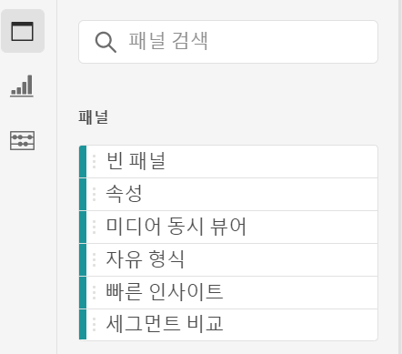
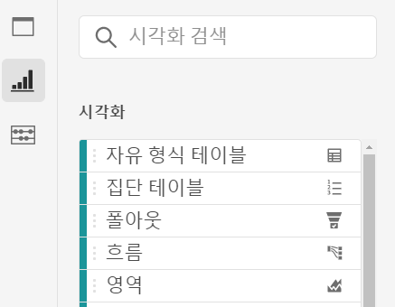
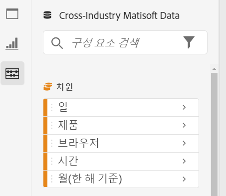
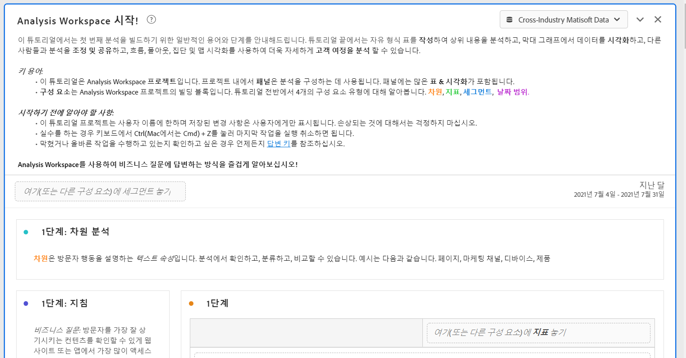

# Analysis Workspace 개요

Analysis Workspace을 사용하면 신속하게 분석을 작성하여 통찰력을 수집한 다음 해당 통찰력을 다른 사용자와 공유할 수 있습니다. 드래그 앤 드롭 브라우저 인터페이스를 사용하여 분석을 작성하고, 시각화를 추가하여 데이터를 생동감 있게 표현하고, 데이터 세트를 조정하고, 선택한 모든 사람과 프로젝트를 공유 및 예약할 수 있습니다.

다음 비디오에서는 가능한 사항에 대한 예제를 포함하는 간단한 개요를 제공합니다.

>[!VIDEO](https://video.tv.adobe.com/v/26266/?quality=12)

## Analysis Workspace의 지역

다음 이미지와 함께 제공되는 표에서는 Analysis Workspace의 주요 영역 중 일부를 설명합니다.

| 이미지 내 위치 | 이름 및 함수 |
|---------|----------|
| A | **맨 왼쪽 레일:** Analysis Workspace에 패널, 시각화 및 구성 요소를 추가하기 위한 탭을 포함합니다. 데이터 사전을 여는 데 사용되는 데이터 사전 아이콘도 포함되어 있습니다. |
| B | **왼쪽 레일:** 맨 왼쪽 레일에서 선택한 탭에 따라 이 영역에는 개별 패널, 시각화 또는 구성 요소가 포함됩니다. |
| C | **캔버스:** 왼쪽 레일에서 콘텐츠를 드래그하여 프로젝트를 빌드하는 기본 영역입니다. 캔버스에 패널, 시각화 및 구성 요소를 추가하면 프로젝트가 동적으로 업데이트됩니다. |
| D | **보고서 세트 드롭다운 메뉴:** Analysis Workspace의 각 패널에 대해 보고서 세트 드롭다운 메뉴를 사용하여 데이터 소스로 사용할 보고서 세트를 선택할 수 있습니다. |

## Analysis Workspace의 기능 {#analysis}

Analysis Workspace에서 사용할 수 있는 몇 가지 주요 기능은 다음과 같습니다.

### 패널

**패널**&#x200B;은 프로젝트 내에서 분석을 구성하는 데 사용되며 많은 표와 시각화를 포함할 수 있습니다. Analysis Workspace에서 제공되는 많은 패널은 몇 개의 사용자 입력을 기반으로 전체 분석 집합을 생성합니다. 맨 왼쪽 레일에서 맨 위의 **[!UICONTROL 패널]** 아이콘을 선택하여 사용 가능한 패널의 전체 목록을 확인합니다.

패널에 대한 자세한 내용은 [패널 개요](https://experienceleague.adobe.com/docs/analytics/analyze/analysis-workspace/panels/panels.html?lang=ko).

### 시각화

**시각화**&#x200B;막대형 차트 또는 선형 차트와 같은 을 사용하여 데이터를 시각적으로 생동감 있게 표현할 수 있습니다. 맨 왼쪽 레일에서 가운데 **[!UICONTROL 시각화]** 아이콘을 선택하여 시각화의 전체 목록을 확인합니다.

시각화에 대한 자세한 내용은 [시각화 개요](https://experienceleague.adobe.com/docs/analytics/analyze/analysis-workspace/visualizations/freeform-analysis-visualizations.html?lang=ko).

### 구성 요소

Analysis Workspace의 구성 요소는 다음과 같이 구성됩니다.

* 차원

* 지표

* 세그먼트

* 날짜 범위

이러한 각 구성 요소 유형에 대한 자세한 내용은 [구성 요소 개요](/help/analyze/analysis-workspace/components/analysis-workspace-components.md).

이러한 각 구성 요소 유형을 시각화(예: 자유 형식 테이블)에 추가하여 비즈니스 질문에 답변할 수 있습니다.

구성 요소 용어를 이해하면 구성 요소를 시각화(자유 형식 테이블 포함)로 드래그하여 [분석 빌드](/help/analyze/analysis-workspace/build-workspace-project/freeform-overview.md).

### 데이터 사전

Analysis Workspace의 데이터 사전을 통해 사용자와 관리자 모두가 Analytics 환경의 구성 요소를 추적하고 더 잘 이해할 수 있습니다.

데이터 사전에 대한 자세한 내용은 다음을 참조하십시오. [데이터 사전 개요](/help/analyze/analysis-workspace/components/data-dictionary/data-dictionary-overview.md).

### 데이터 소스

시각화를 동기화하면 시각화에 해당하는 데이터 테이블 또는 데이터 소스를 제어할 수 있습니다. 다음은 을(를) 수행하는 방법에 대한 자세한 정보입니다 [데이터 소스 관리](/help/analyze/analysis-workspace/visualizations/t-sync-visualization.md).

## Analysis Workspace 사용 시작

### Adobe Analytics에 로그인합니다 {#login}

Analysis Workspace를 사용하려면 [experience.adobe.com/analytics](https://experience.adobe.com/analytics)로 이동하여 Adobe Analytics에 로그인합니다. 기본적으로 Analysis Workspace의 프로젝트 페이지가 표시됩니다. 특정 프로젝트를 선택한 경우 기본적으로 해당 프로젝트가 표시됩니다.

### 프로젝트를 만듭니다. {#new-project}

Analysis Workspace에서의 분석을 라고 합니다. [프로젝트](/help/analyze/analysis-workspace/build-workspace-project/freeform-overview.md).

에 설명된 대로 Analysis Workspace에서 프로젝트를 만들 수 있습니다. [프로젝트 만들기](/help/analyze/analysis-workspace/build-workspace-project/create-projects.md).

에 설명된 대로 프로젝트를 폴더 및 하위 폴더로 구성할 수 있습니다. [Analysis Workspace의 폴더](/help/analyze/analysis-workspace/build-workspace-project/workspace-folders/about-folders.md).

### 프로젝트 저장 및 공유

Analysis Workspace에서 분석을 만들 때 작업은 다음과 같습니다. [자동으로 저장됨](/help/analyze/analysis-workspace/build-workspace-project/save-projects.md).

프로젝트 빌드를 완료하고 실행 가능한 통찰력을 수집하는 경우 프로젝트를 다른 사용자가 사용할 준비가 되었습니다. 조직의 사용자 및 그룹 또는 조직 외부의 사용자와 프로젝트를 공유할 수 있습니다. 프로젝트 공유에 대한 자세한 내용은 [프로젝트 공유](/help/analyze/analysis-workspace/curate-share/share-projects.md).

## 추가 리소스 {#resources}

* Adobe는 수백 개의 [Analytics 비디오 교육 튜토리얼](https://experienceleague.adobe.com/docs/analytics-learn/tutorials/overview.html?lang=ko-KR)을 제공합니다.
* 새 기능을 위한 업데이트에 대해서는 [Adobe Experience Cloud 릴리스 정보](https://experienceleague.adobe.com/docs/release-notes/experience-cloud/current.html#analytics)를 참조하십시오.
* Analysis Workspace 교육 튜토리얼 템플릿을 통해 Analysis Workspace을 접해 보십시오. 이 템플릿은 Workspace에 첫 번째 분석을 작성하는 일반적인 용어 및 단계를 안내합니다. 자습서를 시작하려면 다음을 수행하십시오.
   1. 다음에서 [!UICONTROL **작업 영역**] Adobe Analytics에서 탭을 선택하고 **[!UICONTROL 학습]** 왼쪽이요
   1. 선택 **[!UICONTROL 튜토리얼 열기]**.
      

