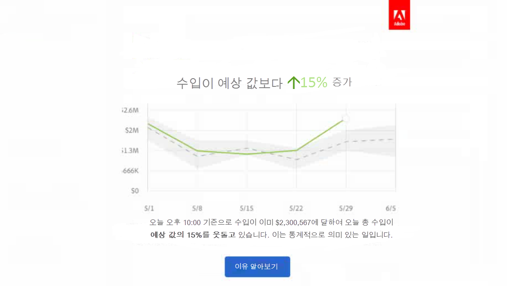

# Analysis Workspace의 새로운 기능

## 2019년 5월

2019 년 5 월 9 일에 릴리스된 개선 사항.

| 개선 사항 | 설명 |
|--- |--- |
| 새 설정은 흐름 시각화 설정에 추가되었습니다. 반복 인스턴스 포함 | [흐름 설정](/help/analyze/analysis-workspace/visualizations/c-flow/flow-settings.md) |

## 2019년 4월

2019 년 4 월 11 일에 릴리스된 개선 사항.

| 개선 사항 | 설명 |
|--- |--- |
| 최적화 모범 사례에 대한 개선 사항 | [성능 최적화](/help/analyze/analysis-workspace/new-features-in-analysis-workspace.md) |

## 2019년 1월

2019년 1월 17일에 릴리스된 새로운 기능 및 개선 사항.

| 기능 | 설명 |
|--- |--- |
| [집단 분석](/help/analyze/analysis-workspace/visualizations/cohort-table/cohort-analysis.md) | 집단 분석의 주요 개선 사항을 통해 다음을 수행할 수 있습니다.<ul><li>세그먼트 포함 및 반환 지표를 각각 적용합니다. </li><li>유지 대신 이탈을 표시합니다.</li><li>지연 테이블(포함 이벤트 전후 경과 시간)을 표시합니다.</li><li>집단 차원(시간이 아니라 eVar를 기준으로 한 방문자 그룹화용)을 사용자 정의합니다.</li><li>롤링 집단 계산: 원래 집단이 아닌 이전 기간에 따라 유지/감소를 계산합니다. </li><li>포함 및 반환 필드에 여러 지표를 추가하고 세그먼트를 적용합니다. (계산된 지표는 지원되지 않습니다)</li></ul> |
| [보기 밀도](/help/analyze/analysis-workspace/build-workspace-project/view-density.md) | 이 새 설정을 사용하면 자유 형식 테이블 및 집단 테이블에서 왼쪽 레일의 수직 안쪽 여백을 줄여 단일 화면에 더 많은 데이터를 볼 수 있습니다. 프로젝트 &gt; 프로젝트 정보 및 설정을 통해 액세스 가능합니다. |
| [속성 IQ에서 여러 값 변수 지원](/help/analyze/analysis-workspace/attribution-iq/attribution.md) | Analytics의 일부 차원에는 listVars, 제품 변수, 목록 속성 또는 머천다이징 eVars 등의 단일 히트에 대한 여러 값이 포함되어 있을 수 있습니다. Analysis Workspace를 사용하면 속성 IQ를 히트 레벨의 모든 유형의 변수에 적용할 수 있습니다. |
| 성능 향상 | 분류 속도 개선으로 분류가 많은 프로젝트가 더 빠르게 로드됩니다. |

## 2018년 11월

2018년 11월 1일에 출시된 새로운 기능 및 개선 사항.

| 기능 | 설명 |
|--- |--- |
| [VRS 및 프로젝트 큐레이션 - 개선 사항](/help/analyze/analysis-workspace/curate-share/curate-projects-vrs.md) | 이러한 변경 사항은 실제로 2018년 10월에 소개되었습니다. 구성 요소 관리자 및 관리자가 아닌 사용자가 조정된 Workspace 프로젝트 및 조정된 VRS(가상 보고서 세트)에서 볼 수 있게 변경되었습니다.   이전에는 모든 구성 요소 표시를 클릭하면 누구나 조정되지 않은 구성 요소를 볼 수 있었습니다. 업데이트된 조정 환경에서는 표시되는 구성 요소를 보다 세밀하게 제어할 수 있습니다.  |

## 2018년 10월

2018년 10월 11일에 출시된 새로운 기능 및 개선 사항.

<table id="table_3DDC812B2F66416F868004416D248BF3"> 
 <thead> 
  <tr> 
   <th colname="col1" class="entry"> 기능 </th> 
   <th colname="col2" class="entry"> 설명 </th> 
  </tr> 
 </thead>
 <tbody> 
  <tr> 
   <td colname="col1"> 
<b>패널 드롭다운 관리</b> 
 </td> 
   <td colname="col2"> 
9월 MR에 도입된 패널 드롭다운의 관리에 대해 몇 가지를 변경했습니다. 이제 드롭다운을 마우스 오른쪽 단추로 클릭하면 다음 작업을 수행할 수 있습니다. 
 
    <ul id="ul_4BDEC66EEB2243628FE32B43E377E5BD"> 
     <li id="li_EF8277BE972540D3B2604D82BC7C0918">드롭다운 삭제(이 옵션은 항상 표시됩니다.) </li> 
     <li id="li_6A991208F2744274817DBE1E9D1B443F">레이블 삭제(레이블이 표시되는 경우) </li> 
     <li id="li_5C1CFC465C2E41D2B35E8841EFDC82AA">레이블 추가(레이블이 표시되지 않는 경우) </li> 
    </ul> </td> 
  </tr> 
  <tr> 
   <td colname="col1"> 
<b>패널 및 시각화 도구 설명의 링크</b> 
 </td> 
   <td colname="col2"> 
패널 및 시각화 도구 설명에 관련된 비디오 및 설명서에 연결된 링크를 추가했습니다. 
 </td> 
  </tr> 
 </tbody> 
</table>

## 2018년 9월

2018년 9월 13일에 출시된 새로운 기능 및 개선 사항.

<table id="table_137719BFA03C44A78FDE872DF8B228A4"> 
 <thead> 
  <tr> 
   <th colname="col1" class="entry"> 기능 </th> 
   <th colname="col2" class="entry"> 설명 </th> 
  </tr> 
 </thead>
 <tbody> 
  <tr> 
   <td colname="col1"> 
<b>패널 드롭다운</b> 
 </td> 
   <td colname="col2"> 
이제 패널 놓기 영역에 드롭다운 기능이 있습니다. 드롭다운 기능을 통해 최종 사용자가 제어된 방식으로 프로젝트의 데이터와 상호 작용할 수 있습니다. 예를 들어 국가별 보고를 제공하기 위한 여러 버전의 프로젝트가 있다고 가정해봅시다. 사용자는 이제 이러한 프로젝트를 단일 프로젝트로 축소하고 대신 국가 드롭다운에 추가할 수 있습니다. 
 </td> 
  </tr> 
  <tr> 
   <td colname="col1"> 
<b>색상 팔레트</b> 
 </td> 
   <td colname="col2"> 
다른 색상 팔레트에서 선택하거나 사용자가 보유한 팔레트를 지정하여 작업 공간에서 사용되는 색상 스키마를 변경할 수 있습니다. 이 기능은 대부분의 시각화를 포함하여 작업 공간의 많은 사항에 영향을 줍니다. 요약 변경 사항, 자유 형식 테이블의 조건부 서식 설정, 맵 시각화에는 영향을 <b>미치지 않습니다</b>. 
 
참고: 색상 팔레트 지원은 Internet Explorer 11에서 사용할 수 없습니다. 
 </td> 
  </tr> 
  <tr> 
   <td colname="col1"> 
<b>새 템플릿: 오디오 소비</b> 
 </td> 
   <td colname="col2"> 
<a href="https://marketing.adobe.com/resources/help/en_US/sc/appmeasurement/hbvideo/media-workspace-templates.html" format="html" scope="external">오디오 분석</a>을 참조하십시오 . 
 </td> 
  </tr> 
 </tbody> 
</table>
## 2018월 8일

2018년 8월 9일에 출시된 새로운 기능 및 개선 사항.

<table id="table_DD77C02344414DCD9AC0A6A22E648B72"> 
 <thead> 
  <tr> 
   <th colname="col1" class="entry"> 기능 </th> 
   <th colname="col2" class="entry"> 설명 </th> 
  </tr> 
 </thead>
 <tbody> 
  <tr> 
   <td colname="col1"> 
<b>놓기 영역 지침</b> 
 </td> 
   <td colname="col2"> 
이러한 안내선을 통해 각 드래그 앤 드롭 작업을 보다 손쉽게 이해할 수 있습니다. 예를 들어 열에 마우스를 올려 놓으면 추가, 바꾸기, 필터링 기준 및 분석과 같은 항목이 표시됩니다. 
 
두 개의 지표를 서로 스택(잘못된 데이터 초래)하는 것과 같이, 권장되지 않거나 금지된 작업을 수행할 때 경고해주는 노란색/빨간색 지침도 추가했습니다. 
 </td> 
  </tr> 
  <tr> 
   <td colname="col1"> 
<b>빈 패널 옵션 추가</b> 
 </td> 
   <td colname="col2"> 
추가 패널을 더 쉽게 추가할 수 있도록 시작 패널 아래에 + 기호를 추가했습니다. 
 </td> 
  </tr> 
 </tbody> 
</table>

## 2018년 7월

2018년 7월 19일에 릴리스된 새로운 기능 및 개선 사항.

<table id="table_336E121310204DC492EA004F40830B0F"> 
 <thead> 
  <tr> 
   <th colname="col1" class="entry"> 기능 </th> 
   <th colname="col2" class="entry"> 설명 </th> 
  </tr> 
 </thead>
 <tbody> 
  <tr> 
   <td colname="col1"> 
<b> <a href="../../analyze/analysis-workspace/attribution-iq/attribution.md#concept_5BDCF631FCC841FF920FE07F1B0D08A2" format="dita" scope="local"> 속성 IQ </a> </b> 
 </td> 
   <td colname="col2"> 
속성 IQ를 사용하면 마케팅 성과에 대해 보다 정교하고 지능적인 분석을 수행할 수 있습니다. 새 속성 모델은 Analysis Workspace의 지표(표 또는 분류) 및 계산된 지표에서 사용할 수 있습니다. 새로운 [속성 패널]을 사용하면 더 나은 시각화 및 비교가 가능합니다. 
 </td> 
  </tr> 
  <tr> 
   <td colname="col1"> 
<b> 왼쪽 레일 개선 사항 </b> 
 </td> 
   <td colname="col2"> 
왼쪽 레일을 보다 직관적이고 사용하기 쉽게 하는 개선 사항: 
 
    <ul id="ul_087BEDF4338946DA857CD82CB69F98C2"> 
     <li id="li_C751AACAC60442DC93118F0819F8EEA7"> 구성 요소(지표, 세그먼트, 날짜)에 대한 함수 생성을 헤더에 맞게 만들었습니다. </li> 
     <li id="li_DE2EB184A02D4CE58C23F518DB85EFDD"> 5개 이상의 옵션이 있음을 명확히 하기 위해 각 섹션 목록의 맨 아래에 "+ 모두 보기"를 추가했습니다. </li> 
     <li id="li_5208F3C6026647B09F4A85131B175175">구성 요소를 선택할 때 아이콘으로 작업(태그, 즐겨찾기 등)을 표시했습니다. </li> 
     <li id="li_11E601488A844515928231E09889BC54">사용자 인터페이스를 미적으로 개선했습니다. </li> 
    </ul> </td> 
  </tr> 
  <tr> 
   <td colname="col1"> 
<b>계산된 지표의 합계 </b> 
 </td> 
   <td colname="col2"> 
가능하면 백분율을 포함하여 계산된 지표에 대한 합계가 표시됩니다 
 </td> 
  </tr> 
  <tr> 
   <td colname="col1"> 
<b>신규 <a href="../../analyze/analysis-workspace/components/calendar-date-ranges/calendar.md#concept_7705EA2616284F7185D82F5E872257FE" format="dita" scope="local"> 날짜 범위 </a>사전 설정 </b> 
 </td> 
   <td colname="col2"> 
Analysis Workspace에서 날짜 범위 사전 설정에 '최근 13주일'을 추가했습니다. 
 </td> 
  </tr> 
 </tbody> 
</table>

## 2018년 6월

2018 년 6 월 14 일에 발표된 새로운 기능 및 개선 사항

<table id="table_57035A06D99447A6BE6ED825A648ED3F"> 
 <thead> 
  <tr> 
   <th colname="col1" class="entry"> 기능 </th> 
   <th colname="col2" class="entry"> 설명 </th> 
  </tr> 
 </thead>
 <tbody> 
  <tr> 
   <td colname="col1"> 
<b> <a href="../../analyze/analysis-workspace/components/dimensions/view-dimensions.md#concept_5459DF3389564391A04AEBC63D732337" format="dita" scope="local"> 다이내믹 차원 열 </a> </b> 
 </td> 
   <td colname="col2"> 
이전에는 열에서 차원을 삭제할 때 시간이 아닌 차원에 대한 상위 5개 값(시간 차원의 경우 15개)을 표시하고 이러한 값을 정적(즉, 선택된 5개 값은 변경되지 않음)으로 유지합니다. 
 
이제 기본적으로 정적 값 대신 정적 값으로 변경하는 옵션과 함께 동적 값을 표시합니다. 기타 참고 사항: 
 
    <ul id="ul_C802BC32CB084E30B4E58E9E90B9A63D"> 
     <li id="li_452466AB416F4737B532849C604BD4CC">다이내믹 차원에서 (i) 기호를 클릭하면 순위(상위 1/5) 및 차원 유형이 표시됩니다. </li> 
     <li id="li_588F6199E38D47869AC855A4C2A4D1B7">데이터가 업데이트되면 현재 5/15 차원 항목을 업데이트하도록 다이내믹 차원 열이 업데이트됩니다. </li> 
     <li id="li_19D47638D4D94416B0DAD2B2FB835ABE">복사되거나 이동되는 다이내믹 차원 열은 정적이 됩니다. </li> 
     <li id="li_B95411689AE04774B7B9BA128F2DB96F">정적 차원 열 위로 마우스를 이동하면 정적 차원을 나타내는 잠금 아이콘이 표시됩니다. </li> 
    </ul> </td> 
  </tr> 
  <tr> 
   <td colname="col1"> 
<b>새 Workspace 기능 양식 </b> 
 </td> 
   <td colname="col2"> 
지난 달에 소개된 오늘의 팁과 마찬가지로, 이 양식은 새로운 릴리스 이후 Workspace에 처음 로그인할 때 새로운 Workspace 기능을 보여줍니다. 
 </td> 
  </tr> 
 </tbody> 
</table>

## 2018년 5월

2018 년 5 월 10 일에 발표된 새로운 기능 및 개선 사항

<table id="table_EE4C690A178B4F80BDAF2BB4424D6020"> 
 <thead> 
  <tr> 
   <th colname="col1" class="entry"> 기능 </th> 
   <th colname="col2" class="entry"> 설명 </th> 
  </tr> 
 </thead>
 <tbody> 
  <tr> 
   <td colname="col1"> 
</b>오늘의 팁<b> </b>
 </td> 
   <td colname="col2"> 
인터페이스의 오른쪽 하단에 짧은 비디오와 함께 표시되는 오늘의 팁을 제공합니다. 이러한 팁은 Analysis Workspace의 다양하고 훌륭한 기능을 숙지하기 위한 것입니다. 도움말 &gt; 팁을 통해 언제든지 이러한 팁을 무시하거나 액세스할지 선택할 수 있습니다. 
 
 
 </td> 
  </tr> 
  <tr> 
   <td colname="col1"> 
<b><a href="../../analyze/analysis-workspace/components/t-freeform-project-segment.md#task_11C6A2C7717B48049E5750B9D20FEC80" format="dita" scope="local"> 세그먼트 템플릿 </a> 및 <a href="../../analyze/analysis-workspace/components/apply-create-metrics.md#concept_941E9463B88D4EC59076B0E3D76F7C5B" format="dita" scope="local"> 계산된 지표 템플릿 </a></b> 
 </td> 
   <td colname="col2"> 
이제 왼쪽 레일은 세그먼트 템플릿 및 계산된 지표 템플릿을 표시합니다. 
 </td> 
  </tr> 
  <tr> 
   <td colname="col1"> 
<b>구성 요소를 드래그하는 동안 스크롤하는 기능</b> 
 </td> 
   <td colname="col2"> 
구성 요소를 새 위치로 드래그하는 동안 위아래로 스크롤할 수 있습니다. 
 </td> 
  </tr> 
  <tr> 
   <td colname="col1"> 
<b>추가 정보 <a href="../../analyze/analysis-workspace/virtual-analyst/c-anomaly-detection/view-anomalies.md#concept_B215F229DD804928BB4455198E89A68D" format="dita" scope="local"> 예외 항목에 대한 추가 정보 </a></b> 
 </td> 
   <td colname="col2"> 
라인 차트에서 예외 항목에 커서를 가져가면 이제 정보에는 예외 항목의 날짜 및 원시 값이 표시됩니다. 
 </td> 
  </tr> 
 </tbody> 
</table>

## 2018년 4월

2018 년 4 월 12 일에 발표된 새로운 기능 및 개선 사항

<table id="table_B9E784CD14A1453EB360FCCDC612250F"> 
 <thead> 
  <tr> 
   <th colname="col1" class="entry"> 기능 </th> 
   <th colname="col2" class="entry"> 설명 </th> 
  </tr> 
 </thead>
 <tbody> 
  <tr> 
   <td colname="col1"> 
 <a href="../../analyze/analysis-workspace/build-workspace-project/column-row-settings/column-settings.md#concept_05C48D3D834F416994602216C9FF6535" format="dita" scope="local"> 머리글 텍스트 줄바꿈을 기본적으로 사용할 수 있음 </a> 
 </td> 
   <td colname="col2"> 
이제 자유 형식 테이블에 대해 머리글 텍스트 줄바꿈 열 설정을 기본적으로 사용할 수 있습니다. 
 </td> 
  </tr> 
  <tr> 
   <td colname="col1"> 
 <a href="../../analyze/analysis-workspace/build-workspace-project/column-row-settings/table-settings.md#concept_AA32AA9932F744FB9044F59C7B8E562C" format="dita" scope="local"> 새 행 설정 </a> 
 </td> 
   <td colname="col2"> 
새로운 행별 백분율 계산 설정을 사용하면 자유 형식 테이블이 열 방향이 아니라 행 방향으로 셀 백분율을 계산합니다. 이 설정은 한 차원 값이 나머지 경과 시간을 나타내는 방법 트렌드처럼 트렌드 백분율에 특히 유용합니다. 이 설정은 시각화 아이콘을 클릭할 때 기본적으로 설정됩니다. 
 </td> 
  </tr> 
  <tr> 
   <td colname="col1"> 
 <a href="../../analyze/analysis-workspace/visualizations/freeform-analysis-visualizations.md#section_D3BB5042A92245D8BF6BCF072C66624B" format="dita" scope="local">"100% 스택" 시각화 설정</a> 
 </td> 
   <td colname="col2"> 
스택 영역/스택 막대/가로 막대형 스택 시각화에 대한 새로운 시각화 설정은 차트를 "100% 스택" 시각화로 바꾸므로 상대 비율을 측정할 수 있습니다. 
 
 
 </td> 
  </tr> 
  <tr> 
   <td colname="col1"> 
 <a href="../../analyze/analysis-workspace/virtual-analyst/virtual-analyst.md#concept_2DEA84993D8641808C25CF2DC286093E" format="dita" scope="local">예외 항목 탐지 및 기여도 분석</a>은 이제 Analysis Workspace를 통해서만 사용할 수 있습니다. 
 </td> 
   <td colname="col2"> 
예외 항목 탐지 및 기여도 분석은 Reports &amp; Analytics 기능 세트에서 제거되었으며 이제 Analysis Workspace를 통해서만 사용할 수 있습니다. 
 
Adobe Analytics Select 및 Adobe Analytics Foundation 고객은 Workspace의 "일별 세부 기간" 예외 항목 탐지에만 액세스할 수 있습니다. 
 </td> 
  </tr> 
 </tbody> 
</table>

## 2018년 3월

2018 년 3 월 8 일 발표된 새로운 기능 및 개선 사항

<table id="table_580CF2C1322E4FB78870BE2B1F497B2F"> 
 <thead> 
  <tr> 
   <th colname="col1" class="entry"> 기능 </th> 
   <th colname="col2" class="entry"> 설명 </th> 
  </tr> 
 </thead>
 <tbody> 
  <tr> 
   <td colname="col1"> 
 <a href="../../analyze/analysis-workspace/build-workspace-project/column-row-settings/column-settings.md#concept_05C48D3D834F416994602216C9FF6535" format="dita" scope="local"> 머리글 텍스트 줄바꿈 </a> 
 </td> 
   <td colname="col2"> 
이제 자유 형식 테이블의 머리글 텍스트를 줄바꿈하여 머리글을 더 읽기 쉽게 하고 테이블을 더 공유하기 쉽게 할 수 있습니다. 열 설정에서 "머리글 텍스트 줄바꿈"이라는 옵션을 추가했습니다. 이 기능은 특히 .pdf 렌더링 및 긴 이름을 사용하는 지표에 유용합니다. 
 </td> 
  </tr> 
  <tr> 
   <td colname="col1"> 
 <a href="../../analyze/analysis-workspace/components/apply-create-metrics.md#concept_941E9463B88D4EC59076B0E3D76F7C5B" format="dita" scope="local">마우스 오른쪽 단추 클릭으로 지표 생성</a> 
 </td> 
   <td colname="col2"> 
계산된 지표를 더 빠르고 쉽게 생성할 수 있도록 선택 항목으로 지표 만들기가 자유 형식 테이블의 마우스 오른쪽 단추 클릭 메뉴에 추가되었습니다. 이 옵션은 머리글 열 셀을 하나 이상 선택하면 표시됩니다. 
 </td> 
  </tr> 
  <tr> 
   <td colname="col1"> 
 <a href="../../analyze/analysis-workspace/visualizations/map-visualization.md#concept_FC933745EDC248D6A783FC6865607F16" format="dita" scope="local"> 맵 시각화 개선 사항 </a> 
 </td> 
   <td colname="col2"> 
맵 시각화에서 기간별(예: 연도별) 비교를 표시할 수 있도록 다음 개선 사항을 추가했습니다. 
 
    <ul id="ul_F570E6AB174C45788620CF50E2742A08"> 
     <li id="li_746E329037764644A9CCF79161C26350">이제 맵 시각화에 음수를 표시할 수 있습니다. 예를 들어, 연도별 지표를 맵에 그리는 경우 뉴욕에 대해 -33%를 맵에 표시할 수 있습니다. </li> 
     <li id="li_E05F0380627044E6A4E8A60C98494BF7">"퍼센트" 유형의 지표를 사용하면 클러스터링에서 백분율의 평균을 함께 계산합니다. </li> 
     <li id="li_44C04306EA1B413E91B8256B340D5296">새로운 색상 구성표: [음수/양수](녹색/빨간색) </li> 
    </ul> </td> 
  </tr> 
  <tr> 
   <td colname="col1"> 
 <a href="../../analyze/analysis-workspace/build-workspace-project/starter-projects.md#concept_49B9A327C5004DB0A4BE6291435625C5" format="dita" scope="local"> 사용자 지정 템플릿 </a> 
 </td> 
   <td colname="col2"> 
최근 릴리스된 사용자 지정 템플릿의 경우 
 
    <ul id="ul_787F48253F454163B99F6DD50F199FE2"> 
     <li id="li_828DD547DDB54A81B9FFB9FE92790F6C">편집 템플릿 모드를 템플릿을 프로젝트의 시작점으로 사용하는 것과 구분하는 데 도움이 되도록 프로젝트 맨 위(제목 근처)에 템플릿 아이콘을 추가했습니다. </li> 
     <li id="li_EEAA4D115CB74A57BABD524B2561E0CC">[Analysis Workspace에서 프로젝트 생성/구성] 권한이 부여된 경우 관리자가 아닌 사용자가 Workspace 프로젝트 템플릿을 생성(다른 이름으로 저장)하고 편집할 수 있도록 허용합니다. (관리 &gt; 사용자 관리 &gt; 그룹 &gt; 모든 보고서 액세스 편집 &gt; Analytics 도구 사용자 지정 &gt; Analysis Workspace에서 프로젝트 생성/구성) </li> 
    </ul> </td> 
  </tr> 
 </tbody> 
</table>

## 2018년 2월

2018년 2월 8일에 릴리스된 새로운 기능 및 개선된 기능.

<table id="table_824BBE4A554B4DB092ADA9044383D0FA"> 
 <thead> 
  <tr> 
   <th colname="col1" class="entry"> 기능 </th> 
   <th colname="col2" class="entry"> 설명 </th> 
  </tr> 
 </thead>
 <tbody> 
  <tr> 
   <td colname="col1"> 
 <a href="../../analyze/analysis-workspace/build-workspace-project/starter-projects.md#section_309C3DEDC9584A3FA3699BE10BF751ED" format="dita" scope="local"> 사용자 지정 작업 공간 템플릿 </a> 
 </td> 
   <td colname="col2"> 
이제 고유한 작업 공간 템플릿을 작성하고 저장하면 조직의 다른 사용자가 이러한 템플릿과 관련된 데이터로 시작할 수 있습니다. 
 </td> 
  </tr> 
  <tr> 
   <td colname="col1"> 
 <a href="../../analyze/analysis-workspace/build-workspace-project/t-freeform-project.md#task_C2C698ACC7954062A28E4784911E6CF2" format="dita" scope="local"> 새 프로젝트 시작 양식 </a> 
 </td> 
   <td colname="col2"> 
"새 프로젝트"를 클릭하면 시작할 항목을 선택할 수 있는 새 화면이 표시됩니다. 
 
    <ul id="ul_FE90E6B9AF334A029D66A43901F8FA0B"> 
     <li id="li_F1DFD9AE140C4E5B849D4C522D5968DB">빈 프로젝트 또는 </li> 
     <li id="li_23BD391D68674C299858A97BFE10598B">표준(내장) 작업 공간 템플릿, 또는 </li> 
     <li id="li_04D84FE375B84BF88843AA0D43A234BF">사용자 지정 작업 공간 템플릿(위 참조) </li> 
    </ul> </td> 
  </tr> 
  <tr> 
   <td colname="col1"> 
마우스 오른쪽 단추로 사본 클릭 지원 
 </td> 
   <td colname="col2"> 
셀/표를 일관되게 복사할 수 있도록 마우스 오른쪽 단추 클릭에 "클립보드에 복사" 옵션을 추가했습니다. 
 </td> 
  </tr> 
  <tr> 
   <td colname="col1"> 
 <a href="../../analyze/analysis-workspace/build-workspace-project/column-row-settings/column-settings.md#concept_05C48D3D834F416994602216C9FF6535" format="dita" scope="local">열 비율 개선</a> 
 </td> 
   <td colname="col2"> 
열에 표시된 "합계의 백분율"은 특정 시나리오가 (평균과 마찬가지로) 합계의 100%를 초과하는 행으로 연결되더라도 100%로 제한되었습니다. 
 
정확하게 말하자면 이제 100%보다 큰 백분율을 표시할 수 있습니다. 또한 열 너비가 아주 크게 늘어날 수 있도록 상한을 1,000%로 이동하려고 합니다. 
 </td> 
  </tr> 
  <tr> 
   <td colname="col1"> 
 <a href="../../analyze/analysis-workspace/build-workspace-project/column-row-settings/column-settings.md#section_3DD847151DA14914888A70FC4FD7BDFB" format="dita" scope="local"> 분류에 조건부 서식 지정 사용 </a> 
 </td> 
   <td colname="col2"> 
"사용자 지정" 제한을 선택하지 않은 경우 자유 형식 테이블 내에 적용하는 조건부 서식 지정(예: 색상)은 자동으로 분류에 사용됩니다. 
 </td> 
  </tr> 
  <tr> 
   <td colname="col1"> 
기본 <a href="../../analyze/analysis-workspace/components/calendar-date-ranges/calendar.md#concept_7705EA2616284F7185D82F5E872257FE" format="dita" scope="local"> 달력</a> 보기 변경 사항 
 </td> 
   <td colname="col2"> 
이제 작업 공간 달력에는 현재 달과 다음 달 대신 현재 달과 마지막 달이 기본적으로 표시됩니다. 
 </td> 
  </tr> 
  <tr> 
   <td colname="col1"> 
작업 공간 테이블에서 마우스 오버/선택 색상 개선 
 </td> 
   <td colname="col2"> 
자유 형식 테이블 셀을 마우스로 가리킬 때와 셀을 클릭할 때 색상의 차이가 더욱 뚜렸해졌습니다. 
 </td> 
  </tr> 
 </tbody> 
</table>

## 2018년 1월

2018년 1월 18일에 릴리스된 새로운 기능 및 개선 사항.

<table id="table_7A2E678577F94BDABB1276C826E6554F"> 
 <thead> 
  <tr> 
   <th colname="col1" class="entry"> 기능 </th> 
   <th colname="col2" class="entry"> 설명 </th> 
  </tr> 
 </thead>
 <tbody> 
  <tr> 
   <td colname="col1"> 
자유 형식 테이블에서 추가 차원 항목 <a href="../../analyze/analysis-workspace/build-workspace-project/pagination-filtering-sorting.md#concept_3E1AE8B53CBE4D06B2C4470EDA7E9FE9" format="dita" scope="local">필터링 옵션</a> 
 </td> 
   <td colname="col2"> 
차원 항목에 대한 다음과 같은(고급) 필터링 옵션이 추가됨(기존 "포함" 및 "포함하지 않음" 옵션 제외). 
 
    <ul id="ul_869B3E943E304C0282D56AD96BB79E18"> 
     <li id="li_81A49BA0CA3041C7AB892FAD2D129E5A">다음 검색어 포함 </li> 
     <li id="li_2AB564F917844F82839A91949D0B684A">검색어를 하나라도 포함 </li> 
     <li id="li_16C7938EDC8F422EA006FB63F2881EF1">구문 포함 </li> 
     <li id="li_5130EBE9A7A54CCFA313F3C3C268B367">검색어 포함 안 함 </li> 
     <li id="li_861825154EDC49EBA57514FD0A2AE462">다음 구문 포함 안 함 </li> 
     <li id="li_5364BFB73ECF4B92A6663693ABD4BCF5">같음 </li> 
     <li id="li_1EBF3119B6364842A35D39BAD645F4AF">같지 않음 </li> 
     <li id="li_487886E0A6EC4245A0E85D2E8B4A20FB">다음으로 시작 </li> 
     <li id="li_A73F54DFBAAB44D4A4134342A3124E47">다음으로 끝남 </li> 
    </ul> </td> 
  </tr> 
  <tr> 
   <td colname="col1"> 
 <a href="../../analyze/analysis-workspace/visualizations/freeform-analysis-visualizations.md#section_05B7914D4C9E443F97E2BFFDEC70240C" format="dita" scope="local"> 패널 및 프로젝트에서 시각화/패널 복사 및 붙여넣기</a> 
 </td> 
   <td colname="col2"> 
이제 시각화 또는 패널을 마우스 오른쪽 단추로 클릭하고 복사한 다음, 복사한 요소를 프로젝트 내의 다른 위치 또는 다른 프로젝트에 붙여넣을("삽입") 수 있습니다. 
 
이 기능을 사용하면 다른 프로젝트에 복사할 수 있는 "문서 블록"(사전 정의된 시각화/패널)을 작성하여 비즈니스와 관련된 데이터로 빠르게 시작할 수 있습니다. 
 </td> 
  </tr> 
  <tr> 
   <td colname="col1"> 
 <a href="../../analyze/analysis-workspace/build-workspace-project/starter-projects.md#concept_49B9A327C5004DB0A4BE6291435625C5" format="dita" scope="local">"메시지" 및 "위치"에 대한 새 모바일 템플릿</a> 
 </td> 
   <td colname="col2"> 
다음 두 개의 새 프로젝트 템플릿이 추가되었습니다. 
 
    <ul id="ul_2F5976C849474A2B8A6BCDA2559F2855"> 
     <li id="li_51B7830E062A4CFDBDF219C56249A733">인앱 및 푸시 메시지 성능에 중점을 둔 "메시지"용 새 모바일 프로젝트 템플릿입니다. </li> 
     <li id="li_D2FB258EF3AF4EB19CEB258D08F4EBBE">맵 표시 위치 데이터를 포함하는 "위치"용 새 모바일 프로젝트 템플릿입니다. </li> 
    </ul> </td> 
  </tr> 
  <tr> 
   <td colname="col1"> 
열 크기 조정 개선 
 </td> 
   <td colname="col2"> 
맨 왼쪽 열의 크기를 조정할 때 이제 오른쪽에 있는 다음 열 너비만 조정하는 것이 아니라 작업 공간이 나머지 열의 너비 백분율을 유지 관리합니다. 이러한 변경은 분석과 공유 모두에서 표 작성 속도를 높여 줍니다. 
 </td> 
  </tr> 
  <tr> 
   <td colname="col1"> 
표에 <a href="../../analyze/analysis-workspace/visualizations/freeform-table.md#concept_0D2E24FCCBAF4194AA941448860E422F" format="dita" scope="local">400개 행</a> 표시 
 </td> 
   <td colname="col2"> 
이제 표에 365일 추세를 허용할 수 있도록 기존에 200개까지였던 행을 400개까지 표시할 수 있습니다. 
 </td> 
  </tr> 
  <tr> 
   <td colname="col1"> 
 <a href="../../analyze/analysis-workspace/visualizations/map-visualization.md#concept_FC933745EDC248D6A783FC6865607F16" format="dita" scope="local"> PDF에서 지도 시각화 지원</a> 
 </td> 
   <td colname="col2"> 
이제 2017년 10월에 도입된 지도 시각화를 PDF로 렌더링할 수 있습니다. 
 </td> 
  </tr> 
  <tr> 
   <td colname="col1"> 
 <a href="../../analyze/analysis-workspace/build-workspace-project/t-freeform-project.md#task_C2C698ACC7954062A28E4784911E6CF2" format="dita" scope="local"> 프로젝트 복사/다른 이름으로 저장 시</a> 상대 인트라 링크 
 </td> 
   <td colname="col2"> 
이전에는 프로젝트를 복사하거나 "다른 이름으로 저장"한 경우 프로젝트에 저장된 모든 인트라 링크가 복사한 프로젝트가 아닌 원래 프로젝트를 가리켰습니다. 
 
이제 인트라 링크는 복사/다른 이름으로 저장한 후에 활성 상태인 프로젝트를 기준으로 합니다. 
 </td> 
  </tr> 
  <tr> 
   <td colname="col1"> 
기여도 분석: <a href="https://marketing.adobe.com/resources/help/en_US/analytics/contribution/ca_main.html" format="html" scope="external">토큰 알림 </a> 
 </td> 
   <td colname="col2"> 
이제는 회사에 기여도 분석 토큰 수가 제한되어 있는 경우 토큰을 사용하면 Analysis Workspace UI에 알림이 표시됩니다. 이를 통해 남은 토큰 수를 알 수 있습니다.&amp;nbsp; 
 
(관리자 사용자: 그룹 권한을 편집하여 이러한 토큰을 사용할 수 있는 사용자를 제한할 수 있습니다. 이 권한을 "예외 항목 탐지 및 기여도 분석"이라고 합니다(Analytics &gt; 관리자 &gt; 사용자 관리 &gt; 그룹 편집 &gt; 모든 보고서 액세스 편집 &gt; 보고서 세트 도구 사용자 지정 &gt; 도구 및 보고서).  
 </td> 
  </tr> 
  <tr> 
   <td colname="col1"> 
멀티바이트 문자가 있는 CSV 파일 
 </td> 
   <td colname="col2"> 이제 이메일로 전송되고, 멀티바이트 문자가 포함되어 있는 CSV 파일을 MS Excel에서 열 수 있습니다. </td> 
  </tr> 
  <tr> 
   <td colname="col1"> 
event#, eVar# 및 prop# 변경 
 </td> 
   <td colname="col2"> 
2017년 왼쪽 레일의 차원 이름에 추가된 Event#, eVar# 및 prop#은 구성 요소를 <b>검색</b>할 때만 표시됩니다. 
 
(가상 보고서 세트 빌더에도 적용됩니다.) 
 </td> 
  </tr> 
  <tr> 
   <td colname="col1"> 
없음/지정되지 않음 변경 
 </td> 
   <td colname="col2"> 
Analysis Workspace의 Reports &amp; Analytics, 세그먼트 빌더 및 차원 값 메뉴와 일치하도록 Analysis Workspace에서 없음/지정되지 않음이 작동하는 방식이 변경되었습니다. 
 
이는 값이 Analysis Workspace의 대부분의 프로젝트에서 "없음"이 아닌 "지정되지 않음"으로 표시됨을 의미합니다. 
 </td> 
  </tr> 
 </tbody> 
</table>

## 2017년 11월

2017년 11월 09일에 릴리스된 새로운 기능.

<table id="table_C502E81253634E6CBAE7F12C7B62F7B6"> 
 <thead> 
  <tr> 
   <th colname="col1" class="entry"> 기능 </th> 
   <th colname="col2" class="entry"> 설명 </th> 
  </tr> 
 </thead>
 <tbody> 
  <tr> 
   <td colname="col1"> 
호환되지 않는 구성 요소 목록 
 </td> 
   <td colname="col2"> 
경우에 따라 프로젝트에 포함된 일부 구성 요소가 보고서 세트에 포함되지 않습니다. 이제 프로젝트를 로드하거나 보고서 세트로 전환할 때 결과로 나타나는 "호환되지 않는 보고서 세트" 메시지에는 호환되지 않는 구성 요소가 나열됩니다. 
 </td> 
  </tr> 
 </tbody> 
</table>

## 2017년 10월

2017년 10월 26일 릴리스된 새로운 기능

<table id="table_892279F2B4AF4DB38C64AA9AFC5657A7"> 
 <thead> 
  <tr> 
   <th colname="col1" class="entry"> 기능 </th> 
   <th colname="col2" class="entry"> 설명 </th> 
  </tr> 
 </thead>
 <tbody> 
  <tr> 
   <td colname="col1"> 
 <a href="../../analyze/analysis-workspace/visualizations/map-visualization.md#concept_FC933745EDC248D6A783FC6865607F16" format="dita" scope="local"> 맵 시각화 </a> 
 </td> 
   <td colname="col2"> 
The New &amp; amp; nbsp; 맵 시각화 및 amp; nbsp; 위치 내에서 고객 상호 작용을 쉽게 확인할 수 있습니다. 매크로(전역) 보기에서 마이크로(도시) 보기에 이르기까지 시각화에서 다양한 계층 구조 수준을 쉽게 확대 및 축소하여 지역의 사용자 클러스터를 볼 수 있습니다. 
 
IP 주소(비모바일 데이터 세트)를 통해 위치 데이터를 시각화하거나 위도 및 경도 데이터(Mobile SDK를 사용하는 고객)를 Analysis Workspace에서 실제로 사용할 수 있습니다.&amp;nbsp; 
 </td> 
  </tr> 
  <tr> 
   <td colname="col1"> 
 <a href="../../analyze/analysis-workspace/visualizations/line.md#concept_EBE07FCD66C24D2AB58F1EC0F8017AD8" format="dita" scope="local"> 트렌드 시각화를 위한 세부기간 선택기 </a> 
 </td> 
   <td colname="col2"> 
데이터 소스의 차원이 시간 차원인 경우 시간 세부기간 사이를 쉽게 전환할 수 있습니다. 시각화 설정의 드롭다운에서 세부기간을 전환할 수 있습니다. 
 </td> 
  </tr> 
  <tr> 
   <td colname="col1"> 
 <a href="../../analyze/analysis-workspace/components/t-freeform-project-segment.md#task_11C6A2C7717B48049E5750B9D20FEC80" format="dita" scope="local"> 세그먼트 드롭 영역의 전체 크기 및 이벤트 </a> 
 </td> 
   <td colname="col2"> 
이전에는 차원 항목, 날짜 범위 또는 세그먼트만 세그먼트 드롭 영역으로 끌어 놓을 수 있었습니다. 이제 전체 차원 또는 이벤트를 세그먼트 드롭 영역으로 끌어 놓을 수 있습니다. 두 경우 모두 Analysis Workspace에서 "존재하는" 히트 세그먼트를 만듭니다. 
 
예: "eVar1이 있는 위치 히트" 또는 "event1이 있는 위치 히트". 
 
참고: 계산된 지표를 세그먼트 영역으로 끌어 놓을 수 없습니다. 세그먼트를 작성할 수 있는 차원/지표만 세그먼트 영역에 적합합니다. 
 </td> 
  </tr> 
  <tr> 
   <td colname="col1"> 
 <a href="../../analyze/analysis-workspace/visualizations/t-sync-visualization.md#task_A73B065DC3834AFCA422E364A1468099" format="dita" scope="local"> 데이터 소스 설정에 나열된 연결된 시각화 </a> 
 </td> 
   <td colname="col2"> 
자유 형식 또는 집단 테이블에 시각화가 연결된 경우 왼쪽 상단 점(데이터 소스 설정)에 연결된 시각화가 나열됩니다. 마우스를 이동하면 연결된 시각화가 강조 표시되고, 클릭하면 해당 시각화로 이동합니다. 
 
또한 데이터 테이블을 표시하거나 숨길 수 있는 "데이터 테이블 표시/숨기기" 확인란이 있습니다. 
 </td> 
  </tr> 
  <tr> 
   <td colname="col1"> 
 <a href="../../analyze/analysis-workspace/build-workspace-project/t-freeform-project.md#task_C2C698ACC7954062A28E4784911E6CF2" format="dita" scope="local"> 왼쪽 레일 이벤트 이름에 추가된 이벤트 번호 </a> 
 </td> 
   <td colname="col2"> 
2017년 10월 이전에 evar# 및 prop#이 차원 이름에 추가되었으므로 해당 숫자를 검색할 수 있습니다. 이제 동일한 기능을 이벤트에 사용할 수 있습니다. 
 
예: 이제 "구독"이 왼쪽 레일에 "구독(event1)"으로 표시됩니다. 
 
다음 사항에 주의하십시오. 
 
    <ul id="ul_5DF85C65F7004539949DDC4F23922296"> 
     <li id="li_A685834B4914460D87568583BB39C474">이벤트 번호가 테이블에 표시되지 않습니다(제목을 짧게 지정). </li> 
     <li id="li_D742D04470244633900335B7F5A79FD9">일관성을 유지하기 위해 props와 eVars도 더 이상 테이블 내에 번호를 표시하지 않습니다. </li> 
    </ul> </td> 
  </tr> 
  <tr> 
   <td colname="col1"> 
 <a href="../../analyze/analysis-workspace/build-workspace-project/t-freeform-project.md#task_C2C698ACC7954062A28E4784911E6CF2" format="dita" scope="local"> 기본적으로 논리적 순서로 정렬된 특별 차원 </a> 
 </td> 
   <td colname="col2"> 
다음과 같은 경우 일부 특별 차원의 기본 정렬 순서가 업데이트되었습니다. 
 
    <ul id="ul_B9C0C761F39E43A4977EC028F4D4525C"> 
     <li id="li_FE72ADDCD32A4FF7907462726D6E7758">자유 형식 테이블로 끌었을 경우. </li> 
     <li id="li_5D78DD0DCB7347AC85E260F53109010C">왼쪽 레일에서 볼 경우. </li> 
    </ul> 
예를 들어, "시간"을 테이블에 끌어다 놓으면 오전 12시부터 오후 11시까지 정렬됩니다. 지표 열을 기준으로 정렬할 수 있습니다. 
 </td> 
  </tr> 
  <tr> 
   <td colname="col1"> 
 <a href="../../analyze/analysis-workspace/virtual-analyst/c-anomaly-detection/view-anomalies.md" format="dita" scope="local"> 차트의 크기 조절의 신뢰 구간을 허용하는 옵션 </a> 
 </td> 
   <td colname="col2"> 
예외 항목 탐지 신뢰 구간은 차트를 읽기 쉽게 만들기 위해 시각화의 y축 크기를 자동으로 조절하지 않습니다. 
 
이제 신뢰 구간에서 차트의 크기를 조정할 수 있습니다. 
 </td> 
  </tr> 
  <tr> 
   <td colname="col1"> 
 <a href="/help/components/c-alerts/alert-manager.md" format="dita" scope="local"> 경고: <b>갱신</b> 옵션이 추가됨 </a> 
 </td> 
   <td colname="col2"> 
경고 관리자에서 하나 이상의 경고를 선택한 경우 갱신을 클릭하여 갱신할 수 있습니다 . 
 
이렇게 하면 원래 만료 날짜와 상관 없이 갱신을 클릭한 날로부터 1년으로 만료 날짜가 연장됩니다. 
 </td> 
  </tr> 
  <tr> 
   <td colname="col1"> 
UI 개선사항 
 </td> 
   <td colname="col2"> 
    <ul id="ul_645B43AC6F554353B887DD58F0AA86E8"> 
     <li id="li_05B16A84008E4DA3A5DE91AF3C942D55">빈 패널: 이제 맵, 폴아웃, 플로우, 막대 그래프, 집단 및 벤과 같이 추가할 수 있는 모든 시각화를 강조 표시하여 시작합니다. 이 패널을 기본 프로젝트 시작 상태로 저장할 수 있습니다. </li> 
     <li id="li_9F1ED138DB0E453DA6BD4B4A512492CC">새로운 왼쪽 레일 스타일을 사용하면 왼쪽 레일의 패널, 시각화 및 구성 요소를 보다 쉽게 보고 사용할 수 있습니다. </li> 
     <li id="li_5DF6177F0EFD4D4D9D432768DEA3F37D">자유 형식 테이블: 이제 빈 자유 형식 테이블에 Analysis Workspace의 끌어다 놓기 패러다임을 보여주는 애니메이션 GIF가 표시됩니다. </li> 
    </ul> </td> 
  </tr> 
 </tbody> 
</table>

## 2017년 9월

2017년 9월 21일 릴리스된 새로운 기능.

<table id="table_DC0DA93B8A3B481080FCB2BA8F985753"> 
 <thead> 
  <tr> 
   <th colname="col1" class="entry"> 기능 </th> 
   <th colname="col2" class="entry"> 설명 </th> 
  </tr> 
 </thead>
 <tbody> 
  <tr> 
   <td colname="col1"> 
 <a href="../../analyze/analysis-workspace/components/dimensions/time-parting-dimensions.md#concept_03D6295D84CD42528D40B932AD80AE04" format="dita" scope="local"> Analysis Workspace의 시간 분할 차원 </a> 
 </td> 
   <td colname="col2"> 
타임스탬프를 기준으로 한 차원이 Analysis Workspace에 바로 추가되었습니다. 차원에 포함되는 항목은 다음과 같습니다. 
 
    <ul id="ul_9BDBC0B344504E85840040E493873A47"> 
     <li id="li_826A8CBF4FDB4C98AC176C7145C09DB2">시간(예: 01, 12, 15, 23) </li> 
     <li id="li_FD6AAD4D3F544224A757D8124F973BE5">오전/오후(예: 오전 오후) </li> 
     <li id="li_5CAE35FB8E3E490A8FCF72DF8AC619CC">요일(예: 월요일, 화요일, 수요일 등) </li> 
     <li id="li_930DFC6BFCC740A392EC7FA859FF0E73">주말/평일(예: 주말, 평일) </li> 
     <li id="li_C09F8BF8C598498392732C183C5BB720">날짜(예: 1, 2, .... 30, 31) </li> 
     <li id="li_E80A8932C32B4410A9BC703090FB5CFF">월(예: 1월, 2월, 3월) </li> 
     <li id="li_67620F09B58244B2B17317E0DB97067A">일(예: 1일, 2일 등) </li> 
     <li id="li_A96CD77357064FC19D92EFA8244560D6">사분기(예: Q1, Q2 등) </li> 
    </ul> </td> 
  </tr> 
  <tr> 
   <td colname="col1"> 
 <a href="../../analyze/analysis-workspace/build-workspace-project/column-row-settings/column-settings.md#concept_05C48D3D834F416994602216C9FF6535" format="dita" scope="local"> 자유 형식 테이블에서 한 번에 여러 열 관리 </a> 
 </td> 
   <td colname="col2"> 
이제 한 번에 여러 열의 설정을 변경할 수 있습니다. 여러 열을 선택하고 그러한 열 중 하나의 설정 아이콘을 클릭하면 됩니다. 변경 사항은 셀이 선택된 모든 열에 적용됩니다. 
 </td> 
  </tr> 
  <tr> 
   <td colname="col1"> 
 <a href="../../analyze/analysis-workspace/visualizations/c-flow/multi-dimensional-flow.md#concept_7D1D66E9D34D4C52902C8E2D92658B27" format="dita" scope="local"> 흐름: 차원 간 레이블 지정 </a> 
 </td> 
   <td colname="col2"> 
흐름 열의 맨 위에 있는 새 차원 레이블은 흐름 시각화에서 여러 차원을 보다 직관적으로 사용합니다. 
 </td> 
  </tr> 
  <tr> 
   <td colname="col1"> 
 <a href="../../analyze/analysis-workspace/visualizations/histogram.md#section_09D774C584864D4CA6B5672DC2927477" format="dita" scope="local"> 히스토그램 히트 계산 방법 </a> 
 </td> 
   <td colname="col2"> 
이전에는 히스토그램 시각화에 방문과 방문자(기본값)라는 두 가지 계산 방법이 있었습니다. 
 
이제 세 번째 계산 방법인 "히트"를 세그먼트 컨테이너로 사용할 수 있습니다. "발생 횟수"는 자유형 테이블에서 y축 지표로 사용됩니다. 
 </td> 
  </tr> 
  <tr> 
   <td colname="col1"> 
  세그먼트 비교 및 기여도 분석에 대한 모두 지우기 버튼 
 </td> 
   <td colname="col2"> 
이제 각 요소를 수동으로 삭제하는 대신, 다음 작업 공간 영역에서 모든 요소를 지울 수 있습니다. 
 
    <ul id="ul_73E06D64CDCA4E83B9FEC2FD99D41CD3"> 
     <li id="li_A51EF8FADFA04CC19FD79C1675597659"> <a href="../../analyze/analysis-workspace/virtual-analyst/contribution-analysis/run-contribution-analysis.md#section_F6932F4BF74544B5872164E7B1E0C6FC" format="dita" scope="local"> 기여도 분석 제외된 구성 요소 </a> </li> 
     <li id="li_30E612D5A7584484967260931DB9E30E"> <a href="../../analyze/analysis-workspace/c-panels/c-segment-comparison/compare-segments.md#section_5E98FFA0744140C08D83700E3F025937" format="dita" scope="local"> 세그먼트 비교 제외된 구성 요소 </a> </li> 
    </ul> </td> 
  </tr> 
  <tr> 
   <td colname="col1"> 
 <a href="../../analyze/analysis-workspace/visualizations/summary-number-change.md#concept_804726EA096349F8AECF8C2D3DFD9BE4" format="dita" scope="local"> 요약 변경 사항 표시 유형에 대해 업데이트된 이름 </a> 
 </td> 
   <td colname="col2"> 
현재 두 개의 요약 변경 옵션이 의미를 명확하게 하기 위해 이름이 바뀌었습니다. 
 
    <ul id="ul_7301D1C73E72424F911EE8DAAD9247A0"> 
     <li id="li_89D94632E0C94263A84887AF5B360E27">변경 사항 표시 &gt; 백분율 변경 표시 </li> 
     <li id="li_D48EB4055019449DAF2998CB9A5D23DF">차이 표시 &gt; 원시 차이 표시 </li> 
    </ul> </td> 
  </tr> 
  <tr> 
   <td colname="col1"> 
 <a href="../../analyze/analysis-workspace/visualizations/summary-number-change.md#concept_804726EA096349F8AECF8C2D3DFD9BE4" format="dita" scope="local"> 약식 요약 번호/변경 사항에 대한 소수점 이하 자리 수 확장 </a> 
 </td> 
   <td colname="col2"> 
이전에는 약식 요약 번호/변경 사항 시각화가 소수점 이하 0자리를 표시했습니다. 
 
이제 보고를 향상시키기 위해 소수점 이하 0~3자리를 선택할 수 있습니다. 
 </td> 
  </tr> 
 </tbody> 
</table>

## 2017년 8월

2017년 8월 17일 릴리스된 새로운 기능.

<table id="table_C29887097C894B1C91AD7086F0DAEC73"> 
 <thead> 
  <tr> 
   <th colname="col1" class="entry"> 기능 </th> 
   <th colname="col2" class="entry"> 설명 </th> 
  </tr> 
 </thead>
 <tbody> 
  <tr> 
   <td colname="col1"> 
 <a href="../../analyze/analysis-workspace/build-workspace-project/t-freeform-project.md#task_C2C698ACC7954062A28E4784911E6CF2" format="dita" scope="local"> 저장하는 동안 프로젝트에 태그 지정 </a> 
 </td> 
   <td colname="col2"> 
이제 프로젝트를 저장하는 동안 프로젝트에 태그를 추가할 수 있습니다. 
 </td> 
  </tr> 
  <tr> 
   <td colname="col1"> 
 <a href="../../analyze/analysis-workspace/build-workspace-project/freeform-overview.md#concept_F5EE3CF6691545D6AA69AD6F512555D7" format="dita" scope="local"> 프로젝트 랜딩 페이지의 태그 열 </a> 
 </td> 
   <td colname="col2"> 
Workspace 프로젝트 목록 페이지에 태그 열을 추가했습니다. 이 열에는 각 프로젝트의 태그가 표시됩니다. 
 </td> 
  </tr> 
  <tr> 
   <td colname="col1"> 
 <a href="../../analyze/analysis-workspace/visualizations/c-flow/flow.md#concept_2F210EC358ED4887AE6DAA8C095DB55E" format="dita" scope="local">.CSV 파일로 플로우 시각화 내보내기</a> 
 </td> 
   <td colname="col2"> 
플로우 시각화를 .csv 파일로 다운로드하면 Microsoft Excel(표로 시각화됨)이나 다른 프로그램 내에서 플로우 결과를 분석할 수 있습니다. 
 </td> 
  </tr> 
  <tr> 
   <td colname="col1"> 
 <a href="/help/components/c-alerts/intellligent-alerts.md" format="dita" scope="local"> 지능형 경고: 추가 신뢰 구간 </a> 
 </td> 
   <td colname="col2"> 
예외 항목 탐지 기반 경보의 경우 두 가지 새로운 신뢰 수준(99.75% 및 99.9%)이 추가되었습니다. 일부 세부기간 선택에 대한 기본값도 변경되었습니다. 
 
    <ul id="ul_EB1F07A4D2204D57B2DDD9838CE4F5D9"> 
     <li id="li_542AAACE703F4EBFBD91F11F5ABC2929">시간별: 현재 99.75% </li> 
     <li id="li_D01E4598FB33473FAAC5D60441FD081B"> 일별: 현재 99% </li> 
    </ul> </td> 
  </tr> 
 </tbody> 
</table>

## 2017년 7월

2017년 7월 20일 릴리스된 새로운 기능.

<table id="table_64E3A9960F314E2F9FFC738696EACDF7"> 
 <thead> 
  <tr> 
   <th colname="col1" class="entry"> 기능 </th> 
   <th colname="col2" class="entry"> 설명 </th> 
  </tr> 
 </thead>
 <tbody> 
  <tr> 
   <td colname="col1"> 
<b> <a href="../../analyze/analysis-workspace/visualizations/text.md#concept_2315D97E27364E3194AC1C459B654B2F" format="dita" scope="local"> 리치 텍스트 편집기 </a></b> 
 </td> 
   <td colname="col2"> 
텍스트 상자 시각화 및 패널 / 시각화 설명 내의 글꼴 설정(굵기, 기울임체 등)과 하이퍼링크를 변경할 수 있습니다. 
 </td> 
  </tr> 
  <tr> 
   <td colname="col1"> 
<b> <a href="../../analyze/analysis-workspace/analysis-workspace-features.md#section_253EA04E067F4A29A8B54CE2B7631086" format="dita" scope="local"> 인트라 링크(빠른 시각화 링크) </a></b> 
 </td> 
   <td colname="col2"> 
<b>인트라 링크</b>를 사용하면 프로젝트 목차를 작성하는 것처럼 텍스트 상자에서 프로젝트 내의 특정 패널 및 시각화에 연결할 수 있습니다. 프로젝트 링크를 공유하는 것처럼 이 링크를 공유하여 프로젝트 내의 특정 시각화 또는 패널을 다른 사람에게 표시할 수 있습니다. 마우스 오른쪽 버튼으로 클릭하는 새로운 옵션인 "패널 링크 가져 오기" 및 "시각화 링크 가져오기"가 추가되었습니다. 
 </td> 
  </tr> 
  <tr> 
   <td colname="col1"> 
<b> <a href="../../analyze/analysis-workspace/visualizations/freeform-analysis-visualizations.md#section_94F1988CB4B9434BA1D9C6034062C3DE" format="dita" scope="local"> 범례 레이블 편집 </a></b> 
 </td> 
   <td colname="col2"> 
시각화 범례(폴아웃, 영역, 스택 영역, 막대, 스택 막대, 도넛, 막대 그래프, 가로 막대, 스택 가로 막대, 라인, 분산형 및 벤)에서 시리즈 이름을 바꾸게 하여 시각 자료를 더욱 잘 소비하게 해줍니다. 
 
트리맵, 글 머리 기호, 요약 변경 또는 숫자, 텍스트, 자유 형식, 막대 그래프, 집단 또는 플로우 시각화에는 범례 편집이 적용되지 <b>않습니다</b>. 
 </td> 
  </tr> 
  <tr> 
   <td colname="col1"> 
<b><a href="../../analyze/analysis-workspace/visualizations/t-sync-visualization.md#task_A73B065DC3834AFCA422E364A1468099" format="dita" scope="local">"데이터 소스 관리"에 대한 업데이트</a></b> 
 </td> 
   <td colname="col2"> 
데이터 소스(시각화를 가능하게 함)를 관리하는 방법을 재개발했습니다. 데이터 소스를 테이블에 잠그면 더 이상 별도의 숨겨진 테이블이 없습니다. 
 
대신 해당 보기를 이것으로 만든 테이블에 계속 연결하게 됩니다. 이렇게 하면 세부기간을 변경한 후 다음 프로젝트로드 시 이전 세부기간으로 되돌리는 실시간 연결 테이블의 버그도 해결됩니다. 
 </td> 
  </tr> 
  <tr> 
   <td colname="col1"> 
<b> <a href="../../analyze/analysis-workspace/virtual-analyst/contribution-analysis/run-contribution-analysis.md#concept_0E420C3EB71847399AA1D719C0B75250" format="dita" scope="local"> 특정 예외 항목을 강조 표시하는 기능 </a></b> 
 </td> 
   <td colname="col2"> 
이제 기여도 분석 내에서 파란색 점이 있는 예외 항목과 이 항목에 연결된 지능형 경고 프로젝트가 강조 표시됩니다. 이렇게 하면 분석되는 예외 항목이 더 명확히 표시됩니다. 
 </td> 
  </tr> 
  <tr> 
   <td colname="col1"> 
<b>Experience Cloud 로그인을 위한 '프로젝트 링크 가져오기'</b> 
 </td> 
   <td colname="col2"> 
이전에는 Experience Cloud 자격 증명으로 로그인하여 분석으로 이동한 경우 공유 &gt; 프로젝트 링크 가져오기 기능을 사용할 수 없었습니다. 이 문제를 해결했습니다. 여전히 이 옵션을 클릭하려면 먼저 프로젝트를 저장해야 합니다. 
 </td> 
  </tr> 
  <tr> 
   <td colname="col1"> 
<b><a href="../../analyze/analysis-workspace/curate-share/schedule-projects.md#concept_A7B9856EF2504BD791FE5A9E8AA7C29C" format="dita" scope="local">예약된 프로젝트 관리자의 '만료된 프로젝트' 필터</a></b> 
 </td> 
   <td colname="col2"> 
이제 예약된 프로젝트 관리자에서 만료된 프로젝트를 필터링할 수 있습니다. 그런 다음 이 프로젝트를 다시 시작하거나 삭제할지 여부를 결정할 수 있습니다. 
 </td> 
  </tr> 
 </tbody> 
</table>

## 2017년 6월

2017년 6월 8일 릴리스된 새로운 기능.

<table id="table_5B859A64363A44A98FC55E7AFB3C1D0C"> 
 <thead> 
  <tr> 
   <th colname="col1" class="entry"> 기능 </th> 
   <th colname="col2" class="entry"> 설명 </th> 
  </tr> 
 </thead>
 <tbody> 
  <tr> 
   <td colname="col1"> <b> <a href="../../analyze/analysis-workspace/visualizations/fallout/configuring-fallout.md#concept_298891C950D5498FA820CC4D7F51F4CA" format="dita" scope="local"> 폴아웃</a></b> 개선 사항 </td> 
   <td colname="col2"> 
    <ul id="ul_8A979BC0BE0F4D008F68B019A2D83A08"> 
     <li id="li_C8093834980B43A094FA9E2A7906E135">무제한 세그먼트 비교 가능 </li> 
     <li id="li_45D709C9B04F4E6A9BD94FD03E0C80FA">터치포인트 그룹의 이름을 지정하고 더욱 쉽게 관리하는 기능이 추가되었습니다(추가, 제거, 이동 등). </li> 
     <li id="li_BC609CDFD9AA4EB081987922DB318040">마우스 오른쪽 단추로 클릭 &gt; 트렌드 터치포인트 %: 전체 폴아웃 비율 트렌드가 표시됩니다. </li> 
     <li id="li_C72BB725368644DDA3FCE479A918CDB3">마우스 오른쪽 단추로 클릭 &gt; 트렌드 전체 터치포인트 %: 동일한 차트에 폴아웃(모든 방문이 포함된 경우 이 방문 제외)의 모든 터치 포인트 비율 트렌드가 표시됩니다. </li> 
     <li id="li_40D0A8B481B04F21BEC0A4E421C77865">개별 터치포인트를 경로 내의 다음 히트로(결과적으로 실행되는 것과 대조적으로) 제한하는 기능 </li> 
    </ul> </td> 
  </tr> 
  <tr> 
   <td colname="col1"> <a href="../../analyze/analysis-workspace/visualizations/c-flow/flow-settings.md#concept_1DD357A991414622877364BAB40C8E26" format="dita" scope="local"> <b>플로우</b></a> 개선 사항 </td> 
   <td colname="col2"> 
    <ul id="ul_54675DB3F59E4B24AF0C8F6E6AB2F3C1"> 
     <li id="li_DEF7D9BF03CD4A2D86A4BDD89FB3731A">레이블 자르기 사용 안 함이라는 새 시각화 설정을 추가했습니다(기본값 = 선택 해제). </li> 
    </ul> </td> 
  </tr> 
  <tr> 
   <td colname="col1"> <b> <a href="../../analyze/analysis-workspace/components/calendar-date-ranges/calendar.md#concept_7705EA2616284F7185D82F5E872257FE" format="dita" scope="local"> 캘린더</a></b> 변경 사항 </td> 
   <td colname="col2"> Reports &amp; Analytics 캘린더와 다음 사항이 일치하도록 캘린더가 변경되었습니다.  
    <ul id="ul_BD706B07369F4339BF4925F22FEC1C7F"> 
     <li id="li_33A47BAAD3C04C8784D2FC00A6F6782E">처음 클릭하면 날짜 범위 선택이 시작됩니다. 그런 다음 날짜 범위의 끝을 선택하는 두 번째 클릭까지 범위를 양쪽 방향으로 강조 표시합니다. 첫 번째 날짜를 클릭한 채로 Shift 키를 누르면(또는 마우스 오른쪽 단추를 클릭하면) 이 날짜가 범위에 추가됩니다. </li> 
     <li id="li_C3BEC56ABCED482C82A41EA0550B3077">다양한 롤링 날짜 부분에 대한 전환 추적 기간이 확장(예: 최장 2년 전까지 추적 가능)되었습니다. </li> 
    </ul> </td> 
  </tr> 
  <tr> 
   <td colname="col1"> 
<b>차원 항목에 대한 검색 개선</b> 
 </td> 
   <td colname="col2"> 
    <ul id="ul_E955585818FF4553A869003B94DDB697"> 
     <li id="li_A37D2DB6290842578FE752DD8E712B73">속도 향상 </li> 
     <li id="li_BADFD0FF3D574F1C8F19EFB37F95969C">필요한 경우 더 많은 데이터를 가져오는 최근 6개월 상위 항목 표시 옵션 </li> 
    </ul> </td> 
  </tr> 
  <tr> 
   <td colname="col1"> 
<b> <a href="../../analyze/analysis-workspace/build-workspace-project/column-row-settings/column-settings.md#concept_05C48D3D834F416994602216C9FF6535" format="dita" scope="local"> 비율 제한 사용 확인란 </a></b> 
 </td> 
   <td colname="col2"> 
    <ul id="ul_7B6B794EDF874A4D87770AB9BAB42F33"> 
     <li id="li_0B403D892320434FBAD9A7F7B808947C"> 특히 비율 기반 지표에 대해 비율 경계를 표시하는 확인란이 추가되었습니다(비율 이외 기반 지표에서도 작동). </li> 
    </ul> </td> 
  </tr> 
  <tr> 
   <td colname="col1"> 
<b>구성 요소 관리자 개선 사항</b> 
 </td> 
   <td colname="col2"> 
    <ul id="ul_BB22F84ABFB04685A9752AD4BDE6E60A"> 
     <li id="li_B3D460C15C454911A9D7254F50815355">경고 및 예약된 프로젝트에 대해 만료 날짜가 추가되었습니다 </li> 
    </ul> </td> 
  </tr> 
  <tr> 
   <td colname="col1"> 
<b> <a href="/help/components/c-alerts/alert-manager.md" format="dita" scope="local"> 경고 관리자 개선 사항</a></b> 
 </td> 
   <td colname="col2"> 
    <ul id="ul_72464DC499744290BA37DB3B1E143F74"> 
     <li id="li_C687F0A3A99F4CC39B482BDA0F7B75DD">경고를 활성화/비활성화하는 기능이 추가되었습니다. </li> 
     <li id="li_F7415EE7DF29417FAF416594E36A38A4">활성화/비활성화 열이 추가되었습니다. </li> 
     <li id="li_61B3A60A2AFB4BD0AA4D83803AB95B1E">활성화/비활성화 경고에 대한 필터가 추가되었습니다. </li> 
    </ul> </td> 
  </tr> 
  <tr> 
   <td colname="col1"> 
신규 <b> <a href="../../analyze/analysis-workspace/build-workspace-project/fa-shortcut-keys.md#concept_9A6356084DBC4D468E265E7A65B3E051" format="dita" scope="local"> 단축키 </a></b> 
 </td> 
   <td colname="col2"> 
다음 핫키가 추가되었습니다. 
 
    <ul id="ul_5AE965D910DA4883BC2067CDFDBBA75A"> 
     <li id="li_6DBD6DFB9CA54F89B9A0627F3B1D5928">alt + shift + 1 = [패널] 창으로 이동 </li> 
     <li id="li_1B7E7C1115A84DB8A1BC07EA1C3AB15F">alt + shift + 2 = [시각화] 창으로 이동 </li> 
     <li id="li_1BDB09DDEEDC4E7DB0D1C08A4E02A613">alt + shift + 3 = [구성 요소] 창으로 이동 </li> 
    </ul> </td> 
  </tr> 
 </tbody> 
</table>

## 2017년 4월 

2017년 4월 20일 릴리스된 새로운 기능.

<table id="table_53EEFB870ED943F5BFD71FAB2DBCE49B"> 
 <thead> 
  <tr> 
   <th colname="col1" class="entry"> 기능 </th> 
   <th colname="col2" class="entry"> 설명 </th> 
  </tr> 
 </thead>
 <tbody> 
  <tr> 
   <td colname="col1"> 
 <a href="../../analyze/analysis-workspace/build-workspace-project/starter-projects.md#concept_49B9A327C5004DB0A4BE6291435625C5" format="dita" scope="local"> 사람 템플릿 </a> 
 </td> 
   <td colname="col2"> 
Note:  The People template and its associated People metric is available for use only as part of the <a href="https://marketing.adobe.com/resources/help/en_US/mcdc/mcdc-people.html" format="html" scope="external"> Adobe Experience Cloud Device Co-op </a>. 
 
템플릿은 다시 말해, 고유 방문자 수 지표의 중복이 제거된 버전인 사람 지표를 기반으로 합니다. 사람 지표에서는 여러 장치를 사용하는 소비자가 브랜드와 상호 작용하는 빈도를 측정합니다. 
 </td> 
  </tr> 
  <tr> 
   <td colname="col1"> 
실행 취소/다시 실행 옵션 개선 사항 
 </td> 
   <td colname="col2"> 
이 목록에는 <a href="../../analyze/analysis-workspace/build-workspace-project/undo-redo.md#concept_993110B9F2F84EB192308108882F8EEC" format="dita" scope="local"> 분석 작업 공간에서 </a>실행 취소/다시 실행. 
 </td> 
  </tr> 
 </tbody> 
</table>

## 2017년 2월

2017년 2월 16일에 릴리스된 새로운 기능:

<table id="table_227D3668E9FD4FF4A1906FC619DCAFBF"> 
 <thead> 
  <tr> 
   <th colname="col1" class="entry"> 기능 </th> 
   <th colname="col2" class="entry"> 설명 </th> 
  </tr> 
 </thead>
 <tbody> 
  <tr> 
   <td colname="col1"> 
 <a href="../../analyze/analysis-workspace/build-workspace-project/column-row-settings/table-settings.md#concept_AA32AA9932F744FB9044F59C7B8E562C" format="dita" scope="local"> 위치별 분류 </a> 
 </td> 
   <td colname="col2"> 
테이블 위치별로 분류할 수 있습니다. 예: “자유 형식 테이블의 상위 7개 행을 항상 분류하고 싶습니다.” 이제 자유 형식 테이블을 만들 때 "위치별 분류"를 활성화할 수 있는 확인란이 있습니다. 이 설정은 기본적으로 비활성화되어 있습니다. 
 
이전에는 분류에 있는 값 목록이 "잠겨"있었습니다. 이에 따라 페이지로 날짜 분류 등을 수행한 경우 선택한 날짜 범위에 대해 상위 50페이지 목록이 표시되었습니다. 
 
해당 보기를 저장하고 한 달 후 실행한 경우, 상위 50페이지가 변경되었을 것입니다. 하지만 Analysis Workspace에서는 원래의 분류로 인한 결과를 "신뢰"하여 동일한 페이지를 반환하긴 했지만, 현재 달을 날짜 범위로 사용했습니다. 
 </td> 
  </tr> 
 </tbody> 
</table>

## 2017년 1월

2017년 1월 19일에 릴리스된 새로운 기능:

<table id="table_0AB06B81BFA34521A9BF1150E64663C3"> 
 <thead> 
  <tr> 
   <th colname="col1" class="entry"> 기능 </th> 
   <th colname="col2" class="entry"> 설명 </th> 
  </tr> 
 </thead>
 <tbody> 
  <tr> 
   <td colname="col1"> 
 <a href="../../analyze/analysis-workspace/curate-share/download-send.md#concept_BB548979F47F45739679B830428C3025" format="dita" scope="local">프로젝트를 저장하지 않고 PDF 보내기 및 다운로드</a> 
 </td> 
   <td colname="col2"> 
이제 프로젝트를 저장하지 않고도 작업 영역에서 PDF를 보내고 다운로드할 수 있습니다. PDF 파일 이름은 프로젝트의 현재 이름과 일치합니다. 다운로드한 PDF에 프로젝트에 저장하지 않은 변경 사항이 포함되어 있습니다. 저장하지 않은 프로젝트를 예약할 수 없습니다. (또한 저장하지 않은 CSV 파일을 보내고 다운로드할 수 있지만, 예약할 수 없습니다.) 
 </td> 
  </tr> 
  <tr> 
   <td colname="col1"> 
 <a href="../../analyze/analysis-workspace/curate-share/curate.md#concept_4A9726927E7C44AFA260E2BB2721AFC6" format="dita" scope="local">프로젝트 구성 요소 자동 공유</a> 
 </td> 
   <td colname="col2"> 
이제 모든 수신자와 세그먼트, 계산된 지표 및 날짜 범위 등의 프로젝트 구성 요소를 자동으로 공유하는 옵션이 제공됩니다. 이러한 구성 요소가 공유되면 수신자 작업 영역의 구성 요소 드롭다운에 표시됩니다. 
 </td> 
  </tr> 
  <tr> 
   <td colname="col1"> 
CSV 형식으로 폴아웃 시각화 
 </td> 
   <td colname="col2"> 
CSV 형식으로 폴아웃 시각화에 대한 지원이 추가되었습니다. 
 </td> 
  </tr> 
  <tr> 
   <td colname="col1"> 
 <a href="../../analyze/analysis-workspace/components/t-freeform-project-segment.md#task_11C6A2C7717B48049E5750B9D20FEC80" format="dita" scope="local">날짜 범위(세그먼트에서)</a> 
 </td> 
   <td colname="col2"> 
세그먼트의 놓을 지점(예: 패널 세그먼트의 놓을 지점, 폴아웃 시각화 세그먼트의 놓을 지점 등)에 날짜 범위를 끌어다 놓을 수 있습니다. 날짜 범위는 자동으로 세그먼트로 변환됩니다. 날짜 범위를 사용자 정의하거나 사용자 정의하지 않을 수 있지만, 시간/일/주/월/분기/년과 같은 세부 기간을 지정할 수 없습니다. 
 </td> 
  </tr> 
  <tr> 
   <td colname="col1"> 
 <a href="../../analyze/analysis-workspace/components/calendar-date-ranges/time-comparison.md#concept_93BCAD81B7A54ABBBA5CD9E419F6F764" format="dita" scope="local"> 테이블의 각 열에 기간 추가 </a> 
 </td> 
   <td colname="col2"> 
이제 테이블의 각 열에 기간을 추가하여 달력에 설정된 기간과 다른 기간을 추가할 수 있습니다. 이 기능은 날짜를 비교할 수 있는 다른 방법입니다. 또한 각 열의 날짜가 같은 행에서 시작하도록 맞출 수 있습니다. 
 </td> 
  </tr> 
 </tbody> 
</table>

## 2016년 11월

2016년 11월 10일에 릴리스된 새로운 기능:

<table id="table_9B2B9CC7A3574A99A716BF1C9745E32B"> 
 <thead> 
  <tr> 
   <th colname="col1" class="entry"> 기능 </th> 
   <th colname="col2" class="entry"> 설명 </th> 
  </tr> 
 </thead>
 <tbody> 
  <tr> 
   <td colname="col1"> 
 <a href="../../analyze/analysis-workspace/components/calendar-date-ranges/time-comparison.md#concept_93BCAD81B7A54ABBBA5CD9E419F6F764" format="dita" scope="local"> 날짜 비교 </a> 
 </td> 
   <td colname="col2"> 
새 날짜 비교 기능을 사용하여 열을 가져오고, 전년 대비, 사분기 대비, 전월 대비 등과 같은 일반 날짜 비교를 만들 수 있습니다. 
 
날짜 비교에 백분율 변경을 표시하는 차이율 열이 자동으로 포함되어 있습니다. 
 </td> 
  </tr> 
 </tbody> 
</table>

## 2016년 10월

2016년 10월 20일 릴리스된 새로운 기능:

<table id="table_56258080C60F480AA83E1D5DE7D2C782"> 
 <thead> 
  <tr> 
   <th colname="col1" class="entry"> 새로운 기능 </th> 
   <th colname="col2" class="entry"> 사용 방법 </th> 
  </tr> 
 </thead>
 <tbody> 
  <tr> 
   <td colname="col1"> <b> <a href="../../analyze/analysis-workspace/visualizations/fallout/fallout-flow.md#concept_D7ED51D138C747CA8F35BD93F21E79A6" format="dita" scope="local"> 폴아웃 분석 </a></b> </td> 
   <td colname="col2"> 
새로운 폴아웃 기능을 사용하면 마케팅 단계 기능을 Analysis Workspace에 가져오게 됩니다. 단계를 사용하면 고객이 마케팅 캠페인을 포기하는 상황이나, 웹 사이트나 크로스 채널 캠페인과 상호 작용할 때 정의된 전환 경로를 벗어나는 상황을 식별할 수 있습니다. 폴아웃 분석을 이용하면 새로운 시각화와, 주요 성공 지표에 대한 전환을 식별하기 위해 Analysis Workspace에서 제공하는 내재된 유연성으로 강력한 단계를 구축할 수 있습니다. 폴아웃 분석을 이용하면 다음 작업을 수행할 수 있습니다.  
 
 
 
    <ul id="ul_E7C8255BA5D84F74ABBC6CC0E148DFB0"> 
     <li id="li_B7AC104F2A9348DCB2BCAA2FC9D3F3E6">단계 절차(터치포인트) 드래그, 놓기 및 다시 정렬  </li> 
     <li id="li_CC85524BC64546CD84794CC02C24CF21">차원이 여러 개인 폴아웃 분석(서로 다른 차원 및 지표의 값을 혼합 및 대응)  </li> 
     <li id="li_FA59CEE0211E4894B9109FF6A2FA3F80">폴아웃 직후 고객이 이동해 가는 위치를 알기 위한 다음 단계 식별  </li> 
    </ul> 
 
 </td> 
  </tr> 
  <tr> 
   <td colname="col1"> <b> <a href="../../analyze/analysis-workspace/visualizations/c-flow/flow.md#concept_2F210EC358ED4887AE6DAA8C095DB55E" format="dita" scope="local"> 흐름 시각화 </a></b> </td> 
   <td colname="col2"> 
새로운 흐름 기능을 사용하면 Analysis Workspace의 새롭고 업데이트된 유연한 시각화를 통해 사이트/앱을 이동하는 고객을 봄으로써 고객이 어떻게 사이트/앱에서 이동하고 진행해 가는지를 알 수 있습니다. 흐름을 사용하면 다음 작업을 수행할 수 있습니다.  
 
 
 
    <ul id="ul_F1D4A99743664CB3B17E9485CF5E72FC"> 
     <li id="li_0F7AF953EAB746DC95032FF9A533E560">자산 간의 고객 이동 시각화 </li> 
     <li id="li_697A47BE06CF4284ACA3DBE4CA4012BF">고객 이동 경로에 있는 시작, 종료 또는 특정 차원 항목으로부터 바로 다음 단계 분석 </li> 
     <li id="li_D13AD928AC434D599D43836FB334B14D">선택한 경로에서 특정 지점을 지정하여 사용자 세그먼트를 동적으로 생성  </li> 
    </ul> 
 
 </td> 
  </tr> 
  <tr> 
   <td colname="col1"> <b> <a href="/help/components/c-alerts/intellligent-alerts.md" format="dita" scope="local"> 지능형 경고 </a></b> </td> 
   <td colname="col2"> 
모든 Adobe Analytics에 대한 새 경고 시스템으로 지능형 경고를 사용하여 Analysis Workspace에서 경고를 생성하고 관리할 수 있으며, 경고 미리 보기 및 규칙 기여도와 함께 완료할 수 있습니다. 다음을 수행할 수 있습니다. 
 
 
 
    <ul id="ul_02BD64D3047942009880B8F1DA1F2A40"> 
     <li id="li_01504AABBC514DF38354683843222541">예외 항목을 기반으로 한 경고를 만듭니다(90%, 95% 또는 99% 임계값, % 변경, 초과/미만). </li> 
     <li id="li_9BFE2B4C429D441287F1A37A08E62A40">경고가 트리거되는 빈도를 미리 봅니다. </li> 
     <li id="li_08D310196581483DB499C00358835B73">자동 생성된 Analysis Workspace 프로젝트에 대한 링크가 있는 이메일 또는 SMS로 경고를 보냅니다. </li> 
     <li id="li_2ADF9465EE474CDB839ED867662CCE6F">하나의 경고에서 여러 지표를 캡처하는 "누적된" 경고를 생성합니다. </li> 
    </ul> 
 
 </td> 
  </tr> 
  <tr> 
   <td colname="col1"> <b> <a href="../../analyze/analysis-workspace/virtual-analyst/c-anomaly-detection/anomaly-detection.md#concept_65E7C869C20B4509984189C8FD971F0E" format="dita" scope="local"> 예외 항목 탐지 및 기여도 분석 </a></b> </td> 
   <td colname="col2"> 
트렌드 데이터의 변경 사항이 중요한지 여부와 변경 사항을 초래한 원인을 알려줍니다. 
 
이제 Analysis Workspace에서 예외 항목 탐지 및 기여도 분석 기능음 모두 핵심 워크플로우입니다. 
 
중요: 기여도 분석은 Adobe Analytics Premium 고객만 사용할 수 있습니다. 
 
다음을 수행할 수 있습니다. 
 
 
 
    <ul id="ul_9CEE47788F3640838D8598F2E2C020D6"> 
     <li id="li_787236BB5EA545B8833B311C06C24337">사용자의 데이터에 있는 통계적으로 중요한 데이터 예외 항목을 자동으로 탐지할 수 있습니다.  </li> 
     <li id="li_2FB3D94DEEF14DD5ADA6AD69E15F243D">매일 발생하는 임의의 예외 항목에 대해 [기여도 분석]을 실행하고 Analysis Workspace 프로젝트에 포함할 수 있습니다.  </li> 
    </ul> 
 
 
 
 </td> 
  </tr> 
  <tr> 
   <td colname="col1"> <b> <a href="../../analyze/analysis-workspace/build-workspace-project/starter-projects.md#concept_49B9A327C5004DB0A4BE6291435625C5" format="dita" scope="local"> 초보자 프로젝트 </a></b> </td> 
   <td colname="col2"> 사용자가 Analysis Workspace를 더 쉽게 사용할 수 있도록 하기 위해, 다음과 같은 일반적인 비즈니스 문제에 대해 사전 작성된 프로젝트 템플릿을 만들었습니다.  
 
 
    <ul id="ul_603F5ACC16F74D53AEB9F762FAC91656"> 
     <li id="li_6B3F2E5D4B044EC19D45E5501E33DB91">사용자 유지 </li> 
     <li id="li_7240EE8852FC4642B3AD4837C990A775">모바일 앱 획득 </li> 
    </ul> 
 
 </td> 
  </tr> 
  <tr> 
   <td colname="col1"> <b><a href="../../analyze/analysis-workspace/visualizations/freeform-analysis-visualizations.md#section_46E886D108DF49BDB6EE2D5A0E054E95" format="dita" scope="local">히스토그램 시각화</a></b> </td> 
   <td colname="col2"> 
히스토그램을 사용하면 모든 성공 이벤트에 대한 사용자의 분포를 볼 수 있습니다. 버킷 및 버킷 크기를 사용자 지정하여 모든 분포를 수용하고 고가치 사용자와 저가치 사용자를 식별할 수 있습니다.  
 
 
 </td> 
  </tr> 
  <tr> 
   <td colname="col1"> 기타 업데이트  </td> 
   <td colname="col2"> 
    <ul id="ul_2585F74DC7754C819017F280E16BF06F"> 
     <li id="li_412446013E7F42DBB1BF50F9E2C4D92F"> 
      <!--AN-124610: -->프로젝트 수준 설정으로서 "반복 인스턴스 계산"을 추가했습니다(프로젝트 &gt; 프로젝트 정보 및 설정 ). 이 설정은 보고서에서 반복 인스턴스가 카운트되는지 여부를 지정합니다. 동일한 변수에 대해 순차적인 여러 개의 값을 가지고 있으면 변수에 대해 하나 또는 여러 개의 인스턴스로 계산할 수 있습니다. </li> 
     <li id="li_480E1B307C62418CBC2F50ADE32B9EE9">달력에서 "취소" 및 "실행" 옆에 "모든 패널에 적용"이라는 새 단추를 추가했습니다. "실행"을 "적용"으로 변경했습니다. 새 단추를 클릭하면, 현재 패널에 대한 선택된 날짜 범위를 변경할 뿐만 아니라 프로젝트 내의 모든 다른 패널에 대한 선택된 날짜 범위도 변경하게 됩니다. </li> 
     <li id="li_4D10DFE307344D06AA60792FABE5B57E"> 
      <!--AN-124168: -->태그, 즐겨찾기, 승인, <b>공유(새로운 기능!)</b>, <b>삭제(새로운 기능!)</b>과 같은 작업을 포함하는 왼쪽 탐색 레일에 "작업" 단추를 추가했습니다. </li> 
     <li id="li_946EC05568D4447193E9307546DF6F9B">태그, 즐겨찾기, 승인된 항목 및 구성 요소에 대해 필터링할 수 있도록 해주는 검색 막대에 필터를 추가했습니다. </li> 
     <li id="li_4EA118ACCD3B4F88B0ECF72717F631FA">세그먼트, 지표, 날짜 범위를 미리 볼 수 있도록 해주는 미리 보기 아이콘을 수동 행(측정 기준 항목을 나열하는 다이내믹 행이 아님)에 추가했습니다. </li> 
     <li id="li_81D5241EA3FD49CEA0E9F412837D87A8"> 
      <!--AN-128702: -->Analysis Workspace 자습서에 대한 YouTube 링크를 다음과 같이 업데이트했습니다. <a href="https://www.youtube.com/playlist?list=PL2tCx83mn7GuNnQdYGOtlyCu0V5mEZ8sS" format="https" scope="external">https://www.youtube.com/playlist?list=PL2tCx83mn7GuNnQdYGOtlyCu0V5mEZ8sS </a>. </li> 
     <li id="li_D81DB98C49664D2884CCCC1DB0058CD8"> 
      <!--AN-124004:-->시각화를 위해 컨텍스트 메뉴에서 시작이라는 마우스 오른쪽 단추로 클릭하여 표시되는 옵션을 추가했습니다(흐름, 벤, 막대 그래프에 대해 작동하게 됨). 이 옵션을 사용하면 현재 시각화에 대한 구성이 삭제되고, 다시 구성할 수 있는 새 패널이 열립니다. </li> 
     <li id="li_84632BFCE1794B49A31FF45067FA04B7">"범례 표시"하는 새로운 시각화 설정을 사용하면 [요약 번호]/[요약 변경 사항] 시각화에 대한 필터 세부 사항을 숨길 수 있습니다. </li> 
     <li id="li_EE8C48642DD54A04B08F4222F9565BF6">요약 변경 사항 시각화에 대한 새로운 시각화 설정을 사용하면 두 백분율 간의 "차이를 표시"할 수 있습니다. 백분율이 아닌 값의 경우, "차이 표시" 옵션을 선택하면 숫자가 표시됩니다. </li> 
     <li id="li_17AAABCA7B3A477182FB70453CA2EEBB">시간 측정 기준에 대한 행 수를 조정했습니다. </li> 
     <li id="li_35A91D50CD514CD0B939C24AEEC64BF4">Analysis Workspace처럼 보이도록 세그먼트 빌더 및 계산된 지표 빌더에서 왼쪽의 탐색 레일의 모습을 업데이트했습니다.  </li> 
    </ul> </td> 
  </tr> 
 </tbody> 
</table>

## 2016년 6월

2016년 6월 16일 릴리스된 새로운 기능:

* [새 그룹 권한을](https://marketing.adobe.com/resources/help/en_US/reference/groups.html) **[!UICONTROL 참조하십시오]****** . 2016년 6월 16일부터 모든 사용자는 이 탭에 액세스할 수 있는 권한이 있습니다. 액세스를 거부하려면 Analysis Workspace 액세스 그룹에서 사용자를 제거하면 됩니다.
* the [[세그먼트 비교] 패널](../../analyze/analysis-workspace/c-panels/c-segment-comparison/segment-comparison.md#concept_74FAC1C6D0204F9190A110B0D9005793)은 사용자가 액세스하는 모든 개별 지표 및 차원의 자동화된 분석을 통해 두 세그먼트 간의 통계적으로 가장 유의한 차이를 알아냅니다. 
* 맨 위 메뉴를 다시 정렬하고 좀 더 많이 확장 가능하게 하는 [새 프로젝트 메뉴 구조](../../analyze/analysis-workspace/build-workspace-project/freeform-overview.md#concept_F5EE3CF6691545D6AA69AD6F512555D7) 예를 들어 **새 집단 패널**&#x200B;을 생성할 경우 빈 패널이 생성되며 집단 테이블 시각화로 드래그할 수 있습니다.
* [새 왼쪽 레일](../../analyze/analysis-workspace/build-workspace-project/freeform-overview.md#concept_F5EE3CF6691545D6AA69AD6F512555D7): 패널, 시각화, 구성 요소
* 최대 3개의 세그먼트 및 지표를 드래그하고 벤 다이어그램을 작성할 수 있는 새로운 벤 시각화 유형
* 이제 등급 테이블의 [트렌드 선택](../../analyze/analysis-workspace/analysis-workspace-features.md#section_34930C967C104C2B9092BA8DCF2BF81A)(선 차트)가 연결됩니다.
* ["시각화 만들기" 아이콘](../../analyze/analysis-workspace/visualizations/freeform-analysis-visualizations.md#concept_09242627629147A88A68F1506954C276): 이 아이콘을 클릭하면 다음 작업 시 지능적인 추측이 제공됩니다(막대 차트, 벤...).
* 확장된 [수동 행](../../analyze/analysis-workspace/build-workspace-project/column-row-settings/manual-vs-dynamic-rows.md#concept_C50E7DFBC0504C72A973123192F487D8) 기능
* [세그먼트 추가](../../analyze/analysis-workspace/components/t-freeform-project-segment.md#task_11C6A2C7717B48049E5750B9D20FEC80) 드롭 영역
* 부분적인 업데이트:

   * 패널에 있는 모든 시각화와 프로젝트에 있는 모든 패널을 삭제하는 기능. (이전에는 하나 이상의 시각화 또는 1개의 패널을 유지해야 했습니다.)
   * Analysis Workspace 작업을 지원할 수 있도록 [바로 가기 키](../../analyze/analysis-workspace/build-workspace-project/fa-shortcut-keys.md#concept_9A6356084DBC4D468E265E7A65B3E051)(단축키)가 변경되었습니다.
   * 스타일 변경: 시각화의 좀 더 작아진 글꼴, 행의 색상 견본, 아래로 이동된 날짜 선택기(패널에서)

## 2016년 4월 

2016년 4월 21일 릴리스된 새로운 기능:

<table id="table_2649645FDED84B71952F741ABB3FC20E"> 
 <thead> 
  <tr> 
   <th colname="col1" class="entry"> 기능 </th> 
   <th colname="col2" class="entry"> 설명 </th> 
  </tr> 
 </thead>
 <tbody> 
  <tr> 
   <td colname="col1"> 파일 보내기 </td> 
   <td colname="col2"> 
이메일을 통해 Analysis Workspace 프로젝트를 보내거나 전달할 일정을 예약합니다. See <a href="../../analyze/analysis-workspace/curate-share/t-schedule-report.md#task_509549DD2D83495A94A0DFC6724DA907" format="dita" scope="local"> Send File - Schedule a project for delivery </a>. 
 </td> 
  </tr> 
  <tr> 
   <td colname="col1"> PDF 다운로드 </td> 
   <td colname="col2"> 
[작업] 메뉴에서 Analysis Workspace 프로젝트를 PDF 형식으로 다운로드(CSV 형식으로 다운로드하는 것과 유사)할 수 있습니다. 
 </td> 
  </tr> 
 </tbody> 
</table>

## 2016년 1월

2016년 1월 21일 릴리스된 새로운 기능

* [작업 실행 취소](../../analyze/analysis-workspace/new-features-in-analysis-workspace.md#section_12890C393D5E4FC8A3CF050318BD8482)
* [이 프로젝트에 대한 링크](../../analyze/analysis-workspace/new-features-in-analysis-workspace.md#section_453E70F7409F4501B8E976A0D18C9A46)
* [글머리 기호 그래프, 산포도, 트리맵 시각화](../../analyze/analysis-workspace/new-features-in-analysis-workspace.md#section_B19EA50EBF5546E99D3A142827153FD6)
* [세그먼트, 지표 및 날짜에 대해 다른 이름으로 저장](../../analyze/analysis-workspace/new-features-in-analysis-workspace.md#section_04C8B10A0751453AAE5F1BC35938C6CE)
* [새 세그먼트 추가 단추](../../analyze/analysis-workspace/new-features-in-analysis-workspace.md#section_85CC88C02C79456EA2B41F2BFBB64FC4)
* [조건부 서식 설정](../../analyze/analysis-workspace/new-features-in-analysis-workspace.md#section_5775B505D83041408B8C3EAEC5D7C32B)
* [차원 미리 보기](../../analyze/analysis-workspace/new-features-in-analysis-workspace.md#section_F519EBF889B244E8B25BB6BA2833325A)
* [범례 표시](../../analyze/analysis-workspace/new-features-in-analysis-workspace.md#section_28D10D86CAE343AB838808C1DD2E7983)
* [Y축 0에 연결](../../analyze/analysis-workspace/new-features-in-analysis-workspace.md#section_83DF5DE79EF04F9F8DCB3154F5E799B3)
* [탭 제목의 프로젝트 이름](../../analyze/analysis-workspace/new-features-in-analysis-workspace.md#section_497C61A030984BCCA2CEA553312C3226)
* [프로젝트 소유권 양도](../../analyze/analysis-workspace/new-features-in-analysis-workspace.md#section_989C2CCB80B5408EB85E6B12C8D943E3)

## 작업 실행 취소 {#section_12890C393D5E4FC8A3CF050318BD8482}

이제는 Analysis Workspace에서 수행한 대부분의 작업을 실행 취소할 수 있습니다. 

실행을 취소하려면, [작업] 메뉴에서 **[!UICONTROL 실행 취소]를 클릭하십시오.**

You can also use standard Windows and Mac [keyboard shortcuts](../../analyze/analysis-workspace/build-workspace-project/fa-shortcut-keys.md#concept_9A6356084DBC4D468E265E7A65B3E051) (ctrl or cmd + z) for Undo.

*`Undo`* 는 테이블에서 분류를 실행 취소할 때 특히 유용합니다.

Actions that are *`not`* undoable:

* [!UICONTROL 집단 테이블] 구성 변경(예: 지표 드래그, 값 변경). However, you can click **[!UICONTROL Undo]** after clicking **[!UICONTROL Run]**.

* 패널 및 하위 패널 크기 조정 또는 이동

실행 취소 내역을 지우는 작업:

* 프로젝트 저장.
* 보고서 세트 변경.

## 이 프로젝트에 대한 링크 {#section_453E70F7409F4501B8E976A0D18C9A46}

프로젝트의 [작업] 메뉴에서 **[!UICONTROL 이 프로젝트에 대한 링크]를 클릭하여 저장된 프로젝트의 URL을 다른 사용자에게 이메일로 보냅니다.** 관리 담당 받는 사람은 이러한 식으로 공유된 프로젝트를 편집하고 저장할 수 있습니다. 그렇지 않은 경우 이러한 프로젝트는 읽기 전용입니다.

>[!NOTE]
>
>회사에서 Single Sign-On를 사용하는 경우 (기존 Single Sign-On 및 Experience Cloud를 통해 로그인할 때) 보고서 링크를 공유할 수 없습니다.

## 글머리 기호 그래프, 산포도, 트리맵 시각화 {#section_B19EA50EBF5546E99D3A142827153FD6}

다음의 새로운 시각화 기능은 2016년 1월 릴리스에서 사용할 수 있습니다.

**글머리 기호 그래프**

중요한 값이 다른 성능 범위(목표)에 대해 비교되거나 측정되는 방식을 볼 수 있습니다.

글머리 기호 그래프는 단일 기본 측정을 수행하고(예: 올해 초부터 현재까지 매출), 해당 측정값을 하나 이상의 다른 측정값과 비교하여 의미를 보완하고(예: 목표 매출과 비교), 성과의 품질 범위(예: 높음, 중간, 낮음) 컨텍스트에서 표시합니다.  [!UICONTROL 시각화 설정]에서 목표 범위를 지정할 수 있습니다.

**산포도**

제공된 노출 횟수와 해당 노출 횟수에서 확인된 고유한 사용자 수를 표시합니다. 각 데이터 포인트의 크기는 조회자가 광고에 노출된 평균 횟수에 대한 시각적인 단서를 제공합니다. 크기 및 데이터는 차원, 날짜 범위, 선택한 필터에 따라 달라집니다.

>[!NOTE]
>
>산포도 차트와 연관된 표에는 두 개 이상의 열이 필요합니다. 첫 번째 열은 X축을 정의하고 두 번째 열은 Y축을 정의합니다. 사용 가능한 세 번째 열이 있으면 산포도 차트는 이 열을 사용하여 점의 반경을 결정합니다. 즉, 열 *1*, *2* 및 *3*&#x200B;은 *X*, *Y* 및 *점 반경*&#x200B;에 해당됩니다.

**트리맵**

계층형(트리 구조) 데이터를 중첩된 직사각형 세트로 표시합니다. 각 트리 분기에 직사각형이 제공된 다음 하위 분기를 나타내는 좀 더 작은 직사각형으로 바둑판식으로 정렬됩니다.

색상 및 크기 차원이 트리 구조와 어떤 방식으로 상호 연관되어 있는 경우 특정 색상이 특별히 관련이 있는 경우처럼 다른 방식으로는 구분하기 어려울 수 있는 패턴을 쉽게 볼 수도 있습니다. 트리맵의 또 다른 이점은 구조적으로 공간을 효율적으로 사용할 수 있다는 것입니다.

## 세그먼트, 지표 및 날짜에 대해 다른 이름으로 저장 {#section_04C8B10A0751453AAE5F1BC35938C6CE}

기존(저장된) 세그먼트를 편집할 때 Analysis Workspace 세그먼트 빌더에서 **[!UICONTROL 다른 이름으로 저장]을 클릭하여 복사본을 만듭니다.**

새 세그먼트는 [!UICONTROL 구성 요소] 패널의 [!UICONTROL 세그먼트] 그룹에 표시됩니다.

*`Save As`* 기능은 [!UICONTROL 계산된 지표 빌더] 및 [!UICONTROL 날짜 범위 빌더]에서도 사용할 수 있습니다.

## 새 세그먼트 추가 단추 {#section_85CC88C02C79456EA2B41F2BFBB64FC4}

**[!UICONTROL 새 세그먼트 추가]단추가 세그먼트를 드래그하여 프로젝트에 놓는 위치에 추가되었습니다.**

이러한 개선된 기능은 [!UICONTROL 세그먼트] 패널을 사용하여 세그먼트를 만드는 경우가 아니라 프로젝트에서 작업하면서 세그먼트를 직접 만들 때 유용합니다.

## 조건부 서식 설정 {#section_5775B505D83041408B8C3EAEC5D7C32B}

[열 설정]에서 셀 데이터에 조건부 서식을 적용할 수 있습니다.

<table id="table_4285E6982FBD4B66AC95AAF6C5C7B347"> 
 <thead> 
  <tr> 
   <th colname="col1" class="entry"> 요소 </th> 
   <th colname="col2" class="entry"> 설명 </th> 
  </tr> 
 </thead>
 <tbody> 
  <tr> 
   <td colname="col1"> 조건부 서식 설정 </td> 
   <td colname="col2"> 
 데이터 값에 따라 셀에 다음 색상을 적용합니다. 
 
    <ul id="ul_97E3AD5F6B41460C882D8B4EE0A8C77A"> 
     <li id="li_88874B4250224DE781C03E4A5931D6A2">녹색: 높은 값 </li> 
     <li id="li_B4863F967C7544D7AA2847696FB85525">노란색: 중간 값 </li> 
     <li id="li_5B06D7CD0C39437898DA55EA653A1124">빨간색: 낮은 값 </li> 
    </ul> 
테이블에서 차원을 바꾸면 조건부 서식 제한이 재설정됩니다. 지표를 바꾸면 해당 열에 대한 제한이 재계산됩니다(지표는 X축에 있고 차원은 Y축에 있음). 
 </td> 
  </tr> 
  <tr> 
   <td colname="col1"> 자동 생성 </td> 
   <td colname="col2"> 
조건부 서식에 대한 제한을 자동으로 생성합니다. 상한은 이 열에서 가장 큰 값입니다. 하한은 가장 낮은 값이며, 중간점은 상한과 하한의 평균입니다. 
 </td> 
  </tr> 
  <tr> 
   <td colname="col1"> 사용자 지정 </td> 
   <td colname="col2"> 
조건부 서식에 대해 상한, 중간점 및 하한 필드 값을 수동으로 할당할 수 있습니다. 이렇게 하면 열 값이 양호, 평균 또는 나쁨일 때를 유연하게 확인할 수 있습니다. 
 </td> 
  </tr> 
 </tbody> 
</table>

## 차원 미리 보기 {#section_F519EBF889B244E8B25BB6BA2833325A}

[!UICONTROL 차원] 구성 요소 패널에서 차원 옆에 있는 정보 아이콘을 마우스로 가리키면 최상위 5개 미리 보기를 볼 수 있습니다.

## 범례 표시 {#section_28D10D86CAE343AB838808C1DD2E7983}

[!UICONTROL 시각화 설정]의 **[!UICONTROL 범례 표시]옵션은 시각화의 범례를 표시하거나 숨깁니다.**

## Y축 0에 연결 {#section_83DF5DE79EF04F9F8DCB3154F5E799B3}

라인 및 영역 차트에 대한 숫자가 무엇인지에 따라 Y축의 밑면이 0이 아닐 수 있습니다. **[!UICONTROL 시각화 설정]의**[!UICONTROL Y축 0에 연결]을 활성화하면 보다 정확한 추세 보기를 위해 Y축이 0으로 지정됩니다. 다음 예에서는 이러한 설정의 활성화 여부에 따라 매출 차트가 달라지는 방식을 보여줍니다.

**Y축 0에 연결 비활성화**

**Y축 0에 연결 활성화**

## 탭 제목의 프로젝트 이름 {#section_497C61A030984BCCA2CEA553312C3226}

When saving a project, the title on the browser tab will be displayed as "`<Project Name>` - Analysis Workspace". 이러한 향상된 기능은 여러 개의 브라우저 탭에 여러 프로젝트를 여는 경우에 유용합니다.

## 프로젝트 소유권 양도 {#section_989C2CCB80B5408EB85E6B12C8D943E3}

관리자는 사용자 간에 [!UICONTROL Analysis Workspace] 프로젝트를 전송할 수 있습니다.

**[!UICONTROL 관리]** &gt; **[!UICONTROL 사용자 관리]** &gt; **[!UICONTROL 전송으로]** 이동하여 프로젝트를 전송합니다.
