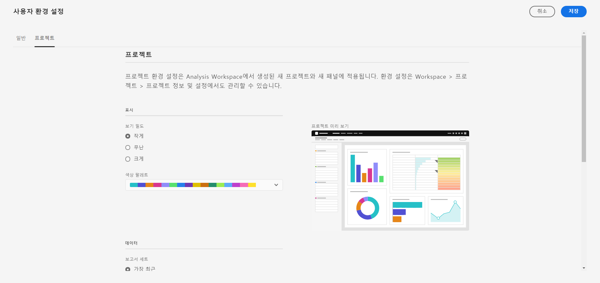

# 사용자 환경 설정

[!UICONTROL 구성 요소] > [!UICONTROL 사용자 환경 설정] 페이지에서 사용자 수준에서 Analysis Workspace 및 관련 구성 요소에 대한 설정을 관리할 수 있습니다. 사용자 환경 설정은 모든 *new* 프로젝트 또는 패널에 적용됩니다.

## 일반 환경 설정

일반 기본 설정은 브라우저에서 Adobe Analytics 환경에 적용됩니다.

| 환경 설정 | 옵션 |
| --- | --- |
| 랜딩 페이지 | <ul><li>프로젝트 목록(기본값)</li><li>빈 프로젝트</li><li>목록에서 선택한 특정 프로젝트</li></ul> |
| 팁 | <ul><li>활성화됨(기본값)</li><li>비활성화됨</li></ul> |

## 프로젝트 환경 설정

프로젝트 환경 설정은 Analysis Workspace에서 만든 새 패널과 새 프로젝트에 적용됩니다. 특정 환경 설정은 [!UICONTROL 작업 공간] > [!UICONTROL 프로젝트] > [!UICONTROL 프로젝트 정보 및 설정]에서 프로젝트별로 관리할 수도 있습니다.

| 섹션 | 환경 설정 | 옵션 |
| --- | --- | --- |
| **표시** |  |  |
|  | [보기 밀도](https://experienceleague.adobe.com/docs/analytics/analyze/analysis-workspace/build-workspace-project/view-density.html?lang=ko-KR) | <ul><li>컴팩트</li><li>편안함</li><li>확장(기본값)</li></ul> |
|  | [색상 팔레트](https://experienceleague.adobe.com/docs/analytics/analyze/analysis-workspace/build-workspace-project/color-palettes.html?lang=ko-KR) | <ul><li>Adobe 제공 팔레트(기본값)</li><li>사용자 정의 팔레트</li></ul> |
| **데이터** |  |  |
|  | [보고서 세트](https://experienceleague.adobe.com/docs/analytics/analyze/analysis-workspace/panels/panels.html?#report-suite) | <ul><li>가장 최근(기본값)</li><li>목록에서 선택한 특정 보고서 세트</li></ul> |
|  | [달력](https://experienceleague.adobe.com/docs/analytics/analyze/analysis-workspace/panels/panels.html?#calendar) | 다음 목록에서 선택합니다. <ul><li>Adobe 제공 범위(기본값은 이번 달)</li><li>사용자 지정 범위</li></ul> |
|  | [패널 유형](https://experienceleague.adobe.com/docs/analytics/analyze/analysis-workspace/panels/panels.html) | <ul><li>자유 형식(기본값)</li><li>빈</li><li>빠른 인사이트</li></ul> |
|  | 번호 형식 | <ul><li>1,000.00(기본값)</li><li>1.000,000</li><li>1 000,000</li></ul> |
|  | CSV 구분 문자 | <ul><li>쉼표(기본값)</li><li>세미콜론</li><li>콜론</li><li>파이프</li><li>기간</li><li>공백</li><li>탭</li></ul> |
