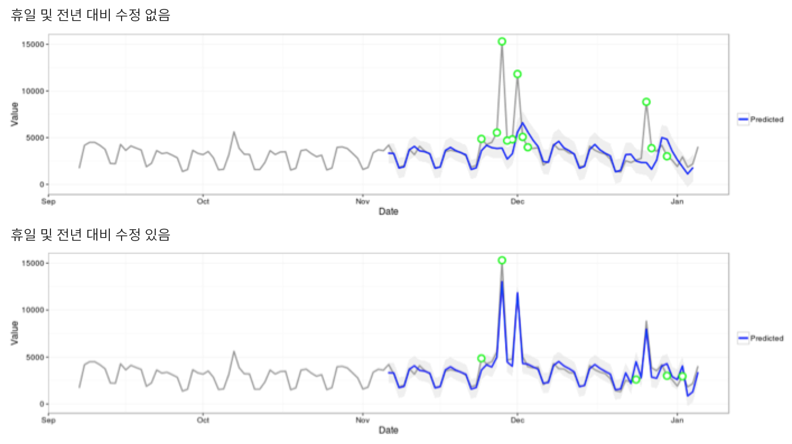

# 예외 항목 탐지에서 사용된 통계 기법

Analysis Workspace의 예외 항목 탐지에서는 일련의 고급 통계 기법을 사용하여 관찰 내용을 예외적인 것으로 간주해야 하는지 여부를 결정합니다. 

보고서에 사용된 날짜 세부기간에 따라, 시간별, 일별, 주별/월별 예외 항목 탐지에 대해 3 개의 다른 통계 기술이 사용됩니다. 각 통계 기법은 아래에 요약되어 있습니다. 

## Anomaly detection for daily granularity {#section_758ACA3C0A6B4D399563ECABFB8316FA}

일별 세부기간 보고서의 경우, 알고리즘에서는 가능한 가장 정확한 결과를 제공하기 위해 몇 가지 중요한 요인들을 고려합니다. 우선 알고리즘은 두 클래스 중 하나인 시간 시리즈 기반 모델 또는 이상치 탐지 모델 (기능적인 필터링) 중에서 사용할 사용 가능한 데이터를 기반으로 적용할 모델 유형을 결정합니다.

시계열 모델의 선택은 오류 유형, 트렌드 및 시즌(ETS)에 대한 다음의 조합을 기반으로 합니다([Hyndman et al. (2008)](https://www.springer.com/us/book/9783540719168))에 설명됨. 특히, 알고리즘에서는 다음의 조합을 시도합니다.

1. ANA(additive error, no trend, additive seasonality)
1. AAA(additive error, additive trend, additive seasonality)
1. MNM(multiplicative error, no trend, multiplicative seasonality)
1. MNA(multiplicative error, no trend, additive seasonality)
1. AAN(additive error, additive trend, no seasonality)

알고리즘에서는 다음 중 MAPE(mean absolute percentage error)가 가장 좋은 하나를 선택하여 각의 적합성을 테스트합니다. 하지만, 가장 좋은 시계열 모델의 MAPE가 15%를 넘는 경우, 기능 필터링이 적용됩니다. 일반적으로, 반복 내용이 많은 데이터(예: 주 단위 또는 월 단위 반복)는 시계열 모델에 가장 적합합니다. 

모델 선택 후에는 알고리즘이 휴일과 연 단위 시즌을 기반으로 결과를 조정합니다. 휴일의 경우, 알고리즘에서는 다음 휴일 중 보고 날짜 범위에 있는 것이 있는지 확인합니다. 

* 메모리얼 데이
* 4년 7월
* 추수감사절
* 블랙 프라이데이
* 사이버 먼데이
* 12월 24-26일
* 1월 1일
* 12월 31일

이 휴일들은 가장 많은 수의 고객 트렌드에 가장 중요한 휴일을 식별하기 위해 많은 고객 데이터 포인트에 대한 광범위한 통계적 분석을 기반으로 선택되었습니다. 모든 고객 또는 비즈니스 주기에 대해 이 목록은 완전하지 않지만, 이 휴일들을 적용할 경우 거의 모든 고객의 데이터 세트에 대해 전반적인 알고리즘 성능이 크게 개선되었습니다. 

모델을 선택하고 보고 날짜 범위에 있는 휴일이 식별되면, 다음 방식으로 알고리즘이 계속 진행됩니다. 

1. 예외 항목 참조 기간 구성 - 여기에는 보고 날짜 범위 전까지의 최대 35 일 및 일치 날짜 범위 (필요한 경우 윤일 회계) 가 포함되며, 이전 달에는 달력이 다른 날짜에 발생한 해당 공휴일이 포함됩니다.
1. 가장 최근 데이터를 기반으로 현재 기간에 있는 휴일(이전 연도 제외)이 이례적인지 테스트합니다. 
1. 현재 날짜 범위에 있는 휴일이 이례적이라면, 이전 연도의 휴일을 고려할 때 현재 휴일의 예상 값과 신뢰 구간(전후 2일 고려)을 조정합니다. 현재 휴일의 수정은 다음 항목의 최저 MAPE(mean absolute percentage error)를 기반으로 합니다. 

   1. 부가 효과
   1. 승법적 효과
   1. 전년 대비 차이

다음 예의 크리스마스와 설날에 대한 성능의 극적 개선에 주목하십시오. 

## Anomaly detection for hourly granularity {#section_014C9E9209AF43F8A03D5D46E3B3AEE7}

시간별 데이터는 일별 세부기간 알고리즘이 수행되는 것과 동일한 시계열 알고리즘 접근 방식에 따라 다릅니다. 하지만, 이것은 주말/주중 주기와 24시간 주기, 이렇게 두 개의 트렌드 패턴에도 강하게 의존합니다. 이 두 개의 시즌 효과를 캡처하기 위해, 시간별 알고리즘은 위에 요약된 동일한 접근 방식을 사용하여 주말 및 주중에 대한 별도의 두 모델을 구성합니다. 

시간별 트렌드에 대한 교육 기간은 336시간 전환 확인 기간에 따라 다릅니다. 

## Anomaly detection for weekly and monthly granularities {#section_5D421576BFBC4B24A58DFCC0A6407545}

주별 및 월별 트렌드는 일별 또는 시간별 세부기간에 있는 것과 동일한 주별 또는 일별 트렌드를 보여주지 않으므로, 이와 같이 별도의 알고리즘이 사용됩니다. 주별 및 월별의 경우, GESD(Generalized Extreme Studentized Deviate) 테스트로 알려진 두 단계 이상 값 감지 접근 방식이 사용됩니다. 이 테스트에서는 이상 값의 최대 개수를 결정하기 위해 조정된 상자 그림 접근 방식(이상 값 발견을 위한 비매개변수적 방식)과 결합된 예상된 예외 항목의 최대 개수를 고려합니다. 두 단계는 다음과 같습니다. 

1. 조정된 상자 그림 함수: 이 함수는 입력 데이터를 고려할 때 예외 항목의 최대 개수를 결정합니다.
1. GESD 함수: 1단계의 결과가 있는 입력 데이터에 적용됩니다.

그런 다음 휴일 및 전년 대비 시즌 예외 항목 탐지 단계에서는 올해 데이터에서 지난 해 데이터를 빼고, 그 다음 위의 2개 단계 프로세스를 사용하여 반복함으로써 해당 예외 항목이 시즌별로 적절한지를 확인됩니다. 이 날짜 세부기간의 각각에서는 선택된 보고 날짜 범위를 포함하는 15개 기간 전환 확인(15개월이나 15주 중 하나)과 교육을 위한 1년 전 해당 날짜 범위를 사용합니다. 
