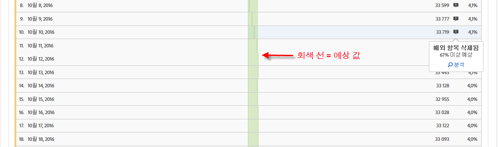
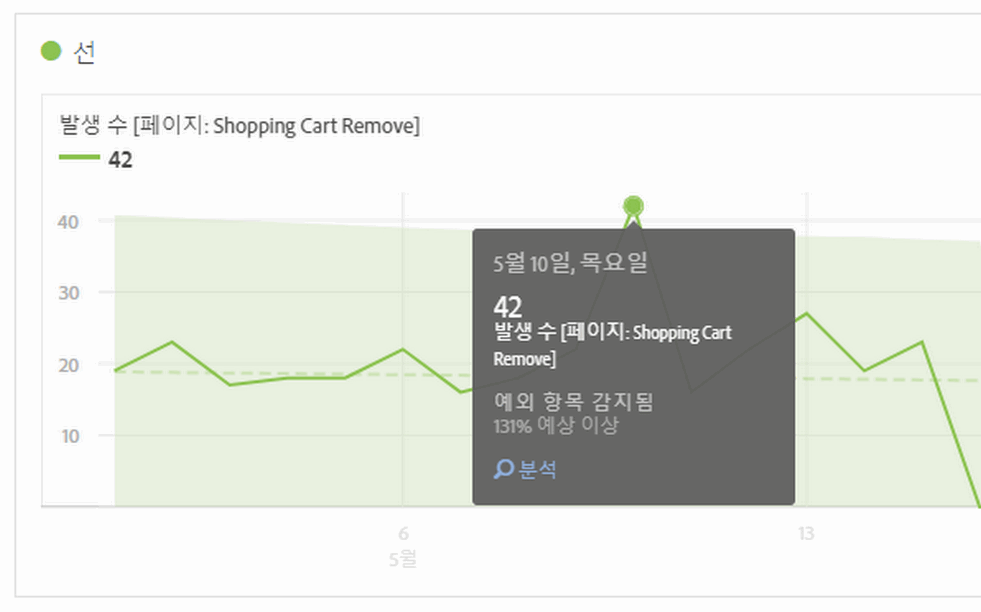
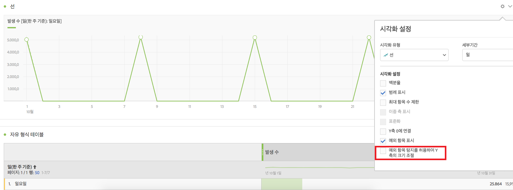

# 분석 작업 공간에서 예외 항목 보기

표 또는 선 차트에서 예외 항목을 볼 수 있습니다.

## View anomalies in a table {#section_869A87B92B574A38B017A980ED8A29C5}

시계열 자유 형식 테이블에서는, 데이터 예외 항목이 탐지된 경우 각 행에 진회색 느낌표 플래그가 지정됩니다.

각 행의 회색 수직선은 예상 값을 가리킵니다. 마우스를 느낌표 위에 놓으면, 예외 항목이 예상 값에서 벗어나는 정도가 표시됩니다(+ 또는 - % 사용).

## View anomalies in a line chart {#section_7C1192AFDB4345A8A2CCFB3AE0C47D82}

라인 차트는 이례적인 값(흰색 점)이 있는 밝은 녹색의 신뢰 대역을 보여 줍니다.

흰색 점을 클릭하면 녹색으로 바뀌고 다음 사항이 표시됩니다.

* 예외 항목이 발생한 날짜
* 예외 항목의 원시 값
* 녹색 선으로 표시되는 예상 값보다 위 또는 아래 값의 백분율 값
* [기여도 분석](../../../../analyze/analysis-workspace/virtual-analyst/contribution-analysis/ca-tokens.md)을 시작하는 분석 링크

라인 차트에 여러 개의 지표가 있을 경우에는 예외 항목만 표시되며, 사용자는 마우스를 각 예외 항목의 위에 놓아 해당 지표에 대한 신뢰 대역을 확인해야 합니다.

예외 항목 탐지 신뢰 구간은 차트를 읽기 쉽게 만들기 위해 시각화의 y축 크기를 자동으로 조절하지 않습니다.

신뢰 구간에서 차트의 크기를 조정할 수 있습니다. 설정(톱니바퀴) 아이콘을 클릭하고 **[!UICONTROL 예외 항목 탐지를 허용하여 Y 축의 크기 조절을 선택하십시오]**.

