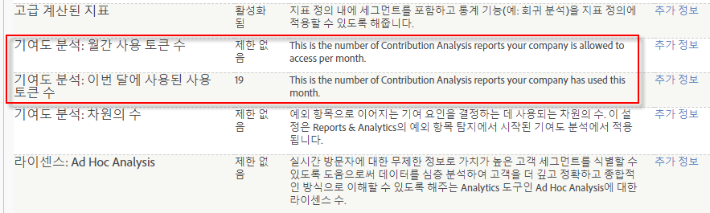

# 기여도 분석 개요

## Contribution Analysis Tokens - overview {#section_3EF8D2BBCE6E4C309D753BCF04A453D0}

>[!IMPORTANT]
>
>기여도 분석은 보고 및 분석 기능에서 제거되었으며 이제 분석 작업 공간을 통해서만 사용할 수 있습니다.

기여도 분석 권한이 있는 모든 고객은 Analysis Workspace에서 매달 제한된 횟수만큼 전체 기여도 분석을 실행할 수 있습니다. 여기에는 기여도 분석을 전혀 받지 않는 포인트 제품(SiteCatalyst 15) 고객, Analytics Foundation 고객 및 Analytics Select 고객은 **제외됩니다**.

회사마다 실행 횟수는 회사에서 구입한 Adobe Analytics 제품을 기준으로 하여 부여된 월별 토큰에 의해 제한됩니다. 여기에는 토큰 오용을 방지하기 위해 기여도 분석 액세스를 제한하는 기능이 포함됩니다.

## FAQ {#section_11D0431AD2014B96AB9561CA66A367CE}

<table id="table_357775E5058644099E26B15A6790E8AF"> 
 <thead> 
  <tr> 
   <th colname="col1" class="entry"> 질문 </th> 
   <th colname="col2" class="entry"> 답변 </th> 
  </tr>
 </thead>
 <tbody> 
  <tr> 
   <td colname="col1"> 
<b>Adobe에서 토큰을 도입한 이유는 무엇입니까? </b> 
 </td> 
   <td colname="col2"> 
기여도 분석는 2015년 출시된 이후 Adobe Analytics에서 가장 공감스러운 기능 중 하나입니다. 일부 Analytics 제품의 경우 3차원이 아닌 매월 "전체" 실행 횟수가 적어 무제한 전체 기여도 분석을 통해 어떤 효과가 있는지 알 수 있습니다. 
 </td> 
  </tr> 
  <tr> 
   <td colname="col1"> 
<b>기여도 분석에서 토큰은 어떻게 작동합니까? 기존 기여도 분석을 사용하여 프로젝트를 로드하는 데 토큰 비용이 듭니까? 또는 새로운 기여도 분석을 실행할 때만 토큰 비용이 필요합니까?</b> 
 </td> 
   <td colname="col2"> 
각 로그인 회사(각 사용자가 아님)는 한 달에 특정 수의 토큰을 얻으므로, Analysis Workspace에서 "전체" 기여도 분석을 실행할 수 있습니다. 
 
새 기여도 분석을 생성할 때마다 한 개의 토큰 비용을 지불합니다. 사전 실행된 기여도 분석을 사용하여 프로젝트 로드 시 토큰 비용이 들지 않습니다. 
 </td> 
  </tr> 
  <tr> 
   <td colname="col1"> 
<b>Reports &amp; Analytics의 기여도 분석에 토큰을 적용합니까?</b> 
 </td> 
   <td colname="col2"> 
아니요. 기여도 분석은 2018년 4월 현재 Reports &amp; Analytics 릴리스에 더 이상 제공되지 않습니다. 
 </td> 
  </tr> 
  <tr> 
   <td colname="col1"> 
<b>회사에 토큰이 없고 추가 기여도 분석을 실행하려는 경우 어떻게 해야 합니까?</b> 
 </td> 
   <td colname="col2"> 
다른 Adobe Analytics 제품으로 업그레이드 할 수 있습니다(예: Standard(매달 2개 토큰)에서 Ultimate(매달 20개 토큰)로). 더 많은 토큰을 구입할 수 없으며, 기존 패키징 프레임 워크 내에서 업그레이드 해야 합니다. 
 </td> 
  </tr> 
  <tr> 
   <td colname="col1"> 
<b>기여도 분석에 대한 액세스를 어떻게 제한합니까?</b> 
 </td> 
   <td colname="col2"> 
By default, only admins have access to run Contribution Analyses, but admins can grant access to other users by creating a permission group in the <a href="https://docs.adobe.com/content/help/en/core-services/interface/manage-users-and-products/admin-getting-started.html" format="html" scope="external"> Admin Console </a>. 정당한 이유가 있는 사용자에게만 기여도 분석을 사용할 수 있는 권한을 부여하고 액세스 권한을 남용하지 않도록 신뢰해야 합니다. 
 
이 권한을 "기여도 분석"이라고 하며, 분석 &gt; 관리 &gt; 사용자 관리 &gt; 그룹 편집 &gt; 모든 보고서 액세스 권한 편집 &gt; 보고서 세트 도구 사용자 지정 &gt; 도구 및 보고서에 있습니다. 
 </td> 
  </tr> 
  <tr> 
   <td colname="col1"> 
<b>한 달에 얼마나 많은 토큰을 받을 수 있고, 얼마나 많은 토큰을 현재 달에 사용했는지 어떻게 알 수 있습니까?</b> 
 </td> 
   <td colname="col2"> 
관리자 &gt;  회사 설정 &gt; 기능 액세스 수준 보기로 이동합니다. 이 페이지에는 다음 2개의 새로운 항목이 있습니다. 
 
 
 </td> 
  </tr> 
 </tbody> 
</table>

## Anomaly Detection and Contribution Analysis entitlements {#section_9278D58F21A840AA9B1ED1BD07A1EF0A}

다음은 Analysis Workspace에서 예외 항목 탐지 및 기여도 분석에 대한 상세 권한 목록입니다.

>[!IMPORTANT]
>
>예외 항목 탐지 및 기여도 분석은 Reports &amp; Analytics 기능 세트에서 제거되었으며 이제 Analysis Workspace를 통해서만 사용할 수 있습니다. Adobe Analytics Select 및 Adobe Analytics Foundation 고객은 Workspace의 &quot;일별 세부 기간&quot; 예외 항목 탐지에만 액세스할 수 있습니다.

<table id="table_5C9B7E4AE82640B5A913519E576889B5"> 
 <thead> 
  <tr> 
   <th colname="col1" class="entry"> Adobe Analytics 권한 </th> 
   <th colname="col2" class="entry"> 예외 항목 탐지 </th> 
   <th colname="col3" class="entry"> 기여도 분석 </th> 
  </tr>
 </thead>
 <tbody> 
  <tr> 
   <td colname="col1"> 
Foundation 
 </td> 
   <td colname="col2"> 
일별 세부 기간만 
 </td> 
   <td colname="col3" colsep="1"> 
토큰 없음 
 </td> 
  </tr> 
  <tr> 
   <td colname="col1"> 
<a href="https://www.adobe.com/data-analytics-cloud/analytics/select.html?promoid=B4XQ3X7G&amp;mv=other" format="html" scope="external"> Select </a> 
 </td> 
   <td colname="col2"> 
일별 세부 기간만 
 </td> 
   <td colname="col3"> 
토큰 없음 
 </td> 
  </tr> 
  <tr> 
   <td colname="col1"> 
<a href="https://www.adobe.com/data-analytics-cloud/analytics/prime.html?promoid=91BF51TR&amp;mv=other" format="html" scope="external"> Prime </a> 
 </td> 
   <td colname="col2"> 
예 
 </td> 
   <td colname="col3"> 
월별 10개 토큰 
 </td> 
  </tr> 
  <tr> 
   <td colname="col1"> 
<a href="https://www.adobe.com/data-analytics-cloud/analytics/ultimate.html?promoid=8N4B5F1V&amp;mv=other" format="html" scope="external"> Ultimate</a> 
 </td> 
   <td colname="col2"> 
예 
 </td> 
   <td colname="col3"> 
월별 20개 토큰 
 </td> 
  </tr> 
  <tr> 
   <td colname="col1"> 
+Predictive Workbench 
 </td> 
   <td colname="col2"> 
예 
 </td> 
   <td colname="col3"> 
무제한 토큰 
 </td> 
  </tr> 
  <tr> 
   <td colname="col1"> 
표준 
 
    <ul id="ul_73D52020793B44868C9CE0F90893075D"> 
     <li id="li_21EE0871C87E43C8B781219B2BA0FA74">Adobe Analytics 코어 </li> 
     <li id="li_AB3593200F33439BAEE8FEB13CAE57F4">Adobe Analytics OD </li> 
     <li id="li_2B7D625519BC4A4CB598C95F15D3029B">Adobe Analytics MA </li> 
    </ul> </td> 
   <td colname="col2"> 
예 
 </td> 
   <td colname="col3"> 
월별 2개 토큰 
 </td> 
  </tr> 
  <tr> 
   <td colname="col1"> 
Premium(360, 기여도) 
 </td> 
   <td colname="col2"> 
예 
 </td> 
   <td colname="col3"> 
월별 2개 토큰 
 </td> 
  </tr> 
  <tr> 
   <td colname="col1"> 
Premium(완료 , <a href="https://www.adobe.com/data-analytics-cloud/analytics/predictive-intelligence.html" format="html" scope="external">예측 인텔리전스</a>) 
 </td> 
   <td colname="col2"> 
예 
 </td> 
   <td colname="col3"> 
무제한 토큰 
 </td> 
  </tr> 
 </tbody> 
</table>
