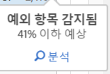
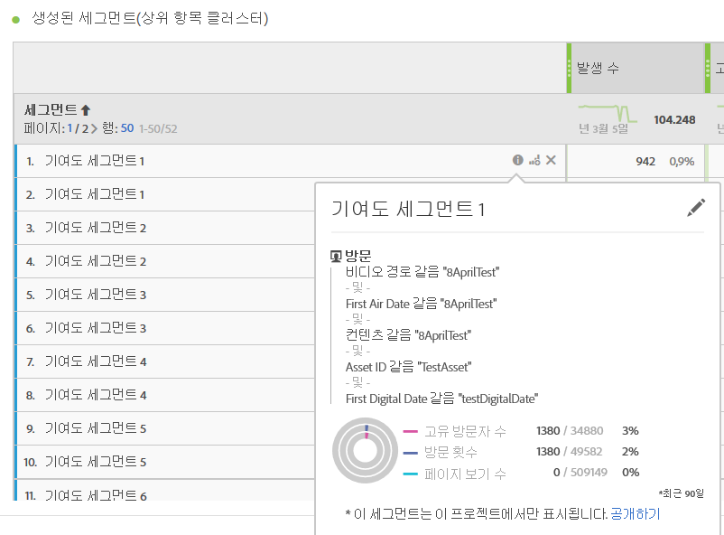
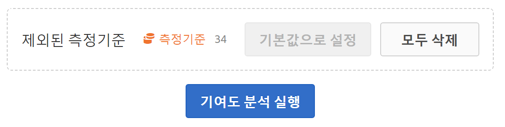
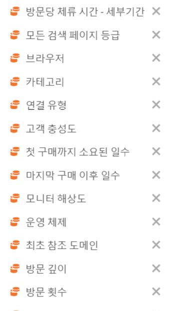

# 기여도 분석 실행

기여도 분석은 Adobe Analytics에서 관찰된 예외 항목에 기여한 사항을 드러내도록 설계된 집중 기계 학습 프로세스입니다. 이 프로세스의 목적은 사용자가 집중 영역이나 추가 분석 기회를 원래 가능한 것보다 훨씬 더 빨리 찾는 것을 돕는 것입니다. 

## 기여도 분석 실행 {#section_7D2C5E48A5664727941DF4C90976D9DC}

프로젝트에서 기여도 분석을 호출하는 데에는 두 가지 방법이 있습니다. 

* In a freeform table with daily granularity, right-click any row and select **[!UICONTROL Run Contribution Analysis]**. 예외 항목을 표시하지 않는 행에서 실행할 수도 있습니다. 

   >[!NOTE]
   >
   >현재 일별 세부기간에서만 기여도 분석을 지원합니다.

   

* 라인 차트에서는, 라인 차트의 예외 항목 데이터 포인트 위로 마우스를 가져갑니다. 표시되는 **[!UICONTROL 분석]링크를 클릭합니다.**

   

1. (선택 사항) 라인 차트나 표에서 **[!UICONTROL 기여도 분석 실행]**&#x200B;을 클릭한 후에 [차원을 제외](../../../../analyze/analysis-workspace/virtual-analyst/contribution-analysis/run-contribution-analysis.md#section_F6932F4BF74544B5872164E7B1E0C6FC)하여 분석 범위를 좁힐 수 있습니다(따라서 분석 속도가 빨라짐). 

1. 기여도 분석이 로드되는 동안 기다려 주십시오. 이 작업은 보고서 세트의 크기와 차원의 수에 따라 상당한 시간이 걸릴 수 있습니다. 기여도 분석에서는 차원당 상위 50,000개의 항목을 분석합니다.
1. 그런 다음 Analysis Workspace에서는 이 프로젝트 내에서 바로 새 기여도 분석 패널을 로드합니다. 전에 Reports &amp; Analytics에서 기여도 분석을 사용한 적이 있다면 익숙한 패널이 많이 표시됩니다.

   * 해당 일의 **방문** 수를 보여 주는 시각화.
   * 컨텍스트에 대한 월별 **방문 횟수 꺾은 선형**.
   * 이 예외 항목에 기여하고, [기여도 점수](https://marketing.adobe.com/resources/help/en_US/analytics/contribution/ca_contribution_score.html)와 해당 지표, 고유 방문자 수 지표로 정렬되어 크기 조정 관점의 문맥에서 지표를 적용하기 위한 **상위 항목**.

   * [생성된 세그먼트](https://marketing.adobe.com/resources/help/en_US/analytics/contribution/ca_workflow_premium.html)(상위 항목 클러스터) 표는 기여도 점수, 예외 항목 발생 횟수 및 이상 지표에 기여하는 전체적인 비율을 기반으로 상위 항목의 연관성을 식별합니다. 그런 다음 대상 세그먼트로서 캡처됩니다(기여도 세그먼트 1, 기여도 세그먼트 2 등). "i"(정보) 단추를 클릭하면 세그먼트를 구성하는 상위 항목을 포함하여 각 자동 세그먼트의 정의가 표시됩니다. 

      

1. 이제 기여도 분석은 Analysis Workspace의 일부이므로 다음과 같이 표의 마우스 오른쪽 단추 클릭 메뉴에 있는 많은 기능을 사용하여 분석을 훨씬 더 의미 있게 할 수 있습니다. 

   * [각 차원 항목을 다른 차원으로 분석](../../../../analyze/analysis-workspace/components/dimensions/t-breakdown-fa.md#task_B594DA2476E84DFDA8279E831F0BD9C4)
   * [하나 이상의 행에 대한 트렌드 표시](../../../../analyze/analysis-workspace/analysis-workspace-features.md#section_34930C967C104C2B9092BA8DCF2BF81A)
   * [새 시각화 추가](../../../../analyze/analysis-workspace/visualizations/freeform-analysis-visualizations.md#concept_09242627629147A88A68F1506954C276)
   * [경고 만들기 ](/help/components/c-alerts/intellligent-alerts.md)
   * [세그먼트 만들기 또는 비교](../../../../analyze/analysis-workspace/c-panels/c-segment-comparison/segment-comparison.md#concept_74FAC1C6D0204F9190A110B0D9005793)

>[!NOTE]
>
>기여도 분석 내의 파란색 점과 연결된 지능적인 경고 프로젝트를 통해 분석되는 예외 항목을 강조 표시합니다. 이렇게 하면 분석되는 예외 항목이 더 명확히 표시됩니다.

## Exclude dimensions from Contribution Analysis {#section_F6932F4BF74544B5872164E7B1E0C6FC}

기여도 분석에서 일부 차원을 제외하고자 하는 경우가 있을 수 있습니다. 예를 들어, 브라우저 또는 하드웨어와 관련된 차원을 전혀 고려하지 않을 수 있으며, 이를 제거하여 분석 속도를 높이고 싶을 수도 있습니다.

1. **[!UICONTROL 기여도 분석 실행]**(또는 라인 차트에서 **[!UICONTROL 분석])을 클릭하면**&#x200B;제외된 차원&#x200B;**패널이 표시됩니다.**

1. Just drag any unwanted dimensions into the **[!UICONTROL Excluded Dimensions]** panel, then save the list by clicking **[!UICONTROL Set as Default]**. 또는 **[!UICONTROL 모두 지우기]를 클릭하여 제외할 차원을 선택하여 다시 시작합니다.**

   

1. 제외할 차원을 추가한(또는 제외하지 않도록 선택한) 후, 다시 **[!UICONTROL 기여도 분석 실행]을 클릭합니다.**
1. 제외된 차원 목록을 수정해야 하는 경우, 차원을 두 번 클릭하면 제외된 차원 목록이 표시됩니다.

   

1. 원하지 않는 차원 옆에 있는 x를 클릭하여 삭제한 다음 **[!UICONTROL 기본값으로 설정을 클릭하여 목록을 저장합니다]**.

