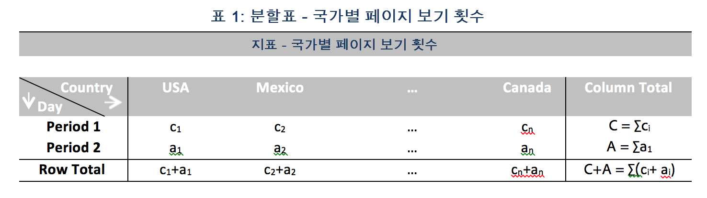

# 기여도 분석에 사용된 통계 기법

기여도 분석은 Adobe Analytics에서 관찰된 예외 항목에 기여한 사항을 드러내도록 설계된 집중 기계 학습 프로세스입니다. 이 프로세스의 목적은 사용자가 집중 영역이나 추가 분석 기회를 원래 가능한 것보다 훨씬 더 빨리 찾는 것을 돕는 것입니다. 

기여도 분석에서는 사용자의 기여도 분석 보고서에 사용할 수 있는 모든 단일 차원 항목에 두 부분으로 구성된 알고리즘을 수행하여 이 작업을 완수합니다. 알고리즘은 다음 순서로 작동합니다.

1. 각 차원에 대해 Cramer의 V 테스트 통계가 계산됩니다. 다음 예에서, 두 개의 시간 기간에 대해 국가별 페이지 보기 횟수를 보여주는 분할표를 고려하십시오. 

   

   표 1에서는 Cramer의 V를 사용하여 기간 1(예: 히스토리)과 기간 2(예: 예외 항목이 발생한 날)에 대한 국가별 페이지 보기 횟수 간 연관성을 측정할 수 있습니다. Cramer의 V에 대한 낮은 값은 낮은 수준의 연관성을 나타냅니다. Cramer의 V 범위는 0(연관성이 없음) ~ 1(완전한 연관성)입니다. Cramer의 V 통계를 다음과 같이 계산할 수 있습니다. 

   

1. 각 차원 항목에 대해서는 PR(Pearson's Residual)을 사용하여 예외 항목 지표와 각 차원 항목 간의 연관성을 측정할 수 있습니다. PR은 표준 정규 분포를 따르며, 이 분포에서 알고리즘은 편차가 비교할 수 없이 작더라도 임의의 두 변수에 대한 PR을 비교할 수 있습니다. 실제로, 이 오류는 알려져 있지 않으며, 한정된 샘플 수정을 사용하여 평가됩니다. 

   이전 예의 표 1에서, 국가 i 및 기간 2에 대한 한정된 샘플 수정이 있는 PR은 다음 식으로 주어집니다.

   

   여기에서,

   

   (기간 1에 대해 유사한 공식을 얻을 수 있습니다.) 

   이 때 최종 결과를 위한 각 차원 항목의 점수는 Cramer의 V 척도 만큼 가중 계산되며, 기여도 점수를 제공하기 위해 0과 1 사이의 숫자로 조정됩니다. 

