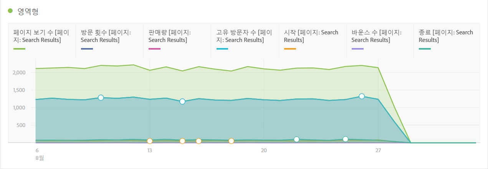
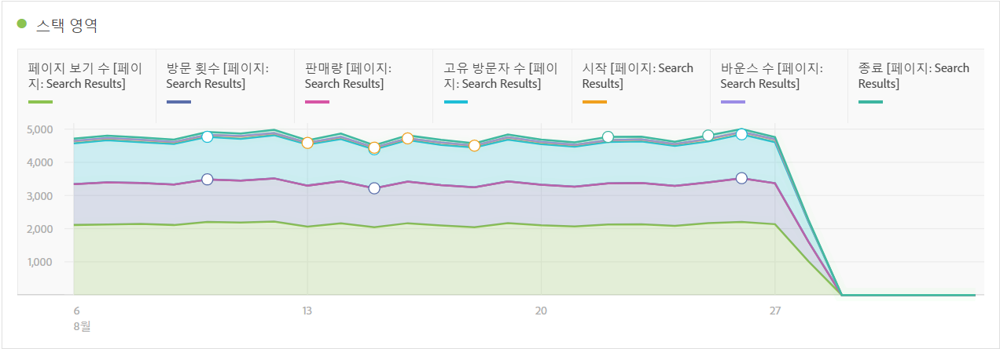
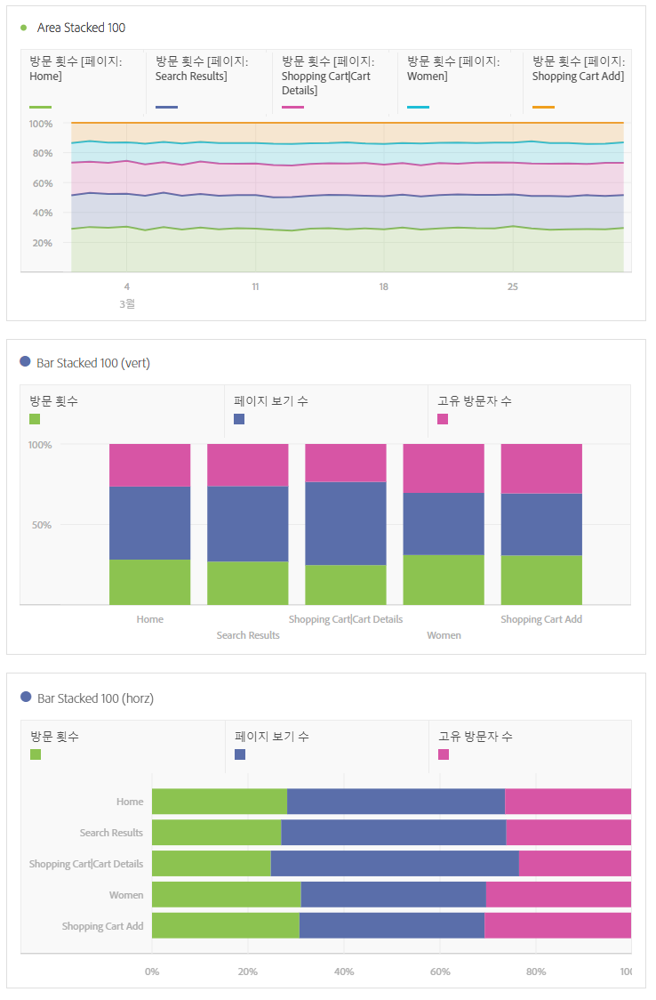

# 스택된 영역 및 영역

## 영역 {#section_FDC4B6AA944F4F8AAAEAA5E17359F28A}

이 시각화는 선 그래프 모양이며 선 아래에 색칠된 영역이 있습니다. 여러 개의 지표가 있고 두 개 이상 지표의 교차 지점으로 표시되는 영역을 시각화하려는 경우 영역 그래프를 사용하십시오.

## Area stacked {#section_922BBC5A6D254778A050DF710B0BD8D9}

이 시각화는 영역 차트와 유사하지만 각 시리즈가 이전 시리즈의 맨 위에서 시작됩니다.

스택 영역 시각화에 대한 새로운 시각화 설정은 차트를 "100% 누적" 시각화로 바꿉니다.

