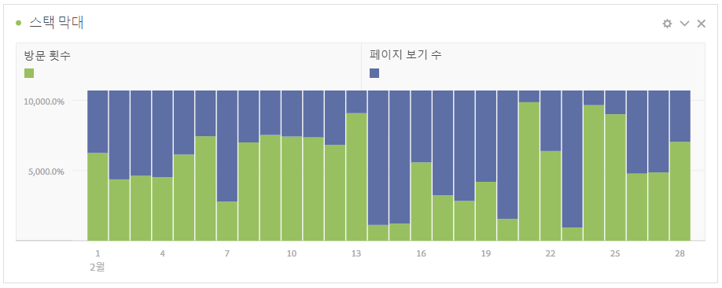

# 막대 및 스택 막대

## 막대 {#section_2E96E55D4E8E488CBCA6A3508DDF3918}

이 시각화는 하나 이상 지표에서 다양한 값을 나타내는 세로 막대를 표시합니다.

시각화 설정의 세부기간 드롭다운을 사용하면 트렌드 시각화(예: 선, 막대)를 일별에서 주별, 월별 등으로 변경할 수 있습니다.

## Bar stacked {#section_9EA83779AE964635907EE5031A785A49}

이 시각화는 막대 차트와 유사하지만 시리즈 막대가 서로의 위에 스택되어 있습니다.

스택 막대 시각화에 대한 새로운 시각화 설정은 차트를 "100% 누적" 시각화로 바꿉니다.

