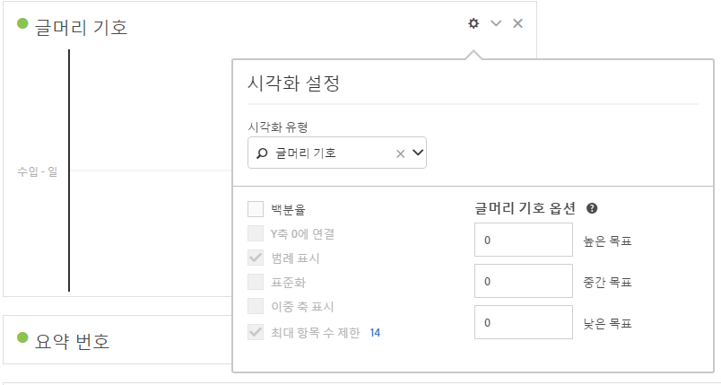

# 글머리 기호 그래프

중요한 값이 다른 성능 범위(목표)에 대해 비교되거나 측정되는 방식을 확인할 수 있도록 해줍니다.

글머리 기호 그래프는 단일 기본 측정값 (예: 현재 년간의 매출) 를 포함하며, 품질 범위 성능 범위를 입력할 수 있습니다 (예: 목표 매출과 비교). 높음, 중간 및 낮음을 지정할 수 있습니다.  [!UICONTROL 시각화 설정]에서 목표 범위를 지정할 수 있습니다.
