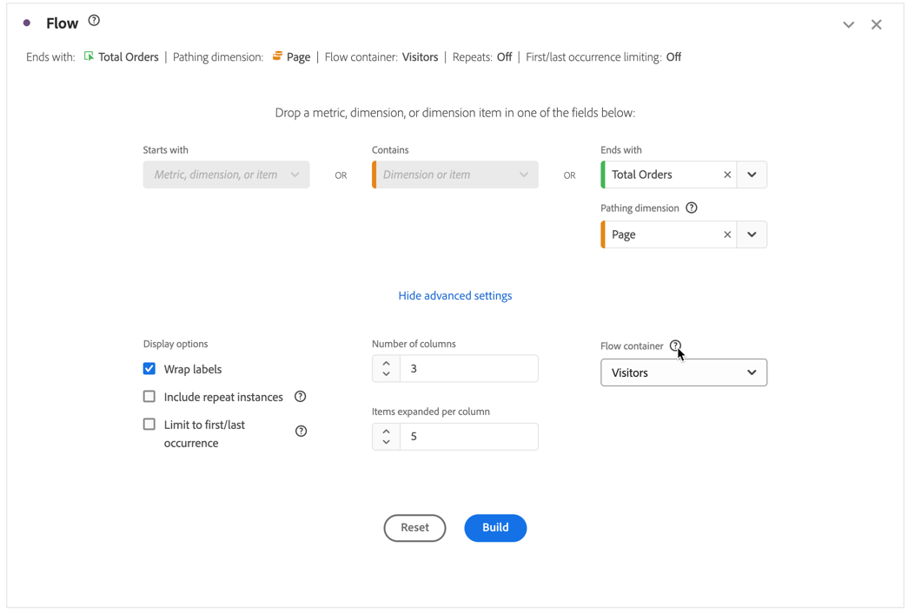
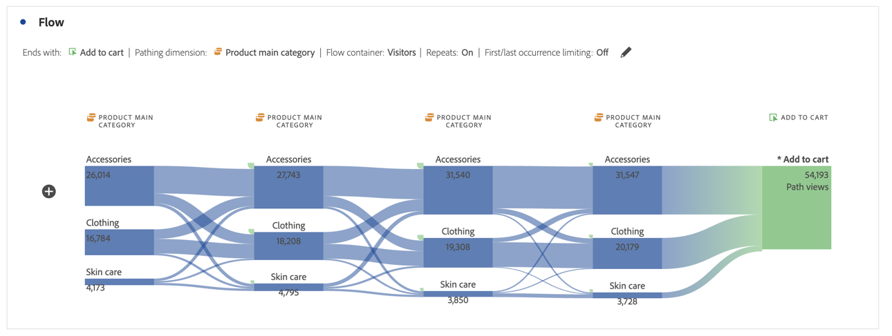

# 플로우 시각화 구성 {#configure-a-flow-visualization}

>[!CONTEXTUALHELP]
>id="workspace_flow_startswith"
>title="다음으로 시작"
>abstract="이 필드는 초기 빌드에서만 설정할 수 있습니다. 이 필드를 업데이트하려면 **[!UICONTROL 재설정]**&#x200B;을 선택하여 새 플로우 시각화를 작성하십시오."

>[!CONTEXTUALHELP]
>id="workspace_flow_contains"
>title="다음 포함"
>abstract="이 필드는 초기 빌드에서만 설정할 수 있습니다. 이 필드를 업데이트하려면 **[!UICONTROL 재설정]**&#x200B;을 선택하여 새 플로우 시각화를 작성하십시오."

>[!CONTEXTUALHELP]
>id="workspace_flow_endswith"
>title="다음으로 끝남"
>abstract="이 필드는 초기 빌드에서만 설정할 수 있습니다. 이 필드를 업데이트하려면 **[!UICONTROL 재설정]**&#x200B;을 선택하여 새 플로우 시각화를 작성하십시오."

>[!CONTEXTUALHELP]
>id="workspace_flow_pathingdimension"
>title="경로 지정 차원"
>abstract="선택한 구성 요소로 연결되거나 연결되는 경로로 사용할 차원을 선택합니다."

>[!CONTEXTUALHELP]
>id="workspace_flow_container"
>title="흐름 컨테이너"
>abstract="경로 지정(번호)을 표시하는 데 사용할 컨테이너를 선택하십시오."

>[!CONTEXTUALHELP]
>id="workspace_flow_include_repeats_disabled"
>title="반복 포함 (비활성화됨)"
>abstract="다중 값 차원을 포함하는 플로우 시각화에서 반복을 제거할 수 없습니다."

>[!CONTEXTUALHELP]
>id="workspace_flow_include_repeats_default"
>title="반복 포함"
>abstract="플로우 시각화는 차원의 인스턴스를 기반으로 합니다. 이 설정은 반복된 인스턴스(예: 페이지 다시 로드)를 포함하거나 제외하는 옵션을 제공합니다."

>[!CONTEXTUALHELP]
>id="workspace_flow_limit_occurrence"
>title="처음/마지막 발생으로 제한"
>abstract="첫 번째/마지막 접점이 시작/종료인 경우 결과는 경로로 제한됩니다."

>[!CONTEXTUALHELP]
>id="workspace_flow_numberofcolumns"
>title="열 수"
>abstract="이 필드는 초기 빌드에서만 설정할 수 있습니다. 이 필드를 업데이트하려면 **[!UICONTROL 재설정]**&#x200B;을 선택하여 새 플로우 시각화를 작성하십시오."

>[!CONTEXTUALHELP]
>id="workspace_flow_itemsexpandedpercolumn"
>title="열당 항목 확장됨"
>abstract="이 필드는 초기 빌드에서만 설정할 수 있습니다. 이 필드를 업데이트하려면 **[!UICONTROL 재설정]**&#x200B;을 선택하여 새 플로우 시각화를 작성하십시오."

>[!CONTEXTUALHELP]
>id="workspace_flow_resettoupdate"
>title="업데이트로 재설정"
>abstract="이 필드는 초기 빌드에서만 설정할 수 있습니다. 이 필드를 업데이트하려면 **[!UICONTROL 재설정]**&#x200B;을 선택하여 새 플로우 시각화를 작성하십시오."

플로우 시각화는 웹 사이트 또는 앱의 특정 전환 이벤트에서 발생하는 여정을 이해하는 데 도움이 됩니다. 또는 특정 전환 이벤트로 이어질 수 있습니다. 시각화는 차원(및 차원 항목) 또는 지표를 통해 경로를 추적합니다.

원하는 경로의 시작 또는 끝을 구성할 수 있습니다. 또는 차원 또는 차원 항목을 통과하는 모든 경로를 분석합니다.

## 사용

1.  **[!UICONTROL 플로우]** 시각화를 추가합니다. [패널 내에 시각화 추가](../freeform-analysis-visualizations.md#add-visualizations-to-a-panel)를 참조하십시오.

1. 다음 옵션 중 하나를 사용하여 플로우 시각화를 고정합니다.

   * [!UICONTROL **다음으로 시작**] (지표, 차원 또는 항목)
   * [!UICONTROL **포함**] (차원 또는 항목)
   * [!UICONTROL **다음으로 끝남**] (지표, 차원 또는 항목)

   이러한 각각의 카테고리는 화면에 *드롭 영역*&#x200B;으로 표시됩니다. 세 가지 방법으로 드롭 영역을 채울 수 있습니다.

   * 드롭다운 메뉴를 사용하여 지표 또는 차원을 선택합니다.
   * 왼쪽 패널에서 차원 또는 지표를 드래그합니다.
   * 차원 또는 지표의 이름을 입력하기 시작한 다음 드롭다운 목록에 표시되면 선택합니다.

   >[!IMPORTANT]
   >
   >계산된 지표를 **[!UICONTROL 다음으로 시작]** 또는 **[!UICONTROL 다음으로 끝남]** 필드에 사용할 수 없습니다.

1. 지표를 선택하는 경우 여기에 표시된 대로 선택한 구성 요소로 연결되거나 연결되는 경로로 사용할 [!UICONTROL **경로 지정 차원**]&#x200B;도 제공해야 합니다. 기본값은 [!UICONTROL **페이지**]&#x200B;입니다.

   

1. (선택 사항) **[!UICONTROL 고급 설정 표시]**&#x200B;를 선택하여 다음 옵션 중 하나를 구성합니다.

   | 설정 | 설명 |
   | --- | --- |
   | **[!UICONTROL 줄 바꿈 레이블]** | 대개 흐름 요소의 레이블은 화면 공간을 절약하기 위해 잘리지만 이 상자를 선택하여 전체 레이블을 표시할 수 있습니다.  기본값 = 선택 해제. |
   | **[!UICONTROL 반복 인스턴스 포함]** | 플로우 시각화는 차원의 인스턴스를 기반으로 합니다. 이 설정은 반복된 인스턴스(예: 페이지 다시 로드)를 포함하거나 제외하는 옵션을 제공합니다. 하지만 listVars, listProp, s.product, 머천다이징 eVar 등과 같이 여러 값을 갖는 차원을 포함하는 플로우 시각화에서는 반복을 제거할 수 없습니다. 
이 옵션은 기본적으로 비활성화되어 있습니다.
 |
   | **[!UICONTROL 처음/마지막 발생으로 제한]** | 차원, 항목 또는 지표의 처음 또는 마지막 발생으로 진입 또는 종료하는 경로로 경로를 제한합니다. 자세한 설명은 [처음/마지막 발생으로 제한](#example-scenario-for-limit-to-firstlast-occurrence)을 참조하십시오. |
   | **[!UICONTROL 열 수]** | 플로우 다이어그램에 원하는 열 수입니다. 최대 5개의 열을 지정할 수 있습니다. |
   | **[!UICONTROL 열당 항목 확장됨]** | 각 열에 원하는 항목 수입니다. 열당 확장된 최대 10개의 항목을 지정할 수 있습니다. |
   | **[!UICONTROL 플로우 컨테이너]** | **[!UICONTROL 방문]**&#x200B;과(와) **[!UICONTROL 방문자]** 간을 전환하여 경로 지정을 분석할 수 있습니다. 이러한 설정은 방문에 대해 방문자 수준에서 방문자의 참여를 이해하거나 분석을 단일 방문으로 제한하는 데 도움이 됩니다. |

   >[!IMPORTANT]
   >
   >**[!UICONTROL 열 수]**&#x200B;와 **[!UICONTROL 열당 확장된 항목]**&#x200B;의 조합에 따라 플로우 시각화를 만드는 데 필요한 기본 요청 수를 결정합니다. 열 수가 높을수록 시각화를 렌더링하는 데 시간이 오래 걸립니다.

1. **[!UICONTROL 빌드]**&#x200B;를 선택합니다.

### 예

사용자가 사이트의 가장 방문 빈도가 높은 페이지를 오가는 경로를 추적한다고 가정합니다.

1. 위에서 설명한 대로 플로우 시각화 만듭니다.
1. [!UICONTROL **페이지**] 차원을 **[!UICONTROL 포함]** 필드로 끌어온 다음 [!UICONTROL **빌드**]&#x200B;를 선택합니다.
1. 플로우 시각화는 시각화 중앙의 포커스 노드에 표시되는 가장 많이 본 페이지로 빌드됩니다. 또한 해당 페이지로 연결되는 상위 페이지(포커스 노드 왼쪽)와 해당 페이지에서 시작되는 상위 페이지(포커스 노드 오른쪽)를 확인할 수 있습니다.
1. [구성](#configure)에 설명된 대로 플로우에서 데이터를 분석합니다.

## 구성

플로우 구성의 요약이 시각화의 맨 위에 나타납니다. 다이어그램의 경로는 비례합니다. 활동이 많은 경로일수록 더 두껍게 표시됩니다.

데이터를 추가 드릴다운하려면 다음과 같은 몇 가지 옵션이 있습니다.

* 흐름 다이어그램은 대화형입니다. 표시되는 세부 사항을 변경하려면 마우스를 다이어그램 위에 놓습니다.

* 다이어그램에서 노드를 선택하면 해당 노드에 대한 세부 사항이 표시됩니다. 축소하려면 노드를 다시 선택합니다.

  플로우 시각화에 여러 노드를 확장하면 보고 시간에 영향을 줄 수 있습니다. 일반적인 지침으로 주어진 시간에 10개 이하의 노드가 계속 확장되어야 합니다.

  

* 포함 및 제외, 기준 지정 등과 같은 특정 결과만 표시하도록 열을 필터링할 수 있습니다.

* 열을 확장하려면 왼쪽이나 오른쪽에 있는 을 선택합니다.

* 출력을 사용자 정의하려면 [컨텍스트 메뉴](#context-menu) 옵션을 사용합니다.

* 플로우를 편집하거나 다른 옵션으로 다시 빌드하려면 구성 요약 옆에 있는 을 선택합니다.

## 필터링

각 열 위에 마우스를 가져다 대면 필터 가 나타납니다. 필터를 선택하면 자유 형식 테이블에 있는 것과 동일한 필터 대화 상자가 나타납니다. [필터링 및 정렬](freeform-table/../../freeform-table/filter-and-sort.md)을 참조하십시오.

* **[!UICONTROL 고급 표시]**&#x200B;를 사용하면 연산자 목록을 사용하여 특정 기준을 포함하거나 제외하는 고급 설정을 구성할 수 있습니다. 자세한 내용은 [필터링 및 정렬](../freeform-table/filter-and-sort.md)을 참조하십시오.
* 열을 필터링하면 해당 열에 필터링이 반영됩니다. 파란색 는 열이 필터링되었음을 나타냅니다.  필터는 열을 줄여서 필터에서 허용된 항목만 표시합니다. 또는 필터에 원하는 항목 하나만 제외하고 모든 항목을 제거합니다.
* 나머지 노드로 데이터가 유입되는 한 모든 다운스트림 및 업스트림 열은 지속됩니다.
* 필터를 제거하려면 를 선택하여 필터 메뉴를 엽니다. 적용된 필터를 제거한 다음 **[!UICONTROL 저장]**&#x200B;을 선택합니다. 플로우를 필터링되지 않은 이전 상태로 돌아가야 합니다.

## 컨텍스트 메뉴

다음 옵션을 사용하여 플로우 시각화의 모든 노드에서 컨텍스트 메뉴를 사용합니다.

| 옵션 | 설명 |
|--- |--- |
| **[!UICONTROL 이 노드에 대한 포커스]** | 포커스를 선택된 노드로 변경합니다. 플로우 다이어그램의 중앙에 포커스 노드가 표시됩니다. |
| **[!UICONTROL 시작]** | 새 플로우 다이어그램을 빌드할 수 있는 자유 형식 다이어그램 빌더로 돌아갑니다. |
| **[!UICONTROL 이 경로에 대한 필터 만들기]** | 필터를 만듭니다. 필터 빌더로 이동하여 새 필터를 구성할 수 있습니다. |
| **[!UICONTROL 분류]** | 사용할 수 있는 차원, 지표 또는 시간으로 노드를 분석합니다. |
| **[!UICONTROL 필터 열]** | 자유 형식 테이블에서 사용 가능한 것과 동일한 필터 옵션이 나타납니다. 사용 가능한 옵션에 대한 자세한 내용은 [테이블 필터 및 정렬](/help/analyze/analysis-workspace/visualizations/freeform-table/filter-and-sort.md)의 “테이블에 단순 또는 고급 필터 적용” 섹션을 참조하십시오. |
| **[!UICONTROL 항목 제외]** 또는 **[!UICONTROL 제외된 항목 복원]** | 열에서 특정 노드를 제거하고 열 맨 위에 필터로 자동으로 만듭니다. 제외된 항목을 복원하려면 컨텍스트 메뉴에서 **[!UICONTROL 제외된 항목 복원]**&#x200B;을 선택합니다. 또한 열의 맨 위에 있는 필터를 열고 방금 제외한 항목이 있는 필박스를 제거할 수도 있습니다. |
| **[!UICONTROL 트렌드]** | 노드에 대한 트렌드 다이어그램을 만듭니다. |
| **[!UICONTROL 다음 열 표시]** / **[!UICONTROL 이전 열 표시]** | 시각화의 다음(오른쪽) 또는 이전(왼쪽) 열을 표시합니다. |
| **[!UICONTROL 열 숨기기]**n | 시각화에서 선택한 열을 숨깁니다. |
| **[!UICONTROL 전체 열 확장]** | 열을 확장하여 모든 노드를 표시합니다. 기본적으로 상위 5개 노드만 표시됩니다. |
| **[!UICONTROL 선택 항목으로 대상자 만들기]** | 선택된 열에 따라 대상자를 만듭니다. |
| **[!UICONTROL 전체 열 축소]** | 열에 있는 모든 노드를 숨깁니다. |

## 처음/마지막 발생으로 제한

이 옵션을 사용할 때는 다음 사항에 유의하십시오.

* **[!UICONTROL 처음/마지막 발생으로 제한]**&#x200B;은 시리즈의 처음/마지막 발생만 카운트합니다. **[!UICONTROL 다음으로 시작]** 또는 **[!UICONTROL 다음으로 끝남]** 기준의 다른 모든 발생은 삭제됩니다.
* **[!UICONTROL 다음으로 시작]** 플로우와 함께 사용할 경우, 시작 기준과 일치하는 처음 발생만 포함됩니다.
아래 예시에서는 플로우의 각 단계에서 *장바구니에 추가* 및 *제품 주요 카테고리*&#x200B;가 **모든** 발생에 포함되어 있습니다.
  

  아래 예시에서는 플로우의 각 단계에서 *장바구니에 추가* 및 *제품 주요 카테고리*&#x200B;가 **처음** 발생에만 포함되어 있습니다.
  
* **[!UICONTROL 다음으로 끝남]** 플로우와 함께 사용할 경우, 종료 기준과 일치하는 마지막 발생만 포함됩니다.
아래 예시에서는 플로우의 각 단계에서 *제품 주요 카테고리* 및 *장바구니에 추가*&#x200B;가 **모든** 발생에 포함되어 있습니다.
  

  아래 예시에서는 플로우의 각 단계에서 *제품 주요 카테고리* 및 *장바구니에 추가*&#x200B;가 **마지막** 발생에만 포함되어 있습니다.
  
* 사용된 시리즈는 컨테이너에 따라 다릅니다. **[!UICONTROL 방문자]** 컨테이너를 사용하는 경우 일련의 이벤트는 방문입니다. **[!UICONTROL 방문자]** 컨테이너를 사용하는 경우 일련의 이벤트는 제공된 날짜 범위에서 지정된 사용자의 모든 히트입니다.
* **[!UICONTROL 다음으로 시작]** 또는 **[!UICONTROL 다음으로 끝남]** 필드에서 지표 또는 차원 항목을 사용할 때 고급 설정에서 **[!UICONTROL 처음/마지막 발생으로 제한]** 옵션을 구성할 수 있습니다.

>[!MORELIKETHIS]
>
>[패널 내에 시각화 추가](/help/analyze/analysis-workspace/visualizations/freeform-analysis-visualizations.md#add-visualizations-to-a-panel)
>[시각화 설정](/help/analyze/analysis-workspace/visualizations/freeform-analysis-visualizations.md#settings)
>[시각화 컨텍스트 메뉴](/help/analyze/analysis-workspace/visualizations/freeform-analysis-visualizations.md#context-menu)
>

<!--
## Create a flow visualization {#configure}

1. Add a blank panel to your project and click the visualizations icon in the left rail. 

   Or
   
   Add a visualization in any of the ways described in the "Add visualizations to a panel" section in [Visualizations overview](/help/analyze/analysis-workspace/visualizations/freeform-analysis-visualizations.md).

1. Anchor your Flow visualization using one of the following options:

   * [!UICONTROL **Starts with**] (metrics, dimensions, or items), or
   * [!UICONTROL **Contains**] (dimensions, or items), or
   * [!UICONTROL **Ends with**] (metrics, dimensions, or items)

   Each of these categories is shown onscreen as a "drop zone." You can populate the drop zone in 3 ways:

   * Use the drop-down menu to select metrics or dimensions.
   * Drag dimensions or metrics from the left rail.
   * Begin typing the name of a dimension or metric, then select it when it appears in the drop-down list.

   >[!IMPORTANT]
   >
   >Calculated metrics cannot be used in the  **[!UICONTROL Starts with]** or **[!UICONTROL Ends with]** fields.

1. If you choose a metric, you also need to provide a [!UICONTROL **Pathing Dimension**] to use as your path leading to or coming from your selected component, as shown here. The default is [!UICONTROL **Page**].

   

1. (Optional) Select **[!UICONTROL Show advanced settings]** to configure any of the following options:

   

   | Setting | Description |
   | --- | --- |
   | **[!UICONTROL Wrap labels]** | Normally, the labels on the Flow elements are truncated to save screen real estate, but you can make the entire label visible by checking this box.  Default = unchecked. |
   | **[!UICONTROL Include repeat instances]** | Flow visualizations are based on instances of a dimension. This setting gives you the option to include or exclude repeated instances, e.g. Page reloads. However, repeats cannot be removed from Flow visualizations that include multi-valued dimensions, such as listVars, listProps, s.product, merchandising eVars, etc. 
This option is disabled by default.
 |
   | **[!UICONTROL Limit to first/last occurrence]** | Limit paths to those that start/end with the first/last occurrence of a dimension/item/metric. See the section below, [Example scenario for 'limit to first/last occurrence'](#example-scenario-for-limit-to-firstlast-occurrence), for a more detailed explanation. |
   | **[!UICONTROL Number of columns]** | The number of columns you want in your Flow diagram. You can specify a maximum of 5 columns. |
   | **[!UICONTROL Items expanded per column]** | The number of items you want in each column. You can specify a maximum of 10 items expanded per column.  |
   | **[!UICONTROL Flow container]** | <ul><li>Visit</li><li>Visitor</li></ul> Lets you switch between Visit and Visitor to analyze visitor pathing. These settings help you understand visitor engagement at the visitor level (across visits), or constrain the analysis to a single visit.|

   >[!IMPORTANT]
   >
   >The combination of **[!UICONTROL Number of columns]** and **[!UICONTROL Items expanded per column]** determine the number of underlying requests required to create the flow visualization. The higher those numbers, the longer it takes to render a visualization.

1. Select **[!UICONTROL Build]**.

>[!INFO]
>
>**Example:** Suppose that you want to trace the path that users took both to and from the most popular pages on your site.
>
>To do this, you would
> 
>1. Begin creating a flow visualization as described above.
>1. Drag the [!UICONTROL **Page**] dimension into the **[!UICONTROL Contains]** field, then select [!UICONTROL **Build**].
>1. The Flow visualization builds with the most-viewed page visible in the focus node in the center of the visualization. You also see the top pages leading into that page (to the left of the focus node) as well as the top pages leading out of that page (to the right of the focus node).
>1. Analyze data in the flow, as described in [View and change the Flow output](#view-and-change-the-flow-output).

## View and change the Flow output {#output}

A summary of the Flow configuration appears at the top of the diagram. The thickness of a path in the diagram is proportional to its activity, with paths with more activity appearing thicker than those with less activity.

To drill down further into the data, you have several options:

* The flow diagram is interactive. Mouse over the diagram to change the details that are shown.

* When you select on a node in the diagram, the details for that node appear. Select on the node again to collapse it.

   

* You can filter a column to display only certain results, such as including and excluding, specifying criteria, and so forth.

* Select the plus sign (+) on the left to expand a column.

* Use the right-click options explained below to further customize the output.

* Select the pencil icon next to the configuration summary to further edit the flow or rebuild it with different options.

* You can also export and further analyze your Flow diagram as part of a project's .CSV file by going to **[!UICONTROL Project]** > **[!UICONTROL Download CSV]**.

## Filtering

Above each column, a filter appears when you hover over it. By selecting the filter, you get the same filter dialog that exists in the Freeform table today. This filter works the same as it does in the Freeform table.

* Use advanced settings to include or exclude certain criteria with our list of operators.
* Once you have filtered an item from the list, that specific column will reflect the filtering. (The filter either reduces it to only show the item allowed in the filter, or it removes all items except for the one item you want in the filter.
* All downstream and upstream columns should persist, as long as there is data flowing into the remaining nodes.
* Once applied, the filter icon appears in blue above the column it is filtering.
* To remove a filter, select the filter icon to open the filter menu. Remove any filters applied and then select **[!UICONTROL Save]**. The flow should return to its previous, unfiltered state.

## Right-click options {#right-click}

| Option | Description |
|--- |--- |
| [!UICONTROL Start over] | Returns you to the Freeform diagram builder, where you can build a new Flow diagram. |
| [!UICONTROL Create segment for this path] | Create a segment. This takes you into the Segment Builder, where you can configure the new segment. |
| [!UICONTROL Breakdown] | Break the node down by available Dimensions, Metrics, or Time. |
| [!UICONTROL Trend] | Create a trended diagram for the node. |
| Show next column / Show previous column | Reveals the next (right) or previous (left) column of the visualization. |
| Hide column | Hides the selected column from the visualization. |
| [!UICONTROL Expand entire column] | Expand a column to show all nodes. By default, only the top five nodes display. |

## Example scenario for 'limit to first/last occurrence'

When using this option, keep in mind that:

* **[!UICONTROL Limit to first/last occurrence]** counts only the first/last occurrence in the series. All other occurrences of the **[!UICONTROL Starts with]** or **[!UICONTROL Ends with]** criteria are discarded.
* If used with a **[!UICONTROL Starts with]** flow, only the first occurrence that matches the start criteria is included.
* If used with an **[!UICONTROL Ends with]** flow, only the last occurrence that matches the end criteria will be included.
* The series used differs based on the container. If using the **[!UICONTROL Visit]** container, the series of hits will be the session. If using the **[!UICONTROL Visitor]** container, the series of hits will be all the hits for a given user in the provided date range.
* The **[!UICONTROL Limit to first/last occurrence]** option can be configured in the advanced settings when using a Metric or Dimension Item in the "Starts with" or "Ends with" fields.

Example series of hits:

Home > Products > Add to cart > Products > Add to Cart > Billing > Order Confirmation

### Consider a flow analysis using the following settings:

* Start with[!UICONTROL  Add to cart] (Dimension Item)
* [!UICONTROL Page] pathing dimension
* [!UICONTROL Visit] container

If **[!UICONTROL Limit to first/last occurrence]** is *disabled*, then this single series of hits counts 2 occurrences of "Add to Cart".
Expected Flow Output:
"Add to Cart" (2) —> "Products" (1)
                  -> "Billing" (1)

However, if **[!UICONTROL Limit to first/last occurrence]** is *enabled*, only the first occurrence of "Add to cart" is included in the analysis.
Expected Flow Output:
"Add to Cart" (1) —> "Products" (1)

### Consider the same series of hits but using the following settings:

* Ends with [!UICONTROL Add to cart] (Dimension Item)
* [!UICONTROL Page] pathing dimension
* [!UICONTROL Visit] container

If **[!UICONTROL Limit to first/last occurrence]** is *disabled*, then this single series of hits would count 2 occurrences of "Add to Cart".
Expected Flow Output:
"Products" (2) <— "Add to cart" (2)

However, if **[!UICONTROL Limit to first/last occurrence]** is *enabled*, only the last occurrence of [!UICONTROL Add to cart] would be included in the analysis.
Expected Flow Output:
"Products" (1) <— "Add to cart" (1)

-->