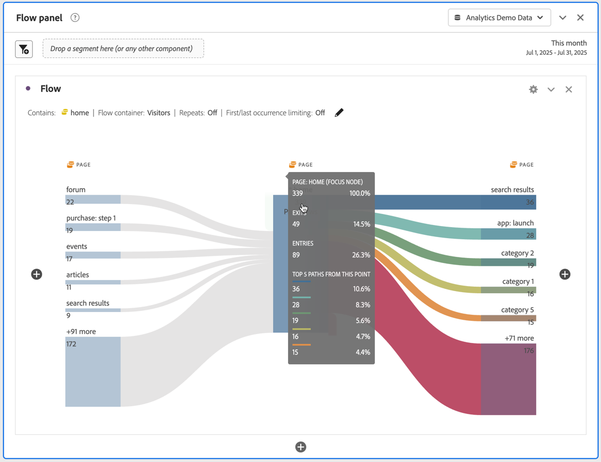

# 플로우 시각화 구성

업데이트된 플로우 시각화를 통해 웹 사이트 또는 앱의 특정 전환 이벤트에서 시작되거나 이어지는 여정을 이해할 수 있습니다. 차원(및 차원 항목) 또는 지표를 통해 경로를 추적합니다. 플로우를 사용하면 관심 있는 경로의 시작 또는 끝을 구성하거나 차원 또는 차원 항목을 통과하는 모든 경로를 분석할 수 있습니다.

새로운 [!UICONTROL 플로우] 경험은 여러 가지 방법으로 워크플로를 향상시킵니다.

* 이제 지표와 경로 지정 차원의 조합으로 경로를 시작하거나 종료하도록 선택할 수 있습니다.
* [!UICONTROL 플로우]를 추가로 사용자 정의할 수 있는 [!UICONTROL 고급 설정]이 포함되어 있습니다.
* 새로운 &quot;빌드&quot; 단추를 사용하면 여정을 한 번에 모두 구성한 다음 쿼리하고 한 번에 여러 열과 노드를 자동으로 작성할 수 있어 분석 시간을 절약할 수 &#x200B; 있습니다.

## 구성 단계 {#configure}

1. 흐름 다이어그램 작성을 시작하려면 프로젝트에 빈 패널을 추가하고 왼쪽 레일에서 시각화 아이콘을 클릭합니다. 그런 다음 플로우 시각화를 패널로 드래그합니다. 또는 [!UICONTROL 플로우] 시각화를 기존 프로젝트로 드래그합니다.

1. 다음 세 가지 옵션 중 하나를 사용하여 플로우 시각화를 고정합니다.

   * [!UICONTROL 다음으로 시작] (지표, 차원 또는 항목)
   * [!UICONTROL 포함] (차원 또는 항목)
   * [!UICONTROL 다음으로 끝남] (지표, 차원 또는 항목)

   이러한 각각의 범주는 화면에 &quot;놓기 영역&quot;으로 표시됩니다. 세 가지 방법으로 놓기 영역을 채울 수 있습니다.

   * 드롭다운 메뉴를 사용하여 지표 또는 차원을 선택합니다.
   * 차원 또는 지표 목록에서 항목을 드래그합니다.
   * 검색 을 사용하여 찾고 있는 차원 또는 지표를 찾습니다.

   예를 들어 체크아웃 이벤트로 이어지는 모든 항목을 추적한다고 가정합시다. 체크아웃 관련 차원 또는 지표(예: [!UICONTROL 주문 있음])를 **[!UICONTROL 다음으로 끝남]** 놓기 영역으로 끌 수 있습니다.

1. 지표를 선택하는 경우 여기에 표시된 대로 경로를 생성하는 데 사용할 [!UICONTROL 경로 지정 차원]도 제공해야 합니다. 기본값은 [!UICONTROL 페이지]입니다.

   

   >[!IMPORTANT]
   >
   >계산된 지표를 **[!UICONTROL 다음으로 시작]** 또는 **[!UICONTROL 다음으로 끝남]** 놓기 영역에 놓을 수 없습니다.

1. (선택 사항) **[!UICONTROL 고급 설정 표시]**&#x200B;를 클릭하여 고급 설정을 구성합니다.

   

   | 설정 | 설명 |
   | --- | --- |
   | **[!UICONTROL 줄 바꿈 레이블]** | 대개 흐름 요소의 레이블은 화면 공간을 절약하기 위해 잘리지만 이 상자를 선택하여 전체 레이블을 표시할 수 있습니다. 기본값 = 선택 해제. |
   | **[!UICONTROL 반복 인스턴스 포함]** | 플로우 시각화는 차원의 인스턴스를 기반으로 합니다. 이 설정은 반복된 인스턴스 (예: 페이지 다시 로드)를 포함하거나 제외하는 옵션을 제공합니다. 하지만 listVars, listProp, s.product, 머천다이징 eVar 등과 같이 여러 값을 갖는 차원을 포함하는 플로우 시각화에서는 반복을 제거할 수 없습니다. 기본값 = 선택 해제. |
   | **[!UICONTROL 처음/마지막 발생으로 제한]** | 차원/항목/지표의 처음/마지막 발생으로 시작/종료하는 경로로 경로를 제한합니다. 자세한 내용은 아래의 &quot;&#39;처음/마지막 발생으로 제한&#39;을 위한 예제 시나리오&quot; 섹션을 참조하십시오. |
   | **[!UICONTROL 열의 수]** | 플로우 다이어그램에 사용할 열 수를 결정합니다. |
   | **[!UICONTROL 열당 항목 확장됨]** | 각 열에 원하는 항목 수입니다. |
   | **[!UICONTROL 흐름 컨테이너]** | <ul><li>방문</li><li>방문자</li></ul> 방문과 방문자 간을 전환하여 방문자 이동 경로를 분석할 수 있도록 합니다. 이 설정은 방문들에 대해 방문자 수준에서 방문자 참여를 이해하거나 분석을 단일 방문으로 제한하는 데 도움이 됩니다. |

1. **[!UICONTROL 빌드]**&#x200B;를 클릭합니다.

## 흐름 출력 보기 및 변경 {#output}

플로우 구성의 요약이 다이어그램의 맨 위에 나타납니다. 다이어그램의 경로들은 비례합니다. 활동이 많은 경로일수록 더 두껍게 표시됩니다.

데이터를 추가 드릴다운하려면 다음과 같은 몇 가지 옵션이 있습니다.

* 흐름 다이어그램은 대화형입니다. 표시되는 세부 사항을 변경하려면 마우스를 다이어그램 위에 놓습니다.

* 다이어그램에 있는 노드를 클릭하면 해당 노드에 대한 세부 사항이 표시됩니다. 축소하려면 노드를 다시 클릭하십시오.

   

* 포함 및 제외, 기준 지정 등과 같은 특정 결과만 표시하도록 열을 필터링할 수 있습니다.

* 왼쪽의 더하기 기호(+)를 클릭하여 열을 확장합니다.

* 아래 설명된 마우스 오른쪽 버튼 클릭 옵션을 사용하여 출력을 추가로 사용자 정의합니다.

* 흐름을 추가로 편집하거나 다른 옵션으로 다시 빌드하려면 구성 요약 옆에 있는 연필 아이콘을 클릭합니다.

* **[!UICONTROL 프로젝트]** > **[!UICONTROL CSV 다운로드]**&#x200B;로 이동하여 프로젝트의 .CSV 파일의 일부로서 플로우 다이어그램을 내보내고 추가로 분석할 수도 있습니다.

## 필터링

각 열 위에 마우스를 가져다 대면 필터가 나타납니다. 필터를 클릭하면 현재 자유 형식 테이블에 있는 것과 동일한 필터 대화 상자가 나타납니다. 이 필터는 자유 형식 테이블과 동일하게 작동합니다.

* 고급 설정을 사용하여 연산자 목록에 특정 기준을 포함하거나 제외할 수 있습니다.
* 목록에서 항목을 필터링하면 해당 열에 필터링이 반영됩니다. (필터는 필터에서 허용된 항목만 표시하도록 줄이거나 필터에서 원하는 한 항목을 제외한 모든 항목을 제거합니다.
* 나머지 노드로 데이터가 유입되는 한 모든 다운스트림 및 업스트림 열은 지속되어야 합니다.
* 일단 적용되면 필터 아이콘이 필터링 중인 열 위에 파란색으로 표시됩니다.
* 필터를 제거하려면 필터 아이콘을 클릭하여 필터 메뉴를 엽니다. 적용된 필터를 제거한 다음 **[!UICONTROL 저장]**&#x200B;을 클릭합니다. 흐름은 필터링되지 않은 이전 상태로 돌아가야 합니다.

## 마우스 오른쪽 버튼 클릭 옵션 {#right-click}

| 옵션 | 설명 |
|--- |--- |
| [!UICONTROL 이 노드에 대한 포커스] | 포커스를 선택된 노드로 변경합니다. 흐름 다이어그램의 중앙에 포커스 노드가 표시됩니다. |
| [!UICONTROL 시작] | 새 흐름 다이어그램을 빌드할 수 있는 자유 형식 다이어그램 빌더로 돌아갑니다. |
| [!UICONTROL 흐름의 이 지점에서 세그먼트 만들기] | 세그먼트를 만듭니다. 새 세그먼트를 구성할 수 있는 세그먼트 빌더가 표시됩니다. |
| [!UICONTROL 분류] | 사용할 수 있는 차원, 지표 또는 시간으로 노드를 분석합니다. |
| [!UICONTROL 트렌드] | 노드에 대한 트렌드 다이어그램을 만듭니다. |
| [!UICONTROL 전체 열 확장] | 모든 노드를 표시하도록 열을 확장합니다. 기본적으로 상위 5개의 노드만 표시됩니다. |
| [!UICONTROL 전체 열 축소] | 열에 있는 모든 노드를 숨깁니다. |
| [!UICONTROL 항목 제외]/[!UICONTROL 제외된 항목 복원] | 열에서 특정 노드를 제거하고 열 맨 위에 필터로 자동으로 만듭니다. 제외된 항목을 복원하려면 다시 마우스 오른쪽 버튼으로 클릭하고 **[!UICONTROL 제외된 항목 복원]**&#x200B;을 선택합니다. 또한 열의 맨 위에 있는 필터를 열고 방금 제외한 항목이 있는 필박스를 제거할 수도 있습니다. |

## &#39;처음/마지막 발생으로 제한&#39;에 대한 예제 시나리오

이 옵션을 사용할 때는 다음 사항에 유의하십시오.

* **[!UICONTROL 처음/마지막 발생으로 제한]**&#x200B;은 시리즈의 처음/마지막 발생만 카운트합니다. **[!UICONTROL 다음으로 시작]** 또는 **[!UICONTROL 다음으로 끝남]** 기준의 다른 모든 발생은 삭제됩니다.
* **[!UICONTROL 다음으로 시작]** 흐름과 함께 사용할 경우, 시작 기준과 일치하는 첫 번째 발생만 포함됩니다.
* **[!UICONTROL 다음으로 끝남]** 흐름과 함께 사용할 경우, 종료 기준과 일치하는 마지막 발생만 포함됩니다.
* 사용된 시리즈는 컨테이너에 따라 다릅니다. **[!UICONTROL 방문]** 컨테이너를 사용하는 경우 일련의 히트 수가 세션이 됩니다. **[!UICONTROL 방문자]** 컨테이너를 사용하는 경우, 일련의 히트 수는 제공된 날짜 범위에서 지정된 사용자의 모든 히트 수가 됩니다.
* 다음 **[!UICONTROL 첫 번째/마지막 항목으로 제한]** &quot;다음으로 시작&quot; 또는 &quot;다음으로 끝남&quot; 필드에서 지표 또는 Dimension 항목을 사용할 때 고급 설정에서 옵션을 구성할 수 있습니다.

히트 시리즈의 예:

홈 > 제품 > 장바구니에 추가 > 제품 > 장바구니에 추가 > 청구 > 주문 확인

### 다음 설정을 사용하여 흐름 분석을 고려하십시오.

* [!UICONTROL 장바구니에 추가] (차원 항목)로 시작
* [!UICONTROL 페이지] 경로 지정 차원
* [!UICONTROL 방문] 컨테이너

If **[!UICONTROL 첫 번째/마지막 항목으로 제한]** is *비활성화됨*를 검색하는 경우, 이 단일 히트 시리즈는 &quot;장바구니에 추가&quot;의 2개를 계산합니다.
예상 흐름 출력: &quot;장바구니에 추가&quot; (2) —> &quot;Products&quot; (1) -> &quot;Billing&quot; (1)

그러나, **[!UICONTROL 첫 번째/마지막 항목으로 제한]** is *활성화됨*, 분석에 &quot;장바구니에 추가&quot;의 첫 번째 발생 항목만 포함됩니다.
예상 흐름 출력: &quot;장바구니에 추가&quot; (1) —> &quot;Products&quot; (1)

### 동일한 일련의 히트 수를 고려하되 다음 설정을 사용하십시오.

* [!UICONTROL 장바구니에 추가] (차원 항목)로 끝남
* [!UICONTROL 페이지] 경로 지정 차원
* [!UICONTROL 방문] 컨테이너

If **[!UICONTROL 첫 번째/마지막 항목으로 제한]** is *비활성화됨*를 검색하는 경우, 이 일련의 단일 히트는 &quot;장바구니에 추가&quot;의 2개 항목을 계산합니다.
예상 흐름 출력: &quot;Products&quot; (2) &lt;— &quot;Add to cart&quot; (2)

그러나 **[!UICONTROL 처음/마지막 발생으로 제한]**&#x200B;이 *활성화된* 경우 [!UICONTROL 장바구니에 추가]의 마지막 발생만 분석에 포함됩니다.
예상 흐름 출력: &quot;Products&quot; (1) &lt;— &quot;Add to cart&quot; (1)
