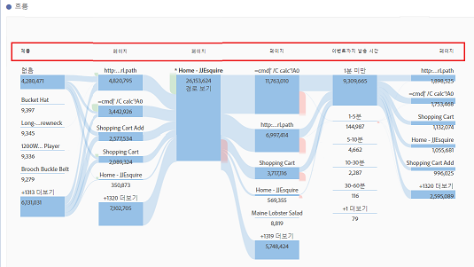

# 차원 간 흐름

차원 간 흐름을 이용하면 다양한 차원에 걸친 사용자 경로를 검사할 수 있습니다. 

각 흐름 열의 맨 위에 있는 차원 레이블은 흐름 시각화에서 여러 차원을 더 직관적으로 사용합니다.

앱 사용 사례와 웹 사용 사례, 이렇게 두 가지 사용 사례를 살펴보겠습니다. 

## Use case one: app {#section_3D31D37B9C9F4134AE46C96291E41294}

맨 위의 반환되는 항목이 [!UICONTROL ItemAdded]인 [!UICONTROL 동작 이름] 차원이 흐름에 추가되었습니다. 

이 앱에서 화면/페이지와 동작 간 상호 작용을 탐색하기 위해, 탐색하려는 내용에 따라 페이지 차원을 여러 위치에 드래그할 수 있습니다. 

* 놓기 영역(테두리가 검은색으로 표시된 직사각형 영역 내부가 나타나면 그 내부)의 한 쪽 끝으로 드래그하여 끝에 있는 상위 결과를 **대체**&#x200B;합니다. 

    

* 끝에 있는 공백(검은색 대괄호 참조)으로 드래그하여 시각화에 **추가**&#x200B;합니다. 

   

다음은 오른쪽 열의 ItemScaled 항목을 페이지 차원으로 바꾸도록 선택하는 경우의 결과입니다. 이제 맨 위의 결과가 페이지 차원에 대한 맨 위 결과로 변경됩니다. 

이제 고객이 동작과 페이지 간을 어떻게 이동하는지 볼 수 있습니다. 다른 노드를 클릭하여 흐름을 더 탐색할 수 있습니다. 

다른 동작 이름 차원을 시각화의 끝에 추가하는 경우 다음의 결과가 나옵니다. 

이렇게 되면 분석 중인 앱에 대해 깊이 있게 이해하고 변경이 가능해집니다.

## Use case two: web {#section_8D55983FA0C84926995270052AE01CD8}

이 사용 사례에서는 대부분의 항목을 웹 사이트로 연결하는 캠페인을 분석할 수 있는 방법을 보여 줍니다. 

캠페인 이름 차원을 새 흐름에 드래그합니다. 

이제 해당 캠페인이 트래픽을 유도하는 페이지를 확인하려 하므로, 페이지 차원을 시각화에 추가할 흐름 결과의 오른쪽으로 드래그합니다. 

그런 다음, 수입, 방문 횟수 등, 다른 차원이나 지표를 사용하여 결과를 분류할 수 있습니다. 
