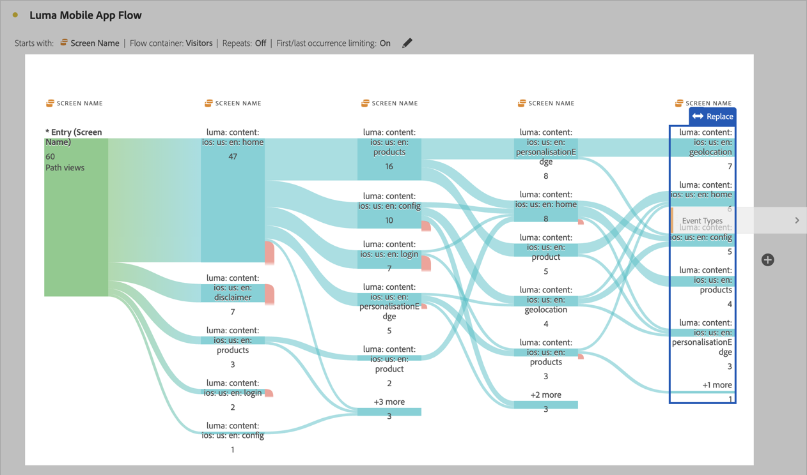

# 차원 간 흐름

차원 간 흐름을 이용하면 다양한 차원에 걸친 사용자 경로를 검사할 수 있습니다.

>[!BEGINSHADEBOX]

데모 비디오를 보려면  [차원 간 흐름](https://video.tv.adobe.com/v/24041?quality=12&learn=on){target="_blank"}을 확인하십시오.

>[!ENDSHADEBOX]

이 문서에서는 모바일 앱 상호작용 및 이벤트 사용 사례에서 이 흐름을 사용하는 방법과 캠페인이 웹 방문을 유도하는 방법을 보여 줍니다.

## 모바일 앱 상호작용 및 이벤트

이 예제 흐름에서는 사용자가 앱의 다양한 화면(장면)을 어떻게 사용하는지 확인하기 위해 [!UICONTROL 화면 이름] 차원을 사용합니다. 반환된 상단 화면은 **[!UICONTROL luma: content: ios: en: home]**&#x200B;로, 앱의 홈 페이지입니다.

이 앱에서 화면과 이벤트 유형(예: 장바구니에 추가, 구매 등) 간의 상호 작용을 탐색하려면 **[!UICONTROL 이벤트 유형]** 차원을 끌어다 놓습니다.

* 흐름에서 사용 가능한 단계 위에 해당 차원을 대체하려면 다음을 수행합니다.

  

* 현재 흐름 시각화 외부에서 차원을 추가하려면 다음을 수행합니다.

  

아래의 흐름 시각화는 **[!UICONTROL 이벤트 유형]** 차원을 추가한 결과를 보여 줍니다. 시각화는 모바일 앱 사용자가 장바구니에 제품을 추가하거나 애플리케이션을 종료하고 오퍼를 제시받기 전에 앱의 다양한 화면을 어떻게 이동하는지에 대한 인사이트를 제공합니다.

## 캠페인이 웹 방문을 유도하는 방법

어떤 캠페인이 웹 사이트 방문을 유도하는지 분석하려고 합니다. **[!UICONTROL 캠페인 이름]**&#x200B;을 차원으로 사용하여 플로우 시각화를 만듭니다.

마지막 **[!UICONTROL 캠페인 이름]** 차원을 **[!UICONTROL 서식이 지정된 페이지 이름]** 차원으로 교체하고 플로우 시각화의 마지막에 다른 **[!UICONTROL 서식이 지정된 페이지 이름]** 차원을 추가합니다.

자세한 내용을 보려면 흐름 위에 마우스를 가져다 댑니다. 예를 들어 어떤 캠페인이 장바구니 결제로 이어졌는지 확인합니다.

