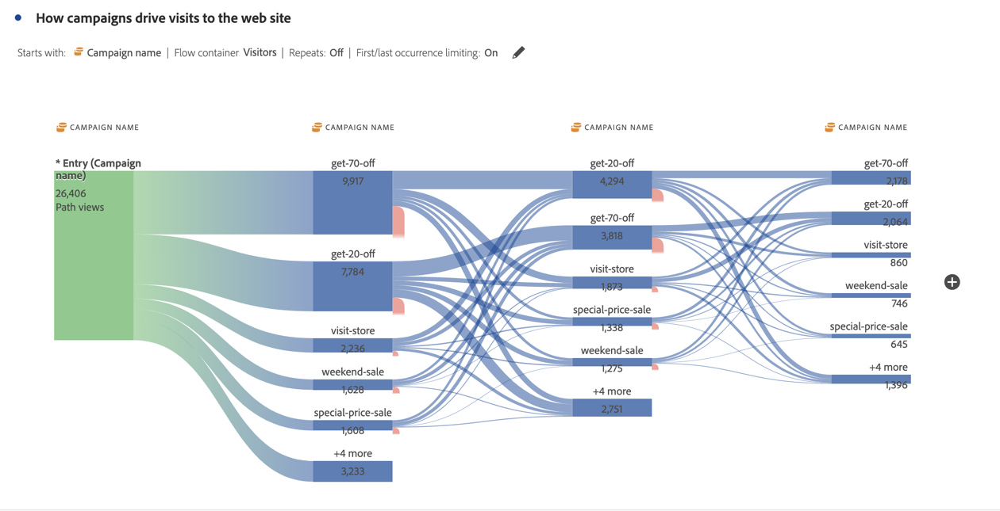
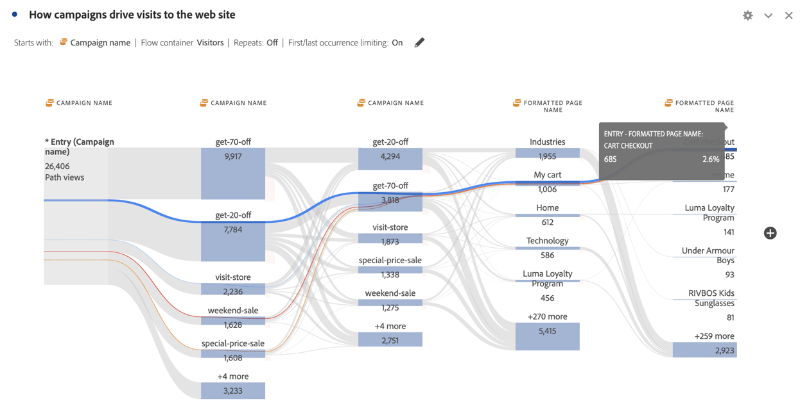

# 차원 간 흐름

차원 간 흐름을 이용하면 다양한 차원에 걸친 사용자 경로를 검사할 수 있습니다.

>[!BEGINSHADEBOX]

데모 비디오가 필요하면  [차원 간 흐름](https://video.tv.adobe.com/v/24041?quality=12&learn=on){target="_blank"}을 참조하세요.

>[!ENDSHADEBOX]

이 문서에서는 모바일 앱 상호 작용 및 이벤트와 같은 두 가지 사용 사례에 대해 이 플로우를 사용하는 방법과 캠페인으로 웹 방문을 추진하는 방법을 보여 줍니다.

## 모바일 앱 상호 작용 및 이벤트

[!UICONTROL 화면 이름] 차원은 사용자가 앱의 다양한 화면(장면)을 사용하는 방법을 확인하기 위해 이 예제 흐름에서 사용됩니다. 반환된 상단 화면은 앱의 홈 페이지인 **[!UICONTROL luma: content: ios: en: home]**&#x200B;입니다.

이 앱에서 화면과 이벤트 유형(장바구니에 추가, 구매 등) 간의 상호 작용을 탐색하려면 **[!UICONTROL 이벤트 유형]** 차원을 끌어서 놓습니다.

* 플로우에서 사용 가능한 단계 위에 해당 차원을 바꾸려면 다음을 수행합니다.

  

* 현재 플로우 시각화 외부에서 차원을 추가하려면:

  

아래 흐름 시각화는 **[!UICONTROL 이벤트 유형]** 차원을 추가한 결과를 보여 줍니다. 시각화는 장바구니에 제품을 추가하거나, 애플리케이션을 닫거나, 오퍼를 표시하기 전에 모바일 앱 사용자가 앱의 다양한 화면을 통해 이동하는 방법에 대한 통찰력을 제공합니다.

## 캠페인이 웹 방문을 유도하는 방법

웹 사이트 방문을 유도하는 캠페인을 분석하려고 합니다. **[!UICONTROL 캠페인 이름]**&#x200B;을(를) 차원으로 하는 플로우 시각화를 만듭니다.

마지막 **[!UICONTROL 캠페인 이름]** 차원을 **[!UICONTROL 서식이 지정된 페이지 이름]** 차원으로 바꾸고 흐름 시각화 끝에 다른 **[!UICONTROL 서식이 지정된 페이지 이름]** 차원을 추가합니다.

플로우 위로 마우스를 가져가면 자세한 내용을 볼 수 있습니다. 예를 들어 어떤 캠페인으로 인해 장바구니 체크아웃이 발생했는지 등을 확인할 수 있습니다.

