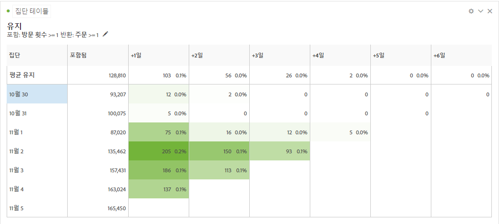
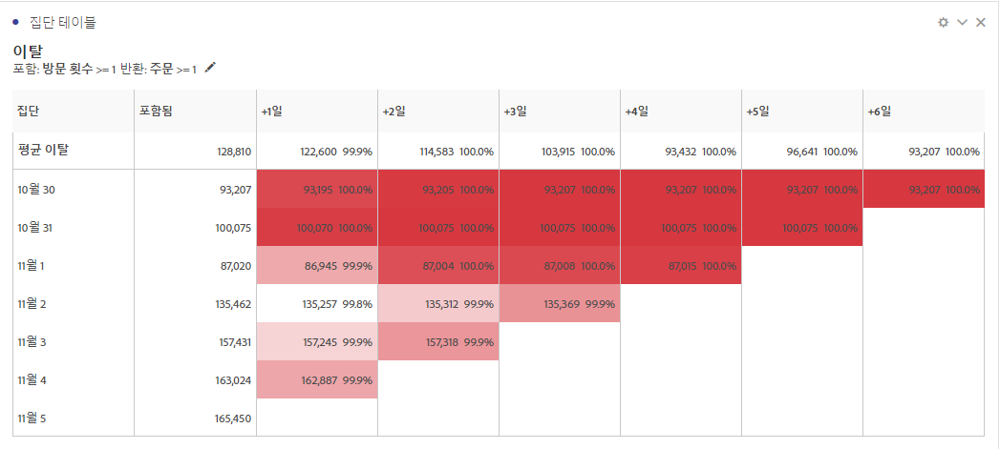
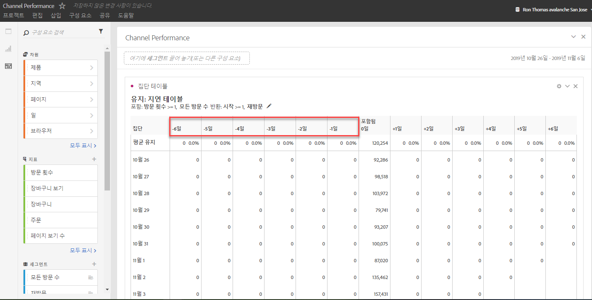
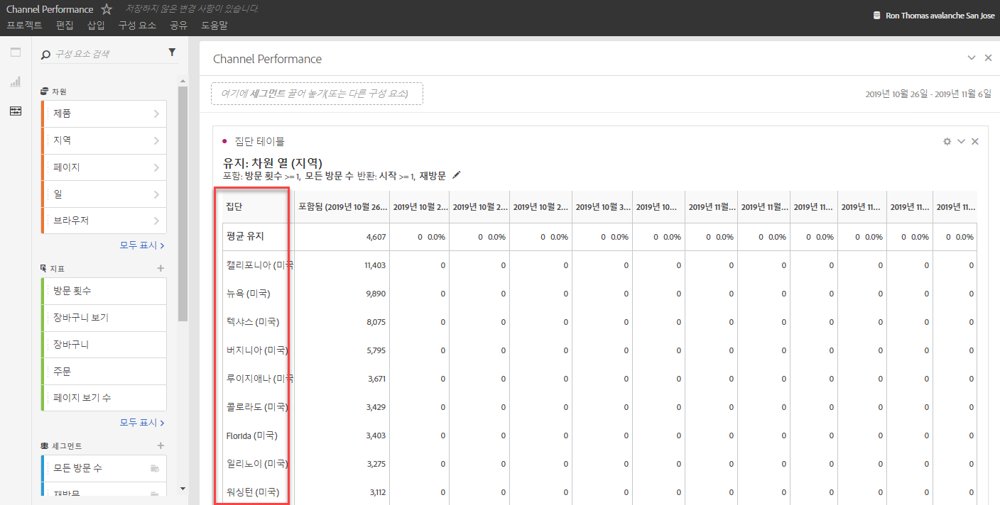

# 집단 분석이란?

A *`cohort`* is a group of people sharing common characteristics over a specified period. 집단 분석은 예를 들어, 집단이 브랜드에 참여하는 방법을 알고 싶을 때 유용합니다. 트렌드 변경 사항을 쉽게 찾아 응답할 수 있습니다. (Explanations of Cohort Analysis are available on the web, such as at [Cohort Analysis 101](https://en.wikipedia.org/wiki/Cohort_analysis).)

집단 보고서를 만들면 그 구성 요소(특정 차원, 지표 및 세그먼트)를 조정한 다음, 모든 사람과 집단 보고서를 공유할 수 있습니다. 조정 [및 공유를 참조하십시오](../../../../analyze/analysis-workspace/curate-share/curate.md#concept_4A9726927E7C44AFA260E2BB2721AFC6).

집단 분석으로 수행할 수 있는 작업의 예:

* 원하는 작업에 박차를 가할 수 있도록 설계된 캠페인 시작.
* 고객 라이프사이클에서 적시에 마케팅 예산 전환.
* 평가판이나 오퍼를 종료하여 가치를 극대화할 시점 인식.
* 가격 책정, 업그레이드 경로 등과 같은 분야에서 A/B 테스트를 하기 위한 아이디어 얻기.
* 안내가 있는 분석 보고서 내에서 집단 분석 보고서 보기.
* 평가판이나 오퍼를 종료하여 가치를 극대화할 시점 인식.
* 가격 책정, 업그레이드 경로 등과 같은 분야에서 A/B 테스트를 하기 위한 아이디어 얻기.

집단 분석은 Analysis Workspace에 대한 액세스 권한이 있는 모든 Analytics 고객에 대해 사용할 수 있습니다.

[YouTube의 집단](https://www.youtube.com/watch?v=kqOIYrvV-co&index=45&list=PL2tCx83mn7GuNnQdYGOtlyCu0V5mEZ8sS) 분석(4:36)

>[!IMPORTANT]
>
>집단 분석은 계산된 지표를 지원하지 않습니다.

## 집단 분석 기능

In January 2019, Adobe released a new and significantly enhanced version of Cohort Analysis. 이 버전은 사용자가 구축하는 집단에 대한 미세한 조정이 가능합니다. 다음과 같은 향상된 기능을 제공합니다.

### 유지 테이블

유지 보고서:각 데이터 셀에는 해당 기간 동안 작업을 수행한 집단에 있는 방문자의 원시 수와 비율이 표시됩니다. 최대 3개의 지표와 10개의 세그먼트를 포함할 수 있습니다.

### 이탈 테이블

이탈률(Churn) 코트는 보존 테이블의 역이며 시간이 지남에 따라 그룹에 대한 반환 기준을 충족하거나 충족하지 못한 방문자를 보여줍니다. 최대 3개의 지표와 10개의 세그먼트를 포함할 수 있습니다.

### 롤링 계산

포함된 열이 아니라 이전 열에 따라 유지 또는 이탈을 계산할 수 있습니다.

### 지연 테이블

포함 이벤트가 발생한 이전 및 이후에 경과한 시간을 측정합니다. 이것은 이전/이후 분석을 위한 훌륭한 도구입니다. "포함" 열은 테이블의 중앙에 있으며 포함 이벤트 전후의 기간이 양쪽에 표시됩니다.

### 사용자 정의 차원 집단

기본값인 시간 기반 집단이 아닌 선택된 차원에 따라 집단을 생성합니다. 마케팅 채널, 캠페인, 제품, 페이지, 영역 또는 Adobe Analytics의 다른 차원과 같은 차원을 사용하여 차원의 다양한 값을 기준으로 유지 변경 방법을 보여 줍니다.

집단 보고서를 설정하고 실행하는 방법에 대한 지침을 확인하려면 [집단 분석 보고서 구성](/help/analyze/analysis-workspace/visualizations/cohort-table/t-cohort.md).

