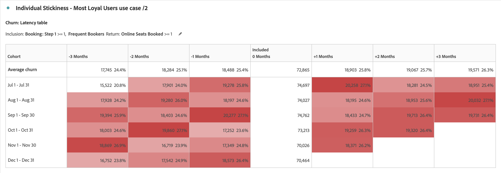

# 코호트 분석 사용 사례

이 문서에서는 집단 테이블 이 다음 작업을 수행하는 데 유용한 통찰력을 제공하는 데 유용한 몇 가지 일반적인 사용 사례에 대해 설명합니다.

## 앱 참여

앱을 설치하는 사용자가 시간에 따라 앱에 어떻게 참여하는지를 분석하려 한다고 가정해 봅시다. 사용자가 앱을 설치하고 이후에 앱을 사용하지 않습니까? 또는 앱을 잠시 사용한 다음 앱 사용을 중지합니까? 또는 사용자가 시간이 지나도 계속 참여합니까?

6개월 집단 분석을 만들 수 있습니다. 세션이 있거나 앱을 시작하지 않은 경우 다음 달에는 방문자가 *`engaged`*(으)로 계산되지 않습니다. 그러면 [!UICONTROL 코호트 분석]에서는 *`App Install`*&#x200B;이 항상 0번째 달에 발생하는 사용의 패턴을 보여 줍니다. 사용자가 앱을 설치한 시기에 관계없이 2번째 달에는 사용량 감소가 나타날 수 있습니다. 이 분석을 사용하면 앱을 설치한 후 두 번째 달 동안 모든 사용자에게 앱을 사용하도록 알리는 이메일 또는 푸시 메시지를 보낼 수 있습니다.

+++ 집단 테이블 시각화 예

+++

## 구독

Adobe.com에서 일하고 무료 Creative Cloud 구독을 제공합니다. 목표는 사용자가 무료 버전을 30일 체험판이나, (궁극적으로) 유료 버전으로 업그레이드하는 것입니다.

예를 들어 무료 Creative Cloud 사용자의 8%-10% 가량이 설치한 시기에 상관없이 설치 후 첫 번째 달에 업그레이드함을 이해하려면 [!UICONTROL 집단 분석]을 사용하십시오. 그런 다음 두 번째 사용 달에 12-15% 업그레이드합니다. 그 후에는 업그레이드가 크게 떨어져서 세 번째 달에는 4-5%, 네 번째 달에는 3-4%, 다섯 번째 달에는 1-2%가 됩니다.

3번째 달에는 잠재 고객을 잃고 싶지 않다는 점을 인식하여 3번째 달 중순에 사용자 샘플로 이동하도록 설계된 이메일 캠페인을 설정했습니다. 해당 캠페인에서는 아직 업그레이드하지 않은 사용자에게 50달러 쿠폰을 제공합니다.

몇 달 후 집단 분석으로 다시 확인하십시오. 캠페인 출시 후 형성된 코호트의 경우 3개월 내 유료 Creative Cloud 가입으로 전환율이 4∼5%에서 13∼14%로 상승했다. 전환은 해당 시점부터 3개월에 도달하는 매달 집단에 대해 코호트당 수십만 달러를 초래합니다.

+++ 집단 테이블 시각화 예

+++

## 복잡한 집단 세그먼트

프로모션을 위해 여러 고객 그룹을 타겟팅하는 주요 호텔 체인에 대해 분석을 수행하고 성과에 대해 고객 그룹을 추적합니다. 타겟팅할 사용자 집단의 최상의 그룹을 식별하려면 매우 구체적인 집단 그룹을 생성해야 합니다. [!UICONTROL 집단] 테이블 내에서 증강된 [!UICONTROL 포함] 및 [!UICONTROL 반환] 기준을 사용하여 여러 지표와 세그먼트가 있는 올바른 집단을 정의합니다. 이 분석을 통해 성과가 부진한 고객 그룹을 식별하여 판촉 행사 및 거래를 타깃팅하여 예약을 늘릴 수 있습니다.

+++ 집단 테이블 시각화 예

+++

## 앱 버전 채택

모바일 앱을 통해 고객 참여를 유도하는 대형 보험 회사의 분석가입니다. 새로운 기능이 앱에 추가되면 고객은 최신 앱 버전으로 업그레이드해야 합니다. [!UICONTROL 사용자 지정 Dimension] 집단을 사용하여 앱 버전을 함께 분석 및 비교하여 고객이 어떤 앱 버전을 대상으로 하는지 확인할 수 있습니다. 또한 유지 및 이탈을 추적하여 특정 앱 버전이 고객의 시간 경과에 따른 앱 사용을 어렵게 하는지 확인할 수 있습니다. 모바일 메시징을 통해 이러한 사용자와 다시 연결할 수 있으므로 사용자는 최신 버전으로 업그레이드하여 최신 기능을 활용할 수 있습니다.

+++ 집단 테이블 시각화 예

+++

## 캠페인 고착성

타겟팅 캠페인을 사용하여 사용자를 다양한 플랫폼으로 유도하여 참여를 유도하는 다국적 미디어 회사의 분석가입니다. 플랫폼당 광고 지출은 고객 참여 및 유지에 따라 결정됩니다. 성공적인 캠페인은 비즈니스의 성공에 매우 중요합니다. [!UICONTROL 집단] 테이블의 새로운 [!UICONTROL 사용자 지정 Dimension] 집단 기능을 사용하여 다양한 캠페인을 나란히 비교하면서 사용자 확보 및 유지에 가장 효과적인 캠페인이 무엇인지 파악하여 참여를 늘릴 수 있습니다. 그런 다음 어떤 측면이 캠페인의 성공에 기여하는지 식별하고 해당 지식을 다른 캠페인에 적용하여 다양한 플랫폼 전반에서 참여를 높일 수 있습니다.

+++ 집단 테이블 시각화 예

+++

## 제품 출시

매출 비중이 큰 특정 고객 부문이 많은 대형 의류 retailer의 분석가입니다. 각 세그먼트에는 해당 세그먼트를 염두에 두고 설계 및 제작된 특정 제품이 있습니다. 각 제품 출시를 통해 새로운 제품이 시간이 지남에 따라 다양한 집단에 대한 판매를 어떻게 증가시켰는지 알아보십시오. [!UICONTROL 집단 분석]의 새로운 [!UICONTROL 지연 테이블] 설정을 사용하여 주어진 고객군의 출시 전 및 출시 이후 행동과 수익을 분석할 수 있습니다. 이 정보를 사용하여 어떤 제품이 새로운 매출을 주도하고 있으며 어떤 제품이 고객에게 관심을 끌지 못하는지 파악할 수 있습니다.

+++ 집단 테이블 시각화 예

+++

## 개인의 고착성 - 가장 충성스러운 사용자

당신은 그들의 성공과 수익의 대부분을 반복 및 단골 고객으로부터 도출하는 주요 항공사의 분석가입니다. 대부분의 경우 단골 여행객이 매출의 대부분을 차지하며 이러한 고객은 장기적인 성공에 중요합니다. 가장 충성스럽고 일관된 고객을 파악하는 것은 종종 어려울 수 있습니다. 그러나 [!UICONTROL 집단 분석]에서 새로운 [!UICONTROL 순환 계산] 설정을 사용하면 단골 고객군을 분석하고 시간이 경과하면서 어떤 여행객이 구매를 반복하는지 확인할 수 있습니다. 그런 다음 이러한 여행객을 대상으로 충성도에 대한 보상과 혜택을 제공할 수 있습니다. 또한 집단 유형을 보존에서 이탈로 전환하면 시간이 경과하면서 어떤 고객이 반복 구매자가 되지 않았는지도 식별할 수 있습니다. 그런 다음 이러한 고객이 향후에도 충성심을 유지할 수 있도록 이러한 고객을 다시 참여시키기 위한 프로모션으로 이러한 세그먼트를 타겟팅할 수 있습니다.

+++ 집단 테이블 시각화 예

+++
