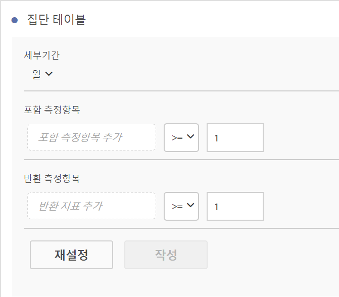
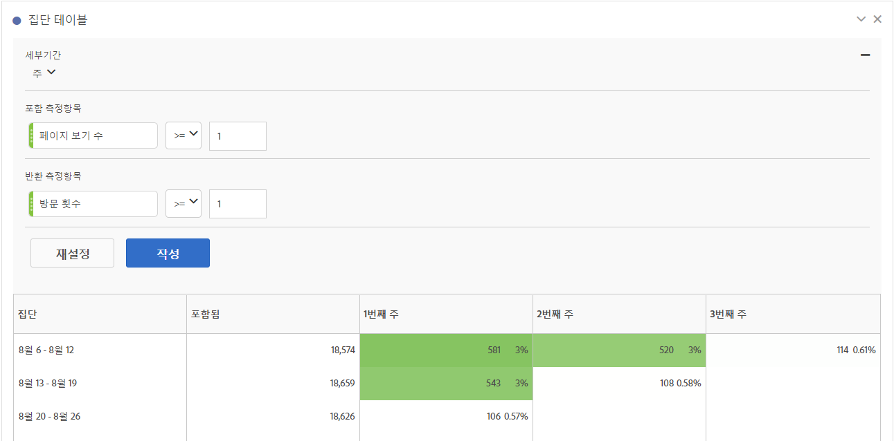

# 집단 분석 보고서 구성

분석 작업 공간에서 집단을 만들고 집단 분석 보고서를 실행합니다.

1. In Analysis Workspace, click the **[!UICONTROL Visualizations]** icon in the left rail and drag a **[!UICONTROL Cohort Table]** to the canvas.

   

1. Define the **[!UICONTROL Inclusion Criteria]**, **[!UICONTROL Return Criteria]**, **[!UICONTROL Cohort Type]**, and **[!UICONTROL Settings]** as defined in the table below.

| 요소 | 설명 |
|--- |--- |
| **[!UICONTROL 포함 기준]** | 최대 10개의 포함 세그먼트와 3개의 포함 지표를 적용할 수 있습니다. 이 지표는 사용자가 집단에 포함되는 위치를 지정합니다. 예를 들어, 포함 지표가 [주문]이면, 집단 분석의 시간 범위 동안 주한 사용자는 초기 집단에 포함됩니다. 지표 간의 기본 연산자는 AND이지만 OR로 변경할 수 있습니다. 또한 이러한 지표에 숫자 필터링을 추가할 수 있습니다. 예를 들어, "방문수 &gt;= 1"입니다.  |
| **[!UICONTROL 반환 기준]** | 최대 10개의 반환 세그먼트와 3개의 반환 지표를 적용할 수 있습니다. 지표는 사용자의 유지 또는 이탈 여부를 표시합니다. 예를 들어, 반환 지표가 [비디오 보기 횟수]일 경우, 그 다음 기간 동안 비디오를 본 사용자만(집단에 추가된 기간 후) [보존]으로 표현됩니다. 보존을 수량화하는 다른 지표는 [방문 횟수]입니다. |
| **[!UICONTROL 세부기간]** | 시간 세부기간 [일], [주], [월], [분기] 또는 [년]입니다. |
| **[!UICONTROL 유형]** | ****&#x200B;유지(기본값): 유지 집단은 방문자 집단이 시간이 지남에 따라 사용자의 자산으로 어떻게 반환되는지 측정합니다. 이것은 당사가 항상 보유하고 있는 표준 집단이며 사용자 행동의 반환과 반복을 나타냅니다. 유지 집단은 테이블에서 녹색으로 표시됩니다. **[!UICONTROL 이탈률]**:이탈률(예: "감소" 또는 "폴아웃") 코호트는 방문자 그룹이 시간 경과에 따라 자산에서 이탈하는 방식을 측정합니다. 이탈 = 1 - 유지입니다. 이탈은 고객이 다시 돌아오지 않는 빈도를 제시하여 기회와 고착성을 측정하는 좋은 방법입니다. You can use churn to analyze and identify areas of focus: which cohort segments could use some attention. A Churn Cohort is indicated by the color red in the table (similar to fallout in our **[!UICONTROL Flow]** visualization).  |
| **[!UICONTROL 설정]** | **[!UICONTROL 롤링 계산]**: 포함된 열(기본값)이 아닌 이전 열을 기준으로 보존 또는 이탈을 계산합니다. 롤링 계산은 "반환" 기간에 대한 계산 방법을 변경합니다. 일반적인 계산은 이전 기간 동안 해당 집단에 있었는지 여부에 관계없이 "반환" 기준을 충족하고 포함 기간에 해당하는 사용자를 개별적으로 찾습니다. 대신 롤링 계산은 "반환" 기준을 충족하고 이전 기간에 포함되었던 사용자를 찾습니다. 따라서 롤링 계산은 시간의 경과에 따라 "반환" 기준을 지속적으로 충족하는 사용자를 필터링합니다. 선택한 기간까지 이어지는 각 기간에 대해 반환 기준이 적용됩니다.   **[!UICONTROL 지연 테이블]**: 지연 테이블은 포함 이벤트가 발생한 이전 및 이후에 경과한 시간을 측정합니다. 지연은 이전/이후 분석 시 유용한 도구입니다. 예를 들어 출시 예정된 제품이나 캠페인 실행이 있으며, 출시 이전 행동과 출시 이후 수행 방법을 추적하려는 경우, 지연 테이블은 이전/이후 행동을 나란히 표시하여 직접적인 영향을 파악할 수 있습니다. 지연 테이블의 사전 포함 셀은 포함 기간의 "포함" 기준을 충족한 사용자를 계산한 다음 포함 기간 이전 기간의 "반환" 기준을 충족하는 사용자를 계산합니다. 지연 테이블 및 사용자 정의 차원 집단은 함께 사용할 수 없습니다.  **[!UICONTROL 사용자 정의 차원 집단]**: 시간 기반 집단(기본값)이 아니라 선택한 차원을 기반으로 그룹을 생성합니다. 많은 고객이 시간 이외의 다른 항목으로 집단을 분석하기를 원하며 새로운 사용자 정의 차원 집단 기능은 자신이 선택한 차원을 기준으로 집단을 구축할 수 있는 유연성을 제공합니다. 마케팅 채널, 캠페인, 제품, 페이지, 영역 또는 Adobe Analytics의 다른 차원과 같은 차원을 사용하여 차원의 다양한 값을 기준으로 유지 변경 방법을 보여 줍니다. 사용자 지정 집단 차원 세그먼트 정의는 반환 정의의 일부가 아니라 포함 기간의 일부로 차원 항목만 적용합니다.  사용자 정의 차원 집단 옵션을 선택한 후 원하는 영역으로 차원을 끌어다 놓을 수 있습니다. 이를 통해 동일한 기간에 유사한 차원 항목을 비교할 수 있습니다. 예를 들어 도시의 성능, 상품, 캠페인 등을 나란히 비교할 수 있으며 이때 상위 14개의 차원 항목을 반환합니다. 그러나 필터(끌어다 놓은 차원의 오른쪽으로 마우스를 가져가면 액세스할 수 있음)를 사용하여 원하는 차원 항목만 표시할 수 있습니다. 사용자 정의 차원 집단은 지연 테이블 기능과 함께 사용할 수 없습니다.  |

1. Adjust the **[!UICONTROL Cohort Table Settings]** by clicking the gear icon.

| Setting | Description |
| Only show percent | Removes the number value and only shows the percentage. || 가장 가까운 합계에 대한 반올림 퍼센트| 백분율 값을 십진수 값을 표시하지 않고 가장 가까운 정수로 반올림합니다. || 평균 행 표시| 표의 맨 위에 새 행을 삽입한 다음 각 열 내의 값에 대한 평균을 추가합니다. |

## 집단 분석 보고서 작성

1. **[!UICONTROL 작성을 클릭합니다]**.

   

   이 보고서는 주문( *`Included`* 열)을 수행한 방문자와 이후 방문 시 사이트로 돌아온 방문자를 보여줍니다. 시간이 지나면서 방문 횟수가 감소하면 문제를 발견하고 조치를 취할 수 있습니다.
1. (선택 사항) 선택 내용에서 세그먼트를 만듭니다.

   셀들(연속 또는 불연속)을 선택한 다음, 마우스 오른쪽 단추를 클릭 &gt; **[!UICONTROL 선택 항목으로 세그먼트 만들기를 클릭합니다]**.

1. In the [Segment Builder](https://marketing.adobe.com/resources/help/en_US/analytics/segment/seg_build.html), further edit the segment, then click **[!UICONTROL Save]**.

   저장된 세그먼트는 Analysis Workspace의 [!UICONTROL 세그먼트] 패널에서 사용할 수 있습니다.
1. 집단 프로젝트에 이름을 지정하고 저장합니다.
1. (Optional) [Curate and share](../../../../analyze/analysis-workspace/curate-share/curate.md#concept_4A9726927E7C44AFA260E2BB2721AFC6) the project components.

   >[!NOTE]
   >
   >You must save your project before curation is available.

