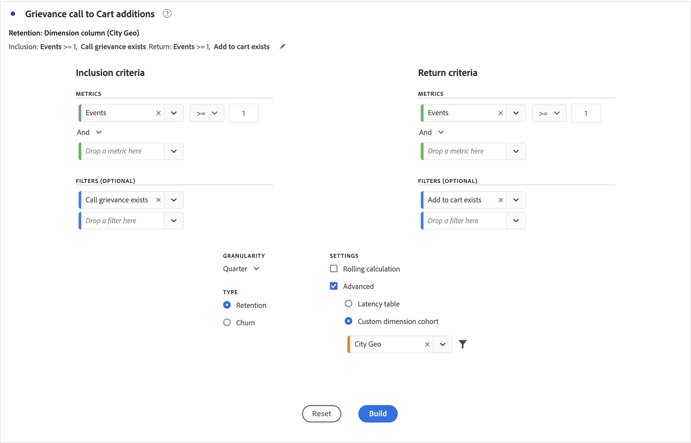

# 집단 테이블 구성

[!UICONTROL 집단 테이블]을 만들고 구성하려면:

1.  **[!UICONTROL 집단 테이블]** 시각화를 추가합니다. [패널에 시각화 추가](../freeform-analysis-visualizations.md#add-visualizations-to-a-panel)를 참조하십시오.

1. 아래 테이블에 정의된 대로 **[!UICONTROL 포함 기준]**, **[!UICONTROL 반환 기준]**, **[!UICONTROL 집단 유형]** 및 **[!UICONTROL 설정]**&#x200B;을 정의합니다.

   

   | 요소 | 설명 |
   |--- |--- |
   | **[!UICONTROL 포함 기준]** | 최대 10개의 포함 필터와 최대 3개의 포함 지표를 적용할 수 있습니다. 지표는 사용자가 속한 집단을 지정합니다. 예를 들어 포함 지표가 주문이면, 집단 분석의 시간 범위 동안 주한 사용자는 초기 집단에 포함됩니다. 지표 간의 기본 연산자는 AND이지만 OR로 변경할 수 있습니다. 또한 이러한 지표에 숫자 필터링을 추가할 수 있습니다. 예: `Sessions >= 1`.  |
   | **[!UICONTROL 반환 기준]** | 최대 10개의 반환 필터와 최대 3개의 반환 지표를 적용할 수 있습니다. 지표는 사용자의 유지 또는 이탈 여부를 표시합니다. 예를 들어, 반환 지표가 [비디오 보기 횟수]일 경우, 그 다음 기간 동안 비디오를 본 사용자만 (집단에 추가된 기간 후) [보존]으로 표현됩니다. 보존을 수량화하는 또 다른 지표는 세션입니다. |
   | **[!UICONTROL 세부기간]** | 시간 세부기간 일, 주, 월, 분기 또는 년입니다. |
   | **[!UICONTROL 유형]** | **[!UICONTROL 유지]**(기본값): **[!UICONTROL 유지]** 집단은 개인 집단이 시간이 지남에 따라 사용자의 자산으로 어떻게 반환되는지 측정합니다. 유지 집단은 표준 집단으로, 반환 및 반복 사용자 행동을 나타냅니다. 녹색은 테이블의 [!UICONTROL 유지] 집단을 나타냅니다. **[!UICONTROL 이탈&#x200B;]**:**[!UICONTROL &#x200B;이탈&#x200B;]**(감소 또는 폴아웃이라고도 함) 집단은 개인 집단이 시간이 지남에 따라 사용자의 자산에서 어떻게 이탈하는지 측정합니다. Churn은 보존의 반대입니다. `Churn = 1 - Retention`. [!UICONTROL 이탈]은 고객이 다시 돌아오지 않는 빈도를 제시하여 기회와 고착성을 측정하는 좋은 방법입니다. 이탈을 사용하여 집중 영역을 분석하고 식별할 수 있습니다. 어떤 집단 필터가 주의를 기울일 수 있습니까? 빨간색 색상은 테이블의 [!UICONTROL Churn] 집단을 나타냅니다(**[!UICONTROL &#x200B;흐름&#x200B;]**시각화의 폴아웃과 유사).  |
   | **[!UICONTROL 설정]** | **[!UICONTROL 순환 계산]**: 포함된 열(기본값)이 아닌 이전 열을 기준으로 보존 또는 이탈을 계산합니다. [!UICONTROL 순환 계산]은 &quot;반환&quot; 기간에 대한 계산 방법을 변경합니다. 일반 계산은 반환 기준을 충족하고 포함 기간에 포함되었던 사용자를 찾습니다. 이전 기간 동안 코호트에 있었는지 여부에 관계없이 분류합니다. 대신 [!UICONTROL 순환 계산]은 &quot;반환&quot; 기준을 충족하고 이전 기간에 포함되었던 사용자를 찾습니다. 따라서 [!UICONTROL 순환 계산]은 시간의 경과에 따라 &quot;반환&quot; 기준을 지속적으로 충족하는 사용자를 필터링합니다. 선택한 기간까지 이어지는 각 기간에 대해 [!UICONTROL 반환] 기준이 적용됩니다.   **[!UICONTROL 지연 테이블&#x200B;]**: [!UICONTROL 지연 테이블]은(는) 포함 이벤트가 발생하기 전후에 경과된 시간을 측정합니다. [!UICONTROL 지연 테이블]은(는) 이전/이후 분석에 사용할 수 있습니다. 예를 들어 출시 예정된 제품이나 캠페인 실행이 있으며, 출시 전후의 동작을 추적하려고 합니다. [!UICONTROL 지연 테이블]은(는) 직접 영향을 보기 위해 이전/이후 동작을 나란히 표시합니다. [!UICONTROL 지연 테이블]의 사전 포함 셀은 포함 기간의 [!UICONTROL 포함] 기준을 충족한 사용자를 계산한 다음 포함 기간 이전 기간의 [!UICONTROL 반환] 기준을 충족하는 사용자를 계산합니다. [!UICONTROL 지연 테이블]과(와) [!UICONTROL 사용자 지정 차원 집단]은(는) 함께 사용할 수 없습니다.  **[!UICONTROL 사용자 지정 차원 집단]**: 시간 기반 집단(기본값)이 아니라 선택한 차원을 기반으로 그룹을 만듭니다. 많은 고객이 시간 이외의 다른 항목으로 집단을 분석하기를 원하며 새로운 사용자 정의 차원 집단 기능은 자신이 선택한 차원을 기준으로 집단을 구축할 수 있는 유연성을 제공합니다. 마케팅 채널, 캠페인, 제품, 페이지, 영역 또는 기타 차원과 같은 차원을 사용하여 이러한 차원의 다양한 값을 기준으로 유지 변경 방법을 보여 줍니다. [!UICONTROL 사용자 정의 차원] 집단 필터 정의는 차원 항목을 반환 정의의 일부가 아닌 포함 기간의 일부로만 적용합니다.  사용자 지정 차원 집단] 옵션을 선택한 후 원하는 영역으로 차원을 끌어다 놓을 수 있습니다. [!UICONTROL  차원을 추가하면 동일한 기간 동안 유사한 차원 항목을 비교할 수 있습니다. 예를 들어 도시, 제품, 캠페인 등의 성과를 나란히 비교할 수 있습니다. 집단 테이블은 상위 14개 차원 항목을 반환합니다. 그러나  필터를 사용하여 원하는 차원 항목만 표시할 수 있습니다. [!UICONTROL 사용자 지정 차원 집단]은(는) [!UICONTROL 지연 테이블] 기능과 함께 사용할 수 없습니다.  |

1. **[!UICONTROL 빌드]**&#x200B;를 클릭합니다.
1. [!UICONTROL 집단 테이블]을 다시 구성하려면 을 선택하세요.

1.  (선택 사항) 선택 내용에서 세그먼트를 만듭니다.

   하나 이상의 셀(연속 또는 비연속)을 선택한 다음 > **[!UICONTROL 선택 항목으로 세그먼트 만들기]**&#x200B;를 마우스 오른쪽 단추로 클릭합니다.

1. [세그먼트 빌더](/help/components/segmentation/segmentation-workflow/seg-build.md)에서 세그먼트를 더 편집한 다음 **[!UICONTROL 저장]**&#x200B;을 클릭합니다.

   저장된 세그먼트는 Analysis Workspace의 [!UICONTROL 세그먼트][!UICONTROL  패널에서 사용할 수 있습니다].

## 설정

[!UICONTROL 집단 테이블]에 대한 특정 설정을 정의할 수 있습니다.

1. [!UICONTROL 집단 테이블] 설정을 조정하려면 을 선택하세요.

   | 설정 | 설명 |
   |---|---|
   | **백분율만 표시** | 숫자 값을 제거하고 백분율만 표시합니다. |
   | **백분율 반올림** | 백분율 값을 소수 값으로 표시하지 않고 가장 가까운 정수로 반올림합니다. |
   | **평균 백분율 행 표시** | 테이블의 맨 위에 새 행을 삽입한 다음 각 열 내의 값에 대한 평균을 추가합니다. |

>[!MORELIKETHIS]
>
>[패널에 시각화 추가](/help/analyze/analysis-workspace/visualizations/freeform-analysis-visualizations.md#add-visualizations-to-a-panel)
>[시각화 설정](/help/analyze/analysis-workspace/visualizations/freeform-analysis-visualizations.md#settings)
>[시각화 컨텍스트 메뉴](/help/analyze/analysis-workspace/visualizations/freeform-analysis-visualizations.md#context-menu)
>

