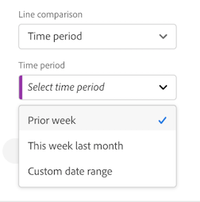

# 콤보 차트

>[!NOTE]
>
>이 기능은 현재 [제한적인 테스트](/help/release-notes/releases.md)가 실시되고 있습니다.

다음 [!UICONTROL 콤보 차트] 시각화를 사용하면 먼저 테이블을 작성하지 않고도 비교 시각화를 빠르게 작성할 수 있습니다. 데이터의 트렌드를 라인/막대 조합으로 쉽게 볼 수 있습니다.

다음 작업 [!UICONTROL 콤보 차트] to

* 몇 번의 클릭만으로 이번 주의 주문을 지난 달(및 작년)의 주문과 비교할 수 있습니다.

* 여러 지표(예: [!UICONTROL 고유 방문자 수] 및 [!UICONTROL 매출])을 동일한 차트에서 서로 비교합니다.

* 함수에 대해 지표 분석(예: [!UICONTROL 누적 평균])을 선택할 수 있습니다.

다음을 수행할 수 있습니다

* 한 번에 여러 비교 추가 [!UICONTROL 콤보 차트].
* 비교를 한 개 이상 추가하는 경우 같은 유형이어야 합니다 [!UICONTROL 시간 비교].
* 최대 5개의 비교를 추가할 수 있습니다.
* 지표에 최대 3개의 필터(세그먼트)를 적용할 수 있습니다.

## 콤보 차트 작성

1. 왼쪽 레일의 시각화 드롭다운 목록에서 [!UICONTROL 콤보 차트] 시각화를 빈 패널로 이동합니다.

   

1. 드롭다운 목록에서 X축에 대한 차원 및 Y축에 대한 지표를 선택합니다.

1. 유형 선택 [!UICONTROL 선 비교] 를 사용하려고 합니다.

   | 선 비교 유형 | 정의 |
   | --- | --- |
   | **[!UICONTROL 시간 비교]** | 가장 일반적인 비교 유형 - 이 기간을 4주 전에 비교하는 예를 들어, 선택한 경우 [!UICONTROL 시간 비교]을(를) 선택한 경우 비교할 기간을 기준으로 보조 선택을 합니다.
 |
   | **[!UICONTROL 함수로 플러그인 호출]** | 다음과 같은 기능을 도입할 수 있습니다 [!UICONTROL 평균] 를 비교로 볼 수 있습니다. 아래에서 지원되는 함수 목록을 참조하십시오.
 |
   | **[!UICONTROL 보조 지표]** | 예를 들어 다음과 같은 방법으로 비교할 수 있습니다 [!UICONTROL 매출] 다른 지표에 추가
 |

   {style=&quot;table-layout:auto&quot;}

1. **[!UICONTROL 빌드]**&#x200B;를 클릭합니다.

   출력은 다음과 비슷합니다.

   

   현재 기간은 막대 차트에 표시되고 비교 기간은 라인 차트로 표시됩니다. 선 차트의 점들은 &quot;바벨&quot;이라고 합니다.

## 지원되는 함수

만약 **[!UICONTROL 함수]** 로서의 [!UICONTROL 선 비교 유형]: 선택한 지표의 함수가 반환됩니다.

| 함수로 플러그인 호출 | 정의 |
| --- | --- |
| **[!UICONTROL 열 합계]** | 열 내의 한 지표에 대한 모든 숫자 값을 추가합니다 (차원의 요소들에 대해) |
| **[!UICONTROL 누적 평균]** | 마지막 N개 행의 평균을 반환합니다. |
| **[!UICONTROL 중간값]** | 열에 있는 지표에 대한 중간값을 반환합니다. 중간값은 숫자 세트의 중간에 있는 숫자입니다. 즉, 이 값의 반은 중간값보다 크거나 같은 값이고 다른 반은 중간값보다 작거나 같습니다. |
| **[!UICONTROL 누적]** | N 행의 누적 합계. |
| **[!UICONTROL 열 최대값]** | 지표 열에 대한 차원 요소 세트에서 가장 큰 값을 반환합니다. |
| **[!UICONTROL 평균]** | 지표에 대한 산술 평균 또는 평균을 반환합니다. |
| **[!UICONTROL 열 최소값]** | 지표 열에 대한 차원 요소 세트에서 가장 작은 값을 반환합니다. |

{style=&quot;table-layout:auto&quot;}

다음은 매출 지표의 누적 평균의 예입니다.

다음은 누적 평균 및 평균 함수를 모두 사용하는 콤보 차트의 예입니다.

## 콤보 차트 설정

콤보 차트의 오른쪽 위에 있는 톱니바퀴 아이콘을 클릭하여 설정을 변경합니다.

| 설정 | 정의 |
| --- | --- |
| **[!UICONTROL 시각화 유형]** | 다른 시각화 유형으로 전환할 수 있습니다. |
| **[!UICONTROL 세부기간]** | 트렌드 시각화의 경우 이 드롭다운에서 시간 단위(일, 주, 월 등)를 변경할 수 있습니다. |
| **[!UICONTROL 일반]** |  |
| **[!UICONTROL 백분율]** | 값을 백분율로 표시합니다. |
| **[!UICONTROL 범례 표시]** | 콤보 차트 시각화에 대한 자세한 범례 텍스트를 숨길 수 있습니다. |
| **[!UICONTROL 최대 항목 제한]** | X축에 있는 항목 수를 줄입니다. 큰 데이터 세트가 있는 경우 처음 10개 항목(또는 선택한 모든 값)만 표시할 수 있습니다. |
| **[!UICONTROL 오버레이]** | 줄에서 바벨을 표시하거나 숨깁니다. |
| **[!UICONTROL 축]** |  |
| **[!UICONTROL 이중 축 표시]** | 지표가 두 개일 경우에만 적용됩니다. 왼쪽(한 지표에 대해)과 오른쪽(다른 지표에 대해)에 y축을 놓을 수 있습니다. 그려진 지표의 크기가 매우 다른 경우에 유용합니다. 여러 비교가 없는 경우 이중 축 색상은 표의 색상에 일치합니다. 이 경우 모든 비교에 대한 색상은 회색으로 표시됩니다. |
| **[!UICONTROL 표준화]** | 지표를 등분 비례에 강제 적용합니다. 그려진 지표의 크기가 매우 다른 경우에 유용합니다. |
| **[!UICONTROL x축 표시]** | x축을 표시하거나 숨깁니다. |
| **[!UICONTROL y축 표시]** | y축을 표시하거나 숨깁니다. |
| **[!UICONTROL y축 0에 연결]** | 차트에 표시된 모든 값이 0보다 매우 큰 경우, 차트 기본값에 따라 y축의 하단이 0이 아닌 값으로 지정됩니다. 이 상자를 선택하면 y축이 0이 됩니다(그리고 차트가 다시 그려짐). |

{style=&quot;table-layout:auto&quot;}
