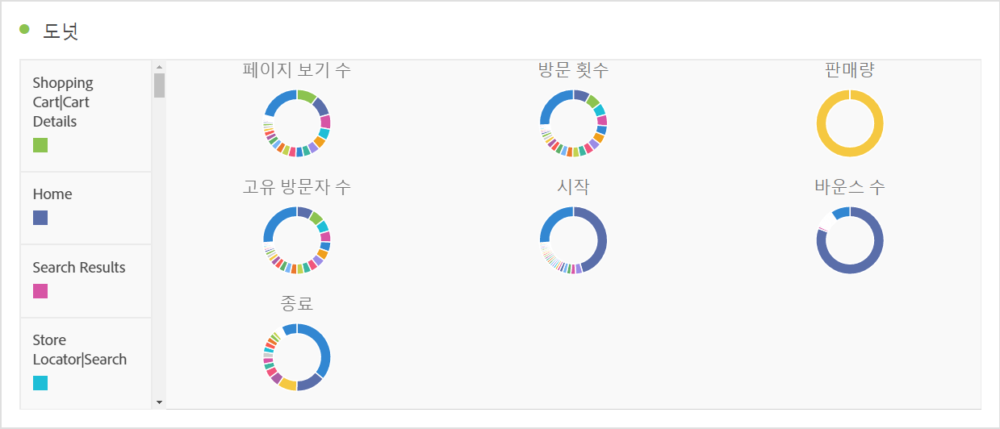

# [!UICONTROL 도넛] {#donut}

<!-- markdownlint-disable MD034 -->

>[!CONTEXTUALHELP]
>id="workspace_donut_button"
>title="도넛"
>abstract="일반적으로 적은 수의 항목에 대한 합계의 백분율을 비교하는 도넛 시각화를 만듭니다."

<!-- markdownlint-enable MD034 -->

>[!BEGINSHADEBOX]

_이 문서에서는 도넛 시각화에 대해 설명합니다._  _**Adobe Analytics**._ _이 문서의_  _**Customer Journey Analytics** 버전에 대한 [도넛](https://experienceleague.adobe.com/ko/docs/analytics-platform/using/cja-workspace/visualizations/donut)을(를) 참조하십시오._

>[!ENDSHADEBOX]

파이 차트와 유사하게  **[!UICONTROL 도넛]** 시각화는 데이터를 전체의 일부 또는 필터로 표시합니다. 일반적으로 적은 수의 항목에 대한 합계의 백분율을 비교할 때 도넛 시각화를 사용합니다.

>[!BEGINSHADEBOX]

데모 비디오를 보려면  [도넛 시각화 추가](https://experienceleague.adobe.com/en/docs/analytics-learn/tutorials/analysis-workspace/visualizations/using-the-donut-visualization){target="_blank"}를 확인하십시오.

>[!ENDSHADEBOX]

>[!MORELIKETHIS]
>
>[패널에 시각화 추가](/help/analyze/analysis-workspace/visualizations/freeform-analysis-visualizations.md#add-visualizations-to-a-panel)
>[시각화 설정](/help/analyze/analysis-workspace/visualizations/freeform-analysis-visualizations.md#settings)
>[시각화 컨텍스트 메뉴](/help/analyze/analysis-workspace/visualizations/freeform-analysis-visualizations.md#context-menu)
>

