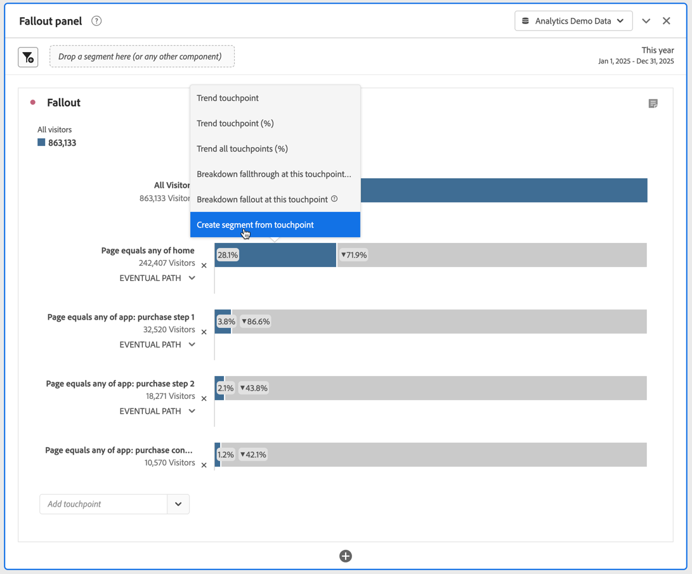

# 폴아웃 분석에서 세그먼트 적용

터치 포인트에서 세그먼트를 만들고, 세그먼트를 터치 포인트로 추가하고, Analysis Workspace의 다양한 세그먼트 간에 주요 워크플로를 비교할 수 있습니다.

>[!IMPORTANT]
>
>폴아웃에서 체크포인트로 사용되는 세그먼트는 폴아웃 시각화의 전체 컨텍스트보다 낮은 수준에 있는 컨테이너를 사용해야 합니다. 방문자 컨텍스트 폴아웃을 사용하면 체크포인트로 사용되는 세그먼트는 방문 또는 히트 기반 세그먼트여야 합니다. 방문 컨텍스트 폴아웃을 사용하면 체크포인트로 사용되는 세그먼트는 히트 기반 세그먼트여야 합니다. 잘못된 조합을 사용하는 경우 폴아웃은 100%가 됩니다. 호환되지 않는 세그먼트를 터치포인트로 추가할 때 폴아웃 시각화에 경고가 표시됩니다. 잘못된 특정 세그먼트 컨테이너 조합은 다음과 같이 잘못된 폴아웃 다이어그램을 만듭니다.
>
>* 방문자 컨텍스트 폴아웃 시각화에서 방문자 기반 세그먼트를 터치포인트로 사용
>* 방문 컨텍스트 폴아웃 시각화에서 방문자 기반 세그먼트를 터치포인트로 사용
>* 방문 컨텍스트 폴아웃 시각화에서 방문 기반 세그먼트를 터치포인트로 사용
>

## 터치 포인트에서 세그먼트 만들기

1. 특별히 관심이 있고, 다른 보고서에 적용하는 데 유용할 수 있는 특정 터치 포인트로부터 세그먼트를 만듭니다. 터치 포인트를 마우스 오른쪽 버튼으로 클릭하고 **[!UICONTROL 터치 포인트에서 세그먼트 만들기]**&#x200B;를 선택하여 이 작업을 수행합니다.

   

   선택한 터치포인트와 일치하는 사전에 만들어진 순차적 세그먼트로 사전에 채워진 세그먼트 빌더가 열립니다.

   

1. 세그먼트에 제목과 설명을 지정하고 저장합니다.

   이제 원하는 프로젝트에서 이 세그먼트를 사용할 수 있습니다.

## 터치 포인트로서 세그먼트 추가

예를 들어 모바일 앱 히트 수가 어떻게 트렌드를 보이고 폴아웃에 영향을 주는지를 보려는 경우 모바일 앱 히트 세그먼트를 폴아웃으로 드래그하면 됩니다.

또는 모바일 앱 히트 세그먼트를 다른 체크포인트로 드래그하여 AND 터치포인트를 만들 수 있습니다.

## 폴아웃에서 세그먼트 비교

폴아웃 시각화에서는 세그먼트를 무제한으로 비교할 수 있습니다. (아래 비디오에는 최대 3개의 세그먼트를 비교할 수 있다고 나와 있는데, 이는 잘못된 것입니다.)

>[!BEGINSHADEBOX]

데모 비디오는  [폴아웃 시각화에서 세그먼트 비교](https://video.tv.adobe.com/v/30863?quality=12&learn=on&captions=kor){target="_blank"}를 참조하십시오.

>[!ENDSHADEBOX]

1. 왼쪽의 [!UICONTROL 세그먼트] 패널에서 비교할 세그먼트를 선택합니다. 예제에서는 두 개의 세그먼트를 선택합니다. **[!UICONTROL iOS]** 및 **[!UICONTROL Android]**.
1. 세 개의 세그먼트를 시각화 상단에 있는 세그먼트 드롭 영역으로 드래그합니다.

   

1. 선택 사항: *모든 사용자*&#x200B;를 기본 컨테이너로 유지하거나 컨테이너를 삭제할 수 있습니다.

1. 이제 하나의 세그먼트가 다른 세그먼트나 다른 통찰력을 능가하는 경우와 같이, 세 세그먼트에 대한 폴아웃을 비교할 수 있습니다.
