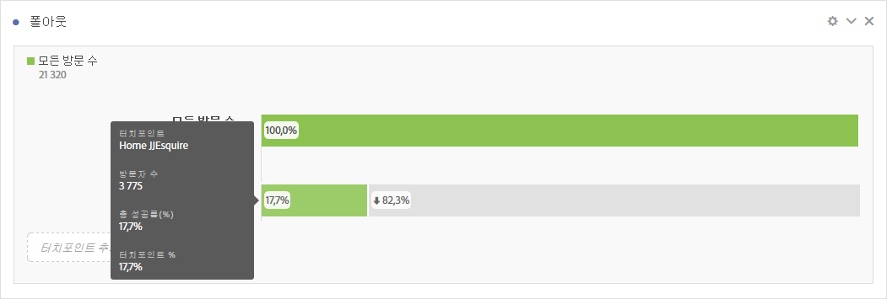
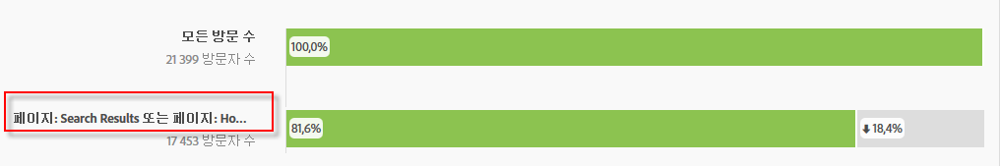
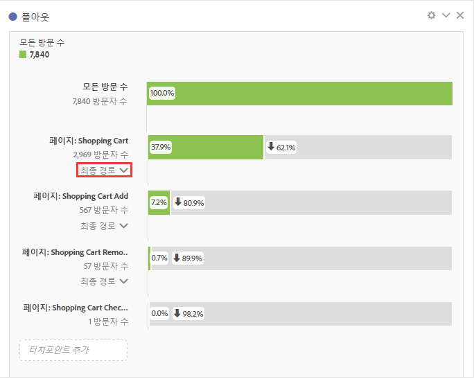

# 폴아웃 시각화 구성

터치포인트를 지정하여 차원이 여러 개인 폴아웃 시퀀스를 만들 수 있습니다. 일반적으로 터치포인트는 사이트에 있는 페이지입니다. 하지만, 터치포인트는 페이지에 제한되지 않습니다. 예를 들어, 고유 방문자 수 및 재방문 뿐만 아니라 단위와 같은 이벤트를 추가할 수도 있습니다. 카테고리, 브라우저 유형 또는 내부 검색어와 같은 차원을 추가할 수도 있습니다. 

또한 터치포인트 내의 세그먼트를 추가할 수도 있습니다. 예를 들어, iOS 및 Android 사용자와 같은 세그먼트를 비교할 수 있습니다. 원하는 세그먼트를 폴아웃의 맨 위에 드래그하십시오. 그러면 해당 세그먼트에 대한 정보가 폴아웃 보고서에 추가됩니다. 해당 세그먼트만 표시하려는 경우, 모든 방문 수 기준선을 제거할 수 있습니다. 

추가할 수 있는 단계의 수나 사용된 차원의 수에 대한 제한은 없습니다. 

머천다이징 eVar 및 [listVars](https://marketing.adobe.com/resources/help/en_US/sc/implement/listN.html)를 포함한 eVar에 대해 경로를 지정할 수 있습니다(제품, listVars, 머천다이징 eVar 및 목록 속성과 같이 히트당 여러 개의 값이 있을 수 있는 변수). 예를 들어, 어떤 사람이 한 페이지에서 신발, 셔츠를 보고 다른 페이지에서는 셔츠, 양말을 보는 경우, 신발의 다음 제품 흐름 보고서는 셔츠가 아니라 셔츠 및 양말이 됩니다. 

1. 시각화 드롭다운의 [!UICONTROL 폴아웃] 시각화를 [!UICONTROL 자유 형식 테이블]로 드래그합니다. 

1. 페이지 차원을 자유 형식 테이블로 드래그하고, 거기에서 페이지(이 경우, 홈 - JJEsquire)를 **[!UICONTROL 터치포인트 추가]필드에 첫 번째 터치포인트로서 드래그합니다.**

   

   마우스를 터치포인트 위에 놓아 폴아웃과, 터치포인트의 이름, 해당 포인트에서의 방문자 카운트와 같은 해당 수준에 대한 기타 정보를 확인하고, 해당 터치포인트에 대한 성공률을 확인합니다(또한 성공률을 다른 터치포인트에 대해 비교합니다.).

   막대의 회색 부분에서 원으로 표시된 숫자는 터치포인트 사이에 있는 폴아웃을 표시합니다(해당 포인트에 대한 전체 폴아웃이 아님). 터치포인트 %는 이전 단계에서 성공한 폴스루를 폴아웃 보고서의 현재 단계에 표시합니다.

   단일 페이지를 전체 차원이 아닌 폴아웃 보고서에 추가할 수도 있습니다. 페이지 차원에서 오른쪽 화살표 "&gt;"를 클릭하여 폴아웃 보고서에 추가할 특정 페이지를 선택합니다.

1. 시퀀스가 완료될 때까지 터치포인트를 계속 추가합니다.

   하나 이상의 추가 터치포인트를 한 터치포인트에 드래그하여 **여러 터치포인트를 결합**&#x200B;할 수 있습니다.

   >[!NOTE]
   >
   >여러 세그먼트가 연결되고, 차원 항목 및 지표와 같은 여러 항목이 OR와 연결됩니다.

   

1. **개별 터치포인트를 경로 내의 다음 히트로 제한**("결과적으로" 실행되는 것과 대조적으로)할 수도 있습니다. 각 터치포인트 아래에는 다음과 같이 "최종 경로"와 "다음 히트"라는 옵션이 있는 선택기가 있습니다.

   

<table id="table_A91D99D9364B41929CC5A5BC907E8985"> 
 <tbody> 
  <tr> 
   <td colname="col1"> 
최종 경로 
 
(기본값) 
 </td> 
   <td colname="col2"> 
결국 경로에 있는 다음 페이지에 도달하지만 다음 히트에서 도달할 필요는 없는 방문자가 카운트됩니다. 
 </td> 
  </tr> 
  <tr> 
   <td colname="col1"> 
다음 히트 
 </td> 
   <td colname="col2"> 
다로 다음 히트에서 경로에 있는 다음 페이지에 도달하는 방문자가 카운트됩니다. 
 </td> 
  </tr> 
 </tbody> 
</table>

## Fallout settings {#section_0C7C89D72F0B4D6EB467F278AC979093}

| 설정 | 설명 |
|--- |--- |
| 폴아웃 컨테이너 <ul><li>방문</li><li>방문자</li></ul> | 방문과 방문자 간을 전환하여 방문자 이동 경로를 분석할 수 있도록 합니다. 기본값은 방문자입니다. 이 설정은 방문들에 대해 방문자 수준에서 방문자 참여를 이해하거나 분석을 단일 방문으로 제한하는 데 도움이 됩니다.  |
| " 모든 방문자 "를 첫 번째 터치포인트로 표시 | "모든 방문 횟수"를 첫 번째 체크포인트로 가지고 있지 않은 경우에는 이 확인란을 선택 취소할 수 있습니다.  |

When you **right-click a touchpoint**, the following options appear:

| 옵션 | 설명 |
|--- |--- |
| 터치포인트 트렌드 | 터치포인트에 대한 트렌드 데이터를 사전 빌드된 일부 예외 항목 탐지 데이터가 있는 선 그래프로 확인하십시오. |
| 터치포인트 트렌드(%) | 총 폴아웃 비율의 트렌드를 표시합니다. |
| 모든 터치포인트의 트렌드 표시(%) | 동일한 차트에서 폴아웃("모든 방문"이 포함된 경우 "모든 방문" 제외)의 모든 터치포인트 비율의 트렌드를 표시합니다. |
| 이 터치포인트에서의 분류 폴스루 | 방문자가 다음 터치포인트로 계속 진행할 경우 두 터치포인트 사이에 어떤 작업을 수행했는지 확인합니다. 이렇게 하면 차원을 보여 주는 자유 형식 테이블이 만들어집니다. 차원과 테이블의 다른 요소를 교체할 수 있습니다.  |
| 이 터치포인트에서의 분류 폴아웃 | 단계를 통과하지 않은 사람이 선택된 단계 직후 무엇을 했는지 볼 수 있습니다.  |
| 터치포인트에서 세그먼트 만들기  | 선택한 터치포인트에서 새 세그먼트를 만듭니다.  |