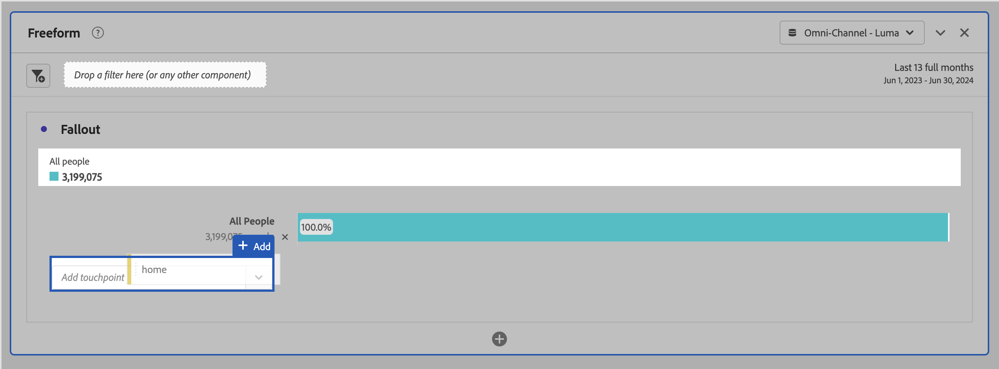
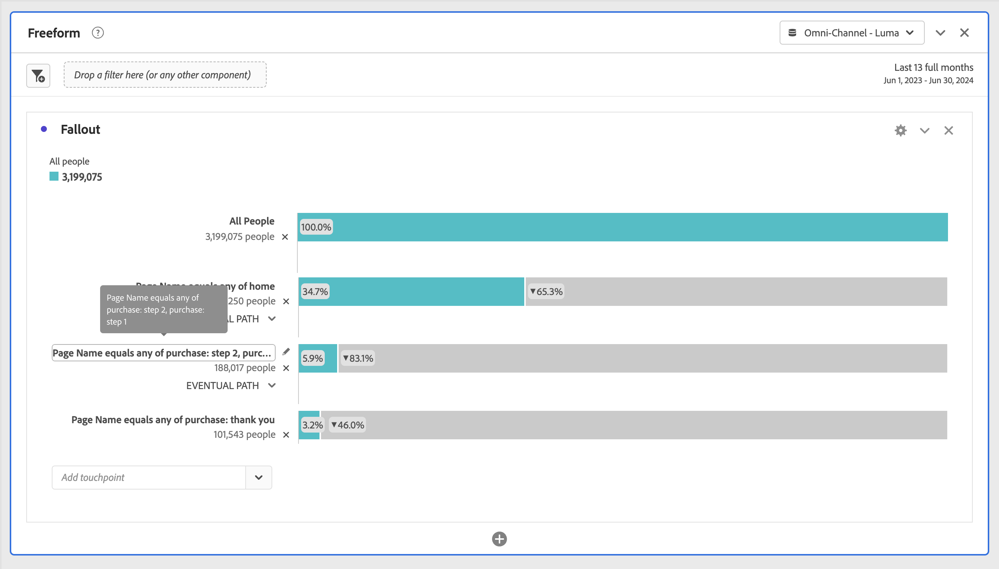

# 폴아웃 시각화 구성

터치포인트를 지정하여 다차원 폴아웃 시퀀스를 만들 수 있습니다. 일반적으로 터치포인트는 사이트의 페이지입니다. 하지만 터치포인트는 페이지에 제한되지 않습니다. 예를 들어 고유 방문자 수 및 재방문 뿐만 아니라 단위와 같은 이벤트를 추가할 수도 있습니다. 카테고리, 브라우저 유형 또는 내부 검색어와 같은 차원을 추가할 수도 있습니다.

터치 포인트 내에 세그먼트를 추가할 수도 있습니다. 예를 들어 iOS 및 Android™ 사용자와 같은 세그먼트를 비교할 수 있습니다. 원하는 세그먼트를 폴아웃의 맨 위에 드래그하십시오. 그러면 해당 세그먼트에 대한 정보가 폴아웃 보고서에 추가됩니다. 해당 세그먼트만 표시하려는 경우, 모든 방문 수 기준선을 제거할 수 있습니다.

추가할 수 있는 단계의 수나 사용된 차원의 수에 대한 제한은 없습니다.

차원, 지표 및 세그먼트에 대한 경로를 지정할 수 있습니다. 예를 들어 어떤 사람이 한 페이지에서 신발, 셔츠를 보고 다른 페이지에서는 셔츠, 양말을 보는 경우, 신발의 다음 제품 플로우 보고서는 셔츠가 아니라 셔츠 및 양말이 됩니다.

## 사용

1.  **[!UICONTROL 폴아웃]** 시각화를 추가합니다. [패널 내에 시각화 추가](../freeform-analysis-visualizations.md#add-visualizations-to-a-panel)를 참조하십시오.
1. 구성 요소를 **[!UICONTROL 터치포인트 추가]** 드롭다운 메뉴로 드래그합니다.

   예를 들어 전체 차원이 아닌 단일 페이지를 폴아웃 보고서에 추가할 수 있습니다. 페이지 차원에서 오른쪽 화살표 을(를) 클릭하여 **[!UICONTROL home]**&#x200B;과 같은 특정 페이지를 선택하여 폴아웃 보고서에 추가합니다.

   

1. 시퀀스가 완료될 때까지 터치포인트를 계속 추가합니다.

   막대의 회색 부분에서 원으로 표시된 숫자는 터치포인트 사이에 있는 폴아웃을 표시합니다(해당 포인트에 대한 전체 폴아웃이 아님). **[!UICONTROL 터치포인트 %]**&#x200B;는 이전 단계에서 성공한 폴스루를 폴아웃 보고서의 현재 단계에 표시합니다.

   

   터치포인트를 추가할 때 다음 중 하나를 수행할 수 있습니다.

   * 하나 이상의 추가 구성 요소를 단일 터치포인트로 드래그하여 여러 구성 요소를 결합합니다.

     >[!NOTE]
     >
     >여러 세그먼트는 AND로 결합되지만 차원 항목 및 지표와 같은 여러 항목은 OR로 결합됩니다.

   * 터치포인트를 폴아웃 계층 구조 내에서 다른 수준으로 끌어 놓아 순서를 변경합니다.

   * 터치포인트를 다른 터치포인트와 결합합니다. 터치포인트를 결합하려면 한 터치포인트를 다른 터치포인트로 드래그합니다. **[!UICONTROL 결합]**&#x200B;이라는 단어가 표시되면 삭제하십시오.

     

   * 개별 터치포인트를 경로 내의 다음 이벤트로 제한(*결과적으로*&#x200B;하는 것과 대조적으로)합니다. 각 접점 아래에는 다음과 같이 **[!UICONTROL 최종 경로]** 및 **[!UICONTROL 다음 이벤트]** 옵션이 있는 선택기가 있습니다.

     

     | 옵션 | 설명 |
     |---|---|
     | **[!UICONTROL 최종 경로]**(기본값) | *결국*&#x200B;이(가) 경로의 다음 페이지에 도달하지만, 반드시 다음 이벤트에는 도달하지 않는 방문자가 카운트됩니다. |
     | **[!UICONTROL 다음 이벤트]** | 다음 이벤트의 경로에서 다음 페이지에 도착하는 방문자는 카운트됩니다. |

   * 마우스를 터치포인트 위에 놓아 폴아웃 및 해당 수준에 대한 기타 정보를 보십시오. 정보에는 터치포인트의 이름, 개인 카운트 및 성공률이 포함됩니다. 성공률을 다른 터치포인트와 비교할 수도 있습니다.

     

## 설정

시각화의 일부로 특정 설정을 사용할 수 있습니다.

| 폴아웃 컨테이너 | 설명 |
|--- |--- |
| **[!UICONTROL 세션]** 또는 **[!UICONTROL 개인]** | [!UICONTROL 세션]과 [!UICONTROL 개인] 간을 전환하여 개인 경로를 분석할 수 있도록 합니다. 기본값은 [!UICONTROL 개인]입니다. 이 설정은 세션들에 대해 사용자 수준에서 사용자 참여를 이해하거나 분석을 단일 세션으로 제한하는 데 도움이 됩니다. |

## 컨텍스트 메뉴

시각화의 일부로 특정 컨텍스트 메뉴 옵션을 사용할 수 있습니다.

### 상황에 맞는 메뉴에 액세스

다음 방법 중 하나로 컨텍스트 메뉴에 액세스할 수 있습니다.

* 시각화에서 터치포인트 위로 마우스를 가져간 다음 **[!UICONTROL 분석하려면 클릭]**&#x200B;을 선택합니다.

  

* 시각화에서 터치포인트를 마우스 오른쪽 버튼으로 클릭합니다.

  

### 상황에 맞는 메뉴 옵션

다음과 같은 상황에 맞는 메뉴 옵션을 사용할 수 있습니다.

| 옵션 | 설명 |
|--- |--- |
| **[!UICONTROL 터치포인트 트렌드]** | 터치포인트에 대한 트렌드 데이터를 사전 빌드된 일부 예외 항목 탐지 데이터가 있는 선 그래프로 확인하십시오. |
| **[!UICONTROL 터치포인트 트렌드(%)]** | 총 폴아웃 비율의 트렌드를 표시합니다. |
| **[!UICONTROL 모든 터치포인트의 트렌드 표시(%)]** | 동일한 차트에서 폴아웃(**[!UICONTROL 모든 방문자]**&#x200B;가 포함된 경우 제외)의 모든 터치포인트 비율의 트렌드를 표시합니다. |
| **[!UICONTROL 이 터치포인트에서 분류 폴스루]** | 방문자가 다음 터치포인트로 계속 이동하는 경우 두 터치포인트 (이 터치포인트와 다음 터치포인트) 간 수행한 작업을 봅니다. 이 옵션을 사용하면 차원을 표시하는 자유 형식 테이블이 만들어집니다. 차원과 테이블의 다른 요소를 바꿀 수 있습니다. 예를 들어, 레이블이 **[!UICONTROL 폴스루: 모든 방문자 > 페이지가 홈]** 중 하나와 같고 차원으로 **[!UICONTROL 페이지]**&#x200B;와 지표로 **[!UICONTROL 프로젝트 전용 빠른 세그먼트]** [폴스루: 모든 방문자 > 페이지가 홈](/help/components/segmentation/segmentation-workflow/seg-quick.md) 중 하나와 같음&#x200B;**[!UICONTROL 고유 방문자]**&#x200B;를 포함하는 테이블이 있습니다. 세그먼트를 검사하여 폴스루 세그먼트가 결정되는 방법을 이해합니다. |
| 이 터치포인트에서 **[!UICONTROL 분류 폴아웃]** | funnel을 통과하지 않은 방문자가 선택한 단계 직후 수행한 작업을 확인합니다. 이 옵션을 사용하면 차원을 표시하는 자유 형식 테이블이 만들어집니다. 차원과 테이블의 다른 요소를 바꿀 수 있습니다. 예를 들어, 레이블이 **[!UICONTROL 폴아웃: 모든 방문자 > 페이지는 모든 홈]**&#x200B;과 같으며 차원으로 **[!UICONTROL 페이지]**&#x200B;과(와) 지표로 **[!UICONTROL 프로젝트 전용 빠른 세그먼트]** [폴스루: 모든 방문자 > 페이지가 홈](/help/components/segmentation/segmentation-workflow/seg-quick.md) 세그먼트 중 하나와 같다는 **[!UICONTROL 고유 방문자]**&#x200B;를 포함하는 테이블이 있습니다. 세그먼트를 검사하여 폴아웃 세그먼트가 결정되는 방식을 이해합니다. |
| **[!UICONTROL 터치포인트에서 세그먼트 만들기]** | 선택한 터치포인트에서 새 세그먼트를 만듭니다. |

>[!MORELIKETHIS]
>
>[패널 내에 시각화 추가](/help/analyze/analysis-workspace/visualizations/freeform-analysis-visualizations.md#add-visualizations-to-a-panel)
>[시각화 설정](/help/analyze/analysis-workspace/visualizations/freeform-analysis-visualizations.md#settings)
>[시각화 컨텍스트 메뉴](/help/analyze/analysis-workspace/visualizations/freeform-analysis-visualizations.md#context-menu)
>

