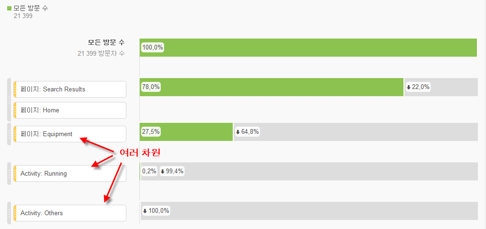
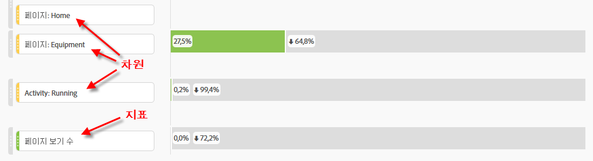
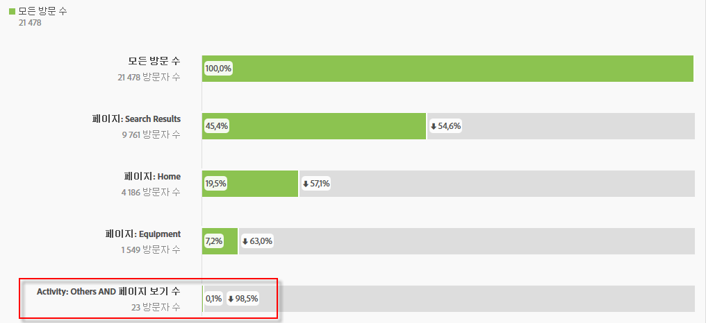

# 다차원 폴아웃

Analysis Workspace의 폴아웃을 사용하면 단계 및 워크플로의 터치포인트로서 차원과 지표를 짜 맞출 수 있습니다. 따라서 조사할 사용자 단계를 더욱 유연하게 정의할 수 있습니다.

다음은 해당 주제에 대한 비디오입니다.

>[!VIDEO](https://video.tv.adobe.com/v/24043/?quality=12)

**예**: 페이지 차원 이외에 작업 기반 차원 항목을 폴아웃 시각화에 추가할 수도 있습니다. 이렇게 하면 페이지와 특정 작업이 고객의 경로에서 어떻게 상호 작용하는지를 시각화할 수 있습니다.

폴아웃은 동적으로 업데이트되며, 여러 차원 간의 폴아웃을 알 수 있도록 해 줍니다.

지표를 이 혼합에 추가할 수도 있습니다. 이 예에서는 지표 &quot;공유 사진&quot;을 추가하여 고객이 이동한 경로를 구체화했습니다.

이 외에, 서로 다른 차원과 지표를 AND 체크포인트에 결합할 수도 있습니다. 다른 차원이나 지표를 기존 차원이나 지표 위에 드래그하면 됩니다.

