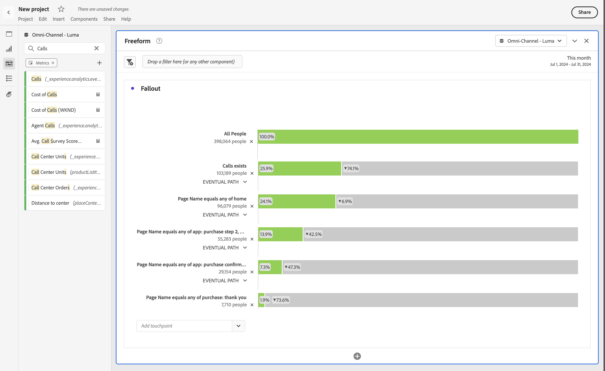

# 차원 간 폴아웃

Analysis Workspace의 폴아웃을 사용하면 단계 및 워크플로의 터치포인트로 차원과 지표를 혼합하고 일치시킬 수 있습니다. 폴아웃을 사용하면 조사할 사용자 단계를 보다 유연하게 정의할 수 있습니다.

예를 들어 페이지 차원 외에도 다른 차원 항목(예: 장치 이름 차원의 특정 장치 이름)을 폴아웃 시각화에 추가할 수 있습니다. 차원을 결합하면 페이지와 특정 작업이 고객의 경로에서 어떻게 상호 작용하는지를 시각화할 수 있습니다.

>[!BEGINSHADEBOX]

데모 비디오는  [다차원 폴아웃](https://video.tv.adobe.com/v/24043?quality=12&learn=on){target="_blank"}을 참조하십시오.

>[!ENDSHADEBOX]

예를 들어 페이지 차원 외에도 다른 차원 항목(예: 장치 이름 차원의 특정 장치 이름)을 폴아웃 시각화에 추가할 수 있습니다. 차원을 결합하면 페이지와 특정 작업이 고객의 경로에서 어떻게 상호 작용하는지를 시각화할 수 있습니다.

폴아웃은 동적으로 업데이트되며, 여러 차원 간의 폴아웃을 알 수 있도록 해 줍니다.

지표를 추가할 수도 있습니다. 예를 들어, 호출이 존재하고 콜센터에 연락한 사용자에 대한 경로만 표시하도록 지표 호출을 추가할 수 있습니다.

차원과 지표를 결합할 수 있습니다. 기존 차원 또는 지표 위로 다른 차원 또는 지표를 드래그합니다. 예를 들어, iPhone이 있고 콜센터에 연락한 사람의 폴아웃을 이해합니다.

