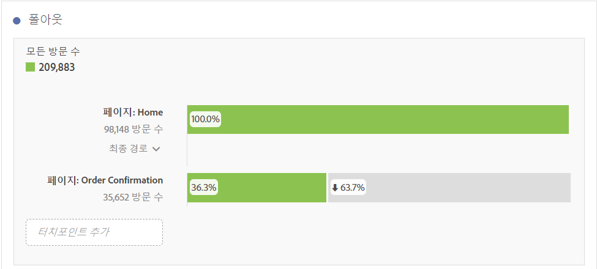
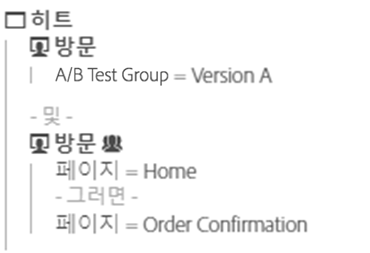
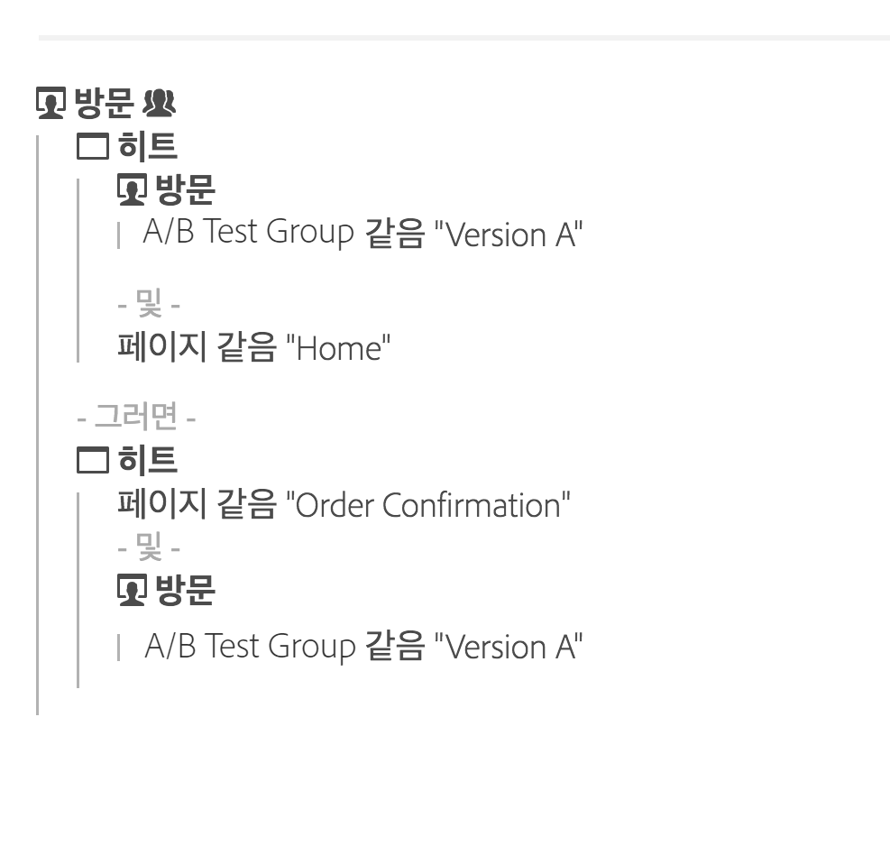

# 폴아웃 개요

폴아웃 시각화 요소에서 더 많은 폴아웃 보고서 작성 옵션을 제공합니다. 폴아웃 보고서는 방문자가 페이지의 사전 정의된 순서를 떠나고(폴아웃) 계속 따라가는(폴스루) 위치를 보여줍니다. 

폴아웃 시각화 요소를 사용하면 다음 작업을 수행할 수 있습니다.

* 동일한 보고서에서 서로 다른 두 개의 세그먼트를 나란히 놓고 비교
* 단계 절차(터치포인트) 드래그, 놓기 및 다시 정렬 
* 서로 다른 차원 및 지표의 값을 혼합 및 대응 
* 차원이 여러 개인 폴아웃 보고서 작성
* 폴아웃 직후 고객이 이동해 가는 위치 식별

폴아웃은 시퀀스에서 각 단계 또는 터치포인트 간 전환 및 폴아웃 비율을 보여 줍니다. 

예를 들어, 구매 프로세스 동안 방문자의 폴아웃 지점을 추적할 수 있습니다. 시작 터치포인트와 완료 터치포인트를 선택하고, 중간 터치포인트를 추가하여 간단하게 웹 사이트 탐색 경로를 만들어 보십시오. 다차원 폴아웃을 수행할 수도 있습니다.

폴아웃 시각화는 다음 항목을 분석하는 데 유용합니다.

* 사이트의 특정 프로세스를 통한 전환율(예: 구매 또는 등록 프로세스)
* 일반적이고 폭 넓은 범위의 트래픽 흐름: 홈 페이지를 방문자 중에서 몇 명이 검색을 수행했으며, 결국 몇 명이 특정 항목을 찾았는가를 표시합니다.
* 사이트에 있는 이벤트 간의 상관 관계. 상관 관계는 개인 정보 보호 정책을 본 방문자 중 제품을 구매한 비율을 보여줍니다.

[YouTube의 폴아웃 시각화](https://www.youtube.com/watch?v=VcrfHSyIoj8&index=52&list=PL2tCx83mn7GuNnQdYGOtlyCu0V5mEZ8sS) (4:15)

## Segmentation as a foundation for flow and fallout {#section_654F37A398C24DDDB1552A543EE29AA9}

Workspace 패널에 적용된 세그먼트는 Reports &amp; Analytics 및 Ad Hoc Analysis의 폴아웃 및 흐름 보고서에 적용되는 세그먼트와 약간 다르게 작동합니다. 대부분의 경우 이 세그먼트들은 정확히 동일한 결과를 제공하지만, 주된 차이점은 Reports &amp; Analytics 및 Ad Hoc Analysis의 경우 시퀀스의 각 단계에서 세그먼트를 적용한다는 것입니다. 이로 인해 결과가 다소 다를 수 있습니다.

다음 두 단계를 사용하여 폴아웃의 예를 살펴보겠습니다.

그런 다음 Workspace 패널 수준에서 세그먼트를 적용하는 경우 세그먼트는 다음과 같이 폴아웃과 결합합니다.

반대로 Reports &amp; Analytics와 Ad Hoc Analysis에서 세그먼트를 계산할 때에는 세그먼트가 다음과 같은 방식으로 결합됩니다.

Reports &amp; Analytics와 Ad Hoc Analysis는 세그먼트를 각 단계와 결합합니다. 컨테이너가 폴아웃과 동일한 수준에 있으면(예: 방문 또는 방문자 수준) 방문 또는 방문자 수가 일치하게 됩니다.

그러나 패널에 적용된 세그먼트가 폴아웃의 수준보다 작으면(예: 히트 수준) 세그먼트는 보고서에서 결합된 방식으로 인해 다른 결과를 보여줍니다. 다시 말해·대부분의 경우 Analysis Workspace의 숫자가 Reports &amp; Analytics 및 Ad Hoc Analysis의 숫자와 일치합니다. 이 숫자들은 아래의 모든 경우가 참인 경우에만 일치하지 **않습니다**.

* 세그먼트가 폴아웃과 같은 수준에 있지 않습니다.
* 방문/방문자에 여러 값이 있는 세그먼트에는 변수가 있습니다.

드물지만 Analysis Workspace에서 세그먼트를 폴아웃/흐름 적용하는 Reports &amp; Analytics 방식을 일치시켜야 할 경우에는 세그먼트를 Workspace의 각 폴아웃 단계에 놓기만 하면 동일한 숫자가 생성됩니다.
