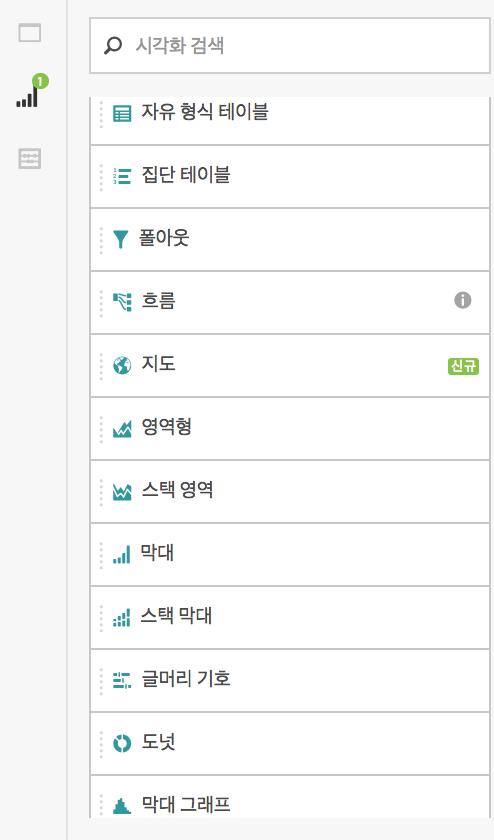
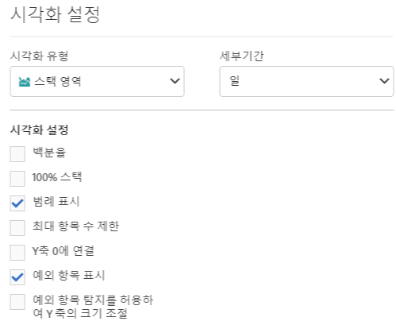
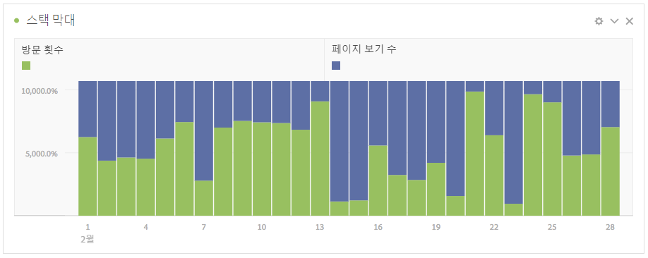
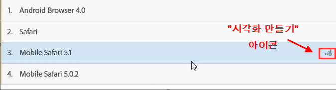
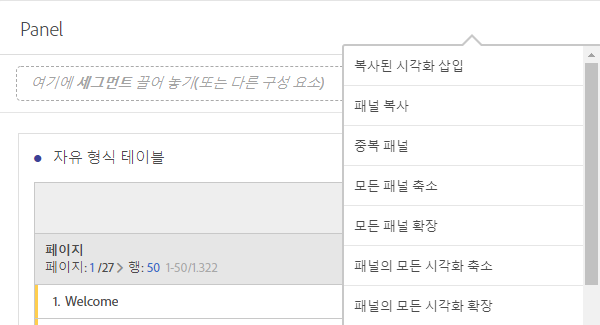
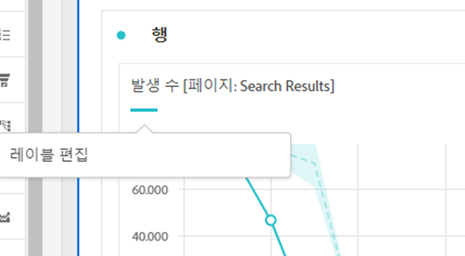

# 시각화 개요

Analysis Workspace에서 시각화 및 시각화 설정에 대해 알아봅니다.

[Visualization Types in Analysis Workspace on YouTube (2:57)](https://www.youtube.com/watch?v=b1zLEywRa6w&index=39&list=PL2tCx83mn7GuNnQdYGOtlyCu0V5mEZ8sS)

## Visualizations panel {#section_DC07F032FBEF4046A40F7B95C28DA018}

시각화 패널을 표시하려면 사이드 패널에서 **[!UICONTROL 시각화]를 클릭합니다.**

Adobe Analytics를 사용하는 경우 대부분의 시각화 유형(예: 면적, 막대, 도넛 및 라인 차트)에 익숙할 것입니다. 그렇지만 Analysis Workspace에서는 시각화 설정을 비롯하여 대화형 기능이 포함된 여러 개의 고유한 새 시각화 유형을 제공합니다.

## Visualization settings {#section_D3BB5042A92245D8BF6BCF072C66624B}

[!UICONTROL 시각화 설정]에 액세스하려면 시각화를 [!UICONTROL 자유 형식 패널]로 드래그한 다음 [!UICONTROL 시각화 설정] 톱니바퀴 아이콘을 클릭합니다. 

>[!IMPORTANT]
>
>시각화 설정에 따라 시각화가 표시됩니다. 모든 설정이 모든 시각화에 적용되는 것은 아닙니다. 또한 일부 고급 설정은 [히스토그램 설정](../../../analyze/analysis-workspace/visualizations/histogram.md#section_09D774C584864D4CA6B5672DC2927477)과 같은 특정 시각화에 대해서&#x200B;**만** 표시됩니다.

<table id="table_E0695243886046979EE609FAE5D6EA00"> 
 <thead> 
  <tr> 
   <th colname="col1" class="entry"> 설정 </th> 
   <th colname="col2" class="entry"> 설명 </th> 
  </tr> 
 </thead>
 <tbody> 
  <tr> 
   <td colname="col1"> 
백분율 
 </td> 
   <td colname="col2"> 
값을 백분율로 표시합니다. 
 </td> 
  </tr> 
  <tr> 
   <td colname="col1"> 
100% 누적 
 </td> 
   <td colname="col2"> 
스택 영역 또는 스택 막대 또는 가로 막대형 스택 시각화에 대한 이 설정은 차트를 "100% 누적" 시각화로 바꿉니다. 예: 
 
 
 </td> 
  </tr> 
  <tr> 
   <td colname="col1"> 
범례 표시 
 </td> 
   <td colname="col2"> 
요약 번호/요약 변경 사항 시각화에 대한 필터 세부 사항 텍스트를 숨길 수 있습니다. 
 </td> 
  </tr> 
  <tr> 
   <td colname="col1"> 
최대 항목 수 제한 
 </td> 
   <td colname="col2"> 
시각화에 표시되는 항목 수를 제한할 수 있습니다. 
 </td> 
  </tr> 
  <tr> 
   <td colname="col1"> 
Y축 0에 연결 
 </td> 
   <td colname="col2"> 
 차트에 표시된 모든 값이 0보다 매우 큰 경우, 차트 기본값에 따라 y축의 하단이 0이 아닌 값으로 지정됩니다. 이 상자를 선택하면 y축이 0이 됩니다(그리고 차트가 다시 그려짐).  
 </td> 
  </tr> 
  <tr> 
   <td colname="col1"> 
표준화 
 </td> 
   <td colname="col2"> 
지표를 등분 비례에 강제 적용합니다. See  Normalization. 
 </td> 
  </tr> 
  <tr> 
   <td colname="col1"> 
이중 축 표시 
 </td> 
   <td colname="col2"> 
두 개의 지표가 있는 경우에만 적용됩니다. 한 지표의 경우 왼쪽(한 지표의 경우)과 오른쪽(다른 지표의 경우)에 y축을 지정할 수 있습니다. 
 </td> 
  </tr> 
  <tr> 
   <td colname="col1"> 
예외 항목 표시 
 </td> 
   <td colname="col2"> 
데이터 예외 항목을 표시하도록 선 그래프와 자유 형식 테이블을 개선합니다.  
 </td> 
  </tr> 
 </tbody> 
</table>

## Create Visual icon {#section_9C11D9DEDC42413AA53E69A71A509DFC}

어떤 시각화를 선택해야 할지 모를 경우 테이블 행에서 **[!UICONTROL 시각화 만들기]아이콘을 클릭합니다.** 이 아이콘은 테이블 행 위로 마우스를 가져가면 나타납니다. 이 아이콘을 클릭하면 기존 학습을 토대로 사용자 데이터에 가장 적합한 시각화가 추측됩니다. 예를 들어 최대 3개의 세그먼트를 선택한 경우 벤 다이어그램이 생성됩니다. 세그먼트가 4개 이상이면 막대 차트가 생성됩니다. 다른 유형의 데이터에서는 선 그래프가 생성될 수 있습니다.

## Right-click visualization/panel menu {#section_05B7914D4C9E443F97E2BFFDEC70240C}

시각화 또는 패널 헤더 옆을 마우스 오른쪽 단추로 클릭하면 그래프와 관련된 설정에 액세스할 수 있습니다. 다음 설정 중 일부 또는 전체를 사용할 수 있게 됩니다. 

| 설정 | 설명 |
|--- |--- |
| 복사한 시각화/패널 삽입 | 복사한 요소를 프로젝트 내의 다른 위치 또는 완전히 다른 프로젝트에 붙여넣을("삽입") 수 있습니다. |
| 시각화/패널 복사 | 시각화 또는 패널을 마우스 오른쪽 단추로 클릭하고 복사할 수 있습니다. |
| 중복 시각화/패널 | 현재 시각화의 수정할 수 있는 정확한 중복을 만듭니다. |
| 모든 패널 축소 | 모든 프로젝트 패널을 축소합니다. |
| 패널의 모든 시각화 축소 | 이 프로젝트 패널의 모든 시각화를 축소합니다. |
| 모든 패널 확장 | 모든 프로젝트 패널을 확장합니다. |
| 패널의 모든 시각화 확장 | 이 프로젝트 패널의 모든 시각화를 확장합니다. |
| 설명 편집 | 시각화/패널에 대한 텍스트 설명을 추가(또는 편집)합니다. 이 설명은 프로젝트 &gt;  프로젝트 정보 및 설정에 표시됩니다 . |
| 패널 링크 가져오기 | 프로젝트 내의 특정 패널로 사용자를 안내할 수 있습니다. |
| 시각화 링크 가져오기 | 이 링크를 복사하고 공유하여 다른 사용자를 이 시각화로 직접 보낼 수 있습니다. 사용자는 로그인해야 합니다. |
| 시작 | (흐름, 벤, 히스토그램에 대해 작동하게 됨) 현재 시각화에 대한 구성이 삭제되고, 다시 구성할 수 있는 새 패널이 열립니다.  |

## Edit legend labels {#section_94F1988CB4B9434BA1D9C6034062C3DE}

시각 자료를 더욱 잘 소비하게 만들 수 있도록 시각화 범례(폴아웃, 영역, 스택 영역, 막대, 스택 막대, 도넛, 막대 그래프, 가로 막대, 스택 가로 막대, 라인, 분산형 및 벤)에서 시리즈 이름을 바꿀 수 있습니다.

트리맵, 글머리 기호, 요약 변경 사항 또는 숫자, 텍스트, 자유 형식, 막대 그래프, 집단 또는 플로우 시각화에는 범례 편집이 적용되지 **않습니다**.

라인 차트에서 범례 레이블을 편집하려면 다음을 수행하십시오.

1. 범례 레이블 중 하나를 마우스 오른쪽 단추로 클릭합니다.
1. **[!UICONTROL 레이블 편집을 클릭합니다]**.

   

1. 새 레이블 텍스트를 입력합니다.
1. **[!UICONTROL Enter]를 눌러 저장합니다.**

다음은 이 항목의 ](https://www.youtube.com/watch?v=mry3vDrTml0&index=61&list=PL2tCx83mn7GuNnQdYGOtlyCu0V5mEZ8sS)비디오에 대한 링크[입니다.
