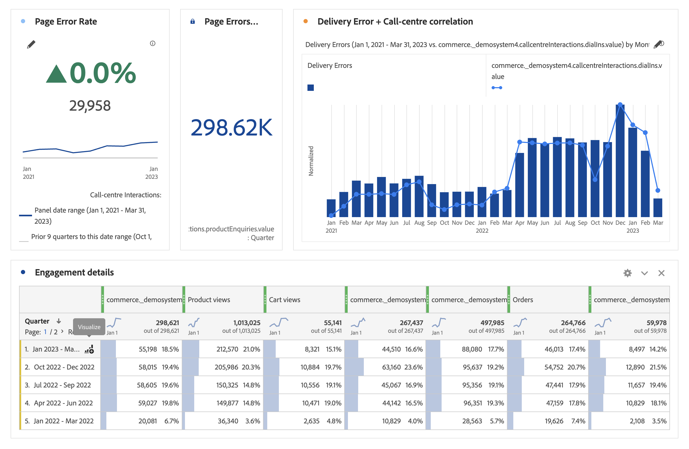

# 시각화 개요

작업 공간에서는 막대 차트, 도넛 차트, 히스토그램, 선 차트, 맵, 산점도 등과 같은 데이터를 시각적으로 나타낼 수 있도록 해주는 다양한 시각화를 제공합니다. Adobe Analytics을 사용하면 대부분의 시각화 유형이 익숙할 것입니다. 그렇지만 Analysis Workspace에서는 시각화 설정을 비롯하여 대화형 기능이 포함된 여러 개의 고유한 새 시각화 유형을 제공합니다.

작업 영역의 왼쪽 위 아이콘, [빈 패널](https://experienceleague.adobe.com/docs/analytics/analyze/analysis-workspace/panels/blank-panel.html?lang=ko-KR) 또는 워크플로우의 오른쪽 클릭 메뉴를 통해 시각화에 액세스할 수 있습니다.

Analysis Workspace에서는 다음 시각화 유형을 사용할 수 있습니다.

| 시각화 이름 | 설명 |
| --- | --- |
| [영역](/help/analyze/analysis-workspace/visualizations/area.md) | 선 그래프처럼 표시되지만 선 아래에 색상이 있는 영역이 있습니다. 여러 개의 지표가 있고 두 개 이상 지표의 교차 지점으로 표시되는 영역을 시각화하려는 경우 영역 그래프를 사용하십시오. |
| [막대](/help/analyze/analysis-workspace/visualizations/bar.md) | 하나 이상 지표에서 다양한 값을 나타내는 세로 막대를 표시합니다. |
| [글머리 기호 그래프](/help/analyze/analysis-workspace/visualizations/bullet-graph.md) | 중요한 값이 다른 성능 범위(목표)에 대해 비교되거나 측정되는 방식을 표시합니다. |
| [집단 테이블](/help/analyze/analysis-workspace/visualizations/cohort-table/cohort-analysis.md) | *`cohort`*&#x200B;은 지정된 기간 동안 공통적인 특성을 공유하는 사람들의 그룹입니다. 집단 분석은 유지, 이탈 또는 지연 분석에 유용합니다. |
| [도넛](/help/analyze/analysis-workspace/visualizations/donut.md) | 파이 차트와 유사하게 이 시각화는 데이터를 전체의 일부 또는 세그먼트로 표시합니다. |
| [폴아웃](/help/analyze/analysis-workspace/visualizations/fallout/fallout-flow.md) | 폴아웃 보고서는 방문자가 페이지의 사전 정의된 순서를 떠나고(폴아웃) 계속 따라가는(폴스루) 위치를 보여줍니다. 최종 또는 정확한 시퀀스로 설정할 수 있음 |
| [흐름](/help/analyze/analysis-workspace/visualizations/c-flow/flow.md) | 웹 사이트와 앱을 통해 정확한 고객 경로를 보여줍니다. |
| [자유 형식 테이블](/help/analyze/analysis-workspace/visualizations/freeform-table/freeform-table.md) | 자유 형식 테이블은 데이터 테이블일 뿐만 아니라 대화형 시각화이기도 합니다. Workspace의 데이터 분석을 위한 기반입니다. |
| [히스토그램](/help/analyze/analysis-workspace/visualizations/histogram.md) | 히스토그램은 지표 볼륨을 기반으로 방문자, 방문 또는 히트를 버킷으로 버킷합니다. |
| [가로 막대형](/help/analyze/analysis-workspace/visualizations/horizontal-bar.md) | 하나 이상 지표에서 다양한 값을 나타내는 가로 막대를 표시합니다. |
| [라인](/help/analyze/analysis-workspace/visualizations/line.md) | 일정 기간 동안 값이 어떻게 변하는지를 보여주기 위해 라인을 사용하여 지표를 나타냅니다. 라인 차트는 x축을 따라 시간을 사용합니다. |
| [맵](/help/analyze/analysis-workspace/visualizations/map-visualization.md) | 모든 지표(계산된 지표 포함)의 시각적 맵을 작성할 수 있도록 해줍니다. |
| [산포도](/help/analyze/analysis-workspace/visualizations/scatterplot.md) | 차원 항목과 최대 3개 지표 간의 관계를 표시합니다. |
| [요약 번호](/help/analyze/analysis-workspace/visualizations/summary-number-change.md) | 선택한 셀을 1개의 큰 숫자로 표시합니다. |
| [요약 변경](/help/analyze/analysis-workspace/visualizations/summary-number-change.md) | 선택한 셀 간의 변경 내용을 큰 숫자/퍼센트로 표시합니다. |
| [텍스트](/help/analyze/analysis-workspace/visualizations/text.md) | 사용자 정의 텍스트를 Analysis Workspace에 추가할 수 있게 합니다. 패널/시각화 설명을 활용하는 것 외에도 분석 및 인사이트에 추가 컨텍스트를 추가하는 데 도움이 됩니다. |
| [트리맵](/help/analyze/analysis-workspace/visualizations/treemap.md) | 계층형(트리 구조) 데이터를 중첩된 직사각형 세트로 표시합니다. |
| [벤](/help/analyze/analysis-workspace/visualizations/venn.md) | 서클을 사용하여 최대 3개의 세그먼트가 겹치는 지표를 표시합니다. |

## 설정 {#settings}

각 시각화에는 관리할 수 있는 자체 설정이 있습니다. [!UICONTROL 시각화 설정]에 액세스하려면 [!UICONTROL 시각화 설정] 톱니바퀴 아이콘을 클릭합니다.

| 설정 | 설명 |
| --- | --- |
| 시각화 유형 | 데이터를 나타내기 위해 사용되는 시각적 유형을 변경합니다. |
| 세부기간 | 트렌드 시각화의 경우 시간 세부기간(일, 주, 월 등)을 변경할 수 있습니다. 이 드롭다운에서. 이 변경 사항은 데이터 소스 테이블에도 적용됩니다. |
| 백분율 | 값을 백분율로 표시합니다. |
| 100% 누적 | 스택형 영역, 스택형 막대 또는 스택형 가로 막대 시각화에 대한 이 설정은 차트를 &quot;100% 누적&quot; 시각화로 바꿉니다. 예: |
| 범례 표시 | 요약 번호/요약 변경 사항 시각화에 대한 자세한 범례 텍스트를 숨길 수 있습니다. |
| 최대 항목 수 제한 | 시각화에 표시되는 항목 수를 제한할 수 있습니다. |
| Y축 0에 연결 | 차트에 표시된 모든 값이 0보다 매우 큰 경우, 차트 기본값에 따라 y축의 하단이 0이 아닌 값으로 지정됩니다. 이 상자를 선택하면 y축이 0이 됩니다(그리고 차트가 다시 그려짐).  |
| 표준화 | 지표를 등분 비례에 강제 적용합니다. 이 기능은 플로팅된 지표가 매우 다른 비율을 갖는 경우에 유용합니다. |
| 이중 축 표시 | 지표가 두 개일 경우에만 적용됩니다. 왼쪽(한 지표에 대해)과 오른쪽(다른 지표에 대해)에 y축을 놓을 수 있습니다. 이 기능은 플로팅된 지표가 매우 다른 비율을 갖는 경우에 유용합니다. |
| 예외 항목 표시 | 예외 항목 탐지를 표시하여 라인 그래프와 자유 형식 테이블을 향상시킵니다. 라인 시각화의 예외 항목 탐지는 예상 값(점선)과 예상 범위(음영 처리된 밴드)를 포함합니다. |

## 범례 {#legend}

시각화 범례는 소스 테이블의 날짜를 시각화에서 계열을 표시하는 데 도움이 됩니다. 범례는 대화형이므로 범례 항목을 클릭하여 시각화에서 시리즈를 표시하거나 숨길 수 있습니다. 시각화된 데이터를 단순화하려는 경우 유용합니다.

또한 범례 레이블의 이름을 변경하여 비주얼을 보다 소비할 수 있도록 할 수 있습니다. 참고:범례 편집은 **에**&#x200B;이(가) 적용되지 않습니다.트리 맵, 글머리 기호, 요약 변경/번호, 텍스트, 자유 형식, 막대 그래프, 집단 또는 흐름 시각화.

범례 레이블을 편집하려면:

1. 범례 레이블 중 하나를 마우스 오른쪽 단추로 클릭합니다.
1. **[!UICONTROL 레이블 편집을 클릭합니다]**.

   

1. 새 레이블 텍스트를 입력합니다.
1. **[!UICONTROL Enter]**&#x200B;를 눌러 저장합니다.

다음은 이 항목의 [비디오에 대한 링크](https://docs.adobe.com/content/help/en/analytics-learn/tutorials/analysis-workspace/visualizations/series-label-editing.html)입니다.

## {#right-click} 메뉴를 마우스 오른쪽 단추로 클릭합니다.

시각화 헤더를 마우스 오른쪽 단추로 클릭하여 시각화에 대한 추가 기능을 사용할 수 있습니다. 설정은 시각화에 따라 다릅니다. 사용 가능한 설정 중 일부는 다음과 같습니다.

| 설정 | 설명 |
| --- | --- |
| 복사한 패널/시각화 삽입 | 복사한 패널 또는 시각화를 프로젝트 내의 다른 위치에 붙여넣거나 완전히 다른 프로젝트에 붙여넣을 수 있습니다(&quot;삽입&quot;). |
| 시각화 복사 | 시각화를 마우스 오른쪽 단추로 클릭하고 복사하여 프로젝트 내의 다른 위치에 삽입하거나 완전히 다른 프로젝트에 삽입할 수 있도록 해줍니다. |
| [CSV로 항목 다운로드](https://experienceleague.adobe.com/docs/analytics/analyze/analysis-workspace/curate-share/download-send.html?#download-items) | 선택한 차원에 대한 최대 50,000개의 차원 항목을 CSV로 다운로드합니다. |
| [데이터를 CSV로 다운로드](https://experienceleague.adobe.com/docs/analytics/analyze/analysis-workspace/curate-share/download-send.html?#download-data) | 시각화 데이터 소스를 CSV로 다운로드합니다. |
| 중복 시각화 | 현재 시각화의 수정할 수 있는 정확한 중복을 만듭니다.  |
| 설명 편집 | 시각화에 대한 텍스트 설명을 추가(또는 편집)합니다. |
| 시각화 링크 가져오기 | 프로젝트 내의 특정 시각화로 사람을 안내할 수 있습니다. 링크를 클릭하면 수신자가 연결된 정확한 시각화로 이동되기 전에 로그인해야 합니다. |
| 시작 | (흐름, 벤, 히스토그램에 대해 작동) 현재 시각화에 대한 구성을 삭제하여 처음부터 다시 구성할 수 있습니다. |

## 시각화 만들기 아이콘 {#quick-viz}

어떤 시각화를 선택할지 확실하지 않은 경우 테이블 행(마우스로 사용 가능)에서 **[!UICONTROL 시각적 만들기]** 아이콘을 클릭합니다. 시각화를 추가하는 가장 빠른 방법입니다. 이 아이콘을 클릭하면 기존 학습을 토대로 사용자 데이터에 가장 적합한 시각화가 추측됩니다. 예를 들어 1개의 행을 선택하면 트렌드 라인 그래프가 생성됩니다. 3개의 세그먼트 행을 선택한 경우 벤 다이어그램을 만듭니다.

