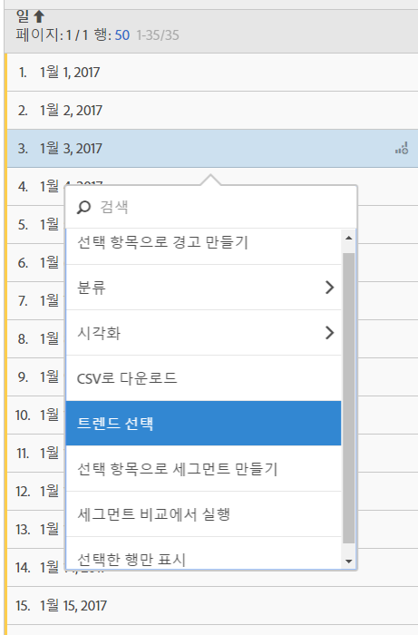

# 자유 형식 테이블

Analysis Workspace에서 데이터 테이블(자유 형식 테이블)은 보고서 테이블일 뿐만 아니라 대화형 시각화이기도 합니다. 개별 행, 선택한 다수의 행 또는 전체 테이블과 상호 작용할 수 있습니다.

한 개 테이블에 최대 400개의 행을 표시할 수 있습니다.

다음과 같은 고유한 방식으로 테이블과 상호 작용할 수 있습니다.

* [테이블 선택에서 경고 만들기](/help/components/c-alerts/alert-builder.md)
* 먼저 [분류](../../../analyze/analysis-workspace/components/dimensions/t-breakdown-fa.md#task_B594DA2476E84DFDA8279E831F0BD9C4)를 실행하고 인라인 세그먼트 만들기(마우스 오른쪽 단추 클릭)
* Run [visualizations](../../../analyze/analysis-workspace/visualizations/freeform-analysis-visualizations.md#concept_09242627629147A88A68F1506954C276) on specific cells
* Export rows to [CSV](../../../analyze/analysis-workspace/curate-share/download-send.md#concept_BB548979F47F45739679B830428C3025)
* 선택한 셀에서 [트렌드](../../../analyze/analysis-workspace/analysis-workspace-features.md#section_34930C967C104C2B9092BA8DCF2BF81A) 시각화 실행
* 선택 사항에서 [세그먼트](../../../analyze/analysis-workspace/components/t-freeform-project-segment.md#task_11C6A2C7717B48049E5750B9D20FEC80) 생성
* [세그먼트 비교 수행](../../../analyze/analysis-workspace/c-panels/c-segment-comparison/segment-comparison.md#concept_74FAC1C6D0204F9190A110B0D9005793)
* 선택한 행만 표시

See [Create an Analysis Workspace project](../../../analyze/analysis-workspace/build-workspace-project/t-freeform-project.md#task_C2C698ACC7954062A28E4784911E6CF2) for more information.
