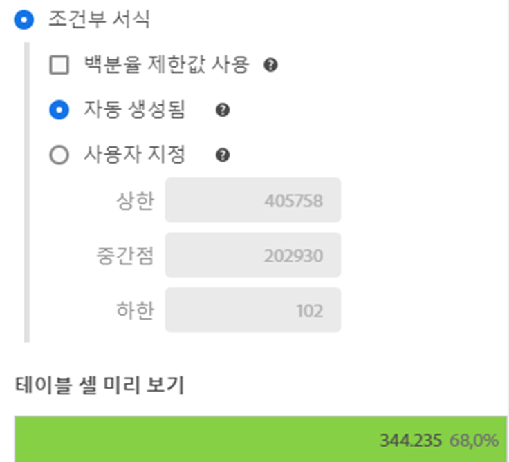
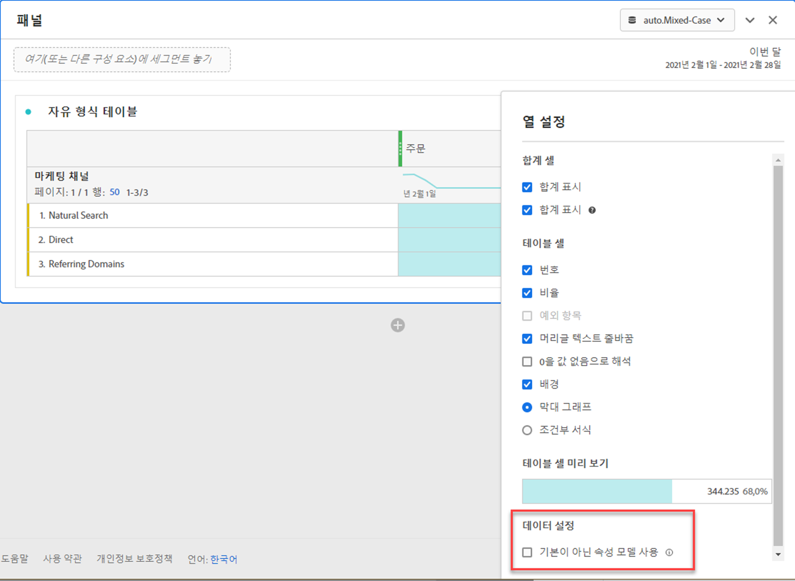
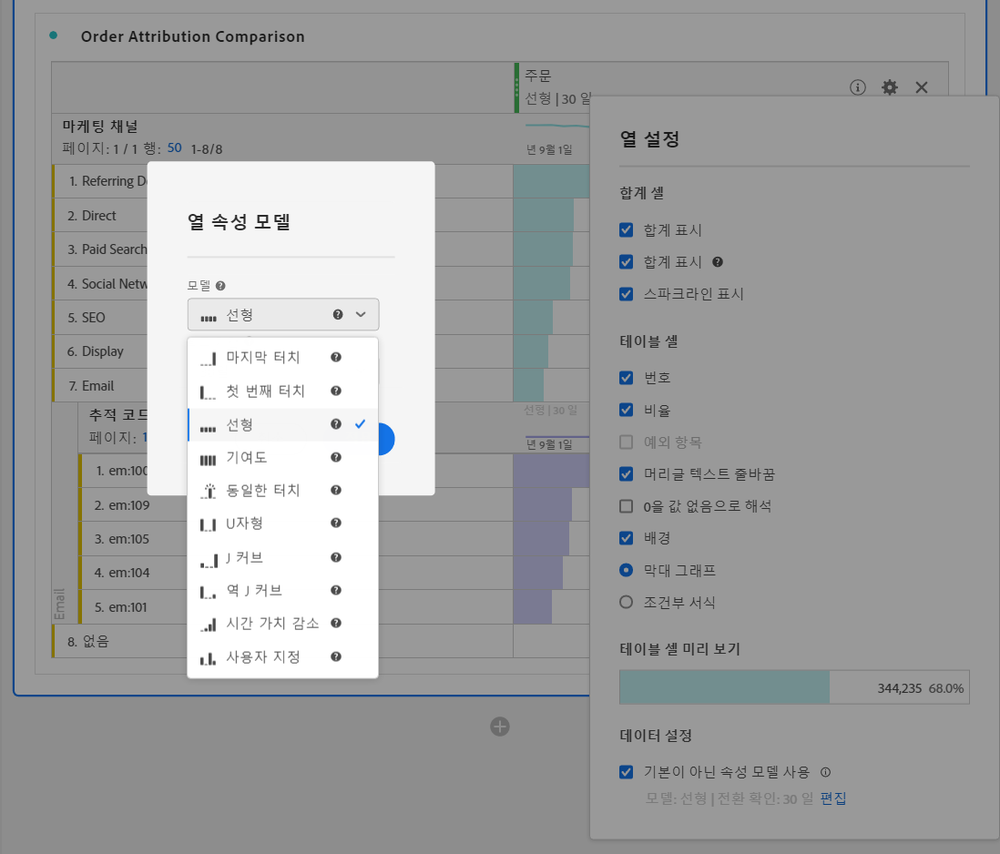

# 열 설정

[!UICONTROL 열 설정]을 사용하면 열 서식을 구성할 수 있으며, 열 서식 일부는 조건부일 수 있습니다.

>[!BEGINSHADEBOX]

데모 비디오를 보려면  [자유 형식 테이블의 행 및 열 설정](https://video.tv.adobe.com/v/40382/?quality=12&learn=on){target="_blank"}을 확인하십시오.

>[!ENDSHADEBOX]

[!UICONTROL 열 설정]에 액세스하려면 열 머리글에서 을 선택합니다.

한 번에 여러 열에 대한 설정을 편집할 수 있습니다. 여러 열을 선택하고 선택한 열 중 하나에서 을 선택합니다. 변경 사항은 셀이 선택된 모든 열에 적용됩니다.

| 옵션 | 설명 |
| --- | --- |
| **[!UICONTROL 합계 표시]** | 열의 클라이언트측 합계를 표시합니다. 이 합계는 세션이나 개인 등의 지표를 중복 제거하지 **않습니다**. |
| **[!UICONTROL 합계 표시]** | 열의 서버측 합계를 표시합니다. 총계는 세션이나 개인 등의 지표를 중복 제거합니다. |
| **[!UICONTROL 스파크라인 표시]** | 열 머리글에 선 차트를 표시합니다. |
| **[!UICONTROL 숫자]** | 셀에 지표에 대한 숫자 값을 표시할지 또는 숨길지를 결정합니다. 예를 들어 지표가 페이지 조회수이면 숫자 값은 행 항목에 대한 페이지 조회수입니다. |
| **[!UICONTROL 백분율]** | 셀에 지표에 대한 퍼센트 값을 표시할지 또는 숨길지를 결정합니다. 예를 들어 지표가 페이지 조회수이면, 퍼센트 값은 행 항목에 대한 페이지 조회수를 해당 열에 대한 총 페이지 조회수로 나눈 수입니다.  참고: 정확성을 보장하기 위해 100%보다 큰 백분율도 가능합니다. 열 너비가 너무 커지는 것을 방지하기 위해 상한값을 1,000%까지 조정할 수 있습니다. |
| **[!UICONTROL 예외 항목 표시]** | 이 열의 값에 대해 예외 항목 탐지가 실행되는지 여부를 결정합니다. |
| **[!UICONTROL 예측 표시]** | 예측 값이 이 열에 표시되는지 결정합니다. |
| **[!UICONTROL 머리글 텍스트 줄바꿈]** | 자유 형식 테이블의 머리글 텍스트를 줄바꿈하여 머리글을 더 읽기 쉽게 하고 테이블을 더 공유하기 쉽게 할 수 있습니다. 줄바꿈은 PDF 렌더링 및 긴 이름을 사용하는 지표에 유용합니다. 기본적으로 사용됩니다. |
| **[!UICONTROL 0을 값 없음으로 해석]** | 값이 0인 셀에 대해, 0을 표시할지 아니면 빈 셀을 표시할지를 결정합니다. 이 해석은 달의 각 날에 대한 데이터를 볼 때 유용하며, 어떤 날은 미래에 있을 수 있습니다.  차후의 날짜에 대해 0을 표시하는 대신 빈 셀을 표시합니다. 차트도 이 설정을 준수합니다(즉, 차트에는 값이 0인 선이나 막대가 표시되지 않습니다). |
| **[!UICONTROL 배경]** | 막대 그래프 및 조건부 서식을 포함하여, 셀에 모든 셀 서식을 표시할지 또는 숨길지를 결정합니다. |
| **[!UICONTROL 막대 그래프]** | 열에 대한 합계와 상대적인 셀 값을 나타내는 수평 막대 그래프를 표시합니다. |
| **[!UICONTROL 조건부 서식]** | 조건부 서식 사용. 아래 [섹션](#conditional-formatting)을 참조하십시오. |
| **[!UICONTROL 테이블 셀 미리보기]** | 각 셀이 현재 선택된 서식 선택 사항이 적용되면 어떻게 나타나는지 미리보기. |
| **[!UICONTROL 비기본 속성 모델 사용]** | 비기본 속성 모델 사용. 아래 [섹션](#use-non-default-attribution-model)을 참조하십시오. |

## 조건부 서식 {#conditional-formatting}

조건부 서식을 지정하면 정의할 수 있는 상한, 중간점 및 하한에 서식이 적용됩니다. 자유 형식 테이블 내 조건부 서식도 [!UICONTROL 사용자 정의] 제한을 선택하지 않은 경우 분류에서 자동으로 적용할 수 있게 됩니다.

| 조건부 서식 옵션 | 설명 |
| --- | --- |
| **[!UICONTROL 백분율 제한값 사용]** | 절댓값이 아니라 백분율에 따라 제한 범위 변경. 백분율 제한값 범위는 비율만을 기반으로 하는 지표(예: 바운스 비율) 및 개수와 비율이 있는 지표(예: 페이지 조회수)에서 작동합니다. |
| **[!UICONTROL 자동 생성]** | 데이터를 기반으로 상한/중간/하한을 자동으로 계산. 상한은 이 열에서 가장 큰 값입니다. 하한값은 가장 낮고, 중간값은 상한 및 하한값의 평균값이다. |
| **[!UICONTROL 사용자 정의]** | **[!UICONTROL 상한]**, **[!UICONTROL 중간점]** 및 **[!UICONTROL 하한]**&#x200B;을 수동으로 할당합니다. 제한값을 통해 열 값이 양호, 평균 또는 나쁨일 때를 유연하게 확인할 수 있습니다. |
| **[!UICONTROL 조건부 서식 팔레트]** | 미리 구성된 색상 세트를 셀에 적용합니다. 선택한 4개의 색상 구성표에 따라 높은 값, 중간 값, 낮은 값에 다른 색상을 지정합니다.   테이블에서 차원을 바꾸면 조건부 서식 제한이 재설정됩니다. 지표를 바꾸면 해당 열에 대한 제한이 재계산됩니다(지표는 X축에 있고 차원은 Y축에 있음). |

## 비기본 속성 모델 사용 {#use-non-default-attribution-model}

<!-- markdownlint-disable MD034 -->

>[!CONTEXTUALHELP]
>id="workspace_freeformtable_column_usenondefaultattributionmodel"
>title="비기본 속성 모델 사용"
>abstract="선택한 열에 기본이 아닌 속성 모델을 사용합니다."

<!-- markdownlint-enable MD034 -->

<!-- markdownlint-disable MD034 -->

>[!CONTEXTUALHELP]
>id="workspace_freeformtable_column_usenondefaultattributionmodel_disabled"
>title="비기본 속성 모델 사용"
>abstract="이 지표에는 기본이 아닌 속성 모델을 사용할 수 없습니다."

<!-- markdownlint-enable MD034 -->

>[!NOTE]
>
>구성 요소의 비기본 속성 모델에 대한 속성을 업데이트할 때 다음 사항을 고려해야 합니다.
>
>* **보고서에서 *단일 차원***&#x200B;으로 구성 요소를 사용하는 경우: 비기본 속성 모델을 사용할 때 구성 요소의 속성은 배분 모델을 무시합니다.
>
>* **보고서에서 *다중 차원***&#x200B;으로 구성 요소를 사용하는 경우: 비기본 속성 모델을 사용할 때 구성 요소의 속성은 배분 모델을 유지합니다.
>
>

Analysis Workspace에서 지표에 대해 비기본 속성 모델을 사용하는 방법:

1. **[!UICONTROL 비기본 속성 모델 사용]**&#x200B;을 선택합니다. 이미 선택한 경우 **[!UICONTROL 편집]**&#x200B;을 사용하여 속성 모델을 편집합니다. 또는 기본 속성 모델로 돌아가려면 선택을 취소합니다.

   

2. **[!UICONTROL 열 속성 모델]**&#x200B;에서 **[!UICONTROL 모델]**&#x200B;과 **[!UICONTROL 전환 확인 기간]**&#x200B;을 선택합니다. 전환 확인 기간이 각 변환에 적용되는 데이터 속성의 기간을 결정합니다.

   

### 속성 모델

{{attribution-models-details}}

### 컨테이너

{{attribution-container}}

### 전환 확인 기간

{{attribution-lookback-window}}

### 예

{{attribution-example}}

>[!MORELIKETHIS]
>
>* [데이터 소스 관리](/help/analyze/analysis-workspace/visualizations/t-sync-visualization.md)

>[!BEGINSHADEBOX]

데모 비디오를 보려면  [동적 열](https://video.tv.adobe.com/v/23138?quality=12&learn=on){target="_blank"}을 확인하십시오.

>[!ENDSHADEBOX]

