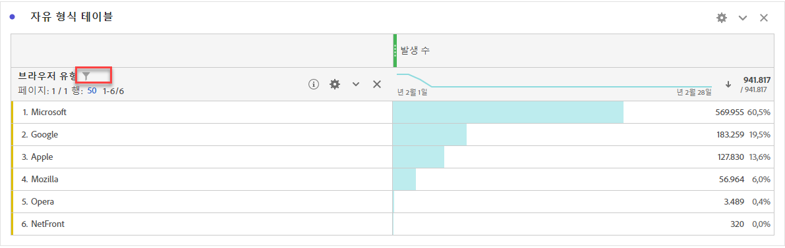
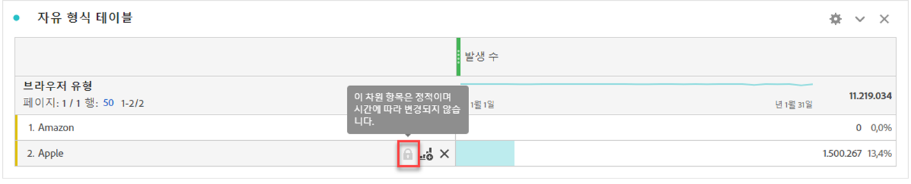
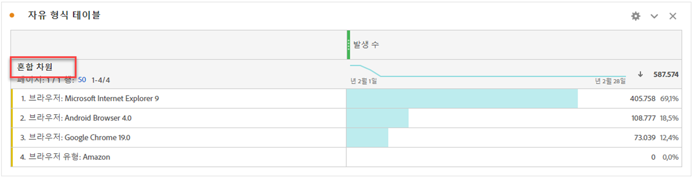

# 자유 형식 테이블의 동적 차원 항목과 정적 차원 항목 비교

자유 형식 테이블의 행과 열에는 다양한 구성 요소 값이 포함될 수 있습니다. 이러한 값은 빌드할 분석에 따라 동적(시간에 따라 변경) 또는 정적(시간에 따라 변경되지 않음)일 수 있습니다.

## 동적 차원 항목

동적 차원 항목은 시간에 따라 변경되며 자유 형식 테이블에서 정렬되는 지표에 따라 달라집니다. 지정된 기간 동안 상위 항목을 분석하려는 경우 동적 차원 항목을 사용하는 것이 좋습니다.

차원을 자유 형식 테이블에 놓으면 동적 행이 반환됩니다. 이 행은 지정된 지표 및 기간에 대한 차원에 해당하는 상위 항목을 나타냅니다. 차원을 자유 형식 테이블 열에 놓을 수도 있으며 이 차원은 상위 5개 차원 항목으로 자동으로 확장됩니다.

예를 들어 브라우저 유형 차원을 테이블로 드래그하면 상위 브라우저 유형 차원 항목(예: Microsoft, Apple, Google 등)이 동적으로 테이블 행에 반환됩니다. 열에 놓으면 상위 5개의 브라우저 유형 차원 항목이 동적으로 반환됩니다.

동적 차원 항목에는 행 필터 옵션이 있고, 자물쇠와 X 아이콘이 **없습니다**.

## 정적 차원 항목

정적 차원 항목은 시간에 따라 변경되지 않습니다. 자유 형식 테이블에서 항상 반환되는 고정 구성 요소입니다. 정적 차원 항목은 특정 캠페인이든 그 주의 특정 요일이든 항상 동일한 항목을 분석하려는 경우 선호됩니다.

특정 구성 요소 값(차원, 지표, 세그먼트, 날짜 범위)을 수동으로 선택하여 테이블에 놓을 때마다 그 결과는 행 또는 열의 정적 목록입니다. 다음 옵션을 선택하면 정적 차원 항목을 생성할 수도 있습니다.

* 행에서 마우스 오른쪽 단추 클릭 > [!UICONTROL 선택한 행만 표시]
* 열에서 마우스 오른쪽 단추 클릭 > [!UICONTROL 정적 항목으로 설정]

예를 들어 Microsoft나 Apple과 같은 특정 브라우저 유형 항목 위로 드래그하면 그 2개의 특정 항목이 항상 테이블에 표시되게 됩니다.

정적 차원 항목에는 행 필터 옵션이 **없습니다**. 대신 각 항목에 자물쇠와 X 아이콘이 표시됩니다. 테이블에서 해당 차원 항목을 제거하려면 X 아이콘을 클릭하십시오.

## 혼합 차원 항목

다른 차원의 차원 항목을 동일한 테이블에 추가할 수 있습니다. 이러한 경우 행 헤더에 &quot;혼합 차원&quot;이 표시됩니다. 이러한 차원 항목은 정적입니다. 예를 들어 브라우저 유형 차원의 특정 차원 항목과 브라우저 차원의 기타 차원 항목을 추가하는 경우가 있습니다.

## 자유 형식 합계 행

동적 및 정적 행은 자유 형식 합계 행에서 다르게 동작합니다. 기본적으로

* 동적 행은 방문 횟수나 방문자 수와 같이 합계로서 계산된 서버 측 및 중복 제거 지표입니다.
* 정적 행은 클라이언트 측에서 합해지며 지표에 대해 중복 제거를 수행하지 **않습니다**. 합계 행 서버 측을 계산하려면 행 설정을 **총계 표시**&#x200B;로 변경하십시오. [추가 정보](https://docs.adobe.com/content/help/ko-KR/analytics/analyze/analysis-workspace/visualizations/freeform-table/workspace-totals.html)
