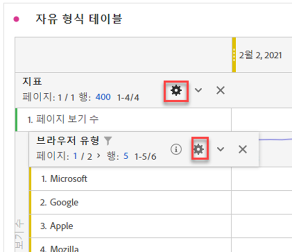

# 행 설정

>[!BEGINSHADEBOX]

데모 비디오를 보려면  [자유 형식 테이블의 행 및 열 설정](https://video.tv.adobe.com/v/328503/?quality=12&learn=on&captions=kor){target="_blank"}을 확인하십시오.

>[!ENDSHADEBOX]

행 설정은 테이블로 드래그한 구성 요소에 따라 다릅니다. 테이블 행 설정에 액세스하려면 이러한 각 오브젝트 내에서 차원, 필터, 지표, 기간 또는 분류 옆에 있는  **[!UICONTROL 설정]**&#x200B;을 선택합니다.

| 설정 | 설명 |
| --- | --- |
| **[!UICONTROL 위치별 분류]** | 기본적으로 이 설정은 비활성화되며 분류는 정적 행 항목에 고정됩니다. 예를 들어 마케팅 채널별로 상위 3개 페이지 차원 항목(홈 페이지, 검색 결과, 체크아웃)을 분류한다고 가정합니다. 그런 다음 프로젝트를 떠났다가 2주 후에 돌아옵니다. 프로젝트를 다시 열면 상위 3개 페이지가 변경되고 대신 이제 홈 페이지, 검색 결과 및 체크아웃이 상위 4-6개 페이지가 됩니다. 기본적으로 마케팅 채널 분류는 4-6행에 있는 경우에도 여전히 홈 페이지, 검색 결과 및 체크아웃 아래에 표시됩니다.   반면 **위치별 분류**&#x200B;는 상위 3개 항목이 무엇인지에 관계없이 항상 상위 3개 항목을 분류합니다. 예를 다시 참조하면, 프로젝트를 다시 열면 마케팅 채널 분류가 표의 상위 3페이지에 연결됩니다. 홈 페이지, 검색 결과 및 체크아웃은 이제 4~6행에 있습니다. |
| **[!UICONTROL 백분율]** | **열별 백분율 계산**(기본값): 셀에 표시되는 백분율은 열 합계를 기반으로 계산됩니다.  **행별 백분율 계산**: 셀의 백분율은 열 방향이 아니라 행 방향으로 계산되며, 총 합계가 분모입니다. 이 계산은 특히 트렌드 백분율에 유용합니다. |
| **[!UICONTROL 열 합계]** | 이 설정들은 [정적 행](/help/analyze/analysis-workspace/visualizations/freeform-table/column-row-settings/manual-vs-dynamic-rows.md)에만 사용할 수 있습니다.   **현재 행의 합계로 표시**&#x200B;는 테이블에서 행의 클라이언트측 합계를 보여 주며 이는 합계가 방문 또는 개인과 같은 지표에 대한 중복 제거를 수행하지 *않음*&#x200B;을 의미합니다.   **총계 표시**&#x200B;는 서버측 합계를 보여 줍니다. 이는 중복 제거된 지표의 합계를 의미합니다. |

## 행 수 변경

표시되는 행 수를 변경하려면:

1. 테이블의 첫 번째 열의 맨 위에 있는 **[!UICONTROL 행]** 옆의 숫자를 클릭합니다.

   

1. 드롭다운 목록에서 테이블에 표시할 행 수를 선택합니다.

## 컨텍스트 메뉴

차원 헤더를 선택하면 다음과 같은 컨텍스트 메뉴 옵션을 사용할 수 있습니다.

| 옵션 | 설명 |
| --- | --- |
| **[!UICONTROL 클립보드에 선택 항목 복사]** | 시각화에서 클립보드로 선택 항목을 복사합니다. |
| **[!UICONTROL CSV로 항목 다운로드(*차원 이름*)]** | 시각화의 차원 항목(최대 50,000개)을 로컬 디바이스에 즉시 다운로드합니다. 선택한 차원에 최대 50,000개의 차원 항목. |
| **[!UICONTROL CSV로 선택 항목 다운로드]** | 시각화의 차원 항목을 즉시 로컬 디바이스에 다운로드합니다. |
| **[!UICONTROL 모든 차원 항목에 대한 하이퍼링크 만들기]** | 모든 차원 항목에 대한 하이퍼링크를 만듭니다. [자유 형식 테이블의 차원에 대한 하이퍼링크](../freeform-table-hyperlinks.md) 참조 |
| **[!UICONTROL 모든 차원 항목에 대한 하이퍼링크 편집]** | 모든 차원 항목에 대한 하이퍼링크를 편집합니다. [자유 형식 테이블의 차원에 대한 하이퍼링크](../freeform-table-hyperlinks.md) 참조 |
| **[!UICONTROL 모든 차원 항목에 대한 하이퍼링크 제거]** | 모든 차원 항목에 대한 하이퍼링크를 제거합니다. [자유 형식 테이블의 차원에 대한 하이퍼링크](../freeform-table-hyperlinks.md) 참조 |
| **[!UICONTROL 삭제]** | 테이블에서 차원을 삭제합니다. |
| **[!UICONTROL 시각화]** | 사용 가능한 시각화를 사용하여 차원을 시각화합니다. |
| **[!UICONTROL 선택한 행만 표시]** | 시각화에서 선택한 항목만 표시합니다. |
| **[!UICONTROL 선택 항목으로 주석 만들기]** | **[!UICONTROL 주석 세부 정보]**&#x200B;를 열어 주석을 추가합니다. |

자유 형식 테이블에서 하나 이상의 차원 항목(첫 번째 열) 또는 하나 이상의 개별 셀을 선택할 때 다음과 같은 추가 컨텍스트 메뉴 옵션을 사용할 수 있습니다.

| 옵션 | 설명 |
| --- | --- |
| **[!UICONTROL 하이퍼링크 만들기]** | 해당 항목에 대한 하이퍼링크를 만듭니다. [자유 형식 테이블의 차원에 대한 하이퍼링크](../freeform-table-hyperlinks.md) 참조 |
| **[!UICONTROL 하이퍼링크 편집]** | 해당 항목에 대한 하이퍼링크를 편집합니다. [자유 형식 테이블의 차원에 대한 하이퍼링크](../freeform-table-hyperlinks.md) 참조 |
| **[!UICONTROL 하이퍼링크 제거]** | 해당 항목에 대한 하이퍼링크를 제거합니다. [자유 형식 테이블의 차원에 대한 하이퍼링크](../freeform-table-hyperlinks.md) 참조 |
| **[!UICONTROL 분류]** | 차원 항목을 분류합니다. **[!UICONTROL 차원]**, **[!UICONTROL 지표]**, **[!UICONTROL 필터]** 또는 **[!UICONTROL 날짜 범위]** 목록에서 선택합니다. *검색*&#x200B;을 사용하여 구성 요소를 대체 검색합니다. |
| **[!UICONTROL 선택 항목 삭제]** | 선택한 행(항목)을 삭제합니다. |
| **[!UICONTROL 트렌드 선택]** | 선택 항목에 대한 트렌드 라인 차트 시각화를 만듭니다. |
| **[!UICONTROL 선택한 행만 표시]** | 시각화에서 선택한 행만 표시합니다. |
| **[!UICONTROL 모든 행 표시]** | 시각화에 모든 행을 표시합니다. |
| **[!UICONTROL 선택 항목으로 필터 만들기]** | 선택 항목을 기준으로 필터를 만들려면 **[!UICONTROL 필터 빌더]**&#x200B;를 엽니다. |
| **[!UICONTROL 선택 항목으로 대상자 만들기]** | 선택 항목을 기준으로 대상자를 빌드하려면 **[!UICONTROL 대상자 만들기]** 대화 상자를 엽니다. |

지표 열 머리글을 선택할 때 다음과 같은 추가 컨텍스트 메뉴 옵션을 사용할 수 있습니다.

| 옵션 | 설명 |
|---|---|
| **[!UICONTROL 선택 항목으로 지표 만들기]** | 선택한 지표에서 새 지표를 만듭니다. 지표는 평균, 미디어, 열 최대값, 열 최소값, 열 합계가 될 수 있습니다. 계산된 지표 빌더에서 열기를 선택하여 계산된 지표를 만들 수도 있습니다. |
| **[!UICONTROL 기간 열 추가]** | 기간 열을 추가합니다. 패널의 캘린더 범위에 따라 *날짜 범위*&#x200B;가 결정되는 여러 옵션이 제공됩니다. <li>**[!UICONTROL 이 날짜 범위보다 이전 *날짜 범위*]**</li><li>**[!UICONTROL 이 날짜 범위까지 이 *날짜 범위*]**.</li><li>**[!UICONTROL 이 날짜 범위에 해당하는 사용자 정의 날짜 범위]**. **[!UICONTROL 날짜 범위 빌더]**&#x200B;를 열어서 날짜 범위를 지정합니다.</li>자세한 내용은 [날짜 비교](/help/analyze/analysis-workspace/components/calendar-date-ranges/time-comparison.md)를 참조하십시오. |
| **[!UICONTROL 기간 비교]** | 비교 기간 열을 추가합니다. 차원이 시간을 기준으로 하지 않을 때만 사용할 수 있습니다. *날짜 범위*&#x200B;를 결정하는 몇 가지 옵션이 제공됩니다. <li>**[!UICONTROL 이 날짜 범위보다 이전 *날짜 범위*]**</li><li>**[!UICONTROL 이 날짜 범위에 해당하는 사용자 정의 날짜 범위]**. **[!UICONTROL 날짜 범위 빌더]**&#x200B;를 열어서 날짜 범위를 지정합니다.</li>자세한 내용은 [날짜 비교](/help/analyze/analysis-workspace/components/calendar-date-ranges/time-comparison.md)를 참조하십시오. |
| **[!UICONTROL 속성 모델 수정]** | 열에 대한 속성 모델을 수정합니다. |
| **[!UICONTROL 속성 모델 비교]** | 새로운 속성 모델을 지정하고 선택한 열의 속성 모델과 비교합니다. 새로운 속성 모델 지표가 포함된 새 열이 추가되었습니다. 또한 비교를 위해 백분율 변경 열이 추가되었습니다. |
| **[!UICONTROL 열 너비 재설정]** | 열 너비를 기본 너비로 재설정합니다. |
| **[!UICONTROL 선택 항목으로 주석 만들기]** | **[!UICONTROL 주석 세부 정보]**&#x200B;를 열어 주석을 추가합니다. |
| **[!UICONTROL 선택 항목으로 필터 만들기]** | 선택 항목을 기준으로 필터를 만들려면 **[!UICONTROL 필터 빌더]**&#x200B;를 엽니다. |
| **[!UICONTROL 선택 항목으로 대상자 만들기]** | 선택 항목을 기준으로 대상자를 빌드하려면 **[!UICONTROL 대상자 만들기]** 대화 상자를 엽니다. |

## 행 높이 변경

프로젝트의 [보기 밀도](/help/analyze/analysis-workspace/build-workspace-project/view-density.md)를 **[!UICONTROL 작게]**, **[!UICONTROL 편하게]**, **[!UICONTROL 확장]**&#x200B;으로 설정할 수 있습니다.
