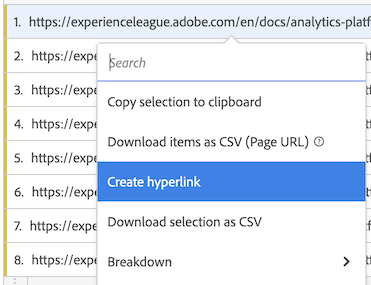
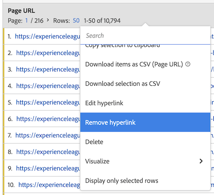

# 자유 형식 테이블에서 차원에 대한 하이퍼링크 만들기

차원 항목에 대한 하이퍼링크를 만들어 Analysis Workspace의 자유 형식 테이블 내에서 클릭할 수 있도록 할 수 있습니다.

이 기능은 다음 유형의 차원 항목에 대한 하이퍼링크를 만들 때 특히 유용합니다.

* 연결할 URL 값이 있는 Dimension 항목(예: 페이지 URL 차원)

* 연결할 URL 값이 있는 분류가 포함된 Dimension 항목(예: 페이지 URL 차원의 분류가 있는 페이지 이름 차원)

* 연결할 URL의 일부인 값이 있는 Dimension 항목 또는 분류(예: URL의 일부인 페이지 이름 차원)

## 하나 이상의 차원 항목에 대한 하이퍼링크 만들기

차원 항목에 대한 하이퍼링크를 만들 때 다음 사항을 고려하십시오.

* 만든 하이퍼링크는 Analysis Workspace 프로젝트 내의 자유 형식 테이블에 저장됩니다. 다른 테이블 또는 다른 프로젝트에서 동일한 차원 또는 차원 항목을 사용할 때는 하이퍼링크가 유지되지 않습니다.

* 자유 형식 테이블의 데이터 보기를 변경하는 경우, 차원이 데이터 보기에 있는 경우 테이블의 차원 또는 차원 항목에 대해 생성된 모든 하이퍼링크를 계속 사용할 수 있습니다.

* 하이퍼링크를 만들 때 URL의 유효성을 검사하지 않습니다.

  잘못된 URL이 있는 하이퍼링크를 만들거나 URL 값이 없는 차원 항목을 참조하는 하이퍼링크를 만드는 경우(차원 항목을 직접 참조하거나 `$value` 또는 `$breakdown` 변수)를 클릭하면 하이퍼링크를 클릭하는 사용자에게 URL이 유효하지 않다는 오류 메시지가 표시됩니다.

* 단일 차원 항목에 대해 생성된 하이퍼링크는 차원에 생성된 하이퍼링크를 덮어씁니다.

* 하이퍼링크가에서 작동하지 않음 [다운로드한 PDF 파일](/help/analyze/analysis-workspace/curate-share/download-send.md).

하나 이상의 차원 항목에 대한 하이퍼링크를 생성하려면 다음을 수행합니다.

1. Analysis Workspace의 자유 형식 테이블에서 다음 중 하나를 수행합니다.

   * **단일 차원 항목에 대한 하이퍼링크를 생성합니다.** 하이퍼링크를 생성할 테이블 내의 차원 항목을 마우스 오른쪽 버튼으로 클릭한 다음 를 선택합니다 [!UICONTROL **하이퍼링크 만들기**].

     

     다음 [!UICONTROL **하이퍼링크 만들기**] 대화 상자가 표시됩니다. 하이퍼링크를 생성할 차원 항목의 이름이 대화 상자에 표시됩니다.

     

   * **차원 열의 모든 차원 항목에 대한 하이퍼링크를 만듭니다.** 차원 열 헤더에서 차원 이름을 마우스 오른쪽 버튼으로 클릭한 다음 을 선택합니다 [!UICONTROL **모든 차원 항목에 대한 하이퍼링크 만들기**].

     

     다음 [!UICONTROL **모든 차원 항목에 대한 하이퍼링크 만들기**] 대화 상자가 표시됩니다. 하이퍼링크를 만들 차원의 이름이 대화 상자에 표시됩니다.

     

1. 다음 선택 사항 중 하나를 선택합니다.

   * [!UICONTROL **차원 항목의 값을 URL로 사용**]: 페이지 URL 차원과 같이 URL 값이 있는 차원 항목에 대해 이 옵션을 선택합니다.

     예를 들어 각 차원 항목의 값이 URL인 페이지 URL 차원을 사용하는 경우 이 옵션을 선택하면 URL에 대한 하이퍼링크가 만들어집니다.

   * [!UICONTROL **사용자 지정 URL 만들기**]: 정적 또는 동적 사용자 지정 URL을 지정합니다. URL 값이 없는 차원 항목에 대한 하이퍼링크를 만들려면 이 옵션을 선택합니다.

     예를 들어, 각 차원 항목의 값이 전체 URL이 아닌 페이지 이름인 페이지 이름 차원을 사용하는 경우 이 옵션을 선택하면 차원 항목에 대한 링크로 사용할 하이퍼링크를 지정할 수 있습니다.

     여러 차원 항목에 대한 동적 URL을 생성하려면 다음을 사용할 수 있습니다. `$value` 및 `$breakdown` 변수를 사용자 지정 URL에 포함시킵니다. 자세한 내용은 아래 표를 참조하십시오.

     사용자 지정 URL을 만들려면 다음 정보를 지정하십시오.

     | 필드 | 설명 |
     |---------|----------|
     | [!UICONTROL **사용자 정의 URL**] | 하이퍼링크에 사용할 사용자 지정 URL을 지정합니다. URL은 정규화된 URL로 입력해야 합니다. 예: https://www.example.com
생성하는 사용자 지정 URL은 정적 또는 동적 URL일 수 있습니다.
 <ul><li>**정적 URL:** 개별 차원 항목에 대한 하이퍼링크를 만드는 경우 정적 URL이면 충분할 수 있습니다. 
다음 예를 생각해 보십시오.예를 들어 페이지 이름 차원 항목이 있는 경우 페이지 이름과 연결할 특정 웹 페이지에 사용자를 연결하는 정적 URL을 만들 수 있습니다.

내부 wiki 페이지 내의 설명서에서 각 정의에 연결된 차원 항목 목록에 대한 하이퍼링크를 만들려고 한다고 가정합니다.

각 차원 항목에 대한 정적 URL을 생성하여 이를 수행할 수 있습니다. 예:

https://wiki.internal.company_name/page_name#item_definition
</li><li>**동적 URL:** 차원 열의 여러 차원 항목 또는 모든 차원 항목에 대한 하이퍼링크를 만드는 경우 동적 URL이 더 실용적일 수 있습니다. 
사용자 지정 URL을 동적으로 만들려면 차원 자체의 값 또는 분류 차원의 값에 따라 URL이 동적으로 변경될 수 있는 변수를 URL 내에 포함합니다.

변수를 사용할 때 URL에서 유효하지 않은 문자(예: 공백)가 포함된 모든 차원 항목은 URL로 인코딩됩니다.

다음 변수를 사용할 수 있습니다. (**참고**: 동일한 URL에서 이러한 변수를 사용할 수 있지만, 별도로 사용하는 것이 더 일반적일 수 있습니다.)
 <ul><li>**`$value`:** 지정한 URL에 차원 항목의 값을 삽입할 수 있습니다. 
예를 들어 다음 시나리오를 생각해 보십시오.

자유 형식 테이블의 모든 페이지 이름 차원 항목에 대한 하이퍼링크를 만들려고 한다고 가정합니다. 여기서 각 차원 항목의 값은 웹 페이지의 URL의 일부입니다. 이 경우 각 차원 항목에 대해 동적으로 조정되는 단일 사용자 지정 URL을 구성할 수 있습니다. 

다음을 추가하여 이를 수행할 수 있습니다. `$value` 변수를 지정한 사용자 지정 URL의 끝에 추가합니다. 예:
 
https://company-name.com/browse/product#$value

이 사용자 지정 URL을 값이 &quot;ProductY&quot; 및 &quot;ProductZ&quot;인 페이지 이름 차원 항목에 적용하면 생성된 하이퍼링크는 다음과 같이 표시됩니다. 

https://company-name.com/browse/product#ProductY

및

 https://company-name.com/browse/product#ProductZ 

**팁**: 를 추가하려는 경우 `$value` 변수를 사용자 지정 URL 필드에 매핑하는 것은 [!UICONTROL **차원 항목의 값 사용**] 옵션을 사용하여 URL을 만들 수 있습니다.
</li><li>**`$breakdown`:** 분류 차원 항목의 값을 지정한 URL에 삽입할 수 있습니다. 이를 통해 제품 ID 또는 페이지 URL 차원과 같이 사용자에게 친숙한 차원을 사용하지 않을 수 있는 분류 차원을 기반으로 하이퍼링크를 생성하는 동안 보고서에 사용자에게 친숙한 이름의 차원(예: 제품 이름 차원)을 사용할 수 있습니다.
분류 차원을 참조할 때 주어진 차원 항목에 대해 하나의 분류 항목만 있는 것이 가장 일반적입니다. 주어진 차원 항목에 대해 여러 분류 항목이 있는 경우 URL에서 첫 번째 분류 항목의 값이 사용됩니다. 분류 항목이 나열되지 않으면 URL이 유효하지 않게 됩니다. 테이블에 적용되는 것과 동일한 정렬 순서가 분류 항목에 적용됩니다.

다음에서 분류 차원을 지정합니다. [!UICONTROL **분류 차원**] 아래 필드.
 
다음에 대해 설명된 예제 시나리오를 고려하십시오. [!UICONTROL **분류 차원**] 아래 필드.
</li></ul> |
     | [!UICONTROL **분류 차원 (선택 사항)**] | 사용할 분류 차원의 이름을 입력한 다음 드롭다운 목록에서 선택합니다. 
이 필드에서 분류 차원을 선택하는 경우 다음을 사용하여 참조해야 합니다. `$breakdown` 변수를에 지정하는 URL의 [!UICONTROL **사용자 정의 URL**] 필드.

예를 들어 다음 시나리오를 생각해 보십시오.

자유 형식 테이블의 모든 제품 이름 차원 항목에 대한 하이퍼링크를 만들려고 한다고 가정합니다. 각 제품 이름 차원 항목에는 제품 ID 차원에 대한 분류가 포함됩니다.

이 경우 제품 ID 분류 차원의 값을 사용하여 사용자를 제품 페이지로 안내하는 각 제품 이름 차원에 대한 하이퍼링크를 만들 수 있습니다. 

다음을 추가하여 이를 수행할 수 있습니다. `$breakdown` 변수를에서 지정하는 사용자 지정 URL의 끝으로 [!UICONTROL **사용자 정의 URL**] 필드. 예:

https://company-name.com/browse/product/$breakdown

이 사용자 지정 URL을 값이 &quot;ProductY&quot; 및 &quot;ProductZ&quot;인 분류 차원 항목을 포함하는 제품 이름 차원 항목에 적용할 경우 생성된 하이퍼링크는 다음과 같이 표시됩니다.

https://company-name.com/browse/product/ProductY

및

https://company-name.com/browse/product/ProductZ

그런 다음, [!UICONTROL **분류 차원**] 필드 

 |

1. [!UICONTROL **만들기**]&#x200B;를 선택합니다.

   자유 형식 테이블을 보는 사용자에게는 하이퍼링크된 차원 항목이 표시됩니다. 차원 항목을 클릭하면 별도의 브라우저 탭에 있는 하이퍼링크가 연결된 페이지로 이동합니다.

   <!-- add screenshot of a table with hyperlinks.-->

1. [프로젝트 저장](/help/analyze/analysis-workspace/build-workspace-project/save-projects.md) 변경 사항을 저장합니다.

## 하이퍼링크 편집

자유 형식 테이블의 차원 또는 차원 항목에 생성된 하이퍼링크를 편집할 수 있습니다.

1. Analysis Workspace의 자유 형식 테이블에서 다음 중 하나를 수행합니다.

   * **단일 차원 항목에 대한 하이퍼링크 편집:** 하이퍼링크를 편집할 테이블 내의 차원 항목을 마우스 오른쪽 버튼으로 클릭합니다.

     

   * **차원 열의 모든 차원 항목에 대한 하이퍼링크 편집:** 차원 열 헤더에서 차원 이름을 마우스 오른쪽 버튼으로 클릭합니다.

     

1. 선택 [!UICONTROL **하이퍼링크 편집**] 마우스 오른쪽 단추 클릭 메뉴에서

   다음 [!UICONTROL **차원 항목에 대한 하이퍼링크 편집**] 대화 상자가 표시됩니다.

1. 하이퍼링크 편집을 위한 구성 옵션에 대한 자세한 내용은 [하나 이상의 차원 항목에 대한 하이퍼링크 만들기](#create-hyperlinks-for-one-or-more-dimension-items) 위의 섹션에서 을(를) 선택한 다음 [!UICONTROL **적용**] 업데이트가 끝나면

1. [프로젝트 저장](/help/analyze/analysis-workspace/build-workspace-project/save-projects.md) 변경 사항을 저장합니다.

## 하이퍼링크 제거

자유 형식 테이블의 차원 항목에 대해 생성된 하이퍼링크를 제거할 수 있습니다.

>[!NOTE]
>
>자유 형식 테이블에서 하이퍼링크가 포함된 차원을 삭제하는 경우 동일한 차원을 자유 형식 테이블에 다시 추가하면 하이퍼링크가 유지되지 않습니다.

차원 항목에서 하이퍼링크를 제거하려면 다음을 수행합니다.

1. Analysis Workspace의 자유 형식 테이블에서 다음 중 하나를 수행합니다.

   * **단일 차원 항목에서 하이퍼링크 제거:** 하이퍼링크를 제거할 테이블 내의 차원 항목을 마우스 오른쪽 버튼으로 클릭합니다.

     

   * **차원 열의 모든 차원 항목에서 하이퍼링크 제거:** 차원 열 헤더에서 차원 이름을 마우스 오른쪽 버튼으로 클릭합니다.

     

1. 선택 [!UICONTROL **하이퍼링크 제거**] 마우스 오른쪽 단추 클릭 메뉴에서

   하이퍼링크는 단일 차원 항목(단일 차원 항목을 선택한 경우) 또는 모든 차원 항목(차원 열 헤더에서 차원 이름을 선택한 경우)에서 제거됩니다.

1. [프로젝트 저장](/help/analyze/analysis-workspace/build-workspace-project/save-projects.md) 변경 사항을 저장합니다.
