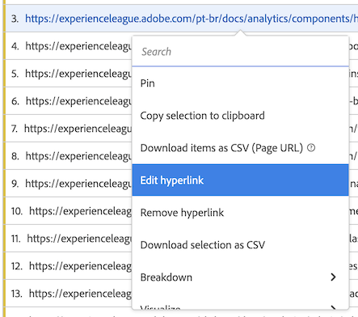

# 하이퍼링크 만들기

차원 항목에 대한 하이퍼링크를 만들어 Analysis Workspace의 자유 형식 테이블 내에서 해당 항목을 클릭하도록 할 수 있습니다.

이 기능은 다음 유형의 차원 항목에 대한 하이퍼링크를 만들 때 특히 유용합니다.

* URL 값이 있는 차원 항목(예: 페이지 URL 차원).

* URL 값이 있는 분류 포함 차원 항목(예: 페이지 URL 차원의 분류가 있는 페이지 이름 차원).

* URL의 일부인 값을 갖는 차원 항목 또는 분류(예: URL의 일부인 페이지 이름 차원).

>[!BEGINSHADEBOX]

데모 비디오는  [차원의 하이퍼링크](https://video.tv.adobe.com/v/3430411?quality=12&learn=on){target="_blank"}를 참조하십시오.

>[!ENDSHADEBOX]

## 하이퍼링크 만들기

하나 이상의 차원 항목에 대한 하이퍼링크를 만들 때 다음 사항을 고려해야 합니다.

* 사용자가 만든 하이퍼링크는 Analysis Workspace 프로젝트 내의 자유 형식 테이블에 저장됩니다. 다른 테이블이나 다른 프로젝트에서 동일한 차원이나 차원 항목을 사용하는 경우 하이퍼링크는 지속되지 않습니다.

* 자유 형식 테이블의 보고서 세트를 변경하면 테이블의 차원 또는 차원 항목에 대해 생성된 모든 하이퍼링크를 계속 사용할 수 있습니다. 이 기능은 차원이 보고서 세트에 여전히 존재한다고 가정합니다.

* 하이퍼링크를 생성할 때 URL의 유효성을 검사하지 않습니다. 만약

   * 잘못된 URL이 있는 하이퍼링크를 만들거나
   * URL 값이 없는 차원 항목 참조 하이퍼링크를 만듭니다(차원 항목을 직접 참조하거나 `$value` 또는 `$breakdown` 변수),

  그러면 하이퍼링크를 클릭한 사용자에게 URL이 잘못되었다는 오류 메시지가 표시됩니다.

* 단일 차원 항목에 대해 생성된 하이퍼링크는 차원에 대해 생성된 하이퍼링크보다 우선합니다.

* 하이퍼링크는 [다운로드된 PDF 파일](/help/analyze/analysis-workspace/curate-share/download-send.md)에서 작동하지 않습니다.

하나 이상의 차원 항목에 대한 하이퍼링크를 만드는 방법:

1. Analysis Workspace의 자유 형식 테이블에서 다음 중 하나를 수행합니다.

   * **단일 차원 항목에 대한 하이퍼링크 만들기:** 하이퍼링크를 만들려는 테이블 내의 차원 항목을 마우스 오른쪽 버튼으로 클릭한 다음 [!UICONTROL **하이퍼링크 만들기**]&#x200B;를 선택합니다.

      1. 차원 항목의 컨텍스트 메뉴를 엽니다.
      1. 컨텍스트 메뉴에서 [!UICONTROL **하이퍼링크 만들기**]&#x200B;를 선택합니다.

         [!UICONTROL **하이퍼링크 만들기**] 대화 상자가 표시됩니다. 하이퍼링크를 만들려는 차원 항목의 이름이 대화 상자에 표시됩니다.

         

   * **차원 열의 모든 차원 항목에 대한 하이퍼링크 만들기:** 차원 열 머리글에서 차원 이름을 마우스 오른쪽 버튼으로 클릭한 다음 [!UICONTROL **모든 차원 항목에 대한 하이퍼링크 만들기**]&#x200B;를 선택합니다.

      1. 차원 열 머리글에서 컨텍스트 메뉴를 엽니다.
      1. 컨텍스트 메뉴에서 [!UICONTROL **모든 차원 항목에 대한 하이퍼링크 만들기**]&#x200B;를 선택합니다.

         <!-- Do we really need a screenshot  -->

         [!UICONTROL **모든 차원 항목에 대한 하이퍼링크 만들기**] 대화 상자가 표시됩니다. 하이퍼링크를 만들려는 차원의 이름이 대화 상자에 표시됩니다.

         

1. 다음 선택 사항 중 하나를 선택합니다.

   * [!UICONTROL **차원 항목의 값을 URL로 사용**]: 페이지 URL 차원과 같이 URL 값이 있는 차원 항목에 대해 이 옵션을 선택합니다.

     예를 들어 각 차원 항목의 값이 URL인 페이지 URL 차원을 사용하는 경우 이 옵션을 선택하면 URL에 대한 하이퍼링크가 생성됩니다.

   * [!UICONTROL **사용자 정의 URL 만들기**]: 정적 또는 동적 사용자 정의 URL을 지정합니다. URL 값이 없는 차원 항목에 대한 하이퍼링크를 만들려면 이 옵션을 선택합니다.

     예: 각 차원 항목의 값이 페이지의 이름(전체 URL이 아님)인 페이지 이름 차원을 사용하는 경우. 그런 다음 이 옵션을 선택하여 차원 항목의 링크로 사용할 하이퍼링크를 지정합니다.

     다중 차원 항목에 대한 동적 URL을 생성하려면 사용자 정의 URL 내의 `$value` 및 `$breakdown` 변수를 사용할 수 있습니다. 자세한 내용은 아래 테이블을 참조하십시오.

     사용자 정의 URL을 만들려면 다음 정보를 지정합니다.

     | 필드 | 설명 |
     |---------|----------|
     | [!UICONTROL **사용자 정의 URL**] | 하이퍼링크에 사용할 사용자 정의 URL을 지정합니다. URL은 정규화된 URL로 입력해야 합니다. 예: <https://www.example.com>
사용자가 만든 사용자 정의 URL은 정적이거나 동적일 수 있습니다.
 <ul><li>**정적 URL:** 단일 차원 항목 또는 모든 차원 항목을 동일한 URL에 연결하려면 모든 차원 항목에 대해 정적 URL을 지정할 수 있습니다. 예: `https://wiki.internal.example.com/page_name#item_definition`
</li><li>**동적 URL:** 여러 차원 항목 또는 차원 열에 있는 모든 차원 항목에 대해 고유한 하이퍼링크를 만들려면 동적 URL을 만들 수 있습니다.
사용자 정의 URL을 동적으로 만들려면 차원의 값이나 분류 차원의 값에 따라 URL을 변경할 수 있는 변수를 URL에 포함시켜야 합니다.

변수를 사용할 때 URL에 유효하지 않은 문자(예: 공백)가 포함된 모든 차원 항목은 URL로 인코딩됩니다.

사용 가능한 변수는 다음과 같습니다. (**참고**: 동일한 URL에서 이러한 변수를 사용할 수도 있지만 일반적으로는 별도로 사용하는 것이 더 일반적입니다.)
 <ul><li>**`$value`:** 지정한 URL에 차원 항목의 값을 삽입할 수 있습니다. 
자유 형식 테이블에서 모든 페이지 이름 차원 항목에 대한 하이퍼링크를 만들고자 한다고 가정해 보겠습니다. 각 차원 항목의 값은 웹 페이지 URL의 일부입니다. 이 경우 각 차원 항목에 대해 동적으로 조정되는 단일 사용자 정의 URL을 구성할 수 있습니다.  예: `https://example.com/browse/product#\$value`

이 사용자 정의 URL을 “ProductY” 및 “ProductZ” 값을 가진 페이지 이름 차원 항목에 적용하면 생성된 하이퍼링크는 다음과 같이 표시됩니다.  `https://example.com/browse/product#ProductY` 및  `https://example.com/browse/product#ProductZ` 

**팁**: 사용자 정의 URL 필드에 `$value` 변수만 추가하는 것은 URL을 생성할 때 [!UICONTROL **차원 항목 값 사용**] 옵션을 선택하는 것과 동일합니다.
</li><li>**`$breakdown`:** 지정한 URL에 분류 차원 항목의 값을 삽입할 수 있습니다. `$breakdown`을 사용하면 보고서에서 사용자 친화적인 이름의 차원(예: 제품 이름 차원)을 사용할 수 있습니다. 그리고 사용자에게 덜 친화적일 수 있는 분류 차원(예: 제품 ID나 페이지 URL 차원)을 기반으로 하이퍼링크를 생성합니다.
분류 차원을 참조할 때는 주어진 차원 항목에 대해 분류 항목이 하나만 있는 것이 가장 일반적입니다. 주어진 차원 항목에 대해 여러 개의 여러 분류 항목이 있는 경우, 첫 번째 분류 항목의 값이 URL에 사용됩니다. 분류 항목이 나열되어 있지 않으면 URL이 유효하지 않습니다. 테이블에 적용된 것과 동일한 정렬 순서가 분류 항목에 적용됩니다.

아래의 [!UICONTROL **분류 차원**] 필드에 분류 차원을 지정합니다.
 
아래 [!UICONTROL **분류 차원**] 필드에 대해 설명된 예시 시나리오를 고려해야 합니다.
</li></ul> |
     | [!UICONTROL **분류 차원(선택 사항)**] | 사용하려는 분류 차원의 이름을 입력한 다음 드롭다운 목록에서 선택합니다. 
이 필드에서 분류 차원을 선택하는 경우 [!UICONTROL **사용자 정의 URL**] 필드에 지정한 URL의 `$breakdown` 변수를 사용하여 해당 차원을 참조해야 합니다.

자유 형식 테이블의 모든 제품 이름 차원 항목에 대한 하이퍼링크를 만들고 싶다고 가정해 보겠습니다. 각 제품 이름 차원 항목에는 제품 ID 차원에 대한 분류가 포함됩니다.

이 경우, 제품 ID 분류 차원의 값을 사용하여 각 제품 이름 차원에 대한 하이퍼링크를 생성하여 사용자를 제품 페이지로 안내할 수 있습니다. 

`$breakdown`사용자 정의 URL [!UICONTROL **필드에 지정한 사용자 정의 URL의 끝에**] 변수를 추가합니다. 예:

`https://example.com/browse/product/$breakdown`
이 사용자 정의 URL이 제품 이름 차원 항목(값이 “ProductY” 및 “ProductZ”인 분류 차원 항목이 있는 항목)에 적용되는 경우 생성된 하이퍼링크는 다음과 같습니다.  `https://example.com/browse/product/ProductY` 및  `https://example.com/browse/product/ProductZ`

그런 다음 [!UICONTROL **분류 차원**] 필드에서 제품 ID 차원을 선택합니다. 

 |

1. [!UICONTROL **만들기**]&#x200B;를 선택합니다.

   자유 형식 테이블을 보는 사용자는 하이퍼링크된 차원 항목을 보게 됩니다. 차원 항목을 클릭하면 사용자는 별도의 브라우저 탭에 있는 하이퍼링크 페이지로 이동합니다.

   <!-- add screenshot of a table with hyperlinks.-->

1. [프로젝트 저장](/help/analyze/analysis-workspace/build-workspace-project/save-projects.md)으로 변경 사항을 저장합니다

## 하이퍼링크 편집

자유 형식 테이블에서 차원 또는 차원 항목에 대해 생성된 하이퍼링크를 편집할 수 있습니다.

1. Analysis Workspace의 자유 형식 테이블에서 다음 중 하나를 수행합니다.

   * **단일 차원 항목에 대한 하이퍼링크 편집:**

      1. 차원 항목의 컨텍스트 메뉴를 엽니다.
      1. 컨텍스트 메뉴에서 [!UICONTROL **하이퍼링크 편집**]&#x200B;을 선택합니다.

     <!-- Do we really need a screenshot? -->

   * **차원 열의 모든 차원 항목에 대한 하이퍼링크를 편집합니다.**

      1. 차원 열 머리글에서 컨텍스트 메뉴를 엽니다.
      1. 컨텍스트 메뉴에서 **[!UICONTROL 모든 차원 항목에 대한 하이퍼링크 편집]**&#x200B;을 선택합니다.

     <!-- Do we really need a screenshot? -->

1. 마우스 오른쪽 클릭 메뉴에서 [!UICONTROL **모든 차원 항목에 대한 하이퍼링크 편집**]&#x200B;을 선택합니다.

   [!UICONTROL **차원 항목에 대한 하이퍼링크 편집**] 대화 상자가 표시됩니다.

1. 하이퍼링크 편집을 위한 구성 옵션에 대한 자세한 내용은 위의 [하나 이상의 차원 항목에 대한 하이퍼링크 만들기](#create-hyperlinks-for-one-or-more-dimension-items) 섹션에서 3단계를 참조한 다음 업데이트를 마치면 [!UICONTROL **적용**]&#x200B;을 선택합니다.

1. [프로젝트 저장](/help/analyze/analysis-workspace/build-workspace-project/save-projects.md)으로 변경 사항을 저장합니다

## 하이퍼링크 제거

자유 형식 테이블의 차원 항목에 대해 생성된 하이퍼링크를 제거할 수 있습니다.

>[!NOTE]
>
>자유 형식 테이블에서 하이퍼링크가 포함된 차원을 삭제한 경우 동일한 차원을 자유 형식 테이블에 다시 추가하면 하이퍼링크가 지속되지 않습니다.

차원 항목에서 하이퍼링크 제거하는 방법:

1. Analysis Workspace의 자유 형식 테이블에서 다음 중 하나를 수행합니다.

   * **단일 차원 항목에서 하이퍼링크 제거:**

      1. 차원 항목의 컨텍스트 메뉴를 엽니다.
      1. 컨텍스트 메뉴에서 [!UICONTROL **하이퍼링크 제거**]를 선택합니다.
         <!-- Do we really need a screenshot? -->

   * **차원 열의 모든 차원 항목에서 하이퍼링크 제거:**

      1. 차원 열 머리글에서 컨텍스트 메뉴를 엽니다.
      1. 컨텍스트 메뉴에서 **[!UICONTROL 모든 차원 항목에 대한 하이퍼링크 제거]**&#x200B;를 선택합니다.

     <!-- Do we really need a screenshot? [Remove hyperlink from a dimension](assets/hyperlink-dimension-remove.png)-->

   단일 차원 항목을 선택한 경우 단일 차원 항목에서 하이퍼링크가 제거됩니다. 또는 차원 열 머리글에서 차원 이름을 선택한 경우 모든 차원 항목에서 제거됩니다.

1. [프로젝트 저장](/help/analyze/analysis-workspace/build-workspace-project/save-projects.md)으로 변경 사항을 저장합니다
