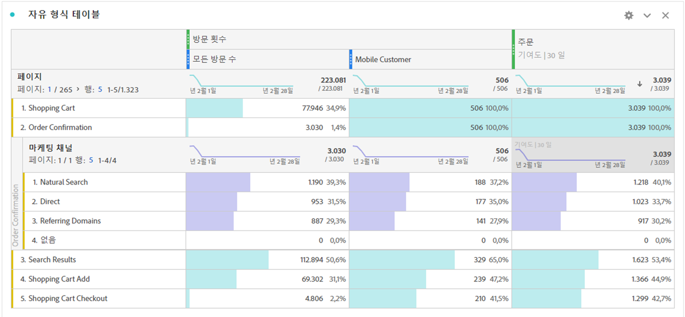
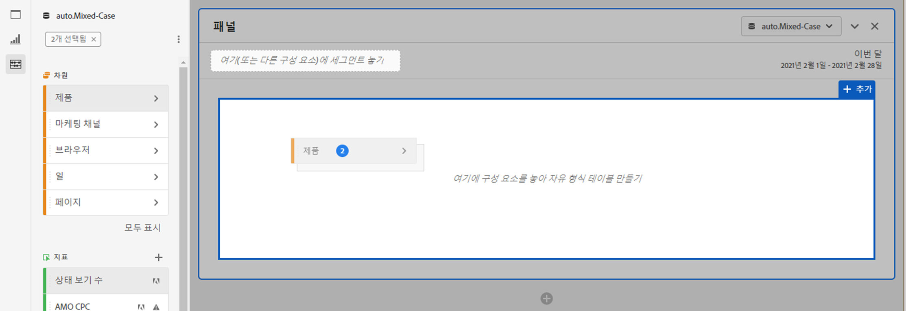
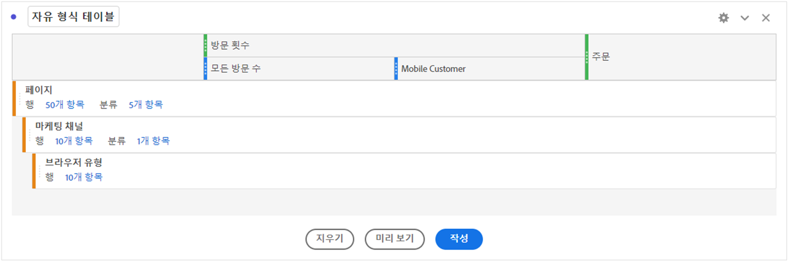
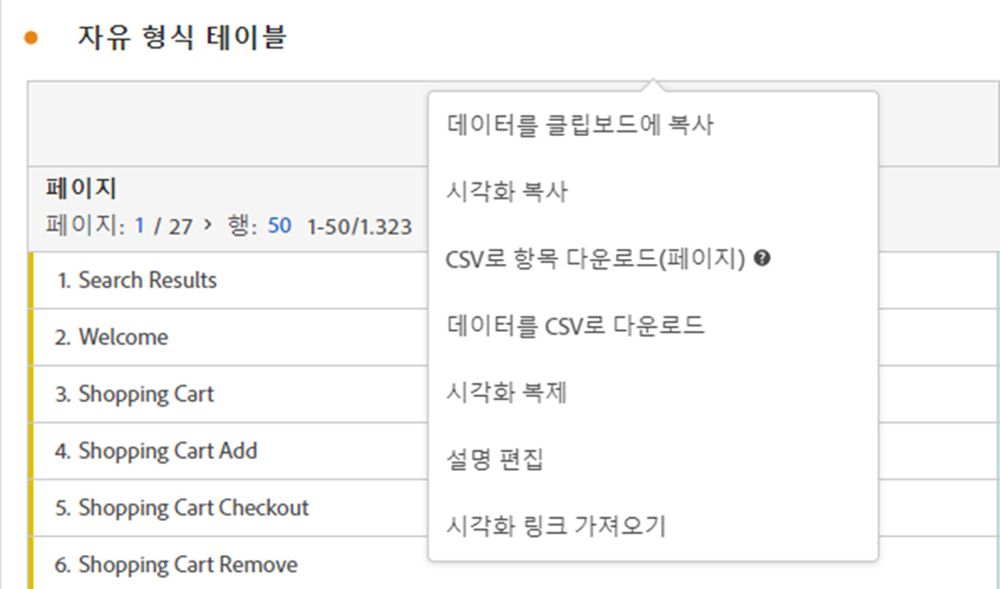

# 자유 형식 테이블

Analysis Workspace에서 자유 형식 테이블은 대화형 데이터 분석을 위한 기반입니다. [구성 요소](https://docs.adobe.com/content/help/ko-KR/analytics/analyze/analysis-workspace/components/analysis-workspace-components.html) 조합을 행과 열로 끌어다 놓아 분석에 사용할 사용자 지정 테이블을 만들 수 있습니다. 각 구성 요소가 삭제되면 테이블이 즉시 업데이트되므로 빠르고 더 깊이 분석할 수 있습니다.

## 자동화된 테이블

테이블을 만드는 가장 빠른 방법은 구성 요소를 빈 프로젝트, 패널 또는 자유 형식 테이블에 직접 놓는 것입니다. 자유 형식 테이블은 권장 형식으로 자동으로 만들어집니다. [자습서를 확인하십시오](https://experienceleague.adobe.com/docs/analytics-learn/tutorials/analysis-workspace/building-freeform-tables/auto-build-freeform-tables-in-analysis-workspace.html).

## 자유 형식 테이블 빌더

먼저 테이블에 여러 구성 요소를 추가한 다음 데이터를 렌더링하려는 경우 자유 형식 테이블 빌더를 활성화할 수 있습니다. 테이블 빌더를 활성화한 상태에서 많은 차원, 분류, 지표 및 세그먼트를 끌어다 놓아 더 복잡한 질문에 대한 답변을 제공하는 표를 작성할 수 있습니다. 데이터는 즉시 업데이트되지 않고 **[!UICONTROL 빌드]**&#x200B;를 클릭하면 업데이트됩니다.

## 테이블 상호 작용

다음과 같은 다양한 방법으로 자유 형식 테이블과 상호 작용하고 사용자 지정할 수 있습니다.

* **다른 결과를 표시했던**
   * 프로젝트의 [보기 밀도](https://docs.adobe.com/content/help/ko-KR/analytics/analyze/analysis-workspace/build-workspace-project/view-density.html)를 조정하여 더 많은 행을 단일 화면에 맞출 수 있습니다.
   * 페이지 매김이 발생하기 전에 각 차원 행에 최대 400개의 행을 표시할 수 있습니다. 행 옆의 숫자를 클릭하여 페이지에 더 많은 행을 표시합니다. 헤더의 페이지 화살표를 사용하여 다른 페이지로 이동합니다.
   * 행을 추가 구성 요소별로 분석할 수 있습니다. 한 번에 여러 행을 분석하려면 여러 행을 선택한 다음 선택한 행 위로 다음 구성 요소를 끌어다 놓으면 됩니다. [분류](https://docs.adobe.com/content/help/ko-KR/analytics/analyze/analysis-workspace/components/dimensions/t-breakdown-fa.html)에 대해 자세히 알아보십시오.
   * 행을 [필터링](https://docs.adobe.com/content/help/ko-KR/analytics/analyze/analysis-workspace/visualizations/freeform-table/pagination-filtering-sorting.html)하여 축소된 항목 세트를 표시할 수 있습니다. 추가 설정은 [행 설정](https://docs.adobe.com/content/help/ko-KR/analytics/analyze/analysis-workspace/visualizations/freeform-table/column-row-settings/table-settings.html)에서 사용할 수 있습니다.

* **열**
   * 구성 요소를 열 내에 스택하여 세그먼트화된 지표, 탭 간 분석 등을 만들 수 있습니다.
   * 각 열의 보기는 [열 설정](https://docs.adobe.com/content/help/ko-KR/analytics/analyze/analysis-workspace/build-workspace-project/column-row-settings/column-settings.html)에서 조정할 수 있습니다.
   * [마우스 오른쪽 단추 클릭 메뉴](https://docs.adobe.com/content/help/en/analytics-learn/tutorials/analysis-workspace/building-freeform-tables/using-the-right-click-menu.html)를 통해 몇 가지 작업을 사용할 수 있습니다. 이 메뉴는 표 머리글, 행 또는 열을 클릭하는지 여부에 따라 다른 작업을 제공합니다.

## 자유 형식 테이블 데이터 내보내기

Analysis Workspace용 모든 데이터 [내보내기 옵션](https://experienceleague.adobe.com/docs/analytics/analyze/analysis-workspace/curate-share/download-send.html)에 대해 자세히 알아보십시오.

* 마우스 오른쪽 단추를 클릭하고 > **[!UICONTROL 클립보드에 데이터 복사]**&#x200B;를 클릭하면 표시된 테이블 데이터가 내보내집니다. 테이블을 선택하면 이 옵션에는 **[!UICONTROL 선택 항목을 클립보드로 복사]**&#x200B;가 표시됩니다. **Ctrl+C** 단축키도 선택한 데이터를 복사합니다.
* 마우스 오른쪽 단추를 클릭하고 > **[!UICONTROL 데이터를 CSV로 다운로드]**&#x200B;를 클릭하면 표시된 테이블 데이터를 CSV로 다운로드합니다. 테이블을 선택하면 이 옵션에는 **[!UICONTROL CSV로 선택 항목 다운로드]**&#x200B;가 표시됩니다.
* 마우스 오른쪽 단추를 클릭하고 > **[!UICONTROL 프로젝트 > CSV로 항목 다운로드]**&#x200B;를 선택하면 선택한 차원에 대해 최대 50,000개의 차원 항목이 내보내집니다.

Analysis Workspace용 모든 데이터 [내보내기 옵션](https://experienceleague.adobe.com/docs/analytics/analyze/analysis-workspace/curate-share/download-send.html)에 대해 자세히 알아보십시오.

