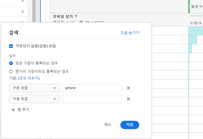

# 테이블 페이지 매김, 필터링 및 정렬

개요를 보려면 이 비디오 튜토리얼을 시청하십시오.

[Analysis Workspace에서 테이블 페이지 매김, 필터링 및 정렬](https://docs.adobe.com/help/ko-KR/analytics-learn/tutorials/analysis-workspace/building-freeform-tables/pagination-filtering-sorting-tables.html)

## 고급 필터링 옵션 {#section_36E92E31442B4EBCB052073590C1F025}

필터 아이콘을 클릭한 다음 자유 형식 테이블의 차원 옆에 있는 고급 표시를 클릭하면 다음 기준을 사용하여 필터링할 수 있습니다.

* 다음 포함
* 다음을 포함하지 않음
* 다음 검색어 포함
* 검색어를 하나라도 포함
* 구문 포함
* 검색어 포함 안 함
* 다음 구문 포함 안 함
* 같음
* 같지 않음
* 다음으로 시작
* 다음으로 끝남

